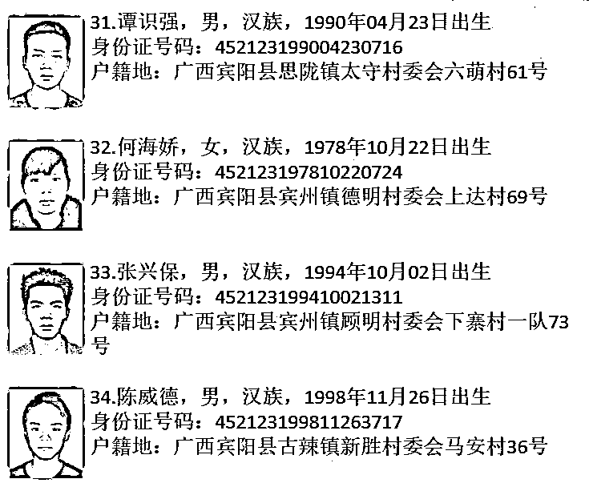

# 警告所有骗子：67 人的户籍（国籍）即将注销，再不回国将“社死”！

> 原文：[`mp.weixin.qq.com/s?__biz=MzIyMDYwMTk0Mw==&mid=2247515404&idx=1&sn=6d581dfe6c5e3349914d593de297a264&chksm=97cb7634a0bcff22d1428ffd02a64d891685032c72d9fd2554bf4c9e291a9a46a7f667b51ebe&scene=27#wechat_redirect`](http://mp.weixin.qq.com/s?__biz=MzIyMDYwMTk0Mw==&mid=2247515404&idx=1&sn=6d581dfe6c5e3349914d593de297a264&chksm=97cb7634a0bcff22d1428ffd02a64d891685032c72d9fd2554bf4c9e291a9a46a7f667b51ebe&scene=27#wechat_redirect)

**重要提醒**

**被注销户籍将影响其国籍的甄别**

**导致今后无法回国！**

**目前，劝返境外涉诈人员回国的公告，措施一个比一个严厉。**

**已有地方发文拟对长期失联的人员进行注销户口处理。**

**注销户籍相当于断绝了后路，即使通过各种手段偷渡回国那其以后的生活将困难重重。** 

**即使一直生活在国外，那也将是一个活死人一个，人身安全更没有半点保障。**

****

****

**而同样在 5 月 18 日，宾阳县公安局就发布关于敦促境外违法犯罪人员投案自首的通告，经多次劝返仍不回国的，公安机关将依法注销其户籍。**

****（注意：此举将影响其国籍的甄别，导致今后无法回国）****

****

**事隔半月，6 月 1 日，**广西壮族自治区**宾阳县公安局官方公众号正式发出了一则后续消息——**关于认定第一批失踪人员的公示。****

|   |

****

****

**在这则公示中，宾阳县直接将 34 名宾阳籍人员**认定为失踪人员，**并明确表示准备启动程序，**对失踪人员依法注销户籍。****

**干驿镇的 33 人，宾阳县的 34 人，这 67 个人，可能成为我国第一批因为滞留缅北而被注销户籍的人。**

# **02**

**不要低估国家打击电诈的决心**

**近来，各地警方已纷纷发布劝返逼投通告，并呼吁滞留境外涉诈人员一定要抓住机会，立即回国。** 

**但是，仍有不少人还抱着观望心态，以为各地的**“五个一律”、“十个一律”、“十三个一律”**等等都只吓唬人的“纸老虎”凑凑数而已，根本不会真正兑现。**

**真的是如此吗？**

**先来看看有些地方上的：**

****

**就问问这家房子的主人，你躲在缅北是能苟且下去，可你的家人在村里还能不能抬起来头？**

 **[`mp.weixin.qq.com/mp/readtemplate?t=pages/video_player_tmpl&action=mpvideo&auto=0&vid=wxv_1895983674173472769`](https://mp.weixin.qq.com/mp/readtemplate?t=pages/video_player_tmpl&action=mpvideo&auto=0&vid=wxv_1895983674173472769)** 

**说“断水断电”，都是吓唬的？**

****

**电工直接到达现场，按要求切断电源。**

**就问问这家房子的主人，你在缅北骗人“事业有成”，你的家人却要在炎热的夏季蒸桑拿，你于心何忍，还能做个人吗？**

**不但断你的水电，在截止日期前不回来，仍然滞留在缅北，还会将你用赃款建造的违法建筑一律拆除，这滋味恐怕也不好受吧？**

****

**在国内骗就会放过你了吗？更不可能，会全副武装带你到家中指认现场。你不是当时就在家中打打电话就把钱骗了吗？那好，这次让你在光天化日之下指认现场，还要在你家里喷上“诈骗可耻”的永久字样，让你和你的家人因为诈骗而身败名裂！**

 **[`mp.weixin.qq.com/mp/readtemplate?t=pages/video_player_tmpl&action=mpvideo&auto=0&vid=wxv_1895983261084860417`](https://mp.weixin.qq.com/mp/readtemplate?t=pages/video_player_tmpl&action=mpvideo&auto=0&vid=wxv_1895983261084860417)** 

**还有很多例子，在这里就不一一列举了，自己家乡用了什么办法，那些滞留在缅北的人最清楚。**

**5 月 3 日~6 日，**公安部长**到了云南，去了昆明、普洱、德宏、保山和孟连的出入境边防检查站、公安基层单位和边境口岸调研。**

****

**新闻通稿很长，但在普洱市调研的过程中，有这么几句话特别有深意：**

> **在普洱市公安局思茅分局城北派出所，赵克志详细考察开展教育整顿和打击跨境违法犯罪工作情况，……要认真贯彻执行**“自查从宽、被查从严”**政策，努力实现**“处理一人、警示一片”**的效果。**
> 
> **在普洱市公安局，赵克志认真听取打击电信网络诈骗犯罪工作情况汇报。他要求……**要采取有力措施重点整治电信网络诈骗犯罪作案人员集中、黑灰产业泛滥的地方，对问题严重、整改不力的地区坚决予以挂牌整治。****

****大动作马上就来，请仍然滞留缅北的人员好自为之。****

**不知道那些滞留在缅北的人，除了每天坑同胞、打探消息之外，有没有静下心来想一想，为什么各地都在陆陆续续发出公告劝返？而且措施一个比一个严厉？为什么各地给出的自首回国截止日期，从来没有超过 6 月 15 日？而且在这之前回来还可宽大处理？动动脑子，好好想想吧**

 **[`mp.weixin.qq.com/mp/readtemplate?t=pages/video_player_tmpl&action=mpvideo&auto=0&vid=wxv_1769112953519194116`](https://mp.weixin.qq.com/mp/readtemplate?t=pages/video_player_tmpl&action=mpvideo&auto=0&vid=wxv_1769112953519194116)** 

****请仍然滞留缅北的人员好自为之，****

****抓住最后机会，****

****早日投案！****

 **[`mp.weixin.qq.com/mp/readtemplate?t=pages/video_player_tmpl&action=mpvideo&auto=0&vid=wxv_1892439060128841731`](https://mp.weixin.qq.com/mp/readtemplate?t=pages/video_player_tmpl&action=mpvideo&auto=0&vid=wxv_1892439060128841731)** 

 **[`mp.weixin.qq.com/mp/readtemplate?t=pages/video_player_tmpl&action=mpvideo&auto=0&vid=wxv_1892421231300165635`](https://mp.weixin.qq.com/mp/readtemplate?t=pages/video_player_tmpl&action=mpvideo&auto=0&vid=wxv_1892421231300165635)** 

 **[`mp.weixin.qq.com/mp/readtemplate?t=pages/video_player_tmpl&action=mpvideo&auto=0&vid=wxv_1892413957924044803`](https://mp.weixin.qq.com/mp/readtemplate?t=pages/video_player_tmpl&action=mpvideo&auto=0&vid=wxv_1892413957924044803)** 

 **[`mp.weixin.qq.com/mp/readtemplate?t=pages/video_player_tmpl&action=mpvideo&auto=0&vid=wxv_1892412061981196289`](https://mp.weixin.qq.com/mp/readtemplate?t=pages/video_player_tmpl&action=mpvideo&auto=0&vid=wxv_1892412061981196289)** 

****在缅北“搞事业”就一定风生水起吗？**** 

****也有可能成了孤魂野鬼呢！**** 

 **[`mp.weixin.qq.com/mp/readtemplate?t=pages/video_player_tmpl&action=mpvideo&auto=0&vid=wxv_1821338493789192193`](https://mp.weixin.qq.com/mp/readtemplate?t=pages/video_player_tmpl&action=mpvideo&auto=0&vid=wxv_1821338493789192193)

来源：刑事正义、天下有诈、终结诈骗、反诈骗先锋**

****

**← 向右滑动与灰产圈互动交流 →**

****