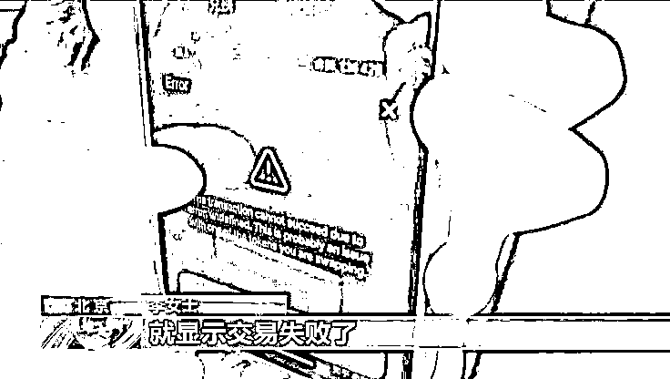
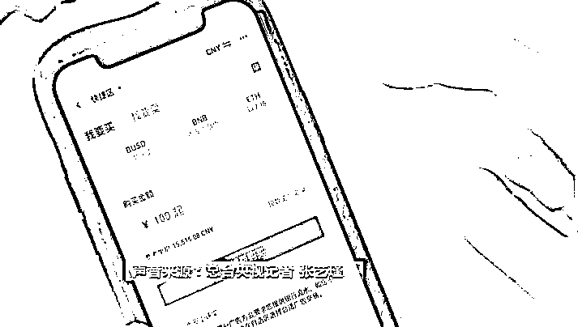
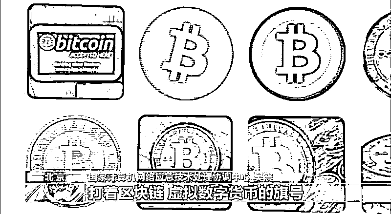
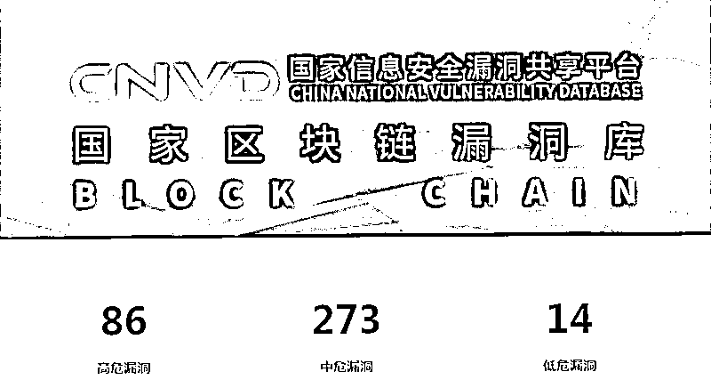

# 买了虚拟币却卖不出去！央视记者独家揭秘“百倍币”骗局

> 原文：[`mp.weixin.qq.com/s?__biz=MzIyMDYwMTk0Mw==&mid=2247515404&idx=3&sn=ad1ab18f30bbb32b50843a0e162c6a1d&chksm=97cb7634a0bcff22c046f00bb1e7cc131ebb76661cc8d961fcf2f76a586c31f4e6c307aa9cc9&scene=27#wechat_redirect`](http://mp.weixin.qq.com/s?__biz=MzIyMDYwMTk0Mw==&mid=2247515404&idx=3&sn=ad1ab18f30bbb32b50843a0e162c6a1d&chksm=97cb7634a0bcff22c046f00bb1e7cc131ebb76661cc8d961fcf2f76a586c31f4e6c307aa9cc9&scene=27#wechat_redirect)

近期虚拟货币价格剧烈波动引发广泛关注。数据显示，比特币价格自去年持续攀升，在一年时间里从不到 1 万美元到突破 6.4 万美元，经历多次大幅调整，目前维持在 3.5 万美元左右。

在比特币的带动下，很多虚拟币都出现大涨，投机行为也更为频繁。而国内的犯罪分子也盯上了虚拟币，将犯罪手段通过包装成虚拟币来实施诈骗。

[`mp.weixin.qq.com/mp/readtemplate?t=pages/video_player_tmpl&action=mpvideo&auto=0&vid=wxv_1896691751340343297`](https://mp.weixin.qq.com/mp/readtemplate?t=pages/video_player_tmpl&action=mpvideo&auto=0&vid=wxv_1896691751340343297)

△视频丨警惕虚拟币骗局

今年上半年，虚拟币已经成为了圈钱诈骗的重灾区，不少人都在高收益的诱惑之下，落入了别人精心布局的陷阱。

最近一段时间，虚拟货币的监管力度不断升级。5 月 21 日，国务院金融稳定发展委员会明确提出要“打击比特币挖矿和交易行为，坚决防范个体风险向社会领域传递”。不久前，互联网金融协会、银行业协会、支付清算协会联合发布公告，要求会员机构不得展开虚拟货币交易兑换以及其他相关金融业务。

**国家的禁令之下，一场虚拟币清退行动立即展开。**虚拟币挖矿最为集中的地区之一“内蒙古”，5 月 25 日公布了《关于坚决打击惩戒虚拟货币“挖矿”行为八项措施（征求意见稿）》，严格禁止虚拟币挖矿行为。

卖不掉的虚拟币

这并不是国家第一次这么大力度来监管虚拟币了。2013 年，人民银行等 5 部委印发《关于防范比特币风险的通知》，禁止金融机构和支付机构开展比特币相关业务。2017 年，人民银行等 7 部委发布《关于防范代币发行融资的公告》，指导地方政府排查清退涉嫌非法发行证券、非法集资的虚拟货币交易和代币发行融资平台。但此后，一些平台如火币、欧易等转移到境外，仍然面向境内居民提供服务。

**今年上半年，随着虚拟币整体市值的暴涨，虚拟币已经成为了圈钱诈骗的重灾区**，不少人都在高收益的诱惑之下参与境外平台组织的交易炒作活动，落入了别人精心布局的陷阱。

不久前，李女士找到记者，称她在境外交易平台上买入的一种虚拟币，竟然在想卖的时候却发现卖不掉了，投入的钱全都打了水漂。

**李女士：**你看这是我当时截的图，卖出的时候它就显示交易失败。

李女士正在展示的这种虚拟币名叫 TRTC，今年年初，这种虚拟币从一文不值，价格一路飙升。熟悉虚拟币投资交易的李女士看准了这个机会，在境外平台上用约合六千元人民币，买入了这种 TRTC 币。

**李女士：**我们都把这种币叫百倍币，你可以想想这个最开始的时候行情有多好，觉得它能涨一百倍。

**记者：**没有怀疑过会出问题？

**李女士：**没有怀疑，因为这个币主打的概念叫流动性挖矿，算是现在币圈一个新的投资风口吧，大家都在炒，没想过竟然最后不让卖了。

一卖出就报错，这样的问题是个别现象，还是普遍情况？另一位熟悉炒币流程的玩家，帮记者进行了一次测试。

这位玩家告诉，这种 TRTC 币只能用另一种数字加密货币“以太坊”来购买。视频中，这位玩家正在通过手机上的 App 访问虚拟币交易平台，来买进以太坊，再买入 TRTC 币。**但是在尝试把它卖掉时，系统出现了交易失败的提醒页面。**

2020 年虚拟币安全事件增长 240%

这一类代币发行融资活动本质是非法发行证券，涉嫌非法经营和金融诈骗。但这些还只是虚拟币交易风险的冰山一角，**虚拟币交易还暗藏着哪些问题和风险？**记者走访了国家计算机网络应急技术处理协调中心。

国家计算机网络应急技术处理协调中心的统计数据显示，随着上半年虚拟币交易量的活跃，各类风险隐患也是层出不穷。

**国家计算机网络应急技术处理协调中心 吴震：**很多不法分子利用虚拟数字货币进行洗钱或者非法资金转移，可能会对国家的经济秩序造成扰乱。甚至还有一些不法分子打着区块链的旗号进行诈骗。同时，现在我们收录了 400 多个漏洞，有漏洞就会被不法分子利用窃取相关的数字资产。

国家区块链漏洞库发布的报告指出，据不完全统计，2020 年度区块链领域发生的安全事件数量达 555 起，相比于 2019 年安全事件增长了近 240%；主要包括诈骗/钓鱼事件 204 起、勒索软件事件 143 起、交易平台安全事件 31 起。所造成的经济损失高达 179 亿美元，环比 2019 年增长了 130%。

自新冠疫情以来，境外虚拟货币交易平台上的各类非法金融活动更加活跃。除了李女士遭遇的涉嫌非法发行证券的代币发行融资外，比较火热的还有虚拟货币远期合约交易，有数十倍到上百倍的杠杆率，本质上不过是“赌多空”的游戏。**这类非法期货活动给参与群众带来巨额财产损失，时常有投机者爆仓的新闻报道，但虚拟货币交易平台在背后赚得盆满钵满。**

别让炒作之风干扰区块链健康发展

炒币投机不等于高大上的理财，而是高风险的赌博，有的甚至是违反法律的行为。

对普通投资者而言，面对境外交易平台和庄家掌握信息、资金、筹码，拥有巨大的信息优势，最终难逃“被割韭菜”的命运，还需多一分冷思考。而对区块链的从业者而言，区块链技术创新也不等于炒作虚拟货币，**如何让区块链技术脱虚向实，让“区块链+”在各个应用场景落地生根，为中国经济转型升级、实现高质量发展注入新动能，这才是技术创新的应有之义。**

来源：央视新闻客户端、中国人民银行

← 向右滑动与灰产圈互动交流 →

