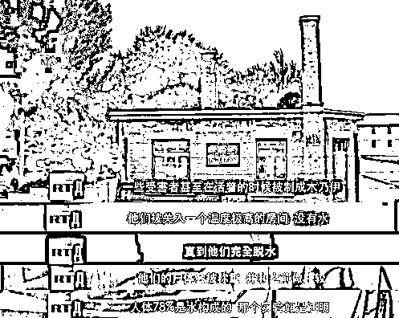
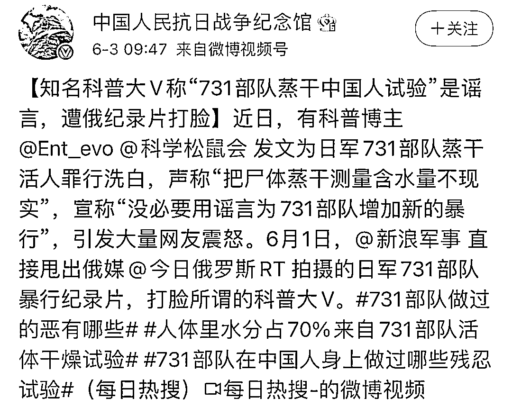

# 科学松鼠会道歉了，但通篇没提 731

> 原文：[`mp.weixin.qq.com/s?__biz=MzIyMDYwMTk0Mw==&mid=2247515404&idx=4&sn=c248bbae2a6eac586f9e7d3b11796fff&chksm=97cb7634a0bcff22646a1f2c1654ff19f99bf69f33deb5c2e9e34973d0b14eff6340b04f6503&scene=27#wechat_redirect`](http://mp.weixin.qq.com/s?__biz=MzIyMDYwMTk0Mw==&mid=2247515404&idx=4&sn=c248bbae2a6eac586f9e7d3b11796fff&chksm=97cb7634a0bcff22646a1f2c1654ff19f99bf69f33deb5c2e9e34973d0b14eff6340b04f6503&scene=27#wechat_redirect)

近日，一则“‘人体 70%是水’是日军 731 部队把活的中国人蒸干得出的结论”的帖文火了，但微博科普大 V@Ent_evo  却辟谣称该网友发帖内容有误，指其用谣言增加日本 731 部队的罪行，民间科普组织@科学松鼠会 也转发支持。

而随后众多资料证明日军 731 部队确实曾做蒸干活人实验，因此@Ent_evo 和@科学松鼠会 的言论引发大量网友震怒，被指“为暴行洗地”。

时隔 4 天，今天（4 日）中午，**@Ent_evo、@科学松鼠会 几乎同时发声，在微博发布致歉长文。**

@Ent_evo 称自己在此事件中，未经多方查证资料就妄下结论，仅凭印象就否定了 731 人体含水量实验。为了纠正自己认识上的偏差，他还表示准备前往相关爱国主义教育基地进行学习。

@科学松鼠会 则将责任归咎于内部管理不善，**将清除官博过往所有内容，并永久停更该账号**；同时，它还对会员@Ent_evo 发表的不当言论表示强烈愤慨，**对其做出除名处罚。**

然而@科学松鼠会 的这封致歉声明中，通篇没有提及“731 部队”，因此再被网友指责在原则问题上避重就轻，道歉态度不真诚。

5 月 31 日，一则“‘人体 70%是水’是日军 731 部队把活的中国人蒸干得出的结论”的帖文引发关注。

**贴文里的内容随即也被日本作家森村诚一《恶魔的饱食》证实，该书是森村诚一经过在中日两国多次调查取证、采访日本老兵后发表的纪实作品。**

但随后微博粉丝高达 425 万的科普大 V、科学松鼠会成员@Ent_evo 发文“辟谣”称，“把尸体蒸干测量含水量不现实”，宣称“没必要用谣言为 731 部队增加新的暴行”，这一言论随后引起大量网友震怒，质疑其在偷换概念，实则“为暴行洗地”。

而在当晚，@科学松鼠会 还转发这篇所谓的“辟谣帖”，内涵道：网友的关注点跟原博“相去甚远”。

引发网友激烈批评后，目前两条博文都已查询不到。

此事引发关注后，6 月 1 日下午，@新浪军事 直接叫板相关博主，甩出了俄媒“今日俄罗斯”2020 年 12 月发布的纪录片《日本 731 秘密部队——生化战争起源地》（Japan's secret Unit 731 – where biological warfare was conceived），视频中明确揭露了 731 部队曾蒸干受害者进行实验的罪行。

这一视频引发近 2 万微博网友转发，5.4 万个点赞，包括@中国人民抗日战争纪念馆 等官博也转发了相关博文。

与此同时，美国政府再炒新冠肺炎疫情起源，中国外交部发言人曾提到，公开资料显示，**德特里克堡与侵华日军 731 部队有着千丝万缕的关系。**

新华社、央视新闻等官方媒体揭秘美国德特里克堡基地与日军 731 部队肮脏交易的报道中，也进一步证实 731 部队在哈尔滨郊外曾使用活体中国人、朝鲜人、联军战俘进行了惨绝人寰的实验。但在美国的庇护下，731 部队的成员几乎没人因他们的罪行受到惩治。

[`v.qq.com/iframe/preview.html?width=500&height=375&auto=0&vid=p3250y64ho3`](https://v.qq.com/iframe/preview.html?width=500&height=375&auto=0&vid=p3250y64ho3)

铁证如山，@Ent_evo 和@科学松鼠会 又岂能装作“睁眼瞎”？

包括知名爱国画手@乌合麒麟 、警界大 V@江宁婆婆 等博主们，以及众多网友都对他俩隔空喊话，要求他们为自己的错误言论道歉，转发真相。

沉默了 4 天，今天（4 日）中午，@Ent_evo、@科学松鼠会 几乎同时发声，在微博发布致歉长文。

@Ent_evo 称自己在此事件中，**未经多方查证资料就妄下结论，仅仅从实验设计有漏洞的角度，凭印象否定了日军 731 部队人体含水量实验。**他还表示，经过三天闭关反思，**自己已深刻认识到问题的严重性，对此次事件带来的影响负全部责任。**

同时他也声辩称自己绝不会出于利益驱使为日本的罪行“洗地”，此次事件是自己在相关知识上存在偏差，他准备前往黑龙江的“侵华日军第七三一部队罪证陈列馆”等爱国主义教育基地，再次接受爱国主义教育。

他还表示，自己未来将会继续反思，谨言谨行，严格审视个人微博言论，注意社会影响，对国家和民族历史相关问题慎之又慎。在各个领域都先调查再发言，不轻率下结论。

@科学松鼠会 的致歉声明则将责任归咎于内部管理不善，称前线运营人员未能谨慎核实并斟酌内容，用官博转发了包含严重错误的不当言论。

它表示，对官方认证账号所做的不当转发、对未能对有效管理会员内容、对成员思想教育的疏忽，向公众致以最大的诚挚歉意。**并决定清除官博过往所有内容，并永久停更该微博账号。**同时，它还对会员@Ent_evo 发表的不当言论表示强烈愤慨，**对其做出除名处罚。**

据中新经纬报道，“科学松鼠会”由北京市朝阳区哈赛科技传播中心运营。该中心法定代表人为果壳网创始人嵇晓华。

今天中午这篇致歉声明发出后，认证为果壳网主笔的@游识猷 转发了该文并向各方道歉，宣布松鼠会官博将永久停更。

然而@科学松鼠会 的这封致歉声明中，通篇没有提及日军 731 部队。

有网友认为它**没有说明道歉和关闭账号的原因是给日军 731“洗地”，司空见惯地甩锅给前线员工**，因此再度指责其在原则问题上避重就轻，道歉态度不真诚。

包括科幻作家@宝树 等在内的不少网友还表示，**@科学松鼠会 没必要因此直接把微博账号都关停。**

结合它含糊其辞的道歉声明，更有人感觉@科学松鼠会 此举多少有些在发泄怨气的意思，认为它与其清除往期博文关闭账号，不如尽到科普博主的义务，好好地给公众制作一期关于日军 731 部队罪行的科普内容。

其实翻车第二天，也就是 6 月 1 日，@科学松鼠会 曾经发过一条道歉博文。

但这条博文更敷衍，@科学松鼠会 当时转发了一则与涉事博文毫不相关的内容，再承认 5 月 31 晚官博转发的日军 731 部队相关博文确实有不当之处，表示将引以为戒。如果不知道具体发生了什么，它这条博文多少让人看得丈二和尚摸不着头脑。

而且这条不知前因后果的博文还关闭了评论区，但依旧挡不住转发区里骂声一片。

来源：观察者网

← 向右滑动与灰产圈互动交流 →

