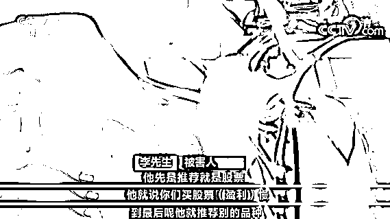
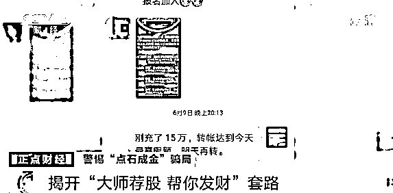
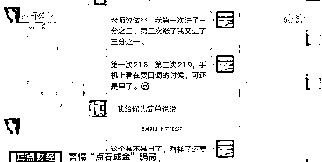
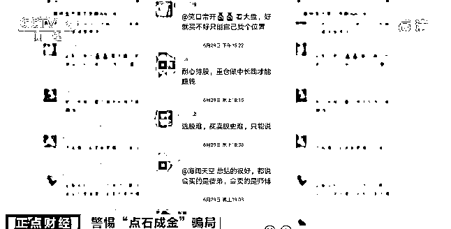
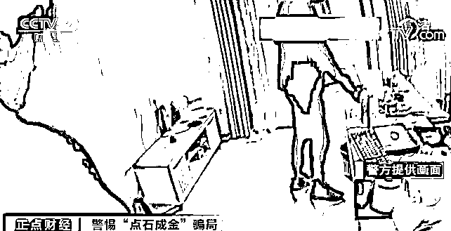
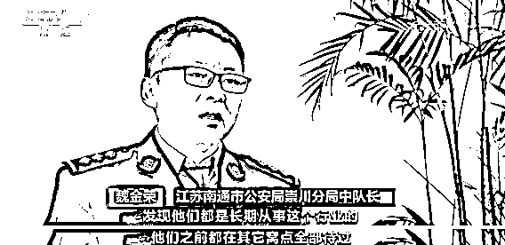
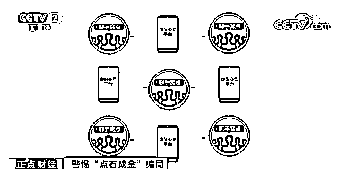

# 80 余人已被抓！这个投资平台，专门用来诈骗→

> 原文：[`mp.weixin.qq.com/s?__biz=MzIyMDYwMTk0Mw==&mid=2247515404&idx=5&sn=54612708a28e4ef94ac304edf7f7a2b4&chksm=97cb7634a0bcff225a5bd7d1450ccbd83da5a3240d7f97cdf8f7da7ecaaf4c6fd5e14313a3c8&scene=27#wechat_redirect`](http://mp.weixin.qq.com/s?__biz=MzIyMDYwMTk0Mw==&mid=2247515404&idx=5&sn=54612708a28e4ef94ac304edf7f7a2b4&chksm=97cb7634a0bcff225a5bd7d1450ccbd83da5a3240d7f97cdf8f7da7ecaaf4c6fd5e14313a3c8&scene=27#wechat_redirect)

高级理财师教你投资，轻松获得 10 倍收益，帮你快速发财。这些充满诱惑的话语总会让一些人心动。然而背后或许是一个个的网络诈骗陷阱。

就像江苏南通的李先生，遭遇了投资噩梦。他在所谓投资老师的推荐下，进入了一个叫做“点石成金”的投资平台，没想到短短几天赔了数十万。

**1**

**揭开“大师荐股 帮你发财”套路**

[`mp.weixin.qq.com/mp/readtemplate?t=pages/video_player_tmpl&action=mpvideo&auto=0&vid=wxv_1897926083937632265`](https://mp.weixin.qq.com/mp/readtemplate?t=pages/video_player_tmpl&action=mpvideo&auto=0&vid=wxv_1897926083937632265)

△央视财经《正点财经》栏目视频

2020 年夏天，一个陌生人主动联系到李先生，**声称可以通过股市快速赚钱，并且将李先生拉到一个投资群中讨论。**

这名所谓的投资老师说，**在自己推荐的平台上交易，与一般的股票交易不同，可以获得 10 倍的收益**，而且交易范围不仅仅是股票，还包括期货、买涨买跌等“专业”的操作。

为了获得丰厚的回报，李先生短时间内就先后向平台中注入 40 多万元作为本钱。 

然而令李先生没有想到的是，在这名所谓的投资老师的指点下，自己的投资全部失败，而且一点挽回的余地都没有，很快，**注入平台的资金所剩无几。**

眼见着自己的钱就这样不明不白没有了，李先生在微信群中讨要说法，然而自己不仅没有得到回复，还被从微信群中踢了出去。 

此时，李先生已经察觉到自己有可能被骗，准备向警方报案，然而就在这时，群里的助理主动来劝阻李先生，并且表示，可以赔偿一部分损失的金额。

**2**

**有人负责扮老师荐股**

**有人营造氛围**

几经波折，李先生拿回了 8 万多元，可是**30 多万短短数天就赔得干干净净**，李先生越想越不对劲，随即向当地警方寻求帮助。

[`mp.weixin.qq.com/mp/readtemplate?t=pages/video_player_tmpl&action=mpvideo&auto=0&vid=wxv_1897926837855387654`](https://mp.weixin.qq.com/mp/readtemplate?t=pages/video_player_tmpl&action=mpvideo&auto=0&vid=wxv_1897926837855387654)

△央视财经《正点财经》栏目视频

办案民警判断，这是一起典型的虚假股票平台诈骗案件，犯罪嫌疑人分工明确，整个作案过程环环相扣，添加李先生的所谓助理，就是这其中的一环。

**江苏南通市公安局崇山分局刑警大队民警 何思遥**：这些诈骗团伙，有一个很明确的分工，他们大概有三种角色。第一种角色是平台方，就是制作、运营虚假投资平台的人。

第二种角色是招商，招商是帮助平台方找到具体实施诈骗的聊手。

第三种角色是聊手，聊手直接通过社交帐号像微信、QQ，跟受害人直接接触，骗取他们的信任，引导他们在虚假投资平台里入金、充值。

警方侦查发现，李先生遇到的所谓股票老师和助理，都是聊手，有人负责假扮老师点评股票推荐投资渠道，有人专门在群里作托儿，附和老师的指导，并时不时抛出自己在指导下赚钱的消息，进一步刺激被害人的神经。 

 被害人李先生在所谓投资老师的推荐下，进入了一个叫做“点石成金”的投资平台，在里面开户充值和操作。而这个投资平台，是犯罪嫌疑人为了实施诈骗专门设立的。

之后，犯罪嫌疑人扮演的股票老师通过杠杆、做空等专业术语，诱使被害人向平台注入大量资金，等到资金累计到一定程度，犯罪嫌疑人立刻选择关闭平台跑路，换一个地方继续实施犯罪。

**3**

**不同窝点与交易平台**

**组合形成庞大关系网**

[`mp.weixin.qq.com/mp/readtemplate?t=pages/video_player_tmpl&action=mpvideo&auto=0&vid=wxv_1897925409459994626`](https://mp.weixin.qq.com/mp/readtemplate?t=pages/video_player_tmpl&action=mpvideo&auto=0&vid=wxv_1897925409459994626)

△央视财经《正点财经》栏目视频

警方逐渐摸清了犯罪团伙的人员组织结构，然而经过调查发现，李先生报案时，在广东东莞的犯罪团伙已经解散了。不过，主要嫌疑人还在东莞，随即警方迅速进行抓捕。 

在广东东莞，办案民警抓获了四名犯罪嫌疑人，令警方始料未及的是，通过对犯罪嫌疑人的审讯，总能牵连出新的诈骗团伙窝点或者虚假的交易平台，抓获的犯罪嫌疑人也越来越多，远超办案民警的预计。

犯罪嫌疑人通过不同的窝点与交易平台组成了一张庞大的关系网，即便有同伙被抓或者平台被关闭，他们也能很快换一个地方重新实施犯罪。同时，犯罪嫌疑人还会不断拉拢亲朋好友一起实施诈骗。 

截至目前，警方已经抓获犯罪嫌疑人八十余名，涉案金额超过两千万元，经初步统计，案件涉及被害人超过一千人。民警提示，**投资须谨慎，一定要在正规的交易平台进行，切莫被高回报高收益冲昏头脑。**  

来源：央视财经，利箭在行动

← 向右滑动与灰产圈互动交流 →

