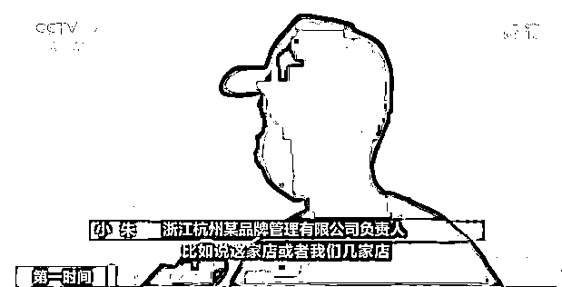

# 百余家“网红餐厅”，好评靠花钱请刷手！

> 原文：[`mp.weixin.qq.com/s?__biz=MzIyMDYwMTk0Mw==&mid=2247515404&idx=6&sn=7c98ccc1504178a5ce99fa47b439a1e8&chksm=97cb7634a0bcff22ad055f6efe4ccc88ab4eb3f2f54275bbc5f71200d4254a9f8a766c8da5ea&scene=27#wechat_redirect`](http://mp.weixin.qq.com/s?__biz=MzIyMDYwMTk0Mw==&mid=2247515404&idx=6&sn=7c98ccc1504178a5ce99fa47b439a1e8&chksm=97cb7634a0bcff22ad055f6efe4ccc88ab4eb3f2f54275bbc5f71200d4254a9f8a766c8da5ea&scene=27#wechat_redirect)

给商家刷单很有可能落入诈骗的陷阱，而就刷单本身来说，其行为严重有违诚信。近日，浙江杭州市市场监管综合行政执法队接到举报，称有公司专门组织人员为餐饮企业提供刷好评服务，于是在全市进行了突击检查，结果发现百余家网红餐厅，都存在花钱请刷手刷好评的行为。

[`mp.weixin.qq.com/mp/readtemplate?t=pages/video_player_tmpl&action=mpvideo&auto=0&vid=wxv_1899036039382368258`](https://mp.weixin.qq.com/mp/readtemplate?t=pages/video_player_tmpl&action=mpvideo&auto=0&vid=wxv_1899036039382368258)

△央视财经《第一时间》栏目视频

今年 5 月初，杭州市市场监管综合行政执法队根据举报者提供的线索，通过调查和走访，发现杭州某品牌管理有限公司等 10 家公司，涉嫌组织他人刷好评牟利。

浙江杭州市市场监管综合行政执法队执法人员方伟表示，在现场发现大量的合同、聊天记录、转账记录等有关证据材料，通过聊天记录等证据材料发现，**杭州市各大商圈有大量的餐饮企业存在非法刷好评的违法行为。**

涉案的杭州某品牌管理有限公司负责人小朱，向记者讲述了内幕。

**浙江杭州某品牌管理有限公司负责人 小朱：**商家会提出需求，比如，一家或几家店需要几十条或者 100 条评价，然后我们在圈内很多所谓的“大 V 群”再进行对应的招募。 

记者在该款点评类 App 上发现，涉案的商家均在同类商家中排名靠前，不少打着“网红”标签，评论区则充斥着文艺范的美图，有着口味赞、服务好、食材新鲜等各类好评，那么这些好评是真实的吗？

**好评刷手 小谢：**正常用餐完以后，不论好与坏，都要把好的一面呈现在平台上——就是免费吃一顿，给商家写个好评。 

其实，不少点评类 App 为防止商家刷好评，一直有相应的监管措施，但组织刷好评的公司仍有办法规避平台监管。

**浙江杭州某品牌管理有限公司负责人小朱表示，整个过程要签到打卡，要真实地在店里拍照，同时要购买消费，就是为了模拟一个真实的消费轨迹。最后在完成好评的同时，公司会把消费金额还给刷手。**

**杭州市市场监管综合行政执法队相关负责人表示，这些公司的行为涉嫌违反《反不正当竞争法》第八条第二款之规定：经营者不得通过组织虚假交易等方式，帮助其他经营者进行虚假或者引人误解的商业宣传。**

****

****浙江杭州市市场监管综合行政执法队大队长 李赛：**针对虚假评价案件的集中整治，我们一共查处了涉嫌组织虚假交易的经营者十家，涉嫌虚假宣传的经营者，也就是商家，大约 100 余家。**

**接下来我们将根据反不正当竞争法第八条和第二十条的规定对涉嫌虚假宣传，和涉嫌组织虚假交易的经营者，处以人民币 20 万元以上，200 万元以下的罚款，案件结束后会对相关企业的违法行为进行公示。** 

**‍** 

****

**在消费之前，很多人都会参考他人留下的评论。而这些花钱刷出来的虚假好评和销量，无疑对消费者构成了极大的误导，也破坏了商业生态。“刷好评”挣来的只是“一锤子买卖”，无法赢得回头客，长远来看，最终“刷掉”的必然是自己的信用和“钱途”。**

**来源：央视财经**

****

**← 向右滑动与灰产圈互动交流 →**

****