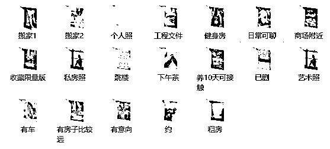

# 人间蒸发的男友和消失的 100 万

> 原文：[`mp.weixin.qq.com/s?__biz=MzIyMDYwMTk0Mw==&mid=2247515455&idx=1&sn=bf13f787e409e29cbbc960a0b2511536&chksm=97cb7607a0bcff1191055c5cf07c48fb98498b15024553465ec12c9b304772a67c6535c382e1&scene=27#wechat_redirect`](http://mp.weixin.qq.com/s?__biz=MzIyMDYwMTk0Mw==&mid=2247515455&idx=1&sn=bf13f787e409e29cbbc960a0b2511536&chksm=97cb7607a0bcff1191055c5cf07c48fb98498b15024553465ec12c9b304772a67c6535c382e1&scene=27#wechat_redirect)

***谈一场恋爱，损失 100 多万，男友人间蒸发。***

***一个无微不至关心自己，甚至把银行密码都告诉自己的男友，竟然是一个骗子？***

***爱情有多甜美，骗子就有多可恶。今天这篇文章，我们详细采访多位反诈专家，深挖爱情“杀猪盘”的重重套路。***

***希望你们依然相信爱情，更学会保护自己。***

主笔：大黄

编辑：西瓜

“您拨打的电话已关机，请稍后再拨……”

阿芸在 30 岁这年，经历了一场人生的狂风骤雨。

她本是亲友们艳羡的对象，大学毕业后开始创业，经营着一家女装网店，流水可观。早些年赶在房市大涨前，在北京买了房，还留了一笔不小的积蓄。有颜有房有财，阿芸距离她理想中完美人生，只差一个 Mr.Right。

经历过几场不成功的感情，阿芸希望未来的另一半踏实稳重，给予她充分的安全感。

两年前，她通过某交友平台遇到了阿强。阿强年长 8 岁，是个为人憨厚老实的小老板，在澳门从事技术相关行业。两人都是生意人，有很多共同话题，很快就加了微信，两个月后确立了恋爱关系。

由于分隔两地，加上工作都很忙，两人还没机会线下相见，阿芸在等着生意旺季过后，去澳门和阿强约会。阿强也常提出，渴望回内地安居，在北京买个大房子迎娶阿芸。

阿芸未曾想到，亲密爱人的温柔攻势背后，竟藏着如此惊人的圈套。

***爱情“屠宰场”***

为了尽快购入北京“爱巢”，阿强开始进行理财投资。阿强的公司为澳门赌场提供技术支持，他开始通过在该赌场网站上炒内资盘获利。起初阿芸还觉得这种投资不靠谱，但阿强每天都在朋友圈发行情走势图以及当日获利情况，让阿芸也开始产生兴趣。

有一天，阿强告诉阿芸“晚上有个大行情”，并把银行卡和网站的账号密码给了阿芸，由于自己等会在飞机上，请阿芸帮忙操盘一笔交易。阿芸按照阿强的指示，用卡里的 8 万元买入，当天获利了 30%。这让阿芸开始觉得“这事儿靠谱”，缠着阿强让他带自己一起炒。

“投资风险我一个人来担就好了，你辛苦赚的钱就不要投在里面了。”起初阿强多次拒绝阿芸的请求，这让阿芸更加感动于阿强的诚恳和担当。但阿芸还是执意投入了这场看似“钱途无量”的游戏。

阿芸起初跟着阿强投了 10 万，一下子赚了几十万，每笔操作后账户余额都能比之前翻一倍。接着，阿强开始劝阿芸“玩儿把大的”，阿芸凑了 100 多万投入，盘算着这把收益之后，就能和阿强在北京购置婚房。

想不到这一次，阿强消失了。

微信不回，电话不通。阿芸还在安慰自己，阿强常年各地出差，一两天联系不上也是正常的。直到网站关闭，无法提现，阿芸的世界开始天旋地转。她终于意识到，自己被骗了。

这种披着爱情外衣，以甜言蜜语为迷药，一步步实施诈骗的过程，被诈骗者称为“杀猪”。而受害者眼里曾经浪漫甜蜜的恋爱，不过是如法炮制的“养猪”圈套。一经踏入，人财两失，一生就此改写。

*（图片来自网络）*

懊悔、愤怒、自责、抑郁、痛苦……阿芸至今都没能从这起诈骗中走出来。对她来说，失去的不止是钱财，更是她对爱情的所有信任和期待。

阿芸不敢相信，一个无微不至关心自己，甚至把银行密码都告诉自己的男友，会是一个骗子。而男友每天无微不至的关怀，竟是诈骗团伙写好的话术模版。

同样的剧本，不知道阿强曾和多少个女孩上演过，又有多少个女孩像她一样“被宰”。

数据显示，目前“杀猪盘”在全部电信网络诈骗案件中占比达到了 20%，诈骗金额占所有诈骗案件的近 50%，日均诈骗损失达 9000 万元，平均单笔诈骗损失金额达 18 万以上。受害者基本上都是拿出全部身家来“投资”爱情。

“杀猪盘”已经成为当前最泛滥、损失最高的诈骗手段之一。

据珍爱网反诈骗专家竺工介绍，**年龄在 30-35 岁之间，有着一定经济基础的单身女性成为“杀猪盘”主要瞄准的对象。同性交友的诈骗案例也开始涌现，呈现上升趋势。**这一类受害者普遍处于情感空虚状态，也更愿意为爱情付出。

**更想不到的是，“杀猪盘”还呈现出年轻化、高学历的趋势。21-30 岁的 90 后、00 后受害者占到了 44.8%。**而通过案例研究发现，500 强高管、海归博士，甚至是高级财务从业者，都成为了被“猎杀”对象。

即使听过再多的诈骗案例，学习过再多的套路，也难逃爱情和金钱的双重诱惑。

***“我亲手把自己交给了诈骗团伙”***

当心了，“杀猪盘”不止埋伏于传统交友网站，他们无处不在。

你每天刷的抖音、快手、小红书，各种微信和 QQ 群聊，玩的各类游戏，甚至是健身类 APP,都成为诈骗团伙“找猪”的渠道。

*（图片来自网络）*

随后，骗子把目标群体会从各个平台上引流到他个人社交账号上，实施后续的“养猪、杀猪”计划。

据腾讯安全专家张工介绍，骗子在实施诈骗之前会把自己的人设进行一番精美的包装，主要集中于金融、商人、部队军人的人设。一方面，这类人群“收入稳定”、“体面”，在市场中比较抢手。另一方面，这类职业的人要么常年出差，要么需要住在部队，为“无法线下见面”提供了理由。有的骗子甚至会下一定“血本”，为受害者订花、寄礼物，通过这种方式进行“线下互动”，来打消不能见面而产生疑虑。

在心理学上，这被称为“首因效应”，指先入为主的第一印象对双方后续交往产生的深刻影响。第一印象并非总是准确的，却是最鲜明、最牢固的。良好的第一印象会大大加速关系发展的进程，也会让受害者主动对骗子后续一系列行为进行美化、解释。

当聊到一定程度，骗子开始有意无意地提及“自己今天又赚钱了”，或者“今天又投资了什么，收益不错”，慢慢的勾起受害者对他投资这块的兴趣，慢慢的带入圈套。

实际上，像珍爱网、微信等各大平台已经具备了完善的反诈骗机制，当对方出现疑似诈骗行为时，会对用户进行诈骗风险提示。但尽管如此，依然会有受害者前仆后继，深陷其中。

珍爱网反诈骗专家竺工介绍，在一个案例中，平台曾先后给受害人发出过 30 多次的诈骗预警提示，包括弹窗提醒，甚至客服电话提示，但该受害人当时已经被冲昏了头脑，根本听不进去，始终坚持自己的判断。

“当你投进去 10 万，短短几个小时变成了七八十万。对面那头又是你希望共度余生的爱人，你的心态一下就会崩掉，完全进入到这个角色里面去。这就是人性的弱点。”

甚至有的人不但自己被骗，还成为“杀猪盘”中的一环，在交友平台上“发展下线”，连带新约会的网友一起被骗。“直到她约会过的网友报警，举报她是诈骗犯，她才醒悟过来，其实自己也被骗了。”

很多受害者都抱有“赌徒心理”。即使中途察觉到哪里不对，但也不敢承认感情里的失败，不愿放弃自己之前投入的沉默成本，进而投入更多成本去“验证”，一次又一次地主动把自己送到诈骗团伙的“屠刀”之下。

*** 起底“阿强”的幕后***

 “杀猪盘”骗术在不断升级进化。

早期的网络诈骗，一般是比较简单、粗暴的。例如假冒游戏、Q 币充值网站，通过垃圾广告的方式引导用户去上面充值。这种诈骗的技术含量不高，单笔诈骗金额也不高，主要靠“广撒网”来获利。

随着网络安全技术的发展，国家对这种垃圾传播、恶意网站打击的力度越来越强，广撒网的成功率越来越低。网络诈骗从最早的粗放式撒网，开始走向精细化运作，打起“感情牌”。

而诈骗的由头也一直追逐“潮流”，从早期的赌博、炒股、投资，到如今更为“流行”的炒币、海淘。

在每一个“阿强”的背后，都站着一支训练有素、精细化分工的作案团伙，他们往往埋伏在菲律宾、缅甸、越南等东南亚地区。  

每个“杀猪盘”都有着精细化的团队分工，一般分为话务组、供料组、技术组、洗钱组四类。其中，话务组是直接和受害者打交道的人，也就是账号那头的“恋人”。

供料组则为话务组提供行骗的话术剧本，也称为“猪饲料”。

技术组则一方面负责建站，搭建“杀猪”的网站或 APP。一方面通过技术手段绕过国家对于恶意网站、恶意 APP 的限制，比如防风、翻墙、域名解封等。

洗钱组最为关键，一般是由团队头目自己控制或者联系渠道。

*（诈骗团伙的“素材库”）*

可怕的是，在每个“杀猪盘”团队的背后，还有一条完整的黑产链，为他们提供外围支持。

在上游，有“号商”，专门买卖各个平台账号资源。还有专门的“图商”，在国外网站上搜寻一些高端照片帮助诈骗团伙包装人设，诈骗者在什么时间发什么图，配什么文案，都会打包成一个资料包进行售卖。还有买卖用户资料的，诸如哪些用户是潜在的比较好骗的对象，大致的资产情况等资料信息。

在中游，有专门的技术团队为“杀猪盘”提供技术支持，成本非常低廉。据了解，一款赌博 APP 的软件开发价格为 3 万元左右，源代码可以在网上购买，且所有赌博软件的后台数据均可自由修改，非常方便。

在下游，还有专门帮助诈骗团伙“招工”的，他们通过“高薪”诱骗的方式，把一些劳工骗到境外，来从事前方的诈骗任务。也许“阿强”自己，本身也是一个受害者，被迫实施诈骗。

有的诈骗团伙甚至设置了 “善后部门”，对受害者进行心理安慰，降低他们报警或自杀的几率。

实际上，不只是“杀猪盘”，包括薅羊毛、刷量的等网络黑产手段，都会用到背后的这些黑产资源。随着产业链日益成熟，一套诈骗流程的成本变得非常低，诈骗套路也愈发高超。

据张工介绍，**到了 2020 年，“杀猪盘”案发量以及涉案金额相比于 2019 年差不多翻了倍，特别是疫情期间，由于宅家导致网络交友需求增长，案发量数涨了 3-4 倍。**

***“反杀猪”防卫战***

数量激增的 “杀猪盘”，是不容忽视的社会话题。

受害者不但要承受感情和金钱的双重损失，还面临着难以向亲友启齿的精神压力，严重者自此一蹶不振甚至选择轻生、报复社会。

然而，再精密的骗术也存在破绽，毕竟骗子也是人，也有着人性的弱点。前不久，某女子在被诈骗 45 万元之后，假装毫不知情，在警方的帮助下继续和骗子“谈恋爱”， 把自己包装成一个温柔体贴，毫无保留付出的女性，等骗子真的爱上自己之后，将其“骗”回国，完成一场完美的“反杀”。

当我们熟知了“杀猪”套路，就能“反杀猪”。如今，各地警方、社区、各大网络平台上都在对大众加强反诈骗教育，进行“杀猪盘”案例普及，帮助用户分析诈骗者抓住了怎样的心理弱点，提高大众“反杀”战斗力。

反杀猪，成为一个社会性联动的任务。

由于一个“杀猪盘”案例往往在多个平台上实施，如果各平台各做各的，难以追踪到完整的诈骗链路。因此，很多大型的网络平台开始联合各地警方一起开展打击“杀猪盘”的联合行动。

 为构建全链条反诈体系，开展网络平台联合行动，珍爱网去年开始接入腾讯安全反诈大脑，通过联邦学习技术，双方数据不出本地情况下进行联合建模，可以在隐私保护的前提下，对平台上的疑似诈骗账户进行甄别，进而对潜在受害者进行预警提示，对问题账号进行拦截封杀。

这是一个非常复杂的任务，“实际上，并没有完全的坏人和好人，没有绝对的二元黑白分割，我们得出的是一个‘光谱’，有的人比较偏白一点，有的人比较偏黑一点。”腾讯安全专家张工表示，“珍爱网作为上游的合作企业，会给我们提供可疑账号，我们会进一步分析判定，层层把关，确定为恶意账号后，也会在我们自己的平台进行相应处理。”

据珍爱网反诈骗专家竺工介绍，“反诈大脑”上线后，双方平台“杀猪盘”相关的涉案金额已经大大降低了。

当然，除了技术手段的保障，更重要的是我们自己要有清醒的认识。要知道，世上没有无缘无故的爱。

如果一个颜值、收入、学历“三高”的人，在没有见面和深入了解的情况下，突然对你开启甜蜜攻势，你需要稍微警惕一点，很可能是另有所图的糖衣炮弹。

来源：守护者计划

← 向右滑动与灰产圈互动交流 →

