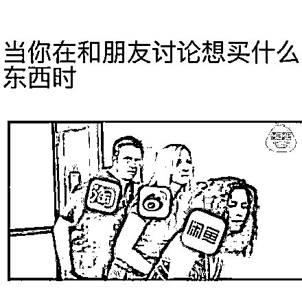
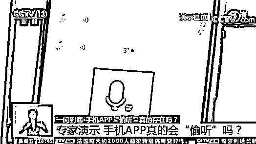
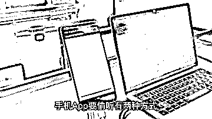
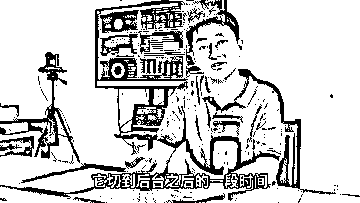
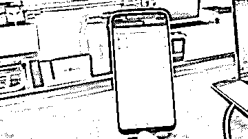
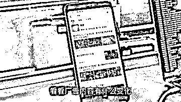
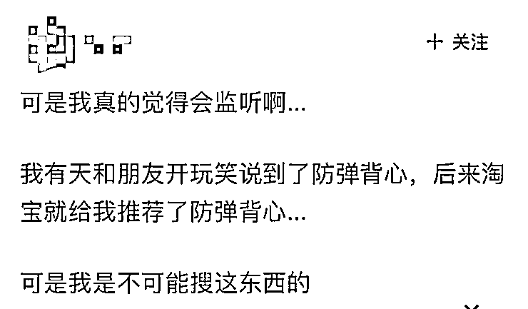
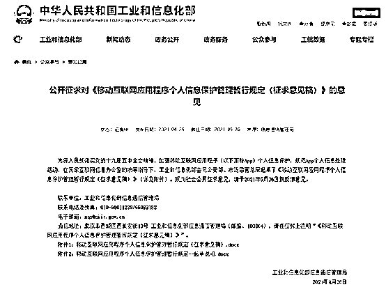

# 聊什么就推什么，手机 App 真的在偷听我们聊天？

> 原文：[`mp.weixin.qq.com/s?__biz=MzIyMDYwMTk0Mw==&mid=2247515455&idx=2&sn=dfffa0fc2a1515d09090d3bd7069b890&chksm=97cb7607a0bcff117958a288c261f53bd6b83da862ad5f83f11d737f19c312fe064bb7ed3f67&scene=27#wechat_redirect`](http://mp.weixin.qq.com/s?__biz=MzIyMDYwMTk0Mw==&mid=2247515455&idx=2&sn=dfffa0fc2a1515d09090d3bd7069b890&chksm=97cb7607a0bcff117958a288c261f53bd6b83da862ad5f83f11d737f19c312fe064bb7ed3f67&scene=27#wechat_redirect)

你是否遇见过这样的情况？

刚路过一个地点

或是谈论起一件事情

手机就会收到相关内容推送

让人不得不怀疑

难道我们被监听了吗？

今年一月，专家实验曾显示

监听在技术层面可以实现

锁屏后也能持续录音一段时间

但成本高、效率低、法律风险大

尚未发现有 APP 这样做

但 APP 会对网上的购买记录、搜索记录等

进行大数据分析

甚至汇总用户的好友信息和其他 APP 数据

一时间，许多网友都分享了自己曾被 APP 监听的经历

比如，聊天和朋友聊到想吃火锅 

打开 App 立马看到附近火锅店的推荐

这究竟是巧合还是被“偷听”？

[`mp.weixin.qq.com/mp/readtemplate?t=pages/video_player_tmpl&action=mpvideo&auto=0&vid=wxv_1895956564155400193`](https://mp.weixin.qq.com/mp/readtemplate?t=pages/video_player_tmpl&action=mpvideo&auto=0&vid=wxv_1895956564155400193)

在网安法实施四周年之际

新华社记者走进专业实验室一探究竟

专家介绍 

手机 App 偷听你通常用两种方式

一种是调用手机麦克风权限

另一种则是利用侧信道的方式

要偷听成功

不仅需要保持 App 在前端运行

还要在联网状态下将录音上传

实验证实

APP 只要拿到了设备的麦克风权限

并保证在联网情况下维持前台运行

就可以做到在用户毫不知情的情况下

监听用户周围的环境音以及谈话内容

部分手机厂商为提醒用户

App 的麦克风使用状态

会在手机屏幕上做醒目提醒

但事实上

手机 App 的“偷听”不仅仅是听

还有“看”“读”“传”等行为

正是通过这些行为

手机 App 才能实现

对用户广告的精准推送

如果你不想被 App 获取过多的个人信息

最简单粗暴的方法

就是拒绝向 APP 提供权限

但实际的情况是

拒绝获取权限后

部分 APP 就会以强制退出等方式阻止用户使用

针对 APP 不授权就停用以及过度索权的情况

工信部还拟规定用户拒绝相关授权申请后

不得强制退出或者关闭 APP

你是否也遇到过被 APP“偷听”的情况呢？

来源：新华社 阿枫科技

← 向右滑动与灰产圈互动交流 →

