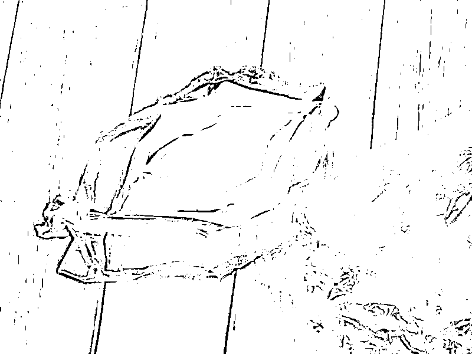
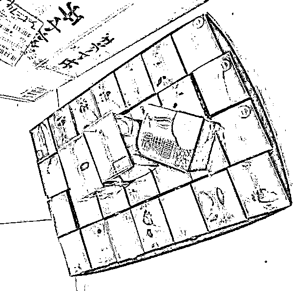
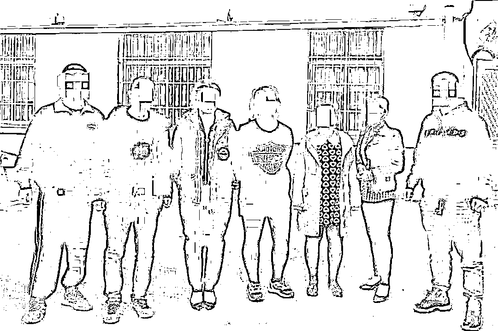
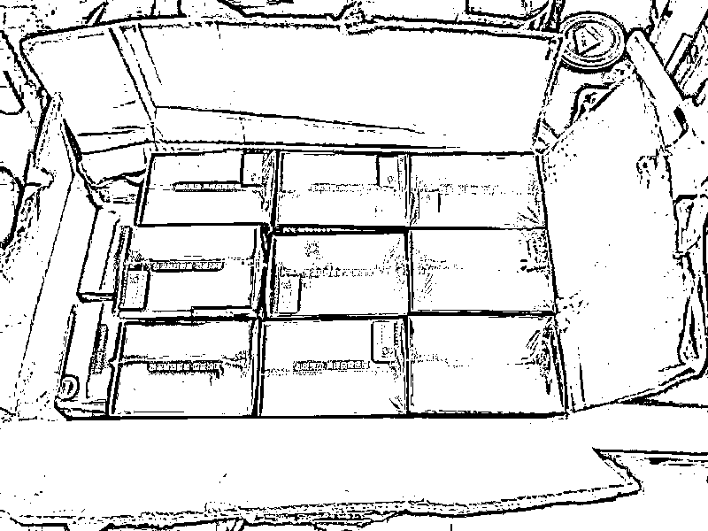

# 10 块钱成本售价 398 元！减肥咖啡竟牵出跨省大案

> 原文：[`mp.weixin.qq.com/s?__biz=MzIyMDYwMTk0Mw==&mid=2247515455&idx=6&sn=4d6b4b233777941bec8e22890c0317c2&chksm=97cb7607a0bcff11ffb05ff2637f9ba5411b220fcce9d92f54f15048549a1fa1df270576b5b1&scene=27#wechat_redirect`](http://mp.weixin.qq.com/s?__biz=MzIyMDYwMTk0Mw==&mid=2247515455&idx=6&sn=4d6b4b233777941bec8e22890c0317c2&chksm=97cb7607a0bcff11ffb05ff2637f9ba5411b220fcce9d92f54f15048549a1fa1df270576b5b1&scene=27#wechat_redirect)

近日，浙江台州市黄岩公安机关会同市场监管部门，经缜密侦查，成功捣毁了一个违法生产和网络销售有毒有害减肥咖啡、果冻、胶囊的犯罪团伙。而“冰山一角”的浮出，源于一位“较真”的消费者。

令警方感到惊讶的是，此案的主谋竟是一对职业光鲜的夫妻，两人为打开销路，制定了严格的销售机制和组织框架，发展代理商数十人。犯罪嫌疑人遍布福建、安徽、山东等地。

男子喝减肥咖啡身体不适牵出

网络跨省生产、销售有害食品案

今年 3 月，台州黄岩区的潘先生在网上看到了一款减肥产品，于是便按照网上的说明，添加了微商代理的微信，购买了一盒减肥咖啡。

收到货后，潘先生立马冲泡了一杯。然而当晚，潘先生的身体就出现了心慌、口渴、饱腹、失眠等症状。“上面写的这个东西减肥效果很好，不反弹。我吃了之后感觉身体不舒服，就看一下它是不是有问题。”

当地市场监管部门收到潘先生的投诉后，送检了这款减肥咖啡。经查验，**咖啡里面含有国家禁止的药物西布曲明，西布曲明是一种精神抑制药品，在 2010 年就被国家列入违禁产品的药物。**

**黄岩区市场监督管理局新前所副所长 章旭：**检测出里面含有西布曲明的成分，这是违禁添加的了。然后我们把相关情况移送给了公安。 

之后，经过黄岩公安分局新前派出所分析，初步确定这是一起**网络跨省生产、销售有害食品案件**，嫌疑人朱某、陈某夫妻俩浮出水面。

10 块钱成本卖到 398 元

主谋竟是一对职业光鲜的夫妻

黄岩公安分局经过 2 个多月的缜密侦查，全面掌握了以朱某为首的犯罪团伙线索。

办案民警杨光介绍，根据受害者潘某提供的线索，民警找到了位于安徽省淮南市的朱姓嫌疑人。“过去把嫌疑人抓获之后，令我们意想不到的，她那刚好就是一个窝点，基本上全部减肥咖啡都是由她来生产、制造的。通过朱某自己交代，还有分析她的资金、物流的信息，我们发现她向全国各地，包括还有一些境外地区，去贩卖这种含有西布曲明的减肥咖啡。”

今年 5 月 10 日，黄岩公安分局开展收网行动，**抓获以朱某为首的犯罪嫌疑人 12 人，**刑拘 3 人，取保候审 9 人，现场查获减肥咖啡成品 100 余盒。

在朱某家中，**民警查获违禁药品西布曲明 391 克，可制成品咖啡 4000 余盒。**一举捣毁了一个跨境生产销售有毒、有害食品减肥咖啡等的犯罪团伙。

据调查，自 2020 年开始至案发，朱某伙同陈某，在其家中设立制售减肥咖啡窝点，私自生产含有“西布曲明”成分的减肥咖啡 7000 余盒，初步核查涉案金额达 2000 余万元。民警在刑事侦查中发现，此案的主谋竟是一对职业光鲜的夫妻。

**杨光：**朱某称自己之前服用咖啡觉得很有效果，而且后来她自己开始制造和贩卖之后，觉得这个利润也特别高。10 块钱的成本可以卖到 398 块钱，暴利面前肯定是抵抗不住的。

△警察（左一、右一）现场抓获犯罪嫌疑人

嫌疑人通过网络搜索到贩卖商家

销售链条遍布全国各地

据了解，犯罪嫌疑人朱某除了销售减肥咖啡，还销售减肥酵素、减肥果冻、减肥胶囊等产品。起初，身材微胖的朱某通过微商购买了这款减肥咖啡以后，一周就瘦了 10 多斤，尝到甜头的朱某决定代理这款减肥产品在朋友圈推广贩卖。

2020 年 3 月，朱某的上家索性让朱某购买原材料，并按比例添加药物西布曲明，自行制作减肥咖啡来卖。

“减肥咖啡卖了一段时间之后，她的上家觉得她的生意不是太好，也不愿意为她提供少量的这种产品，然后就直接把调配的方法都跟朱某讲了，操作起来也比较简单，她就自己开始去制造、贩卖。”杨光说。

为了快速打开销路，夫妻俩还严格制定了销售机制和组织框架。**以朱某为首的销售团伙呈金字塔结构，产品遍布全国多个省份，二级代理商、三级代理商多达数十人。**目前公安机关已斩断这一非法销售链条。

杨光介绍，销售链条在安徽、河南、浙江、山东等地都有，线索还在进一步核查中。“西布曲明现在一般人买不到。据朱某自己交代，是在网络搜索一些关键字，然后搜查到这些贩卖的商家。”

警方提醒：**不要通过非正规途径购买和服用各种特效减肥产品，想要保持健康苗条的身材，坚持运动、健康饮食才是最佳选择。**

来源：光明网、中央广电总台中国之声

← 向右滑动与灰产圈互动交流 →

