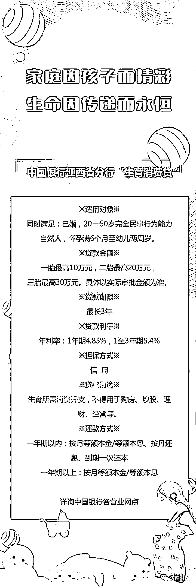
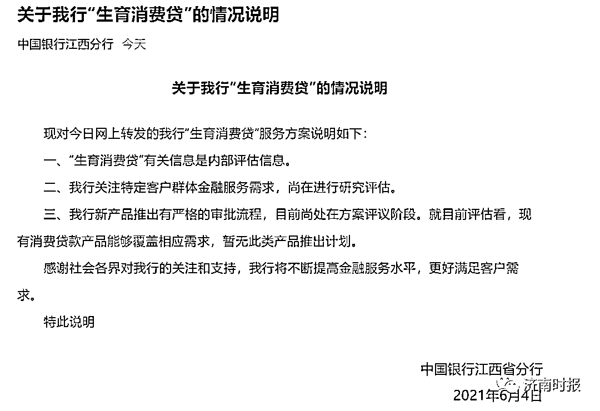
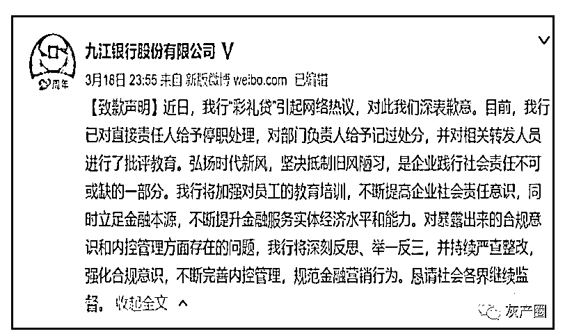
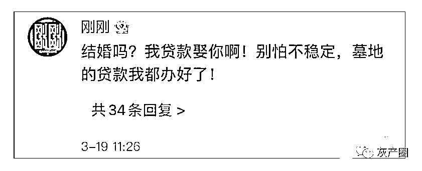
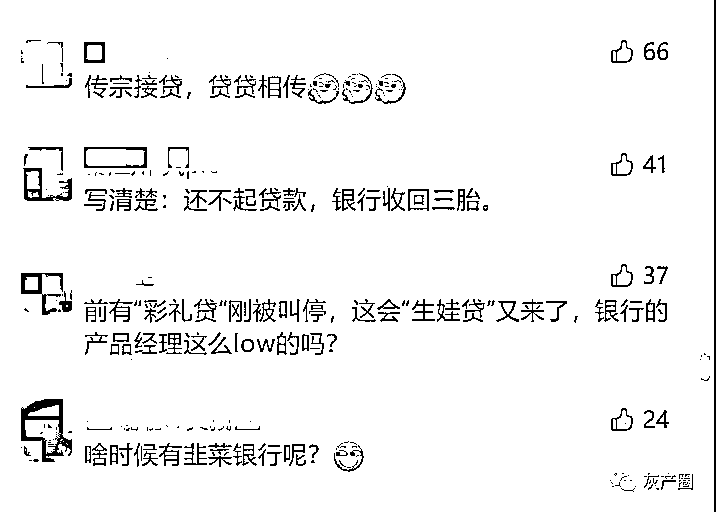
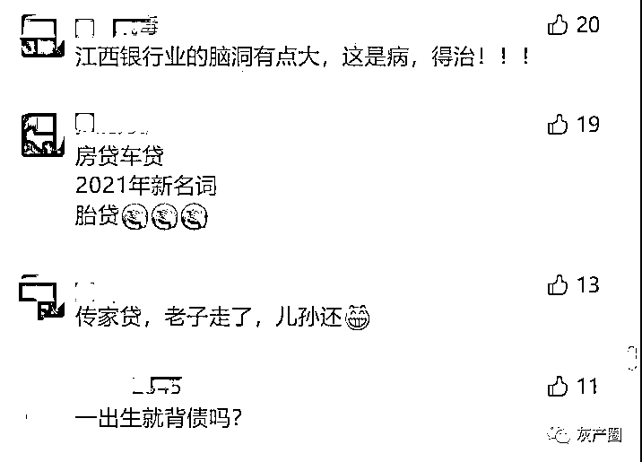

# 银行“生育消费贷”一胎 10 万、二胎 20 万、三胎 30 万？回应来了

> 原文：[`mp.weixin.qq.com/s?__biz=MzIyMDYwMTk0Mw==&mid=2247515455&idx=7&sn=33daa08f5a35a30bf81b5867c6f7bf8d&chksm=97cb7607a0bcff11c1a3bbfc5d19c3b4350386dcd3fb5be1814d430f8a243b24bfe1789844ef&scene=27#wechat_redirect`](http://mp.weixin.qq.com/s?__biz=MzIyMDYwMTk0Mw==&mid=2247515455&idx=7&sn=33daa08f5a35a30bf81b5867c6f7bf8d&chksm=97cb7607a0bcff11c1a3bbfc5d19c3b4350386dcd3fb5be1814d430f8a243b24bfe1789844ef&scene=27#wechat_redirect)

4 日

一则中国银行江西省分行推行

“生育消费贷”的消息

在网上传开

引发了一些网友的讨论

根据网传的宣传海报显示，此项“生育消费贷”在适用对象、贷款金额、贷款期限以及贷款利率等方面作出了一些规定。值得注意的是，一胎最高 10 万元，二胎最高 20 万元，三胎最高 30 万元。

同时贷款还规定，贷款人必须同时是已婚和 20—50 岁完全民事行为能力自然人，需要怀孕满 6 个月至婴儿两周岁。贷款的期限最长为 3 年，利率 1 年期为 4.85%，1—3 年期为 5.4%。

此外，海报还注明此贷款只能用于生育所需消费开支，不得用于购房、炒股、理财、经营等。

支行人员称：宣传页已删除，暂不主推

4 日下午，针对网传的“生育消费贷”，记者致电中国银行江西省分行进行核实，工作人员表示，“目前我们还没有接到相关的政策和业务需求通知，具体可以咨询个人贷款业务部门”。根据对方提供的个贷部门电话，记者多次拨打了该号码，电话一直处于无人接听状态。

随后记者拨打了中国银行景德镇市广场支行的号码，电话接通后，支行工作人员告诉记者，“现在从官网上已经找不到了，刚接的通知已经把宣传页删了，中午的时候删除的。”对方称，网传的宣传页昨晚于中国银行江西省分行官网上线，目前已经下架。“本来是想推的，下架后暂时不推行了，不知道什么原因删掉了。”工作人员说。

据报道，中国银行江西省分行办公室负责人于 4 日下午回应称，网络海报不是网点推出的纸质版本，目前“生育消费贷”并未面向公众推出。负责人还表示，这款产品在市面上并不能见到。

6 月 4 日晚间，中国银行江西省分行微信公众号发情况说明称，**“生育消费贷”有关信息是内部评估信息，尚在进行研究评估。**目前尚处在方案评议阶段，就目前评估看，现有消费贷款产品能够覆盖相应需求，暂无此类产品推出计划。

此前江西的“彩礼贷”曾引发热议

银行道歉

3 个月前，也是在江西，九江银行因推出“彩礼贷”而一度站上了舆论风口浪尖。

3 月 18 日深夜，九江银行在官方微博对此发布致歉声明，称已对直接责任人给予停职处理，对部门负责人给予记过处分，并对相关转发人员进行了批评教育。

在九江银行致歉后，有网友评论：“结婚吗？我贷款娶你啊！别怕不稳定，墓地的贷款我都办好了！”

此条评论的背后，则还涉及近日的另一则新闻。据媒体消息称，云南昆明一陵园推出“墓地按揭贷”。该“墓地按揭贷”可 0 首付购买墓地，贷款额度最高可贷 20 万，贷款期限可达 10 年。

此事在网上引起热议后，陵园相关工作人员表示，对于这一产品，该园和云南西山北银村镇银行此前一直处于沟通阶段，在一次内部活动中提到日后可能会开展这一业务。但目前与银行协商之后，考虑到落地性不强，双方已经决定取消这一项目。

**网友评论**

有观点认为，此次中国银行江西省分行推出的“三胎贷”与“彩礼贷”和“墓地贷”类似，噱头大于实际需求。

上述消费金融业内人士则表示，从宣传的角度来看，“消费生育贷款”确实是一个宣传噱头，其产品的本质和底层逻辑就只是一个消费贷款产品，但它和“彩礼贷”和“墓地贷”还是有本质的区别，并没有违反公序良俗。而且，**消费生育贷款也是有具体需求的，可以缓解一些准备要孩子的家庭在消费上的困难。**

央视网 3 月 18 日发表题为《警惕“墓地贷”以关爱之名行牟利之实》，其中表示，从前些日的“彩礼贷”，到这次的“墓地贷”，红白喜事都全了。是谁在贩卖结不起婚、死不起人的焦虑？如果贷款就能有 20 万元，那墓地总价岂不高到天上去了？在遏制“天价墓”“天价彩礼”的大环境下，这些行为事实上以关爱之名行牟利之实，是时候刹一刹此风了。在国新办举行的“构建新发展格局金融支持区域协调发展”发布会上，央行金融市场司司长邹澜回应了一度热议的“彩礼贷”“墓地贷”等话题，表示个别银行打着所谓金融创新的旗号，**挑战社会痛点，引导居民过度负债，触及社会公序良俗的底线，脱离了金融服务实体经济的本职。**

**“生育消费贷”，你怎么看？**

**留言区说说呀**

来源：红网、济南时报、新黄河客户端、21 世纪经济报道、封面新闻、中国银行江西省分行、大湘网、网友评论等 

← 向右滑动与灰产圈互动交流 →

