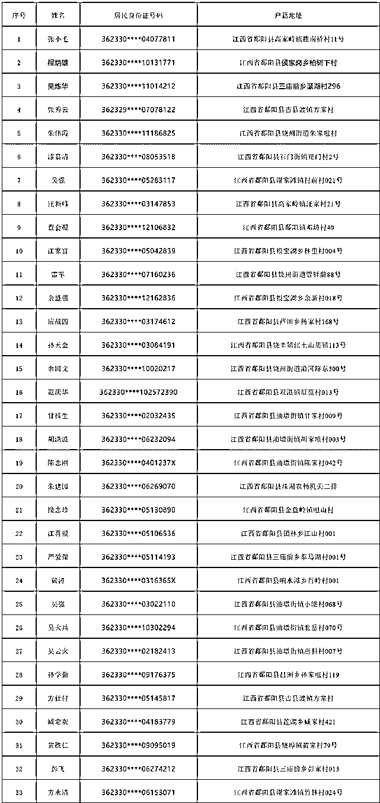

# 涉电诈又失踪失联，又一批人将被拟视情注销户籍！

> 原文：[`mp.weixin.qq.com/s?__biz=MzIyMDYwMTk0Mw==&mid=2247515501&idx=2&sn=8cb2464e2c2259fde39b50585c17710d&chksm=97cb7655a0bcff4365c966e500545a66cb7c72ffbe2ad47d82683f989d3bab20482ddd9d0fca&scene=27#wechat_redirect`](http://mp.weixin.qq.com/s?__biz=MzIyMDYwMTk0Mw==&mid=2247515501&idx=2&sn=8cb2464e2c2259fde39b50585c17710d&chksm=97cb7655a0bcff4365c966e500545a66cb7c72ffbe2ad47d82683f989d3bab20482ddd9d0fca&scene=27#wechat_redirect)

自 6 月以来，多地也发布了关于“拟对失踪人员依法注销户籍”的消息。

特别是江西省最近多地均发布通告。

**此前报道:**

[警告所有骗子：67 人的户籍（国籍）即将注销，再不回国将“社死”！](http://mp.weixin.qq.com/s?__biz=MzIyMDYwMTk0Mw==&mid=2247515404&idx=1&sn=6d581dfe6c5e3349914d593de297a264&chksm=97cb7634a0bcff22d1428ffd02a64d891685032c72d9fd2554bf4c9e291a9a46a7f667b51ebe&scene=21#wechat_redirect)

江西省鄱阳县

江西省鄱阳县公安局微信公众号“平安鄱阳”6 月 3 日发布《鄱阳县关于依法注销第一批失踪人员（疑似偷越中缅边境违法犯罪人员）户籍的公告》，根据有关利害关系人申请，拟视情对以下 33 名失联人员（疑似偷越中缅边境违法犯罪人员）户籍依法提请按程序进行注销。

凡是 2021 年 6 月 10 日前主动联系报备后入境回国的，视为自首，并依法从轻、减轻处罚。

江西瑞昌市

江西瑞昌市公安局 6 月 4 日发布关于依法注销第一批失踪人员户籍的公告，全文如下：

为严厉打击治理电信网络诈骗犯罪，整治中缅边境跨境违法犯罪活动，全力劝返瑞昌籍滞留缅北人员。

根据有关利害关系人申请，拟视情对我市第一批共 10 名失踪人员（涉嫌非法出入境、电信诈骗和网络赌博违法犯罪行为）户籍依法提请按程序注销。

凡是 6 月 20 日前主动联系报备后入境回国的，视为自首，并依法从轻、减轻或免予处罚，否则，将采取“十个一律”惩戒措施，通告如下：

十个一律

1、一律依法拟视情注销户籍。拟对拒不回国的滞留缅北人员户籍依法按程序进行注销，将影响其国籍的甄别，导致今后无法回国。

2、一律严格依法从重打击。对涉嫌违法犯罪的依法从重从严处罚，对按时回国的，依法从轻、减轻或免予处罚。

3、一律冻结其所有银行账户，并对与其有资金往来的账户严格审核。

4、一律关停手机等通讯业务。对拒不回国的滞留缅北人员，按照有关规定关停其使用的手机通讯等业务。

5、一律纳入失信人员黑名单，限制其乘坐飞机、高铁、住宾馆、子女就读私立学校等高消费行为。

6、一律截断政策补助。对滞留缅北人员及其直系亲属一律取消林业、农业等政策性优惠补贴（助），暂停一切政策补助和资质审查。

7、一律依法追缴违法犯罪所得。对滞留缅北人员所获赃款赃物一律没收，对用赃款购置（建设）的房屋等大宗不动产，依法进行查封、没收。

8、一律从严政审。滞留缅北人员及其直系亲属在入团、入党、参军、考取公务员（事业人员）等函询调查时一律从严把关，原则上不予通过。

9、一律不为滞留缅北人员直系亲属就业出具无违法犯罪证明。

10、一律不为滞留缅北人员直系亲属提供新宅基地及申报新建住房。

江西省余干县

6 月 5 日，江西省余干县公安局官方微信公众号“余干公安”发布重要公告：根据有关利害关系人申请，拟视情对李海燕等 39 名失联人员（疑似偷越中缅边境违法犯罪人员）户籍依法提请按程序进行注销。

要求 39 名失联人员直接或委托家属迅速与户籍所在村（居）委会或户籍地派出所联系，并附上了辖区所在地派出所民警联系方式。

上述重要公告称，凡是 2021 年 6 月 15 日前主动联系报备后入境回国的，视为自首，并依法从轻、减轻处罚。

否则，一律视情依法提请宣告失踪、死亡直至注销户籍，并实施村规民约“三评三取消三限制”联合惩戒措施的基础上，一律暂停其直系亲属养老、医保待遇，取消其直系亲属集体经济收益分配资格，不再为其直系亲属新增人口分田。

来源：瑞昌公安

← 向右滑动与灰产圈互动交流 →

