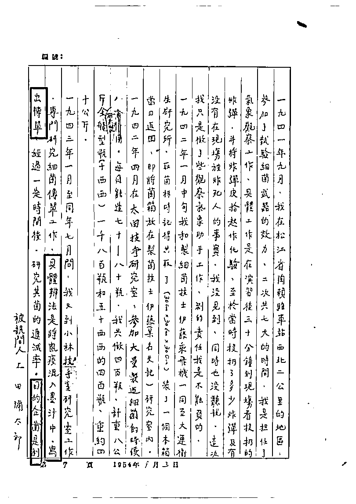
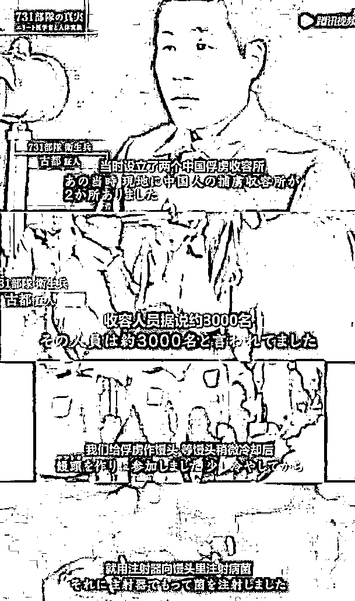
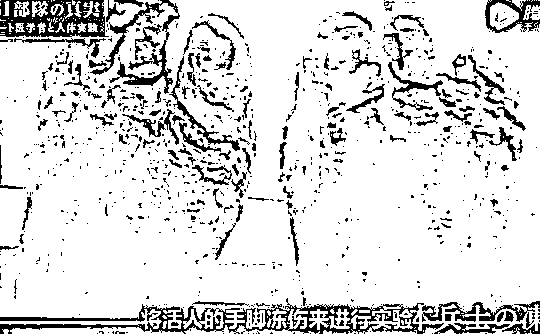
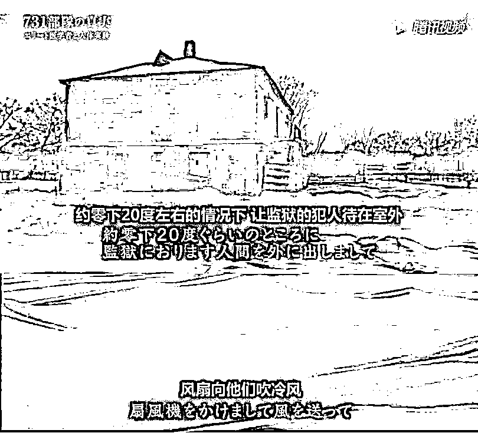
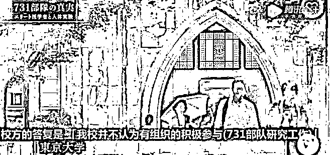

# 罪恶滔天！日本原文罪证披露 731 部队

> 原文：[`mp.weixin.qq.com/s?__biz=MzIyMDYwMTk0Mw==&mid=2247515501&idx=3&sn=3d6b82b10b2eb34e138e40724c669cd3&chksm=97cb7655a0bcff43fbc51272fb07709745a5af9126e6ff766f2fc9d467189d96fe1aa88f723a&scene=27#wechat_redirect`](http://mp.weixin.qq.com/s?__biz=MzIyMDYwMTk0Mw==&mid=2247515501&idx=3&sn=3d6b82b10b2eb34e138e40724c669cd3&chksm=97cb7655a0bcff43fbc51272fb07709745a5af9126e6ff766f2fc9d467189d96fe1aa88f723a&scene=27#wechat_redirect)

战后审判时，石井四郎同意将 731 部队所得人体试验数据提供给美国，来换取免于被起诉战争罪，双方达成协议。石井四郎及 731 部队成员受到了美国的“绝对保护”。恶魔头子摇身一变，成为美国的高级顾问，继续指导相关工作。

6 月 5 日，中国历史研究院官方微博发文表示，6 月 4 日，侵华日军第七三一部队罪证陈列馆给中国历史研究院官方微博提供了珍贵的日文“蒸干实验”原文罪证，731 部队对中国人进行“蒸干实验”，铁证如山！**以下为原文（部分图片或引起不适****）：**

近日，一则“‘人体 70%是水’是日军 731 部队把活的中国人蒸干得出的结论”的帖文引起热议。

当天，某科学博主发文“辟谣”称，“把尸体蒸干测量含水量不现实”，宣称“没必要用谣言为 731 部队增加新的暴行”。

某科学博主微博截图图源：网络某科学博主微博截图图源：网络

历史真相到底是什么？“人体 70%是水”的数据到底是不是日军 731 部队把活的中国人蒸干得出的验证？731 部队到底有没有对中国人民做过惨无人道的“人体蒸干实验”？

6 月 4 日，侵华日军第七三一部队罪证陈列馆给中国历史研究院官方微博提供了珍贵的日文“蒸干实验”原文罪证，我们借此来探明历史真相。

731 部队对中国人进行“蒸干实验”，铁证如山！

（以上资料由侵华日军七三一部队罪证陈列馆提供，出自日本作家森村诚一的著作《恶魔的饱食》第二部）

（这是资料的译文）（这是资料的译文）

该资料出自日本作家森村诚一的著作《恶魔的饱食》。森村诚一在采访日本老兵时，发现了日本 731 细菌部队在中国的犯罪事实。此后，他多次在中国和日本调查取证，发表了《恶魔的饱食》，在日本引起了强烈震动。

由此可见，侵华日军将中国人“活体蒸干”的残忍罪行，并非捏造。

《恶魔的饱食》封面图源：网络

该资料中明确写道：

所谓“干燥实验”，是将活着的“马鲁太”（又名“马路大”，是 731 部队对被迫接受人体实验的受害者的侮辱性称呼。在日语中意为“圆木”，引申意思为“实验品”）绑在椅子上，然后再放进高温干燥室里，在干燥的热风烘烤下，“马鲁太”全身冒大汗，然后烤出来的汗水还不等落到地上，又被热风烘干了。随着时间的流逝，“马鲁太”体内的水分一点点地都被烤干了。不到 15 个小时，“马鲁太”体内再没有一点水分可以渗出来了。

原 731 部队人员的证言说:“‘马鲁太’的身体，就这样变成了一具干巴巴的木乃伊……把它放在秤上一称，干尸的重量，只有活着时的 22%……实验证明，人体内含有的水分为 78%。“马鲁太”体内再没有一点水分可以渗出来。

6 月 3 日，中国人民抗日战争纪念馆也发表了相关声明。

综上可见，日军 731 部队对中国人进行“蒸干实验”，铁证如山！

残忍至极！日本恐怖实验罄竹难书

731 部队的恶行，是日本法西斯阴谋发动细菌战、进行种族灭绝的主要罪证之一。其中的非人实验包括人体活体解剖、手榴弹炸人、冻伤、火焰喷射器烤人、鼠疫、人畜杂交等，其罪状数不胜数，在这里只简单罗列几种。

**1.人体活体解剖**

高高的天花板上吊着一个特大的聚集型照明灯。下面是一个简易的铁床，旁边仅仅放着几个水桶和装有福尔马林液的供装标本用的大型玻璃容器。

这里就是 731 部队的解剖室。

1941 年，活体解剖，日军“北支那防疫给水部”参与，图源：《极秘驻蒙军冬季卫生研究成绩》，供图：侵华日军第七三一部队罪证陈列馆

在这个铁床上，他们从活着的人身体中，掏出五脏六腑，最后做成“标本”。最后将这些新鲜的内脏分发到各个班。

关于这一问题，森村诚一的著作《恶魔的饱食》中有详细记载：

（森村诚一的著作《恶魔的饱食》：绝望的解剖室）

他们事先把解剖活体和进行实验的计划通知各个研究班。“解剖以后把小肠和胰交 A 班”，“B 班要脑子”，“C 班要心脏”……从那时起就开始进行预约。这是对被活生生地解剖了的人体部件的“预先订货”。

活体解剖 图源：北京卫视纪实栏目《档案》《逃出魔窟 731——侵华日军细菌战罪行铁证曝光》

731 部队进行活体解剖，大致有两个目的：

第一个目的是釆集标本。人患传染病时，心脏是否会肥大？肝脏是否会变色？在人活着的时候，查明各个部分的变化情况，解剖活体是最“理想的”方法。

第二目的是研究“马鲁太”（731 部队对被迫接受人体实验的受害者的侮辱性称呼。意思为“实验品”）服用一种药物后，随着时间的推移，与此有关的内脏发生的各种变化。

无数无辜的中国人被当成实验品肆意划开解剖，血喷的满地都是，实验室中充斥着尖叫声和血腥味，甚至连婴儿都无法逃过。

（清末，日本人对鼠疫患者的解剖，图源：明治四十三四年南滿州「ペスト」流行誌附録寫眞帖 P67）

为了完成他们的目的，731 部队把尿、马血注入肾脏，观察人的身体会发生什么反应、他们用猴血、马血和人血进行交替实验。他们利用针管进行过多次抽血实验，看看究竟能从“马鲁太”身上抽出多少血液。他们把大量的烟送入人的肺中，把毒气或糜烂性气体进入人体，观察胃会发生什么变化。

（森村诚一的著作《恶魔的饱食》：“绝望的解剖室”一节）

更过分的是，被 731 部队进行活体解剖的人，并非都是“反日分子”。森村诚一的著作《恶魔的饱食》“绝望的解剖室”一节中，记录了一个实例：

1943 年的某一天，他们把一个中国的少年带进了解剖室。

一个原 731 部队人员回忆当时解剖情景时这样说道，“少年并不是‘马鲁太’……孩子并没有进行什么抗日运动。后来，我才知道解剖他是为了取得一个健康的男少年的内脏。因此，这个少年就活活地被解剖了……”

他们从这个无辜的少年身上依次取出肠、胰、肝、肾、胃等各种内脏，分别计量之后把它们丢进了桶里......

（森村诚一的著作《恶魔的饱食》：“绝望的解剖室”一节）

鲜血如注，活体解剖，身躯掏空，五脏仍动。

恶魔！恶魔！

**2.细菌实验**

731 部队把所有研究出来的细菌都用在活人身上，包括梅毒、淋病、伤寒、鼠疫等，都是高度危险和致死的病菌。

6 月 4 日，侵华日军第七三一部队罪证陈列馆给中国历史研究院官方微博提供了 731 部队成员上田弥太郎的口供原稿。该供述档案现存于中央档案馆，是十分宝贵的第一手档案资料。

在上田弥太郎的口供中就记录了“传单传播鼠疫”：

具体方法是，将鼠疫混入墨汁中，写出传单，目的是企图利用传单方法散布细菌。

（上田弥太郎口供，供图：侵华日军第七三一部队罪证陈列馆）

而为了繁殖鼠疫跳蚤，731 部队首先给老鼠注射鼠疫菌，然后放入跳蚤，让它吸老鼠身上的血。直到剩下骨头为止，同时进行繁殖。

跳蚤吸了已经染有鼠疫菌的老鼠血，保持老鼠的体温，在黑暗中，跳蚤就会拼命地繁殖。

731 部队中约有 4500 个这种饲育鼠疫跳蚤的器具，在两个多月中，可以“制造”几十公斤的鼠疫跳蚤，不是一千或一万只，而是几十公斤的鼠疫跳蚤。

为了研究细菌对不同人群的效果，731 部队还用孩子做实验，无数的孩子死亡，没有死的要么残疾，要么畸形，最后只有两个下场：解剖和焚化炉。

(1940 年 11 月，“731 部队”对吉林的一个农家孩子进行细菌实验，孩子痛苦万分，浑身流脓溃烂，生不如死)

731 部队的一个卫生员表示，他们还向俘虏吃的馒头里注射病菌。

（日本 NHK 电视台纪录片《731 部队的真相》截图）

在糖水中加入伤寒杆菌，再强制俘虏喝下去。

（日本 NHK 电视台纪录片《731 部队的真相》截图）

还有一栋建筑，里面就关 4、5 个囚犯。731 部队把鼠疫跳蚤放进去，过一段时间再来看。

（日本 NHK 电视台纪录片《731 部队的真相》截图）

结果是一个活人都不剩了。人间地狱，名副其实。

囚犯中，还有不少女性，甚至有母亲带着没有断奶的孩子。

接着，京都大学教授田部井和研发出了细菌炸弹，并开始研究如何造成大规模感染。其部下证明，他每次实验需要用 10 名以上的囚犯。

细菌弹在空中爆炸，对地面形成喷雾效果，使细菌四处散落，然后或是让实验对象走过细菌散落的区域，或者将实验对象强行绑在柱子上，在他们上方引爆细菌弹。

**3.冷冻试验**

（日本 NHK 电视台纪录片《731 部队的真相》截图）

为了研究冷冻对人体的伤害，731 部队的吉村寿人做了活人冷冻实验。

更过分的是，吉村还曾就自己进行冻伤实验问题发表过学术论文。甚至连刚出生几天的婴儿，他都不放过。

关于这件事，追查 731 部队残存干部战后足迹的高杉晋吾先生写的《追查石井细菌部队残存干部》论文中有详细的记载。

（资料来源：《恶魔的饱食》）

这篇论文是吉村寿人战后发表在日本生理学会的英文刊物《日本生理学季刊》上的，是一篇关于寒冷生理学的论文。

正像前面提到过的渡边在 M 报纸发表的那样，吉村对别的民族（包括中国人、满洲的蒙古人和鄂伦春人）进行过冷冻实验，同样也对 100 多名旅满日本学生（18 岁至 28 岁）和中国苦力（对劳工的蔑称）进行过活体实验。为对不同年龄层的差别进行调查，对 7 岁至 14 岁的中国小学生也进行过活体实验。

更令人感到震惊的是，他还进行过把出生第三天、一个月和六个月的婴儿的中指放进冷冻水中浸泡 30 分钟的活体实验。

冻伤实验日军“北支那防疫给水部”参与

把手指浸泡在冷水中 30 分钟，婴儿一定会声嘶力竭地哭叫。

由于这种情况，只有在密室中专门修造一个能够强制婴儿进行实验的设施，才有可能。当然这种实验只有在 731 部队的设施里才能进行。

在哈巴罗夫斯克军事审判记录中，有许多证人证实了吉村进行的冻伤研究。现将其中部分证词引用如下。

（资料来源：《恶魔的饱食》）

下面是原 731 部队教育部长西中佐的供述：

问：关于部队内进行过冻伤实验，你知道些什么？

答：听吉村研究员说，在严寒的条件下，把他们从监狱中带出来，空手站立，然后用人造风（电扇）吹，使手冻伤。然后用一支小棍不断敲打冻伤的手，直到能够听到像敲打小板时的声音为止。

（日本 NHK 电视台纪录片《731 部队的真相》截图）

（资料来源：《恶魔的饱食》）

下面是原 731 部队内宪兵的供述：

“（前略）我经过监狱实验室时，看到有 5 名中国人坐在长椅子上。他们中有两人没有手指，双手都变黑了，有三个人的手已露出了白骨。虽说还有手指，但只剩下骨头了。听吉村说，这些都是对他们进行冻伤实验的结果。（以下从略）”

（日本 NHK 电视台纪录片《731 部队的真相》截图）

**4.性病实验**

梅毒等性传染病对于军队的杀伤力是非常巨大的。731 部队经常进行性病实验。

最初，731 部队通过注射使女性感染梅毒，但由于实验结果不成功，就通过强迫性交感染梅毒。

据 731 部队一位研究人员描述：“通过注射感染性病已经行不通了，于是研究人员开始强迫囚犯彼此发生性行为……感染了梅毒的人，将被聚集在一起，并被迫相互发生性关系。很明显，任何抵抗的人都会被枪杀。”

一时间，感染梅毒死亡的人遍地都是，解剖后都来不及烧，只能就地掩埋。

（清末冻结尸体堆积图源：明治四十三四年南滿州「ペスト」流行誌附録寫眞帖 P101）

在受害者被感染后，他们在感染的不同阶段被活体解剖，从而随着疾病的进展可以观察到内部和外部器官。

**5.强奸、强制怀孕**

在 731 部队的罪恶实验里，女人被迫怀孕用于实验。疾病，特别是梅毒垂直传播（从母亲到孩子）是研究的重点。很多女性被强奸怀孕后甚至被活生生地剖开。

在《恶魔的饱食》中记录了如下的证词：

有一名妊娠的“马鲁太”被捕以后在狱中生了孩子。她为了救孩子一命，表示同意自己被用作任何“实验”。她流着眼泪，每天恳求看守人员救救这个孩子。只有部分部队人员知道这件事……但是在 731 部队看来，“马鲁太”的母亲只会生“马鲁太仔”。由于“马鲁太”是材料，那么，她的孩子也只不过像饲养老鼠一样地被饲养着而已。不消说，母子都遭杀害了……

如果说，这些军人的暴行让你已出离愤怒。那么，接下来的这个真相让人更加气愤。

731 部队的核心人物不是军人，而是知识精英。几乎所有的日本顶级学府都向 731 部队输出过人才。

（日本 NHK 电视台纪录片《731 部队的真相》截图）

理由很简单，为了钱。去 731 部队的人都能拿到巨额报酬。

（日本 NHK 电视台纪录片《731 部队的真相》截图）

京都大学院长户田正三两度把学生送去参加 731 部队，得到的研究经费超过 2 亿日元。

（日本 NHK 电视台纪录片《731 部队的真相》截图）

讽刺的是，即使证据确凿，被问及此事的时候，东京大学的回应还是：不承认。

（日本 NHK 电视台纪录片《731 部队的真相》截图）

后来，一名从平房撤退回国的原 731 部队人员，在战败二十余年以后对自己的经历作了十七首俳句：

一

酷寒冻肉伤，

友祥画笔描彩绘，

双手惊颤颤。

二

凝视“马鲁太”，

双手僵冻硬如冰，

肉裂白骨露。

三

生体活解剖，

手术刀上血肉糊，

鲜血凝成球。

四

烈日当空照，

手铐脚镣紧身缚，

锁声震楼哭。

五

越狱求生存，

刀光枪影紧逼人，

解放献终身。

六

反帝意志高，

鲜血誓书留墙上，

葬身烈火中。

七

魔怕留罪状，

慌把尸体火中抛，

油脂臭味冒。

八

终身负罪重，

病毒跳蚤袭人伤，

吸血把病造。

九

狮子狂声吼，

恶魔医生死挣扎，

浑身汗淋漓。

十

大楼烈火烧，

恶魔白塔痕欲消，

鬼梦一场空。

十一

满脸泥汗泡，

亡命货车窜原野，

疾速向南逃。

十二

隧道闷又黑，

汗水煤末满身沾，

车中难友愁。

十三

一切化灰烬，

逃亡途中闻败讯，

货车哭声嚎。

十四

飞越跨国境，

人定气平心安宁，

忙擦满头汗。

十五

炎夏闷又热，

汗流浃背围相坐，

共话釜山夜。

十六

乘船返故国，

凭栏近指仙崎港，

新绿渗人心。

十七

多磨静悄悄，

黑碑无言风中立，

五轮塔下寒。

这些诗句是用无辜者的鲜血、白骨和生命写成的。森村诚一在其著作《恶魔的饱食》中也解说过这首诗，在这里介绍给大家。

（森村诚一解说）

从 731 部队到德特里克堡：罪恶遗产的转移

731 部队实在过于恶臭！而这个部队的始作俑者就是石井四郎。

但是，恶魔一样的石井四郎却没有被审判。

战后审判时，石井四郎同意将 731 部队所得人体试验数据提供给美国，来换取免于被起诉战争罪，双方达成协议。以下这些图片就是美国与石井四郎交易的证据。

石井四郎及 731 部队成员受到了美国的“绝对保护”。

恶魔头子摇身一变，成为美国的高级顾问，继续指导相关工作。

那个研发了伤寒杆菌炸弹的田部井和（前文提过），后来成了京都大学的教授，当上了细菌学的权威。

（日本 NHK 电视台纪录片《731 部队的真相》截图）

直到今天，731 部队的遗毒还在迫害着全世界。

这就是——美国人接过了 731 部队罪恶的黑手。

5 月 28 日，在中国外交部例行记者会上，有记者就美国政府再炒新冠肺炎疫情起源一事提问。中国外交部发言人赵立坚回应，“公开资料显示，德特里克堡居然与侵华日军 731 部队有着千丝万缕的关系，罪恶滔天的 731 部队负责人石井四郎，还曾是德堡的生物武器顾问。”

昨日，中国外交部发言人汪文斌又进行了相关发言：美国为得到 731 部队细菌战数据资料，支付了 25 万日元，甚至向世界隐瞒 731 部队及其头目石井四郎的滔天罪行，还让石井四郎成为德特里克堡的生物武器顾问。对这些历史事实，美国什么时候能够给国际社会一个负责任的交待？

（上图为 731 部队进行人体实验的炭疽菌实验报告封面图，上面有德特里克堡基地的字样。侵华日军第七三一部队罪证陈列馆供图）

（731 部队进行人体实验的鼻疽菌实验报告、炭疽菌实验报告、鼠疫菌实验报告的封面。新华社记者王建摄）

美国长期从事细菌战研究的专家谢尔顿·H·哈里斯一直想证明，美国政府有意隐瞒石井四郎指挥日军在中国犯下的罪行。他在《死亡工厂》一书中披露了核心证据——《希尔报告》中有这样一段记载：“收集到的证据信息对我们开发细菌战十分珍贵……为了拿到这些数据共花费了 25 万日元，与实际研究成本相比，只是花费了如此低廉的价格，就获得了珍贵的资料。”

“这段描述是美国庇护 731 部队免遭东京审判的书面文件，从事件的过程和最后的结果来看，美国确实达到了单独占有 731 部队生物战和人体实验情报资料的目的。”哈尔滨市社会科学院七三一问题国际研究中心主任杨彦君说，美国获得这些数据资料后，加以利用，进行了生物武器研究，德特里克堡基地战后能快速发展壮大，乃至现在成为美国军方的 P4 生物实验室。

美国一贯坚持双重标准，同 731 部队进行的秘密交易，完全没有考虑 731 部队人体实验、细菌战这些违背伦理和文明准则的犯罪行为。正如谢尔顿·H·哈里斯在《死亡工厂》一书中记述的：“实际上，（美国）国务院的态度是，只要不给美国带来麻烦事（即给予战犯免责之事的暴露）留下文字记录，就可以继续与石井四郎等进行交易。”

（图为上田弥太郎的口供中 731 部队的目的）

在上田弥太郎的口供中，白纸黑字地写着，日军 731 部队的目的就是——制造大量的细菌，屠杀中国人民，继续侵略全亚洲！

如今，这只罪恶的黑手，嫁接到了另外一个国家手中。

黑手的主人变了，但目的没有变、罪恶也没有变。

历史和现实的关系，就是这样引人深思……

综合整理自：日本 NHK 电视台纪录片《731 部队的真相》、张宪文.山东画报出版社.《日本侵华图志》第十五卷《化学战与细菌战》、侵华日军七三一部队罪证陈列馆、[日]森村诚一《恶魔的饱食》（骆为龙陈耐轩译）、北京卫视纪实栏目《档案》《逃出魔窟 731——侵华日军细菌战罪行铁证曝光》、央视新闻、新华社、人民日报、北京日报、观察者网等  

来源：@中国历史研究院 观察者网

← 向右滑动与灰产圈互动交流 →

