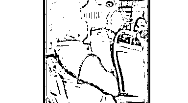

# 北京一大妈公车上嫌让座慢怒骂女乘客：臭外地的，上北京要饭来了？我正黄旗！

> 原文：[`mp.weixin.qq.com/s?__biz=MzIyMDYwMTk0Mw==&mid=2247515501&idx=4&sn=abfe02c4bf92016e2727fe9bdb190583&chksm=97cb7655a0bcff43d3ff926f41cec1d12e362c0992eb3ab7a9c622598235f80c340b44abe486&scene=27#wechat_redirect`](http://mp.weixin.qq.com/s?__biz=MzIyMDYwMTk0Mw==&mid=2247515501&idx=4&sn=abfe02c4bf92016e2727fe9bdb190583&chksm=97cb7655a0bcff43d3ff926f41cec1d12e362c0992eb3ab7a9c622598235f80c340b44abe486&scene=27#wechat_redirect)

北京一大妈嫌让座慢怒骂女乘客：

臭外地的，我正黄旗！

近日，有网友爆料，在北京顺义一辆公交车上，一名自称肢体残疾的 60 多岁女性，因为车上一位年轻女乘客未能在第一时间给她让座，这位大妈大声责骂，言语中多次歧视外地人。

**“我就瞧不起外地人，没素质，老弱病残上来不给让座，我瞧不起。”**

**“臭外地的，上北京要饭来了，狂什么呀。”“看你这长相，就知道你不是北京人儿。”**

被骂的女乘客不忿回嘴：**“北京都是你家的，有本事你住故宫里。”**

这位大妈当即回怼：“我生在红旗下，长在天安门，你呢，臭外地的。我还真是正黄旗人，有通天纹，你看看，你有吗？”说着，大妈摘下了自己的帽子，指着自己的额头给那位年轻女乘客看。

车上有乘客看不下去，劝道：“这跟北京外地有什么关系啊？您这不是挑起矛盾吗？”

但大妈毫不听劝，继续开喷：“我就瞧不起外地人，没素质，我瞧不起，这就叫北京，我二环以里户口，这叫北京！”

[`v.qq.com/iframe/preview.html?width=500&height=375&auto=0&vid=l3251bus0os`](https://v.qq.com/iframe/preview.html?width=500&height=375&auto=0&vid=l3251bus0os)

**视频来源：浙江经视新闻**

车上有北京乘客听不下去，说道：“就您还北京人儿呢，您别在这儿乱了，回您二环里去，皇城根儿底下住去。”

大妈当即怒骂：“跟你有什么关系，我顺义这儿有家，跟你有什么关系，瞧你那揍性。”

这位北京乘客回道：“因为我是北京人，我觉得您太丢北京人脸了。”

大妈：“你爱哪儿的哪儿的，跟我没关系，我就北京人怎么了！”

据目击者李女士表示，该女子上车时就高喊“给我让位置”，自己第一时间就主动让座，且车厢中还有空余座位，但该女子看起来不像残疾人，挺活蹦乱跳的。她当天可能心情不好，故意找茬。” 

4 日，北京公交集团工作人员告诉记者，**该女性行为未对人身或财产造成实质的伤害，只能做道德层面的引导。**引导文明乘车这块工作其实公交公司一直在做，但没办法保证每个乘客都符合道德准则，只能一点点改善。目前从法律规范上来说，她没有明确的违法行为。除非她危害公共安全，或者违反了公共治安的一些条例的情况下，司乘人员才会选择报警，让警方处理。

[`v.qq.com/iframe/preview.html?width=500&height=375&auto=0&vid=c32509n6frs`](https://v.qq.com/iframe/preview.html?width=500&height=375&auto=0&vid=c32509n6frs)

**视频来源：正观新闻**

近年来，老人公交车上逼迫年轻乘客上座的情况屡见不鲜，有老人因对方不肯让座或让座慢了点点就口出秽语，甚至与对方产生肢体冲撞。早在 2018 年，在西安也发生过这样一起。

老人嫌孕妇让座慢还破口大骂

遭指责后狂怼乘客

2018 年 8 月 2 日傍晚，在西安一辆 14 路公交车上，一名孕妇在下车时给一位老太太让座却遭到了对方的谩骂。

[`v.qq.com/iframe/preview.html?width=500&height=375&auto=0&vid=v07520t6n7a`](https://v.qq.com/iframe/preview.html?width=500&height=375&auto=0&vid=v07520t6n7a)

当时该孕妇对她说：您慢一点，别碰着我。老人听罢便破口大骂，嫌她让座太慢，让自己站了好几站。

老人的无理取闹引发了车内多名乘客的愤怒！周围的人纷纷对其进行指责，可老太太的态度却更加嚣张，继续狂怼乘客，大声叫“你管得着吗？”

同样在北京，曾经有一位八旬老人上了车却一再婉拒大家的让座...

83 岁"容嬷嬷"坐公交

男孩好心让座却被"按"回去

2019 年 5 月 13 日，有网友在北京公交车上偶遇曾在《还珠格格》中扮演“容嬷嬷”的李明启老师。

1936 年出生的李明启老师当时已经 83 岁。上车后的李老师一直没有座位，就扶站在车把手旁。车上的乘客发现李老师后，便有人站起来让座，但被李老师以“我就坐两站”为由婉拒，自己继续扶站在车把手旁。

随后，又有一名男孩起身为李老师让座，李老师转身阻止，把男孩的手臂按在座位上，让他不要起身。

[`v.qq.com/iframe/preview.html?width=500&height=375&auto=0&vid=o1432x5qitg`](https://v.qq.com/iframe/preview.html?width=500&height=375&auto=0&vid=o1432x5qitg)

点评：

大妈炫耀正黄旗血统 丢了社会文明的脸

城市公交车空间有限，行驶过程中，乘客之间由于各种原因发生磕碰、口角等在所难免。现实中，这些争执，大多不涉及地域歧视，不挑起本地人与外地人矛盾，更多时候是当事人逞一时之快。不过，这位大妈却“骂力”十足，不仅挑拨北京人与外地人矛盾，还炫耀自己“正黄旗”的血统。如此口出狂言，引发网友众怒。

严格意义上说，大妈确实没有触犯治安处罚条例等法律，只能对其进行批评教育。但是，其态度之嚣张、言论之恶劣，引起全网哗然，招致众声谴责，实乃咎由自取。

这位大妈自称是“二环以里”北京人、“正黄旗人”，情况是否属实，不得而知。问题在于，在文明社会，即使真正是“土著”北京人，也不比其他地区的人高人一等，也没有任何理由看不起外地人。而拿“正黄旗”血统来炫耀，就更令人不齿，具有“正黄旗”血统，又能说明什么？

血统，指由祖先血缘形成的亲属系统。这一定义血亲关系的医学概念，在封建社会曾被用作确定个人身份、社会地位的“金标准”，凡与皇亲国戚有亲缘关系者，就意味着比普通百姓高人一等，享有各式特权。随着社会文明进步，血统论早已被扫进历史垃圾堆，但其影响似乎绵延不绝，时至今日，不时有人拿血统说事，即使在公交车这样的公共场合，也不忘显摆自己所谓高贵血统，令人不禁有“不知今夕是何年”之叹。

当然，这位大妈代表不了北京人，其不文明言行，实属个案，不可能简单地据此定义北京的整体文明程度。换句话说，北京人的脸没那么容易被人弄丢，大妈充其量丢的是自己和家人的脸，丢的是社会文明的脸。

来源：看看新闻 Knews、观察者网、浙江经视新闻、正观新闻、红网、Vista 看天下等

← 向右滑动与灰产圈互动交流 →

