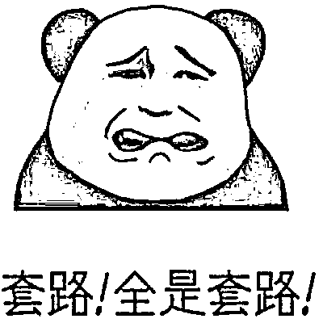
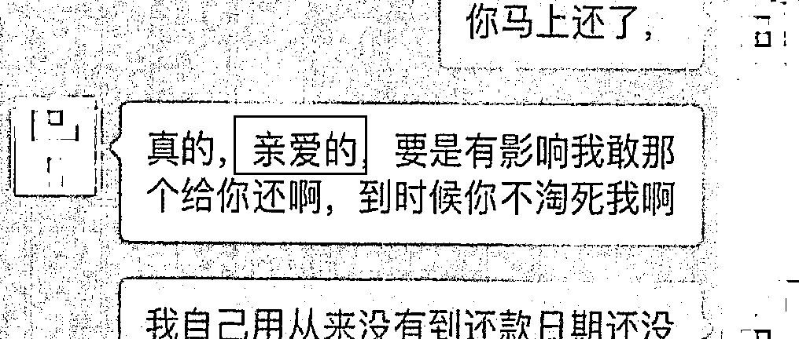

# 骗财骗色近百万，泸州“海王”落网！“演技派”聊天记录曝光！

> 原文：[`mp.weixin.qq.com/s?__biz=MzIyMDYwMTk0Mw==&mid=2247515579&idx=2&sn=54419fce75fb5bd8bfdb816d7eef3a61&chksm=97cb7683a0bcff95f7ccf419d6b998dfb2d8e2d3d856ef70b0e8d3952797ddfbaf3976fb4dab&scene=27#wechat_redirect`](http://mp.weixin.qq.com/s?__biz=MzIyMDYwMTk0Mw==&mid=2247515579&idx=2&sn=54419fce75fb5bd8bfdb816d7eef3a61&chksm=97cb7683a0bcff95f7ccf419d6b998dfb2d8e2d3d856ef70b0e8d3952797ddfbaf3976fb4dab&scene=27#wechat_redirect)

**“本以为走进了哥哥的心房**

**没想到游进了哥哥的鱼塘”**

**现实版泸州“海王”**刘某落网**骗人感情还骗钱财****占有近 20 余人的 50 余张信用卡****非法获利近百万元**

**「海王」是一种什么生物？**

「海王」本是**漫画**宇宙里的超级英雄如今已变成**「渣男渣女」的代名词**

经常以**「大面积撒网，选择性捕捞」**

为中心指导思想撩妹的渣男

**「养鱼」是海王们的日常爱好**

**他们在情场上暧昧对象众多**

通讯工具里几乎 90%以上都是异性

然后像中央空调一样，见谁暖谁

碰上看起来易上钩的对象就重点捕捞用柔情攻势令对方情不自禁地**沦陷其中**

**以为自己是海王心中唯一的真爱**

**却万万没有想到海王其实对谁都是这一套**

****

下面

我们就一起来看看

**这位现实版泸州“海王”**

**是怎么开始他的****“捕捞”****犯罪之路的？！**

继续往下看

↓↓↓

01**已为人父 ****利用社交软件打造成功男人人设**

泸县男子刘某虽已为人父，但常利用社交软件结交异性。这些异性好友，年龄都在 20 多岁至 30 多岁，且不少人有着婚姻不幸福、工作不顺利的烦心事。**基于此，刘某经常在聊天中，表现得非常体贴。嘘寒问暖、甜言蜜语，还请对方吃饭和游玩。** 

▲聊天截图

网上，刘某为自己贴上**“单身、老板、干部”等多个虚假标签**，在异性面前塑造出一个帅气多金、体贴入微的成功男人形象，**渐渐成了异性好友眼中的“帅气大哥哥”**。

而在现实生活中，刘某“为人不错”，也是亲戚、朋友、老乡心中的“本分人”。**打造好“人设”后，刘某才出手行骗。**

02**编造理由 ****占有近 20 余人的 50 余张信用卡**

刘某花言巧语，编造“方便资金周转、提高积分兑换物品”等理由，将异性好友带至成都，找信用卡中介办理多个银行的信用卡，而办理的信用卡最终都寄给了刘某。

对于已有信用卡的异性好友，**刘某则用“反正你不用，你用的我帮你还，提高积分兑换物品”等借口，骗取异性好友将信用卡交由他使用。**

▲部分受害人的信用卡

而针对一起工作的老乡和亲友，刘某提出“资金周转不畅、工程款未收回”等借口，骗取“亲友”办理信用卡并交由他使用……就这样，刘某占有了**近 20 余人的 50 余张信用卡，供自己使用，还车贷、吃饭消费等。**

每当信用卡快要逾期时，刘某便用还有额度的信用卡还款。最终，所有信用卡都透支、逾期了。他又开始下载网贷 APP，**利用他人的信息从 APP 内贷款……**

▲用于放置信用卡的卡包

**03****谎言破碎 ****受害者收到还款提醒电话**

刘某在与他人的交往中，除了解自己的亲友，对其他人他都用虚假的身份信息。**被骗的多人中，异性好友占了大多数。一旦她们在生活、工作、感情上有问题，刘某便趁虚而入，展现温情一面，与多人顺利发展成为男女朋友。**

去年底，刘某编造的“谎言世界”终被揭穿：**多名受害者不断收到银行和网贷公司的还款提醒电话和信息。**

▲还款提醒信息

▲面对受害者询问，刘某这样回答

今年初，多名受害者到泸县公安局潮河派出所报警。

经查，被刘某诱骗成为男女朋友的受害者中，除了被骗感情，还有惨重的经济损失。**受害者中，涉案金额最少几千元，多的超过 20 万元，案件总涉案金额近 100 万。**

目前

刘某已被公安机关刑事拘留

案件正在进一步办理中

**温馨提醒**

** 网恋有风险 **

** 注意保护个人财产！**

来源：天天防诈骗

← 向右滑动与灰产圈互动交流 →

