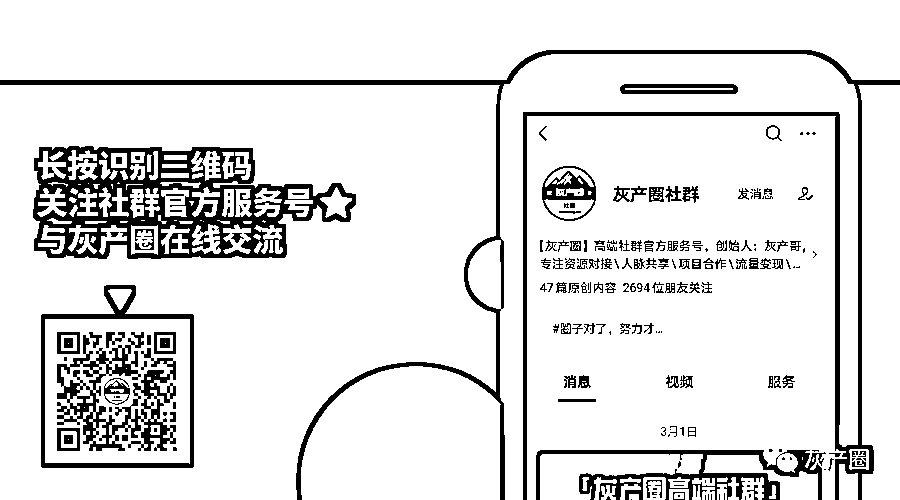

# 被曝涉黄后，“趣住”注册用户竟激增 10 万！

> 原文：[`mp.weixin.qq.com/s?__biz=MzIyMDYwMTk0Mw==&mid=2247515579&idx=4&sn=d8cddee0c9d71f125a3c8d006b2f8d5e&chksm=97cb7683a0bcff95855497d9a0e8d272c5fe88c7555477f758a0ac92321285869602f9ce1b1a&scene=27#wechat_redirect`](http://mp.weixin.qq.com/s?__biz=MzIyMDYwMTk0Mw==&mid=2247515579&idx=4&sn=d8cddee0c9d71f125a3c8d006b2f8d5e&chksm=97cb7683a0bcff95855497d9a0e8d272c5fe88c7555477f758a0ac92321285869602f9ce1b1a&scene=27#wechat_redirect)

以酒店社交为噱头的“趣住”APP，一度被质疑涉黄。然而，经过上海警方查证，“趣住”不存在涉黄违法行为，实际上这一社交平台就是一个骗局，里面存在一万余个虚拟女性用户账号，看上去暧昧诱惑的信息，不过是智能软件批量生成的“画皮”。

目前，这个虚构女性用户身份、批量发布诱惑信息、骗取他人充值牟利的诈骗犯罪团伙已被警方捣毁，10 名犯罪嫌疑人落网。

**与美女聊天须“充值”******

******“趣住”在官方介绍中自称专为出差人群设计、主打差旅酒店社交，软件的首页直接显示附近酒店的列表，每家酒店都有专属的留言墙和聊天室，在留言墙可以浏览其他用户发布的内容并通过私密评论搭讪，也可以通过聊天室呼唤联系。******

******软件的用户很容易就可以找到同住一家酒店或者附近酒店且独自居住的房客，而若要进行私聊、私密评论或发布个人动态等，则需要充值购买“咚币”或充值成为“VIP 会员”。******

******警方调查发现，软件中留言墙、聊天室、话题广场等功能区的留言大多显示为女性用户发布，内容暧昧露骨，图片文字极具诱惑、充满暗示。******

******被骗者张先生表示，一次出差期间，住酒店的他感到无聊，便查找交友软件，下载了这款“趣住”。页面功能和其他的交友软件都差不多，很多美女账号频繁发布一些衣着暴露、性感并带有性暗示的动态，非常吸引人。******

******因为无聊，张先生想找些美女聊聊天，交朋友。在这款软件上，要想跟异性私聊、评论需要花费“咚币”。他充值了人民币 180 元的咚币，前后搭讪了 12 个女性账号，就已经用完了。******

************

************

******聊天中，性感“美女”会发一些带有性暗示的内容，张先生也就“打情骂俏”“发一些下流的话”。但很快他发现，这些美女在聊过几次之后，就不再回复。“我觉得这款软件有问题，可能是诈骗软件。”******

******和张先生有一样遭遇的被骗者不在少数。******

******2 人创建上万个“美女”账号******

************

******和张先生有一样遭遇的被骗者不在少数。******

******2021 年 4 月初，上海警方梳理分析各类信息线索、滚动排查各类风险隐患，很快发现了这款手机软件的异常情况。******

******究竟是隐匿涉黄违法犯罪的平台，还是虚幻画皮下的骗局？经查，“趣住”手机软件的开发运营公司为南京朔道信息科技有限公司，公司法定代表人为邹某某，运营负责人为陈某某。在调查过程中，警方并未发现该手机软件从事涉黄违法犯罪活动，却发现了运营方虚构“女性用户”发布暧昧信息骗取充值牟利的犯罪事实。******

******位于山东的犯罪嫌疑人康某某和位于天津的杨某兼职为“趣住”手机软件做代聊，使用虚构的“女性用户”账号与男性用户进行引诱性的语言互动，以此诱导对方充值消费，从中牟利。******

************

******4 月 9 日，警方在本市将邹、陈两名犯罪嫌疑人抓获归案。随后，又分赴天津、山东、江苏等地，将该团伙其他 8 名犯罪嫌疑人成功抓获。******

******警方查明，2018 年 8 月起，邹、陈两人开始开发运营“趣住”手机软件。为吸引用户下载安装、提高注册量和充值额，自 2020 年 10 月起，该团伙采用技术手段在软件后台批量创建了 1 万余个“虚拟女性”账号，从互联网络上获取大量女性图片制成头像，并使用工具在留言墙、话题广场定期自动发布带有暗示性的个人动态及引诱性的图片，伪装成真实、活跃“女性”用户。******

******也就是说，用户在该手机软件上通过“附近酒店”等功能刷到的女性用户，绝大多数都是虚拟账号，只要用户发起留言、私聊，系统就会出现充值页面，充值缴费后，才可进行聊天。而一旦充值，其实就已经上当受骗，该团伙雇佣了专门的“代聊”人员在系统后台值守经营虚拟账号，和用户聊天的人并不是附近酒店的住户，而是远在千里之外的专业“代聊”。******

******同时，该团伙还利用技术手段，不间断提示有“女性用户”访问个人页面，诱导男性用户回访该“虚拟账号”并进行充值私聊，从而获利。******

******被曝“涉黄”后，“趣住”用户竟激增 10 万******************

******警方梳理相关数据发现，自上线运营以来，该手机软件累计注册用户 40 余万，充值金额 65 万余元。而就在被曝光疑似涉黄后，“趣住”在不到两天时间用户注册量增加了 10.4 万，充值金额达 28 万余元。******

******经警方核实，2018 年 8 月至 2020 年 10 月，2 年多时间共累积用户 30.6 万余人。2020 年 10 月至 2021 年 4 月 7 日（相关媒体报道刊发前），用户共增长 6 万余人（包括虚拟账号 1.9 万个）。2021 年 4 月 7 日至 4 月 9 日（团伙成员落网），仅 2 天时间用户增加 10.4 万余人。******

******目前，邹某某等 3 人已因涉嫌诈骗被检察机关依法批准逮捕，其余 7 人被依法采取刑事强制措施。******

******那么，“趣住”手机软件中相关酒店是否与其有合作关系？经警方核实，相关酒店均表示对“趣住”手机软件设立与其关联的“留言墙”等事项并不知情，从未与该软件有过合作。该团伙犯罪嫌疑人也承认没有与相关酒店合作，只是将相关知名酒店作为标记点，以此提高用户充值聊天的意愿。******

******原标题：被曝涉黄后，“趣住”注册用户竟激增 10 万！上海警方：这个软件纯属骗局******

******来源：上观新闻，利箭在行动******

************

******← 向右滑动与灰产圈互动交流 →******

************