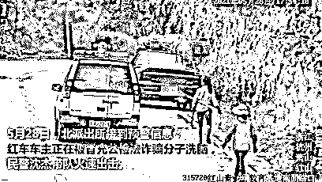
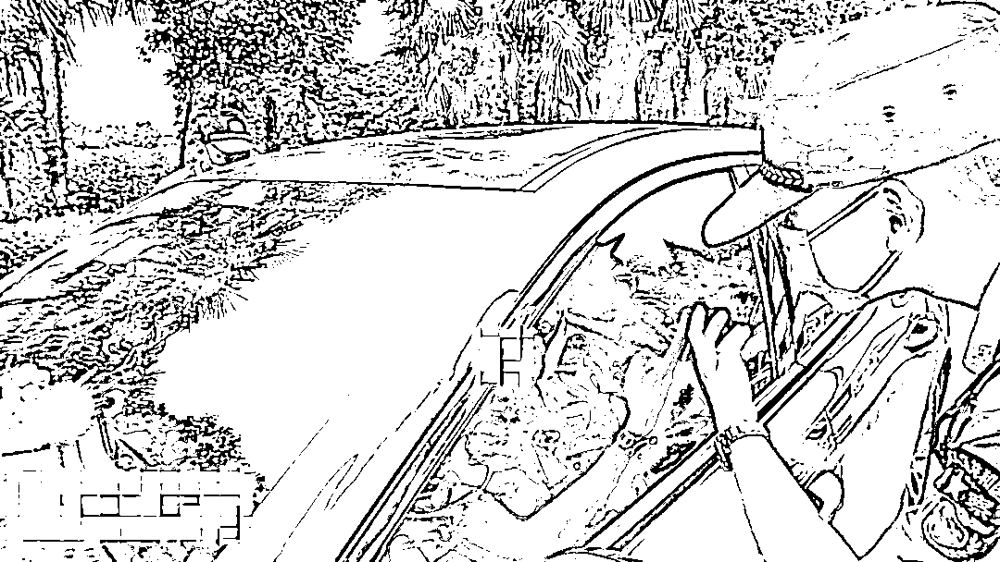
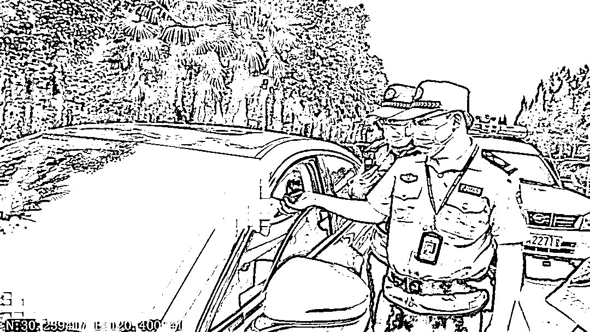
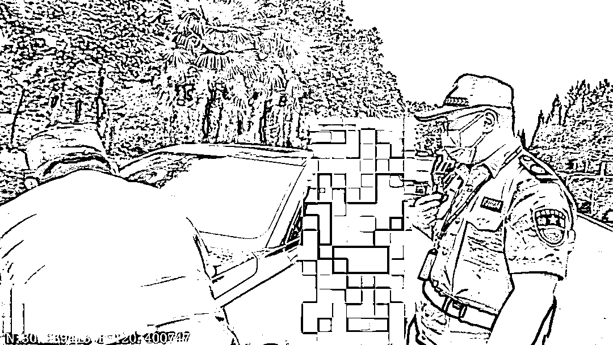

# “电话里说得对！你们果然来抓我了……”

> 原文：[`mp.weixin.qq.com/s?__biz=MzIyMDYwMTk0Mw==&mid=2247515579&idx=5&sn=c51c5d7072130803e31723de0e56f2a7&chksm=97cb7683a0bcff95d7fbae956470ea45787a6f38cd4c3bf2985099f0622de502c463ddbafafc&scene=27#wechat_redirect`](http://mp.weixin.qq.com/s?__biz=MzIyMDYwMTk0Mw==&mid=2247515579&idx=5&sn=c51c5d7072130803e31723de0e56f2a7&chksm=97cb7683a0bcff95d7fbae956470ea45787a6f38cd4c3bf2985099f0622de502c463ddbafafc&scene=27#wechat_redirect)

**“不要转钱！你被骗了”**

近日，浙江杭州

萧山区市北派出所接到预警信息： 

**某女子可能正遭遇诈骗**

便立即前往现场调查 

女子看到警察却吓得躲进车里

咋回事

[`mp.weixin.qq.com/mp/readtemplate?t=pages/video_player_tmpl&action=mpvideo&auto=0&vid=wxv_1901645379972939779`](https://mp.weixin.qq.com/mp/readtemplate?t=pages/video_player_tmpl&action=mpvideo&auto=0&vid=wxv_1901645379972939779)

警察接诈骗预警后前去阻拦

女子竟开车“逃走”

5 月 28 日下午 17 时许

萧山区市北派出所接到预警信息：

开发区某单位员工吴女士（化姓）

可能正遭遇诈骗

综合指挥室队员立即给吴女士单位领导打电话

得知吴女士不久前刚开车离开公司

**“不好，她很可能被骗子忽悠****去偏僻处进行转账操作！”**综合指挥室快速调取路口监控经过分析研判锁定吴女士的行车路线民警**沈杰**带着队员立即驱车赶上去

一路上还与吴女士的丈夫等亲属取得联系

在红山农场附近路段警察发现吴女士驾驶的红色小轿车停在路边沈杰和队员下车走到吴女士车边**见她正神情紧张地接着电话****然而还没等警察开口说上几句话**

**吴女士竟一脚油门开车“逃走了”**

警察立即拉响警笛驱车跟随拦截并通过喇叭呼喊吴女士：**“保持冷静，注意安全，立即停车靠边”**所幸吴女士不熟悉当地路况

开了一段距离后驶入一条死胡同

**警察反复证明身份**

**女子称“不知道哪头是真的”**

****

**“不要转钱，你被骗了！赶紧下车！”**

**警察紧急追上前去****一边呼喊****一边焦急地敲打车窗******而吴女士却将车门窗紧锁********躲在驾驶室就是不肯出来********同时还拿着手机接听电话********不时在手机上点几下******俨然在骗子的指导下**

**一门心思进行转账操作**

******“我是市北派出所民警****我跟你老公联系过了****你要不要听他电话？”****听到沈杰说出自己老公的名字****吴女士终于稍稍镇定下来****停止操作，摇下一点车窗******“我没有汇款”******听到这句****民警的心终于放下大半****但吴女士却依旧对这些警察持怀疑态度****嘴里一直嘟哝着**

****“我现在不知道哪头是真的”****

**看着吴女士一脸纠结疑惑的样子**

**警察都哭笑不得**

**只能反复向其证实身份：**

****“我们就在你面前，你都不相信****

****你看有警车，还有这么多人****

****是随便能冒充的吗？”****

****“你这样开车，万一出事怎么办********你老公也很担心********即使不相信我们****

****你老公的话总该信吧”****

******经过十多分钟的耐心解释****吴女士终于逐渐醒悟过来****一时间后怕不已**

****“因为他说马上要来逮捕我****

****我看到你们过来****

****以为真来抓我****

****吓死我了”****

****女子转账前民警成功阻拦****

****称之前的反诈宣传没认真看****

********

******据吴女士回忆******

******当天下午她接到陌生电话************对方自称通信管理局工作人员**************说有人用吴女士的身份证****************办理了一张北京电话卡****************并用这个号码注册微信实施诈骗**************涉嫌违法犯罪******

******现在公安部门要调查吴女士******

******想到自己的身份证的确曾遗失过************吴女士对此信了大半************急忙求助对方能否帮忙解释，洗脱嫌疑************随后，对方“贴心”地将电话************转到“北京某派出所”************“派出所王警官”和她开启视频和语音聊天************吴女士看到对方穿着警服挂着工作牌******

******更加相信了对方身份******

******************“王警官”称，吴女士名下的账号************当晚 7 点就要被冻结************为了不影响生活************让她赶紧把名下的钱全部转出集中起来************到所谓的“安全账户”进行验证************为了“办案需要”**************对方要求吴女士不能与其他人联系****************随时保持通话****************然后一个人到僻静安全的地方完成操作**************如果不配合******

******马上安排当地派出所对她实施逮捕！******

******在吴女士向安全账户转账前************市北派出所警察及时赶到劝阻************才成功保住了她和老公的血汗钱************之后，警察询问吴女士是否接受过反诈宣传************吴女士有些不好意思地回答：************“经常能看到这种宣传单************嫌麻烦都没有认真看************觉得自己不会上当******

******没想到这回就真遇上了”******

********警方提醒：****************冒充公检法类诈骗**，骗子的电话大多显示外地号码，以“公检法”机关或者社保局、医保局等名义，**声称当事人卷入一起案件或者社保卡、医保卡存在被盗刷或在异地违规使用，**如要洗脱嫌疑，就要按对方指示操作。************广大市民只要牢记以下几点，就能有效避免上当：**************1、公检法机关不会通过电话办案，**公检法机关作为执法部门，绝不会使用语音或视频聊天软件对你进行保密询问，更不会通过陌生链接让你接收“通缉令”“逮捕令”等法律文书，下载所谓的软件查询信息。**************2、公检法机关没有所谓的“安全账户、调查账户”，**不要把钱汇入陌生账户，不要轻易把银行卡验证码、密码等信息告诉他人，也不要随意点击转发未知乱码和陌生链接。**************3、骗子通常使用“00”或“+”开头的外地号码**或者境外网络号码拨打诈骗电话，如有接到这种来电请直接挂断。************4、如遇此类诈骗，请立即记录骗子的电话号码、QQ 号、银行卡账号等信息，并拨打 96110 止损。******

******来源：中央广电总台，中国之声，杭州公安******

************

******← 向右滑动与灰产圈互动交流 →******

************