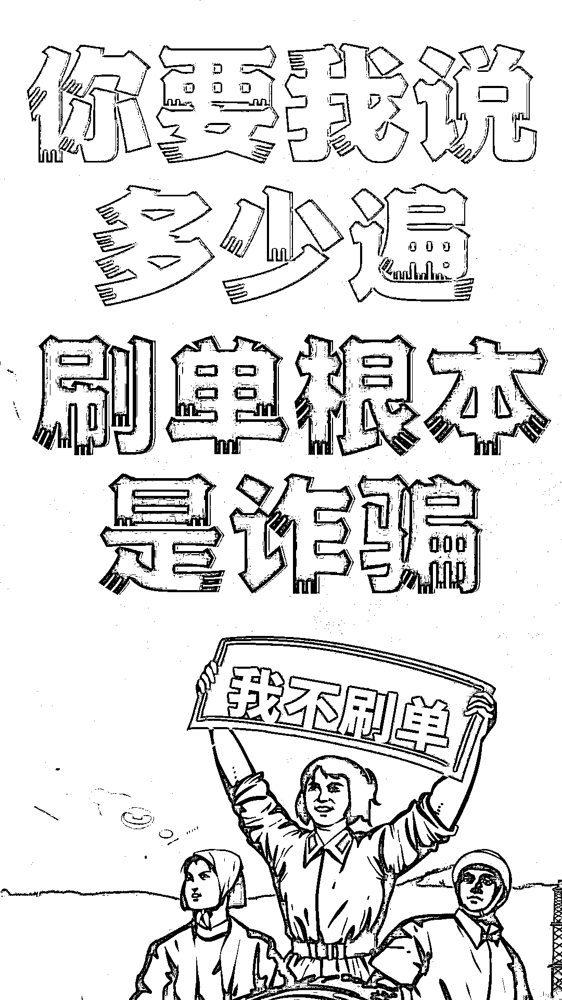
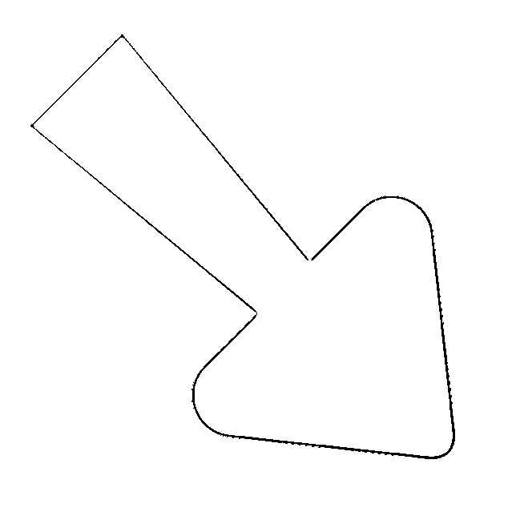
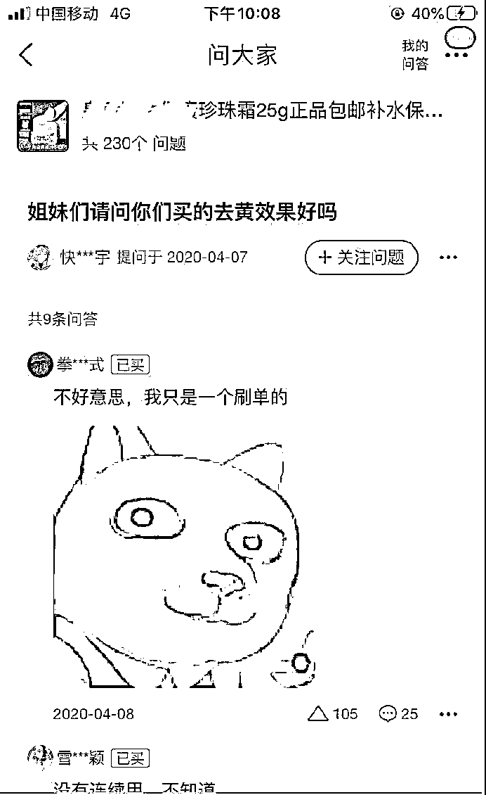
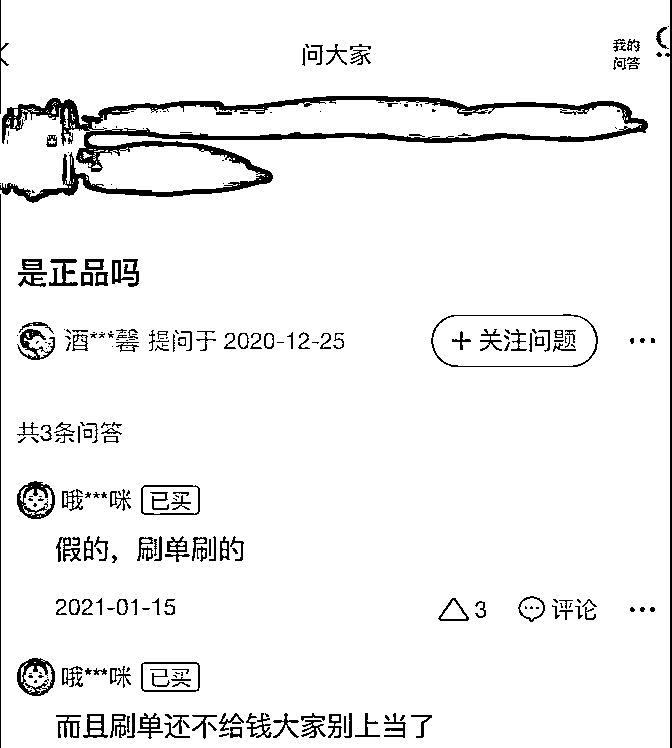
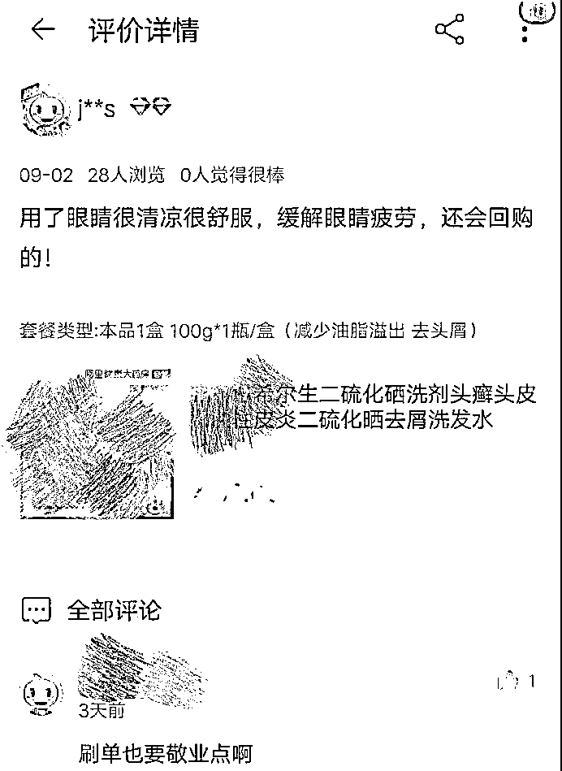
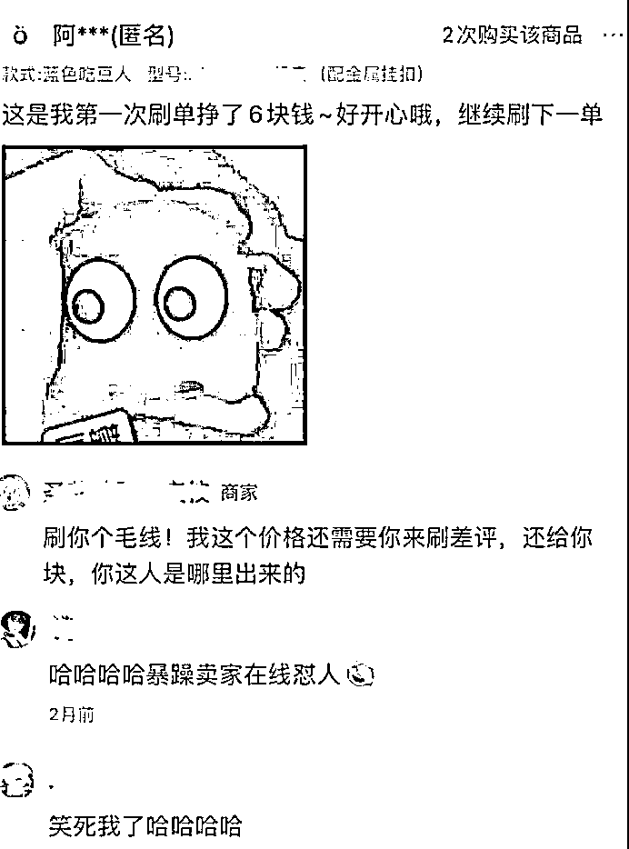

# 你要民警说多少遍，刷单根本是诈骗！

> 原文：[`mp.weixin.qq.com/s?__biz=MzIyMDYwMTk0Mw==&mid=2247515579&idx=6&sn=df7ed7c66af173d5a5aa500190adf83d&chksm=97cb7683a0bcff95fb053f99940bc6ce7f8ef37729e199eb1e2659a64fed563c116eb288dd68&scene=27#wechat_redirect`](http://mp.weixin.qq.com/s?__biz=MzIyMDYwMTk0Mw==&mid=2247515579&idx=6&sn=df7ed7c66af173d5a5aa500190adf83d&chksm=97cb7683a0bcff95fb053f99940bc6ce7f8ef37729e199eb1e2659a64fed563c116eb288dd68&scene=27#wechat_redirect)

什么？出大事了！

又有人被刷单骗了！

虽然我们一直不遗余力地

对这种诈骗类型进行防范宣传

但时常还是会有群众上当受骗

“花西子新款眼影免费领~”看到这样的广告，集美们会不会动心呢？昆明的小鱼（化名）就动心了！4 月 6 日，小鱼在家刷微博时看到花西子粉丝福利群的广告，看到免费领之后果断加入粉丝福利群。

管理员在群里说领取需要先关注花西子微信公众号，然后还需要下载“淘乐”APP。小鱼下载后将截图发给管理员，领到了 7.8 元，之后管理员将她拉进了“淘乐”APP 的群里。

进群后小鱼发现，管理员在群里发布关于刷单的任务单。动动手指就能轻松赚钱，小鱼想着反正自己也没有损失，于是在群里完成任务单，陆续完成了几个任务，获得了 3 元、2.2 元、6.1 元。

之后派单员称后面的任务需要垫付任务费，小鱼一步步刷下去，一开始还只是垫付十多块钱，之后就是垫付几千块。连刷 8 单后，小鱼一共向对方转账 10030 元，而对方返还的佣金才 6716.1 元。

当小鱼最后一次转账给对方不成功后，她联系派单员，对方称因其错误操作不成功，需自行负责，不能得到佣金和本金。正当小鱼急的火烧眉毛时，对方接着又提供了两种解决方法，一种是需要其一次性转账 3 万元，另一种是在做一次 1 万元的单，如果成功，就可以一次性获得两次的本金和佣金。看到这里，小鱼这才意识到骗，报了警。但自己的 3313.9 元就这样刷到了骗子的口袋。

**骗局大揭秘：**

诈骗分子先是通过网页、论坛、社交软件等渠道广泛发布兼职刷单广告，号称给网店刷单提高商家信誉可以“足不出户、日赚千元”。当受害人轻信其虚假宣传后，诈骗分子即要求受害人在某网络平台上购买特定的物品进行刷单，其中购物所需费用即本金由受害人支付，诈骗分子承诺在交易成功后将本金和报酬一同返还受害人。

在最初几单任务时，诈骗分子会向受害人返还本金并支付小额报酬，使其放松警惕。随着受害人刷单量不断增多，诈骗分子最后会以未完成任务量、网络故障等诸多理由不按事先约定返还本金和报酬，而是要求受害人继续刷单并投入更多的本金，使其越陷越深，直到受害人意识到被骗。

受害人多为大学生等年轻群体，有的甚至被骗十几万，给当事人和家庭都造成巨大伤害，严重影响其学业和身心健康，社会影响恶劣。

你问有没有正规刷单

商家引导那种。

小编想说

有的评论，商家也真的不需要！

**沙雕刷单评论大放送：**

希望大家看完一乐后

记住以下这句话

**任何平台上的一切刷单行为，**

**都是诈骗！**

来源：昆明反电信网络诈骗中心

← 向右滑动与灰产圈互动交流 →

