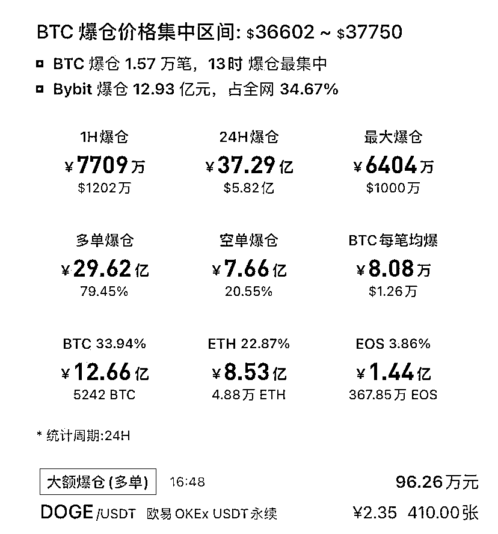

# 暴富梦碎：比特币等虚拟币成“绞肉机”！

> 原文：[`mp.weixin.qq.com/s?__biz=MzIyMDYwMTk0Mw==&mid=2247515634&idx=1&sn=ad526165351f6f3beceb72dfb31271f7&chksm=97cb76caa0bcffdcf16a917b857c74ae12e03f0fdbaf23ee0bdb9e896e9141df319d45400d43&scene=27#wechat_redirect`](http://mp.weixin.qq.com/s?__biz=MzIyMDYwMTk0Mw==&mid=2247515634&idx=1&sn=ad526165351f6f3beceb72dfb31271f7&chksm=97cb76caa0bcffdcf16a917b857c74ae12e03f0fdbaf23ee0bdb9e896e9141df319d45400d43&scene=27#wechat_redirect)

过去的一个月，是比特币历史上表现最差的一个月。 

6 月 5 日晚间，比特币再次闪崩。一枚比特币的价格一日暴跌超 1.6 万元（人民币，下同）至 22.8 万元，较 4 月的历史最高点 41 万元缩水近 50%。即使特斯拉 CEO 埃隆·马斯克将社交媒体的个人头像再次换回比特币，也无法拯救困局。

国内近 37 亿元资金在几小时内被收割得干干净净，最大一笔多头爆仓高达 6404 万元。

图片来源：OKEx

图片来源：UALcoin

但这只是财富破灭的冰山一角。

“眼睁睁看着 3000 万元的合约被强平，有一种瘫倒在地的感觉。”许宁对中国证券报记者表示。

图片来源：投资者

幻想一夜暴富

经历了三年沉寂蛰伏后，以比特币为首的虚拟货币今年初涨势如虹，大量投机者争先恐后地加入，许宁正是其中之一。

受周围朋友炒币的影响，许宁经熟人介绍进了几个炒币的微信群。他幻想着由此走上一条快速致富之路，毕竟身边充斥着动辄涨幅十倍、百倍的造富神话。

“刚开始接触这个圈子时，还将信将疑，但身处牛市就迷失了，开始跟着老师买一些便宜的小币种。一开始是狗狗币，之后又参与了柴犬币、秋田犬币……老师推荐的项目很多，目不暇接。这个项目名还没认全，随即又加了下一个项目的群，有的微信群刚建一天就加满了。”在手握“财富密码”的老师带领下，许宁的投资热情被点燃。

4 月 16 日是许宁炒币生涯最辉煌的一天。这一天，狗狗币在特斯拉 CEO 埃隆·马斯克通过社交媒体疯狂“安利”之下，价格直线拉升。OKEx 数据显示，最高涨至 0.45 美元，日内涨幅一度超 238%，从年初到当天累计暴涨 1330%，其总市值一度跃居至虚拟货币总市值榜第五位。

许宁做梦也没有想到，在年初买入的几百万个狗狗币，竟让他一跃成为千万富翁。

“当一天能赚到一辈子的工资时，会觉得靠这个一定能发家致富。”赚了钱，许宁的心理也发生了细微的变化。

狂欢过后 危机四伏

今年初，CoinMarketCap 数据显示，虚拟货币的总市值为 7181 亿美元，短短 5 个月后，这个数字变成了 25345 亿美元，暴涨 253%。253%的整体涨幅或许看起来并不耀眼，但单看某个币的涨幅，还是可以想象到大涨背后的疯狂。

币圈一日，人间十年。今年以来，狗狗币等一系列高收益币（即比特币以外的虚拟货币）在上涨的声浪中起舞。CoinMarketCap 数据显示，2019 年 9 月比特币在全球虚拟货币中的市值占比高达 70%，山寨币的市值占比仅超 20%。而今，伴随着数百种高收益币的全线反弹，比特币的市值已降至不足 50%。

但是，无限量和筹码的过于集中，意味着这些高收益币空有虚拟货币概念，实际不过是辗转于各个投机人之手的投机工具。

许宁赢得了一时的辉煌，而姚女士购入的高收益币，却让她坠入深度套牢的地狱。

“我充值了 10 万元买猩猩币，本以为可以一本万利，结果猩猩币登上交易平台之后迅速闪崩，大跌后资产缩水至 180 元。”OKEx 数据显示，从诞生到近乎归零，猩猩币的交易生命周期只有 20 分钟。

近日，狗狗币等高收益币剧烈波动，跌回原形，甚至大多徘徊在清零的边缘。随着用户的套现离场，大批投机者被套牢，惨遭收割，只留下所谓的去中心化噱头和几亿个无价值代币。

“参考 2016 年-2017 年上一轮虚拟货币牛市，近日的‘币灾’意味着本轮泡沫离终结不远了。”国泰君安证券研究所固定收益首席分析师覃汉提示，一轮牛市的上半场往往都是比特币表现跑赢“高收益币”，下半场则是行情扩散到高收益币并大幅跑赢比特币。“泡沫真正的拐点，往往对应比特币价格震荡但不创新高、高收益币美元价格仍在上涨，而这种背离持续一个月左右后，泡沫将会彻底走向终结。”

杠杆操作 3000 万血本无归

靠狗狗币等加密货币挣得盆满钵满之后，许宁又瞄准了比特币和以太坊等币圈最为认可的主流币种。只不过，这一次，他不再安于现货，转而选择了合约交易，“合约能用低成本博取几十甚至上百倍的利润，只要行情波动就能挣钱。”

虚拟货币有现货交易和合约交易两种形式。现货交易和股票类似，低价买入，高价卖出，赚取价差。但合约交易具备杠杆的性质，杠杆倍数一般从 5 倍到 125 倍不等。以 20 倍杠杆为例，在这一杠杆下，只需缴纳 5％的保证金即可交易，但只要出现 5％的波动，便面临爆仓风险。以比特币一天最多能涨跌百分之几十的波动来估算，风险被放大到极致。

10 倍、20 倍、50 倍……在合约游戏中，暴富或破产，只在一念之间。许宁每天交易几十万元面不改色，挂单时多打一个零都不会手抖，而现实生活中，他却仍住在月租 2000 多元的小房间里。

越玩越大以后，许宁对开单数字后面的零已经麻木，他一天的合约流水甚至能达到数百万元。

对于虚拟货币合约的风险，业内人士指出，只要在期限内任意时间平仓即可止盈或者止损，但由于虚拟货币市场交易时间不限，价格波动大，投资者经常反应不及时，有时还会遭遇网络异常等问题，能及时操作成功者寥寥无几。

据记者了解，有些交易平台、客户端 APP 会故意制造闪退、卡顿、仓位无法显示等异常现象，影响用户正常的下单、撤单、平仓等交易操作，导致合约爆仓，从而最终达到非法侵占客户财产的目的。

许宁在回忆 3000 万元合约爆仓的当晚时说：“万点瀑布来得太快了，打开账户只感觉心脏骤停。很后悔管不住自己的欲望，一听币价翻倍，就急忙做多。”许宁也告诫其他投资者，“收益与风险并存，贪婪往往能让人忽略后者。投资要有自己的原则，不要碰虚拟货币，不要加杠杆，亏一次就血本无归。”

监管部门及有关专家多次强调，比特币与金融产品有本质区别，没有实际价值支撑，没有主权信用和商业信用，比特币交易归根到底就是炒作。近日，中国人民银行副行长李波明确表示：“央行正研究对比特币、稳定币的监管规则。”

中原证券分析师周建华提示，近期比特币币值极高的波动性反映了这一领域普遍存在的过度投机现象，而投机情绪的累积又进一步催生了诸如“杠杆配资交易”、“代币发行融资”等非法投机、犯罪行为，增加了金融系统的风险。同时，比特币投机行为衍生出大量跟风“挖矿”的行为，对电力资源造成了巨量浪费，不符合我国“双碳战略”的要求。

来源：中国证券报

← 向右滑动与灰产圈互动交流 →

