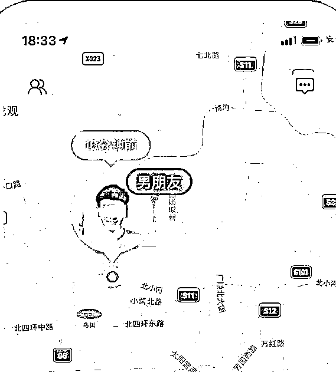
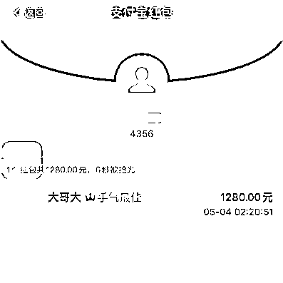
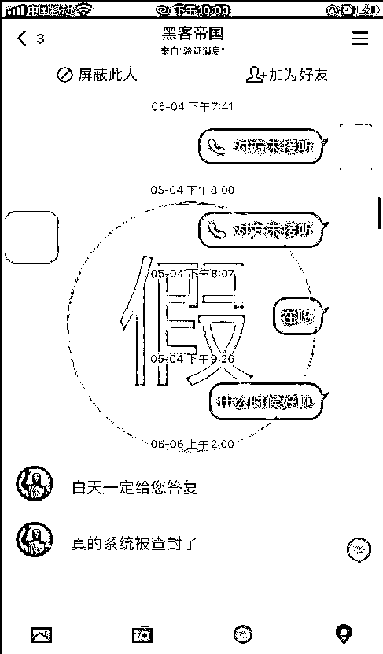
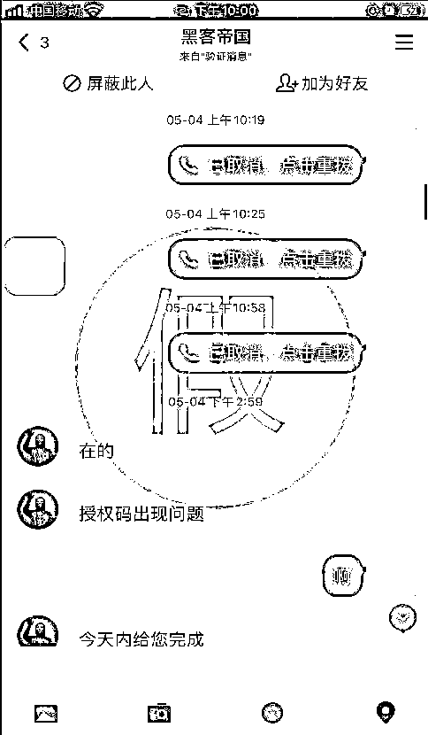
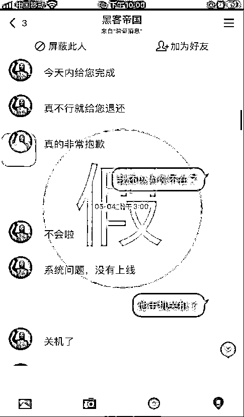
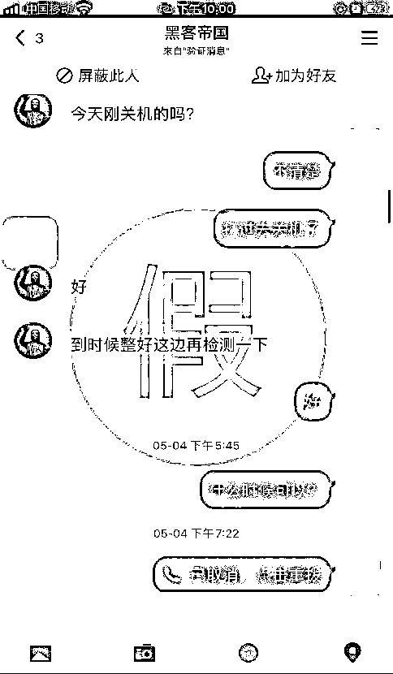

# 你敢玩失踪，我就敢请黑客追击？？？

> 原文：[`mp.weixin.qq.com/s?__biz=MzIyMDYwMTk0Mw==&mid=2247515634&idx=2&sn=ace9cc4bb5693fe8ad8c6e110dd2587e&chksm=97cb76caa0bcffdcc6fe574e566d7eb2d56041b548b09bcc4c3fb9797978cc3f958220984c64&scene=27#wechat_redirect`](http://mp.weixin.qq.com/s?__biz=MzIyMDYwMTk0Mw==&mid=2247515634&idx=2&sn=ace9cc4bb5693fe8ad8c6e110dd2587e&chksm=97cb76caa0bcffdcc6fe574e566d7eb2d56041b548b09bcc4c3fb9797978cc3f958220984c64&scene=27#wechat_redirect)

男（女）友玩失联？

你会怎么做？

默默地伤心难过？

不，我的感情我做主

小榄镇小温就立即出击

——**聘请“黑客”追击定位**

**案件回顾及诈骗套路剖析**

1

**发布虚假“黑客”服务广告**

*   5 月 3 日，小温联系不上男朋友，于是想找“黑客”来查找男友的具体位置。她在网上搜索“黑客查询位置”，通过广告链接添加了“黑客”QQ 好友。

2

**假装了解具体信息**

*   添加好友之后，“黑客”要求小温发送她男友的相关信息，以便“寻找”出具体的定位。

3

**诱导红包转账不留收款信息**

*   “黑客”“贴心”地要求小温扫码加入某支付平台的两个群聊，并让她在群内通过发红包来支付报酬，称“这样支付不会留下双方信息”。于是对方先是要求转**480 元**的红包，又陆续索要**1680 元**、**1280 元**的红包。

4

**以各种理由推托无法找到具体定位**

*   直到 5 月 20 日，“黑客”以“系统被查封”“授权码故障”等各种理由称无法完成任务，小温这才意识到被骗了，于是报警。

↔左右滑动查看图片

小温这次给大家做了个**错误示范**

铁了心玩失踪的男友

值得你花钱请黑客？

过于卑微的姿态换不来真心

遇上“渣男”就像遭遇诈骗

一定要

及时止损

及时止损

及时止损

**You deserve better！！！**

**鹏哥提醒 **** / Warning**

**1\. 通过不正当手段获取他人隐私信息属于违法行为，切不可尝试。**

**2\. 网上所谓“黑客”“私家侦探”“可以定位查信息”等，基本都是诈骗陷阱，千万不要上当。**

**3\. 如有疑问可拨打反诈专线 96110 咨询，如被骗请及时拨打 110 或到就近派出所报警。**

来源：中山市反诈骗中心

← 向右滑动与灰产圈互动交流 →

