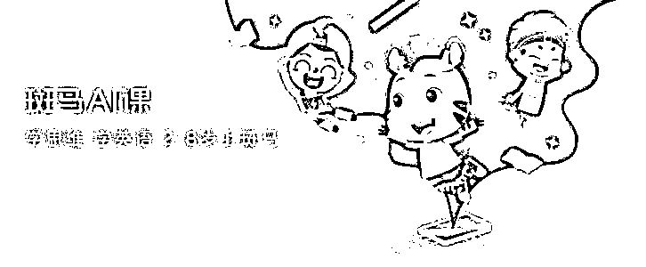

# 高考生拍题上传 APP 被处理背后：在线教育陷裁员风波，多股股价一度跳水

> 原文：[`mp.weixin.qq.com/s?__biz=MzIyMDYwMTk0Mw==&mid=2247515634&idx=5&sn=03ddbb482b647d4dec6aec7978df84de&chksm=97cb76caa0bcffdc1154a51ad6b103166e033e82b5dbf9925841ae6870432e41be17e4cfce97&scene=27#wechat_redirect`](http://mp.weixin.qq.com/s?__biz=MzIyMDYwMTk0Mw==&mid=2247515634&idx=5&sn=03ddbb482b647d4dec6aec7978df84de&chksm=97cb76caa0bcffdc1154a51ad6b103166e033e82b5dbf9925841ae6870432e41be17e4cfce97&scene=27#wechat_redirect)

6 月 7 日，高考第一天，有网友爆料称，在下午的数学考场上有考生疑似将 2021 年全国新高考一卷数学卷拍照上传至小猿搜题 APP 上，被小猿搜题 APP 工作人员发现后截图举报。

网传截图显示，上传的数学试卷截图左上角出现了考生名字吴某某与座位号 24。上方显示时间为 2021 年 6 月 7 日 15 时 46 分，此时离高考数学结束时间还有 1 小时 14 分。 

官方通报：取消考试资格

@黄陂教育 关于考生吴某某舞弊处理意见的通报： 

一、6 月 7 日晚，经考区组织考场视频回放，确认考生吴某某违规携带手机进入考场拍摄试卷事实，监考人员存在入场安检和监考失职问题。 

二、根据目前调查情况，**已停止当事监考人员此次高考监考资格，对相关人员失职行为，由区纪检监察机关进一步调查处理。**依据《国家教育考试违规处理办法》（教育部 33 号令）第九条规定，对违规考生作出给予取消此次考试资格，其所报名参加考试的各阶段、各科成绩无效的处理，并根据后续调查结果作出进一步处理。 

三、对于考试过程中发现的违规行为，我们将发现一起，查处一起，切实维护考风考纪，确保高考公平公正。 

武汉黄陂招考办：

或因 5G 信号屏蔽漏洞

据新京报，黄陂区招考办回应此事称，或因 5G 信号屏蔽出现漏洞，导致该考生能用手机上传考题。

另外，湖北省经济和信息化厅无线电管理处工作人员回应称，已组成专班调查此事，如果确定是他利用无线电设备发射作弊的话，会依照法律规定处理。 

另据央视新闻消息，8 日上午，教育部考试中心回应，**已责成湖北省教育考试院认真调查，依据《国家教育考试违规处理办法》严肃处理，**切实维护高考公平公正。

小猿搜题回应：未外泄

针对网传考生吴某某将高考数学题拍照上传至小猿搜题 APP 一事，据澎湃新闻，6 月 8 日，小猿搜题 APP 公关部一位工作人员回应称，6 月 7 日下午，小猿搜题工作人员监测后台时发现，某用户通过手机拍照搜索疑似高考真题，App 未提供任何搜索结果，考试结束后，经确认，工作人员第一时间向有关部门举报，并将后台截图和数据等线索打包提供给相关部门供核查。**该题目从未在前端显示，未以任何形式泄露。** 

稍早前，8 日 10 时许，湖北省教育考试院高等教育考试办公室一名工作人员告诉澎湃新闻，已经连夜处理该事件，目前已对涉事学生的作弊行为进行了认定，学生也已经承认了自己的作弊行为，现在正在做后续的处理。 

小猿搜题和它的风波

小猿搜题 APP 官网介绍，小猿搜题是一款中小学生免费使用的拍照答疑 APP，题库覆盖小学、初中、高中，包括数学、语文、英语、物理、化学、生物在内的主要学科。APP 号称，“遇到不会做的题，轻松一拍，就能秒出详细解析”。

类似小猿搜题、作业帮一类的搜题工具，曾被家长和老师们贴上“抄作业、不动脑”的标签。《人民日报》曾发表的一篇评论认为，技术工具往往是一把双刃剑，方便“求知”的同时，也增加了“求懒”的系数。尤其是一些自控力不太强的学生，容易将搜题软件简单异化为应付作业的“帮凶”。

**值得一提的是，此次“作弊”事件背后的猿辅导，正深陷“在线教育裁员风波”。**

有媒体报道称，猿辅导内部人士透露，公司于一个月前解散了中班团队，教研员工被转岗或离职。在微博、脉脉等平台还有多位自称与猿辅导签约 offer 的应届毕业生表示，“自己被毁了 offer”、“猿辅导一通电话，全国几百号人全部劝退”、被告知“要么 9 月入职，要么找其他工作”。

对此，猿辅导回应称：“由于业务变化，相应岗位有所调整，故猿辅导目前正与部分待入职员工协商延期入职。” 

在线教育之困

**据悉，猿辅导面临的困境与公司旗下的启蒙品牌“斑马 AI 课”有关。**

2017 年 11 月，猿辅导上线斑马英语 App，主攻低幼赛道，主要面向 8 岁以下儿童。至 2019 年下半年，该项目单月营收额已突破亿元，续费率高达 56%。2020 年 2 月，斑马英语正式更名为“斑马 AI 课”，并拓展了思维、语文等产品。

据有关数据，斑马 AI 课的在读正价课用户 2021 年 2 月达到 200 万，2020 年斑马 AI 课总营收在 50 亿元左右，2021 年收入目标为 100 亿元。斑马官网上显示，该业务有超过 2000 人规模的教研中心。

但新版《未成年人保护法》的推出，却给一众在线教育机构押宝的低幼赛道劈头盖脸地浇了一盆冷水。而此前曾传出上市计划的头部教育机构，也已经偃旗息鼓。 

**“在线教育机构们该考虑转型的问题了。”**有行业人士表示。

新东方、好未来股价崩了

在线教育大裁员？

而昨夜（北京时间 6 月 7 日晚），中概股在线教育股一度崩盘，不过随后有所回升。 

其中好未来跌幅扩大一度至超 15%，收盘跌 6.43%；新东方一度跌超 10%，收跌 3.08%；高途（跟谁学）跌超 9%，收跌 0.35%。

去年还热钱涌动的在线教育正在经历行业“大地震”，行业监管趋严，风波一轮接着一轮。在经历了 5 月下旬的“双减”意见通过、“三不传言”（假期不许开课、培训机构不许上市、不许打广告）之后，6 月 1 日，新版《未成年人保护法》开始实施，同时，国家市场监管总局又宣布对 15 家校外培训机构的虚假宣传、价格欺诈等行为分别处以顶格罚款，使得《广告法》、《反不正当竞争法》中的相关条例开始被行业重视起来。 

6 月 7 日上午，据新浪科技报道称，从多位内部人士独家获悉，作业帮开启大裁员，目前正在按照部门进行面谈，**“有的部门几乎一个人不留。”**  

据悉，在作业帮内部，不少人上周就已经听到要裁员的消息，内部讨论也是非常多。“我们很多人最近都在开始找工作了，快的话有的人就在等 offer 了。”一位内部人士透露，自己所在的部门几乎都被裁掉。 

对此，作业帮回应称，目前个别媒体和网络所谓的裁员传闻不实。我们根据公司战略进行业务调整，包括正常的人员优化和流动，重点业务人才招聘仍在继续。 

此前有多家媒体报道称，受 6 月 1 日起实施《未成年人保护法》影响，多家在线教育公司缩减应届生招聘规模，大量已收到录取通知的应届毕业生被在线教育公司无故毁约，涉及公司包括高途、作业帮、猿辅导等多家在线教育公司。 

新版《未成年人保护法》明确规定，禁止培训机构对学龄前未成年人进行小学课程教育。包括学而思在内的多家网校，也下架了关于学龄前儿童的课程。高途教育也表示，3-8 岁的启蒙课业务“小早启蒙”将被放弃，同时停止招生工作。 

据高途一名员工透露，5 月 27 日，在针对小早启蒙项目的全体会议上，高途集团宣布，根据新版《未成年人保护法》，公司不再对 3 至 6 岁的孩子营销、售卖或者交付语文、数学和英语产品。**这意味着小早启蒙团队中超过 1000 名员工将会被陆续裁撤。**

“在内部开大会明确要裁整个项目前，我们部门的领导就已经明说，这个项目可能被裁撤，让我们早做打算，要么寻求内部活水，要么准备简历重新找工作。”高途课堂小早启蒙项目中被裁的员工陈明说道，“但内部活水，合适的岗位很少，大多只能重新找工作。” 

7 日，高途课堂对此前裁员应届生的消息进行回应。该公司表示，“今年高途课堂和高途在线招聘的辅导老师岗位应届生，只要已和公司签订完三方协议，均可按约定时间入职。” 

在知乎、脉脉等社交平台上，有毕业生表示，花了高价钱在公司附近租了房子，却被通知无法入职或者延迟入职并等到 9 月份，还有人被突然告知“明天是最后一天来不了的话只能说抱歉。” 

有猿辅导的老师发现，自己所在的群公司求职群被解散了，理由是 “怕大家在群里发广告。”5 月 29 号下午，他接到了一通来自猿辅导人力的电话，说现在学生已经分配完了，之后不论是全职还是兼职的教师，都暂不安排入职。 

近日，粉笔教育大规模裁员的消息传得沸沸扬扬，有离职员工称出差回来就被裁员了。据悉，此次粉笔全国性裁员超过 7000 人，不过该消息并未获得官方确认。对于裁员原因，前粉笔教育员工对媒体表示，公司快速扩张后运营成本快速提升，内部缺乏有效管理机制，甚至 CEO 张小龙都已经从企业内部架构里消失了。值得注意的是，粉笔教育在今年 2 月才宣布获得 3.9 亿元 A 轮融资，IDG 资本、挚信资本领投、CPE、德弘资本等为其投资方。 

行业监管趋严

据 36 氪报道，多位投资人重申了**“暂时要规避这个行业，这次比较不一样”**。另一位知名投资人更是直接放弃了已准备投资的教育项目，该项目营收超过 10 亿。 

再加上此前的关于在线教育不得 IPO 的传闻，让整个行业都更加紧张。 

**在线教育行业尽管去年疯狂融资，疯狂投放，但是大多都处于亏损状态。**高额的广告费用和员工成本、教师成本，对于在线教育行业来说，如果不能解决，就难以在这次风波中“活下去”。

6 月 1 日，国家市场监督管理总局集中公布一批校外培训机构虚假宣传、价格欺诈典型案例，对新东方、学而思、精锐教育、掌门 1 对 1、华尔街英语等 13 家校外培训机构予以顶格罚款。 

在此次名单中，除上诉 5 家公司外，还有哒哒英语、卓越、威学、明师、思考乐、邦德、蓝天、纳思书院等，这也意味着更多的二线或三线教育公司将被纳入检查范围。

据了解，此次重点检查发现，校外培训机构违法违规行为主要特点是“虚构、夸大、诱导”。一是虚假宣传多样化、普遍化，主要包括虚构教师资质、虚构执教履历、夸大培训效果等。如新东方“名师风采”栏 103 名教师中，76 名教师的实际教龄与宣传不符，虚假宣传比例达到 73.8%。二是价格欺诈行为问题突出，主要表现为虚构原价和虚假优惠折价。如邦德在其公众号标示“2 节试听课+期末高分秘籍，原价 430 元，现价仅 12 元”，事实上该补习套餐是专门为 2020 年“双 12”推出的全新体验活动，其所谓的“原价”此前从未销售过。

加上前期公布的对作业帮、猿辅导的查处情况，**国家市场监管总局此次重点检查已对 15 家校外培训机构处以顶格罚款 3650 万元。**

来源 ：21 世纪经济报道、@黄陂教育、澎湃新闻、新京报、雷达财经、中国基金报

← 向右滑动与灰产圈互动交流 →

