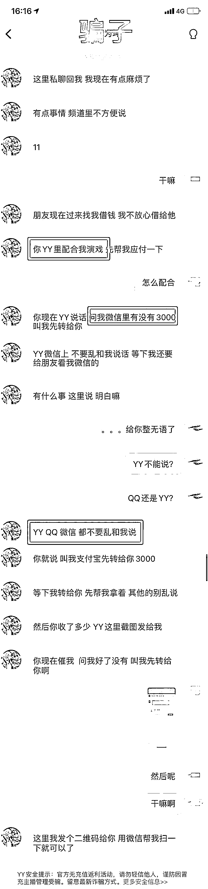
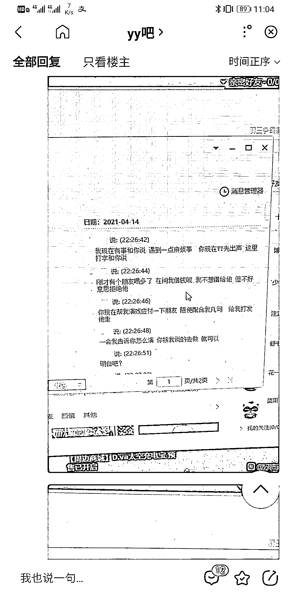
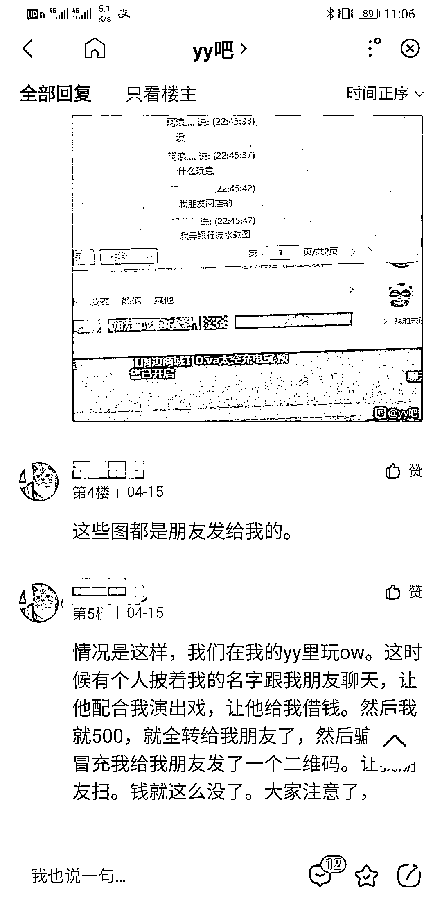

# 注意！新骗局来了！骗子主动借你钱，然后呢？

> 原文：[`mp.weixin.qq.com/s?__biz=MzIyMDYwMTk0Mw==&mid=2247515677&idx=2&sn=bf4b33a737603f7328f702ea8c2e757e&chksm=97cb7525a0bcfc33410ea1b92f00a1c8a85b449c95238a75c60f41a0ed0b5aa83ea172d28c23&scene=27#wechat_redirect`](http://mp.weixin.qq.com/s?__biz=MzIyMDYwMTk0Mw==&mid=2247515677&idx=2&sn=bf4b33a737603f7328f702ea8c2e757e&chksm=97cb7525a0bcfc33410ea1b92f00a1c8a85b449c95238a75c60f41a0ed0b5aa83ea172d28c23&scene=27#wechat_redirect)

骗子冒充熟人向你借钱的骗局， 

想必大家已经司空见惯，

但是，

如果有“熟人”**主动要借给你钱**呢？

你要吗？

近日，

温州发生多起该类诈骗案件。

受害者多为网络游戏玩家

下面我们就一起来看看究竟咋回事吧！

**案例回顾**

5 月 30 日，温州的胡先生在"YY 语音”上和好友玩游戏时，突然收到了一位“好友”发来的信息，“好友”让胡先生配合他“演戏”：因为有其他人找“好友”借钱，好友不想借，所以“好友”想让胡先生先找自己借钱，并以此回绝其他人的借钱请求。

胡先生见“好友”遇到了困难，自己帮忙只是举手之劳，而且自己也不需要向外拿钱，就没有多想同意了对方的要求，配合“好友”演了这出戏，没想到……

聊天内容如下

就这样，胡先生通过扫码的方式把支付宝收到的钱转回给了“好友”。

没想到 10 天后，以为事情已经告一段落的胡先生突然收到了好友询问什么时候方便还钱的信息。直到此时胡先生才发现自己被骗了。

而且胡先生的遭遇并非个例，网上也有很多人发布了类似的被骗经历！

**套路分析**

这类骗局其实是冒充熟人诈骗手法的一个新变种。与传统冒充熟人诈骗相同，骗子首先克隆一个社交账号，使该账号的昵称、头像等信息与被克隆的账号保持一致，接着骗子就开始冒充熟人与受害人进行聊天，并实施诈骗。但与传统冒充熟人诈骗不同的是这类诈骗多发生在“YY”等语音平台，而且不再是主动向受害人借钱，而是以各种借口要求受害人向他借钱。因为不需要受害人向外转账，很大程度上降低了受害人的警惕性，而这一步也是该套路的关键。 一旦受害人相信了骗子的话术，骗子就会以各种借口要求受害人通过其他平台向自己借钱。而实际上骗子只克隆了目前聊天平台的账号，骗子要求受害人通过其他平台找到人实际上是被骗子克隆的熟人。在真熟人将钱借给受害人后，骗子再以各种借口要求受害人通过扫码等方式还钱。至此这次诈骗才算正是完成。

六一儿

警方提示

近期"YY"上冒充熟人诈骗案件增多， 请爱打游戏的年轻朋友要提高警惕！不仅问你借钱的要警惕，主动借给你钱的也要多注意，遇到相似情景，要通过见面、电话等方式进行核实，避免上当！来源：辽宁省反诈骗中心，邯郸市反诈中心

← 向右滑动与灰产圈互动交流 →

