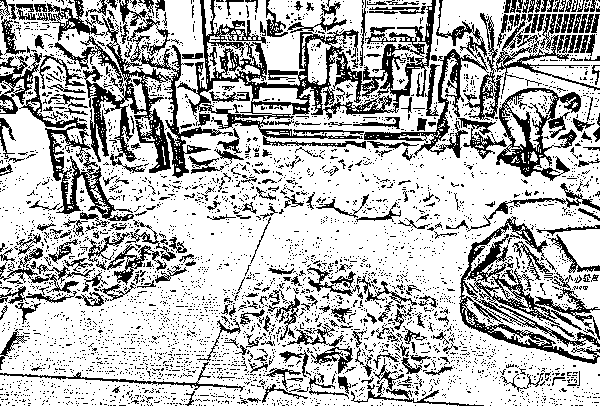

# 涉案金额 3000 余万元，“药房”背后的隐秘交易

> 原文：[`mp.weixin.qq.com/s?__biz=MzIyMDYwMTk0Mw==&mid=2247515677&idx=5&sn=d80368c06e815d75c5afb84a92558637&chksm=97cb7525a0bcfc334c8a5d9f14b55f4a4606c216009730273c600d8ce2376e71ee23202e72cf&scene=27#wechat_redirect`](http://mp.weixin.qq.com/s?__biz=MzIyMDYwMTk0Mw==&mid=2247515677&idx=5&sn=d80368c06e815d75c5afb84a92558637&chksm=97cb7525a0bcfc334c8a5d9f14b55f4a4606c216009730273c600d8ce2376e71ee23202e72cf&scene=27#wechat_redirect)

办案人员在清点扣押的所谓“药品” 

　　一桩涉案金额 3000 余万元的诈骗案,背后有一个犯罪团伙。他们以“保和药房”为幌子,打着治病解忧的旗号,通过微信、QQ 等推广虚假信息,凭借“昵称”扮演专业身份,利用他人求医问诊的急切心理,轻松骗取 6800 余名被害人 3000 余万元钱款。4 月 23 日,郭某、熊某某等 23 人因涉嫌诈骗罪被江苏省溧阳市检察院提起公诉。

网上购买“配方药”

万某在溧阳工作,2020 年 5 月,他经常感觉自己体力不支、心力交瘁,便请假回了山东老家。万某怀疑自己身体不适是由肾虚引起的,就在网上搜索补肾药物,广告页面上刊登的患者用药前后的对比照引起了他的注意,见页面上留有微信联系方式,微信名为“医者仁心-夏老师”,于是加了对方为好友。“夏老师”的微信头像是一个身穿白大褂且年事已高的男性医师,自称从事中医多年。

　　对于万某的咨询,“夏老师”耐心解答,还追问万某想得到什么样的治疗效果。根据万某的病症,“夏老师”给出了三种不同价格的配方药,推荐万某进行排毒治疗。万某选择了价格最高、药效最好的配方,通过支付宝转账支付。配方药很快就寄送到了万某家中,可药包上并没有产品成分、使用说明、生产厂家等信息,万某有些疑惑。但打开药包,他发现里面有熟地黄、杜仲等几种熟识的中药,就放心服用了。

　　带着配方药,万某回到溧阳工作。服药期间,这位“夏老师”还让万某加了私人微信,经常网络回访,询问万某服药的反应和效果,还让万某拍隐私部位照片给他,说要通过专业设备做一个分析检测。没过多久,“夏老师”就给万某发回一张高倍镜检查报告单,并以加强效果等理由建议万某继续购买配方药。

　　“这次治疗是最主要的,要巩固效果不复发,最重要就是这次了!”听了“夏老师”的话,万某虽然有疑惑,但为了能彻底治好自己的问题,还是转账购买了。没想到才过几天,这个“夏老师”又来推荐中药调理,万某醒悟感觉自己被骗了,于 2020 年 9 月 9 日向溧阳市公安局报了案。

　　溧阳市公安机关根据万某提供的线索开展技术侦查,锁定犯罪嫌疑人的作案地点位于江西南昌。锁定目标后,2020 年 11 月 18 日,溧阳公安联合当地公安机关成功抓获包括郭某、熊某某等在内的犯罪团伙。2021 年 3 月 24 日,该案被移送至溧阳市检察院审查起诉。

网络接诊隐设“话术”陷阱

41 岁的郭某是江西南昌人,偶然机会看到网上网络问诊的广告,便想到一条生财之道。他主动联系在乡镇开药房的熊某某:“我想开公司,通过线上宣传销售药品,治疗男性性功能问题,你有没有兴趣?”郭某想以熊某某的名义开实体药房作为幌子,在线上售药。43 岁的熊某某在乡镇上经营一家“保和药房”,虽然知道郭某的做法可能会触犯法律,但禁不住其中暴利的诱惑,还是同意了郭某的提议。

　　审查过程中,郭某向办案检察官交代,他们是采用公司化运营模式,郭某在南昌经济开发区租用写字楼,熊某某负责租房及找人办理药店需要的相关证件,租用的办公点都以“保和药房”名义营业,熊某某是法定代表人,负责药店日常的经营管理,而事实上他们的主要收入来自于线上接诊、售药。

　　“我们招募员工,进行集中培训,在网上用话术卖药骗钱。公司一共有三个部门,分为一线、二线和行政部门。”郭某说,为了拓宽销量,他们通过百度、抖音等网络平台或软件进行虚假宣传和推广。

　　他们口中的一线和二线其实就是业务部门,一线负责发展新客户,以老中医或者老中医助理的身份署名微信,客户添加微信后,业务员就按照公司下发的“话术”帮客户“分析”“诊断”病情,虚构“亲自配药”“一人一方对症治疗”等事实,虚假承诺产品疗效,诱使对方购买他们随意配置的药品。

　　“二线主要是负责将老客户转移到另一个微信上,进一步帮客户问诊和开药。给客户开药的金额也是根据客人的信任度、对病症的重视程度以及经济状况等决定。”郭某坦言,为保证安全,他们公司规定每次售出药品金额不能超过 2 万元。事实上,被客户当作救星的“医师”其实是一群平均学历只有初中文化的业务员,“高倍镜检查报告单”是他们用 PS 软件 P 的图。

神奇秘方竟是“三无”假药

　　郭某等人究竟是怎么取得客户信任的呢?办案检察官经深入审查后发现,原来确实有“夏老师”这么一号人物。

　　夏某某有执业中医资格证,之前开过中医诊所,后因得了脑梗,2008 年起就一直在老家疗养。2020 年 8 月,郭某和熊某某找到他,说要借用他的执业中医资格证开药房备案用,承诺每年支付借用费,夏某某应允,但对于他们网上卖假药事宜毫不知情。用夏某某身份证和执业中医资格证备案后,他们还拍摄了夏某某坐诊的照片,用于“保和药房”的宣传。

　　随着办案检察官的深入讯问,郭某坦白,网上和客户私聊的“夏老师”并非夏某某本人,而是公司的业务员,他们冒充中医专家的身份,依靠话术模板,通过微信、电话为客户诊断开药,并采用夸大病情等方式使客户相信并高价购买药品。

　　对于来实体店的顾客,郭某会借机宣传线上销售的药品,尽量让顾客信任线上销售的假药,从而促使顾客在线上购买。他们还购买大量的微信号,通过养号等方式,制作虚假的好评信息,使得被害人对假冒的中医专家开具的药方更加深信不疑。

　　经统计,2020 年 4 月至 11 月,郭某、熊某某等人以这样的方式诈骗 6800 多人,金额达 3000 余万元。

　　近年来,利用微信“朋友圈”从事广告宣传、商品销售等活动越来越多,甚至成为一种新的购物模式。伴随而来的是新型诈骗模式不断出现,以壮阳、养生等为噱头的“卖药”诈骗案件高发。

　　对此,检察官提醒,电信诈骗犯罪已经呈现集团化、专业化的趋势,诈骗团伙利用人们迷信老中医能治疗疑难杂症的心理,在网上打出神医、名医的幌子进行诈骗。切勿盲目相信网络平台或小程序中的“老中医、老专家、祖传秘方”等虚假广告,以免上当受骗。

来源：正义网，利箭在行动

← 向右滑动与灰产圈互动交流 →

