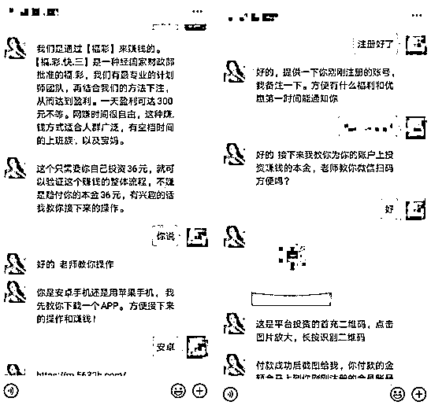

# 网赌一个月 40 万，七年辛苦钱...

> 原文：[`mp.weixin.qq.com/s?__biz=MzIyMDYwMTk0Mw==&mid=2247515723&idx=1&sn=9ee2acb15a9bad3ef4e228edda615fb4&chksm=97cb7573a0bcfc657a2d50443519cbfe760140c0acca4f727a6734d021efed98d6687b12c4f9&scene=27#wechat_redirect`](http://mp.weixin.qq.com/s?__biz=MzIyMDYwMTk0Mw==&mid=2247515723&idx=1&sn=9ee2acb15a9bad3ef4e228edda615fb4&chksm=97cb7573a0bcfc657a2d50443519cbfe760140c0acca4f727a6734d021efed98d6687b12c4f9&scene=27#wechat_redirect)

> “你是不是也经常在网上看到这种网赌广告？这些广告看起来非常诱人，所以很多人陷进去，最后倾家荡产，家破人亡。”

（飞飞 23 岁，入坑方式：浏览器搜索网赚）

我很小就出来工作了，工作七年间，从事过很多行业。在洗车店当过学徒，在 4S 店学过喷漆，在电子厂当过电工，在制衣厂做过制衣工，也干过销售，修过手机，目前从事装修行业。

疫情期间大家都在家，装修这行也没办法复工，我突然意识到，自己过得浑浑噩噩，一事无成，那段时间就琢磨着找一份副业。结果一个月时间，我把七年辛苦攒的 40 万积蓄，全都砸进去了。如果没有接触网赌，我可能会拿这笔钱买套房，付个首付。

▲某博彩 App 平台截图 来源 / 受访者供图

2 月 8 日，我在浏览器上搜索“网赚”的关键词，出现了很多“网赚项目”的广告，我加了一些 QQ 号。

网络上类似的广告很多，后来我才知道这些人在行内被叫做“狗带”，这些人有“专业”的话术带你进坑，并且把风险修饰到最低。

最初，对方跟我说“这是正规的彩票，如果不赚会赔付本金”，其实我意识到，这可能是赌博行为，但我把它当作买彩票一样的正规娱乐项目。第一笔充值了 100 块，没想到当天赢了 5000 块，而且是提现秒到账。

▲与“狗带”的对话截图来源 / 受访者供图 

这完全冲刷了我的价值观，钱来得太容易了，赔率最高的时候达到 1:180，最低也有 1:1.9。接下来，我开始不断加大赌注，充值金额从几块钱变成了几万块。

刚开始充值一万块，只输了一点点，心情还算平静，但输到 1/4 甚至是 1/2 的时候，就开始焦虑了。

这个时候很多人都会选择直接梭哈(把筹码全部押上)，要么输光，要么连本带利赚回来。其实刚开始的时候，有好几次都是起死回生，一把回本，让我产生了一种错觉，下重注容易一次回本，却没有想过会一把输光。

这一个多月来，我充值了无数次，支付宝加银行账户的流水，2 月份最高的时候达到了 160 多万。

▲支付宝 2 月份流水截图 来源 / 受访者供图

输光之后，我找过平台代理商，苦苦哀求他们退还本金。但那些赚着不义之财的人，又怎么会管小小赌徒的死活，大部分都是让我准备好更多的本钱，说能带我回本，最后我只会越陷越深。

▲与“狗带”们的对话截图 来源/受访者供图 

我后来发现，那些网赌平台基本上都是人为操控，他们可以控制玩家输赢状态，套路基本都是前期让你少数盈利，后期启动杀猪模式，让你连本带利赔个精光。

现在我只能靠着微薄的工资勉强度日，家人对这件事情并没有过多责骂，都跑来安慰我，是家人的宽容和理解让我重新站了起来。

说实话，通过网赌几天赢十几万，远没有加班好几天、多赚几百块来得开心，毕竟赢的也是不义之财。

**如果你已经深陷网赌，该怎么脱身呢？**

**看看这个曾经的赌徒给你的真诚建议吧：**

**1、首先一定要知道网赌必输！**

拿 ssc 举例子，黑平台大约 1.96 这样的赔率，将近 2，赌徒们不管亏了多少，他们的心理还是这么想的：倍率这么高，我只要不贪就能赚，只要我倍投就能赚。

不可能！一定会亏！

开奖号码是官网公开的没错，但是你们永远逃不脱概率的魔掌，首先说倍投，第一把 100 第二把 200 第三把 400......以此类推第十把是 51200 元，多么夸张的数字，先不说你有没有钱能够倍投 10 把，就算有，十把连亏的概率也不低，先来算算每次买 100，一次就算你赚 100，也就是你要连续赚 512 次，才够一次十把倍投的钱，你们觉得是连亏 10 把容易还是连赚 512 把容易！！！

还有一些中毒比较深的赌徒甚至认为这些有规律可以研究，我告诉你们这东西没有任何规律！！！ 

**2、务必要找个工作**

务必找个工作，暂时别去创业做生意之类的，一定要先去打工，每天规规矩矩，受老板的管制。就算工资不够你还债也别着急，只要每天不是负收入就好，目的是想让赌徒重新感受一下正规赚钱的感觉，辛苦赚来的钱那才叫钱！

网赌赚来的钱都是魔鬼！赚的越多沦陷的时间就会越长！

**3、现在！立刻！马上！戒赌都不算晚！**

不管现在亏了多少、欠了多少，只要现在立刻马上收手都来得及，请相信我！来得及！

有些赌徒心理是这么想的，我亏了这么多，工作已经拯救不了我了，等我把钱还了就不赌了。告诉你们，这样只会让你欠的更多。

网赌之所以可怕是因为网赌总能赚点钱，赚钱才是网赌的可怕之处，赚的越多的人下场越惨。

欠的钱，要负起责任，每个月还多少自己去固定，就算是每个月还 1000 块钱，十年也能还 12 万，不要怕。生活压不倒我们的！！！ 

**4、定个其他目标，转移法**

举几个例子：

每天跑步 10 公里；每天学一个吉他和弦；每天学几个英文单词；每天学首歌；每天交个异性朋友等等。

这些都可以当做目标，我只是举例子，自己喜欢什么，那就拿梦想当做目标，转移一下注意力。

来源：戒赌吧，飞飞

← 向右滑动与灰产圈互动交流 →

