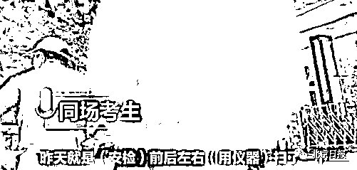

# 教育部通报高考作弊细节：将手机藏于薄衣内带入

> 原文：[`mp.weixin.qq.com/s?__biz=MzIyMDYwMTk0Mw==&mid=2247515723&idx=2&sn=9f69972d50c397ca64768130612ed1f3&chksm=97cb7573a0bcfc65d4fc2f3843c409bb14564dcf14f8b5efa933697a21d2d15fba5edda7a882&scene=27#wechat_redirect`](http://mp.weixin.qq.com/s?__biz=MzIyMDYwMTk0Mw==&mid=2247515723&idx=2&sn=9f69972d50c397ca64768130612ed1f3&chksm=97cb7573a0bcfc65d4fc2f3843c409bb14564dcf14f8b5efa933697a21d2d15fba5edda7a882&scene=27#wechat_redirect)

6 月 7 日，湖北武汉，一考生吴某某携带手机进入考场拍摄考题上传网络，引发社会关注。6 月 8 日，武汉市黄陂区教育局通报，当事监考人员被取消监考资格，涉事考生被取消全部成绩。6 月 9 日凌晨 2 时许，教育部新闻办公室对此事进行了通报，并披露了该考生违规将手机带入考场的细节。教育部通报

**考生将手机藏于手拿薄衣内**

**高举双手避开安检**6 月 9 日凌晨 2 时许，据教育部新闻办公室官博@微言教育 通报，6 月 7 日湖北省某高考考生手机作弊事件，为考生开考后用手机拍照发送考题，**系考中个人作弊，不存在考前泄题。**通报称，教育部第一时间责成湖北省立即开展调查，严肃处理。经查，**该考生在进入考场接受安检时，将手机藏于手拿的薄衣内，高举双手避开了安检，违规将手机带入考场。**考中**将手机藏于草稿纸下拍题，于开考 46 分发至某培训机构寻求答案（未获）**。考生已承认作弊行为。目前，该生已被取消所有成绩，并将按《国家教育考试违规处理办法》等规定严肃处理，以儆效尤。同时，撤换监考人员，加强监考力量，涉事监考人员已由纪检监察机关进一步调查。教育部再次向各地提出要求，进一步加强后续考试的考场监管，严肃考风考纪。同时要求湖北省招生委员会组织教育、公安、纪检监察、无线电管理、市场监管等部门进一步对作弊考生、涉该考点的失职失责人员和相关机构进行全方面、全过程、全链条彻查，依法依规严惩严处，坚决维护高考的公平公正。答题 APP 回应**开考约 50 分钟上传****试题未被公开和解答**此前，小猿搜题工作人员回应了更多关于该考生上传试题的细节。小猿搜题工作人员表示，7 日 15 时 50 分左右，工作人员在后台看到有用户上传了这道题，**因考试期间平台关闭拍搜功能，系统和人工均未作答。**“（该考生）等于没有得到实时反馈，这个题目就进入了我们工作人员的一个群，大家会进行一些回答、讨论，一直也没有给他回复，也没有公开。”工作人员表示，**直到当天下午 6 时许，考试结束，试题公开了，经对比发现，此前用户上传题目疑似高考题，随后留存证据向相关部门报案。**同考场学生回忆

**涉事考生表现慌张**

**事发后考场检测更严格** 涉事考生的同场考生也发声回忆事发当天的情景。6 月 8 日，在涉事考场外，一名同考场学生介绍，事发考试过程无异常，只有一道仪器检测，手机需自行寄存在门外，**考完后涉事学生表现慌张。****事发后，考场检测更严格，要从头到尾被探测，监考人数也有增加。** 6 月 8 日，武汉市黄陂区教育局官方微博发布关于考生吴某某舞弊处理意见的通报。通报称，7 日晚，经考区组织考场视频回放，确认考生吴某某**违规携带手机进入考场拍摄试卷事实**，监考人员存在入场安检和监考失职问题。 根据目前调查情况，已停止当事监考人员此次高考监考资格，对相关人员失职行为，由区纪检监察机关进一步调查处理。依据《国家教育考试违规处理办法》（教育部 33 号令）第九条规定，**对违规考生作出给予取消此次考试资格，其所报名参加考试的各阶段、各科成绩无效的处理**，并根据后续调查结果作出进一步处理。 招考办回应

**“双保险”失灵？**

**或因 5G 信号屏蔽出现漏洞**手机不能带进考场，这是人尽皆知的铁律；但按常理来说，考场一般也会安装手机信号屏蔽器，即便侥幸带入场的手机也是一块“砖头”。在“双重保险”之下，让人瞠目结舌的一幕还是发生了，原因何在？据南方日报 8 日消息，黄陂区招考办向记者回应此事称，**或因 5G 信号屏蔽出现漏洞，导致该考生能用手机上传考题。**华南理工大学电子与信息学院院长、微电子学院院长薛泉表示，当前，通信技术不断升级，5G 信号制式与原有 4G 制式也不同**，旧型号的干扰设备不能完全干扰 5G 信号，也是可能存在的。**8 日下午，湖北省无线电管理部门回应媒体表示，已组成专班调查此事，如果确定该考生利用无线电设备发射作弊的话，会依照法律规定处理。又一起判决

**教师竟然帮助学生作弊**

**湖北通城县两名教师，****收受学生家长 5 万元后，****竟准备作弊器材，****企图帮助学生在高考中作弊。**扬子晚报紫牛新闻记者从中国裁判文书网了解到，湖北省赤壁市人民法院日前对此案做出一审判决，两名被告人虽因担心作弊无法成功而最终放弃，仍以组织考试作弊罪受到刑事处罚。**已准备作弊器材，担心失败最终放弃**2020 年 6 月，李宁在湖北省通城县某高级中学教学期间，**有学生家长联系他询问是否可以安排高考作弊，李宁在收下学生家长 5 万元后，答应帮忙。**判决书披露，随后李宁来到该县初中教师李兴家中商量帮助学生高考作弊的事，决定由李兴负责考试作弊器材，李宁负责联系家长。**同年 6 月底，李兴邀约李宁来家中测试考试作弊设备。因担心作弊无法成功，李宁在距离考前一个星期时，将之前收取的 5 万元退还给葛某。**案发后，李宁和李兴于 2020 年 7 月 4 日被赤壁市公安局刑事拘留，同年 8 月 7 日被逮捕。赤壁市人民法院遵照咸宁市中级人民法院指定管辖决定，于 2021 年 1 月 15 日立案受理，并依法组成合议庭，公开开庭审理了本案。**法院：构成组织考试作弊罪，两人获刑**赤壁法院认为，被告人李兴、李宁在法律规定的国家考试中组织作弊，情节严重，其行为构成组织考试作弊罪，且系共同犯罪。公诉机关指控的罪名成立，法院予以确认。法院认为，两名被告人在着手实施犯罪后主动放弃犯罪，系犯罪中止，依法应当减轻处罚；到案后如实供述了犯罪事实并认罪认罚，亦可予从轻处罚。赤壁法院经审判委员会讨论决定，依照刑法和刑事诉讼法相关规定作出一审判决，被告人李兴犯组织考试作弊罪，被判处有期徒刑七个月，并处罚金 3000 元；被告人李宁犯组织考试作弊罪，被单处罚金 3 万元。（文中案件当事人为化名）来源：北京日报综合@微言教育、南方+客户端、@都市时报、@沸点视频、青小小

← 向右滑动与灰产圈互动交流 →

