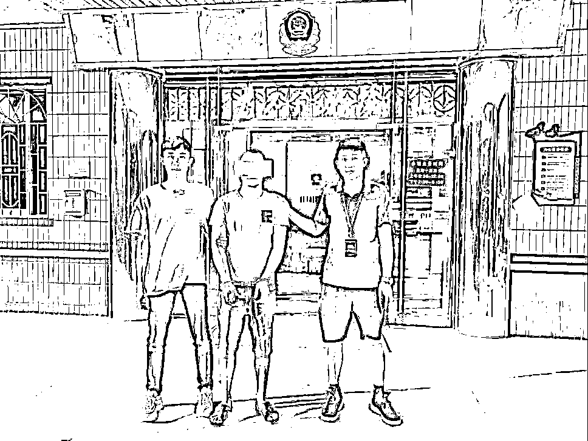

# 男子网恋 4 年被骗 11 万元，“女友”竟是同村兄弟

> 原文：[`mp.weixin.qq.com/s?__biz=MzIyMDYwMTk0Mw==&mid=2247515723&idx=3&sn=244ac195e2f467809762e9c88f450733&chksm=97cb7573a0bcfc65771a363d0d1b0ea194631a0245a1f9f592c1a0958e0c9e87a1cc248ae1a9&scene=27#wechat_redirect`](http://mp.weixin.qq.com/s?__biz=MzIyMDYwMTk0Mw==&mid=2247515723&idx=3&sn=244ac195e2f467809762e9c88f450733&chksm=97cb7573a0bcfc65771a363d0d1b0ea194631a0245a1f9f592c1a0958e0c9e87a1cc248ae1a9&scene=27#wechat_redirect)

遇见一个可爱的女孩子 

谈一段美好的恋爱

是许多单身男士的愿望

但不少人在现实生活中

找不到合适的对象

只能投身于网络交友

不过，当爱情来临时

记得要擦亮双眼

核实身份再谈

否则可能最终人财两空

肇庆男子亚三和“女友”

网恋 4 年，被骗 11 万元

直到“女友”落网

才知道“女友”的真实身份

竟是同村兄弟亚文

2017 年

年近 30 岁的亚三一直没谈过恋爱

和同村好友亚文说

想在网络交友

亚文听后，突发奇想

**“冒充女孩捉弄一下亚三”**

亚文随即注册了一个新微信号

伪装成一名叫“方何静”的女孩

主动添加亚三为好友

很快，两人确定为恋爱关系

此后，**亚文一人分饰两角**

用“方何静”的身份

以生病、购物等理由

向亚三索要金钱

一旦亚三拒绝就将其拉黑

**随后又以亚文的身份充当“和事佬”**

帮亚三转账给“方何静”

这段网恋关系持续了 4 年

到 2020 年 9 月以分手收场

**亚三转给“方何静”的钱财**

**累计多达 11 万元** 

分手后

亚三把网恋的事告诉朋友

朋友调侃他遇到了网络诈骗

亚三回忆恋爱时的种种细节

惊觉有许多可疑之处

今年 4 月，亚三向警方报警求助

经调查，“方何静”所使用的微信

与绑定的手机号均已被注销

但民警注意到，亚三与“方何静”分手后

**亚文让亚三删除与“方何静”的聊天记录**

民警顺藤摸瓜

查到亚三给“方何静”的钱

都流向了亚文的银行账号

5 月 19 日

民警将犯罪嫌疑人亚文抓获

亚文对其实施的网络诈骗犯罪行为供认不讳

亚文家属向亚三返还其被骗的金钱 

民警将犯罪嫌疑人亚文抓获

网络交友务必要保持头脑清醒

涉及钱财往来时，要再三考虑

除了渴望爱情的单身男士

一心寻觅真命天子的女士

也要谨记

广州市的黄女士通过 

网络征婚平台找男友

没想到男友竟是

给自己介绍男友的“红娘”

2019 年初

黄女士通过婚恋网络平台认识“红娘”庄某

随后，两人成为朋友

2020 年 3 月

庄某给黄女士介绍相亲对象“陈某”

庄某称“陈某”是自己老乡，关系很好

黄女士与“陈某”互加微信后

很快确定了恋爱关系

**但当黄女士提出见面时**

**“陈某”总是以各种理由推脱**

2020 年 10 月

“陈某”向黄女士诉苦

其父母因黄女士出身农村

想让二人断绝关系

还撤销了对其公司的投资

以此来要挟

不管遇到什么困难，我都不会离开你。

陈某

黄女士

我给你转账帮你吧。

男人娶媳妇不是为了钱，那是过一辈子的人。

陈某

黄女士深受感动

便与“红娘”庄某商量怎样帮助“男友”

庄某表示，自己与“陈某”是多年好友

对方会接受自己的帮助

于是，黄女士转账给庄某

再让庄某将钱转给“陈某”

**2020 年 10 月至 2021 年 2 月期间**

**黄女士共向庄某转账约 176 万元** 

有一次，黄女士与朋友聊天提到这件事

朋友提醒她可能被骗了

黄女士才意识到有问题

遂再提出与“陈某”见面

并让“陈某”归还通过庄某转账的钱

但“陈某”和庄某均以各种理由搪塞

黄女士于今年 2 月 21 日报警

3 月 16 日

民警在广州市海珠区将庄某抓获

现场扣押涉案手机 1 台

目前，案件正在进一步侦办中

以为终于遇到了真爱

付出了一片真心

结果却是一个个陷阱

一起来看看网恋诈骗的常见套路

以后避开这些坑吧

↓↓↓

**冒充“高富帅”“白富美”借钱**

通过网络（如 QQ、微信等）添加好友

↓

编造出“高富帅”“白富美”等虚假身份

↓

通过聊天获取好感和信任，确定恋爱关系

↓

提出借钱周转、家庭变故等理由要钱

↓

拉黑好友，失去联系

**冒充“美国大兵”“军医”邮寄包裹**

冒充“美国大兵”“军医”等外国人身份

↓

与受害者“坠入爱河”

↓

有巨额“美金”包裹需受害人代其保管

↓

以邮寄过程中被查封等理由，提出交保证金

↓

以高额利益诱导受害者转账汇款

**冒充可修改赌博后台数据的人**

在各种交友网站和相亲平台寻找目标

↓

与受害者陷入“爱河”

↓

以“高回报”“低风险”等诱人条件引人投资

↓

受害者得到少量收益后，加大投资金额

↓

平台无法登录或提现，“对象”也失联

网恋诈骗套路千千万

最终目的都是钱

大家切记守护好自己的钱包

如遇网络诈骗

要保留聊天记录、汇款单据等信息

并及时向公安机关报案

来源 ：平安广州、平安肇庆、中山市反诈骗中心、反诈骗先锋

← 向右滑动与灰产圈互动交流 →

