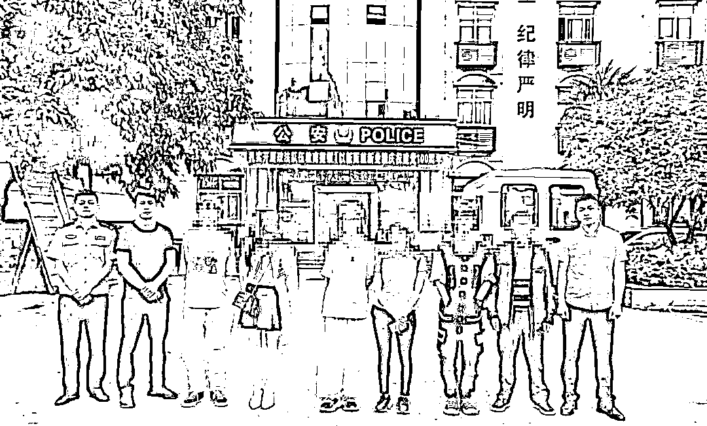
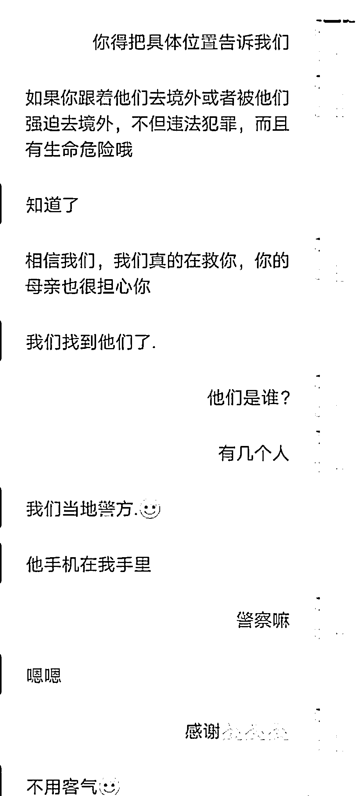

# 四川 3 少年被“中间人”诱骗出境做电诈，偷渡前一刻被警方寻回！

> 原文：[`mp.weixin.qq.com/s?__biz=MzIyMDYwMTk0Mw==&mid=2247515723&idx=4&sn=e2bc82c7401d6d528f2366a437bac14b&chksm=97cb7573a0bcfc656b671b4b8adf241bed5b093ff303e0fd7cb0039a3f3668ee20d5dc95bce9&scene=27#wechat_redirect`](http://mp.weixin.qq.com/s?__biz=MzIyMDYwMTk0Mw==&mid=2247515723&idx=4&sn=e2bc82c7401d6d528f2366a437bac14b&chksm=97cb7573a0bcfc656b671b4b8adf241bed5b093ff303e0fd7cb0039a3f3668ee20d5dc95bce9&scene=27#wechat_redirect)

> 在靠近广场的一处监控视频画面里，民警终于发现了 3 名失联少年的身影，他们上了一辆商务车，随后驶离监控范围……

10 多个小时后，从四川华蓥出发的少年们抵达了位于中越边境线上的广西靖西市，按照计划，他们接下来会跟随“中间人”前往边境线，然后徒步偷渡出境。他们的最终目的地是柬埔寨，然后在那里干“月入上万”的工作，“中间人”此前告诉他们：“工作很简单，只要会打字聊天，会骗人就行……”

民警驱车千里前往广西靖西将 3 名少年接回

幸运的是，在家人报警后，华蓥警方随即行动，最终在靖西警方的协助下，成功地将 3 位少年在偷渡之前寻回。

**“中间人”称会打字就行**

**3 少年结伴欲偷渡出国“打工”**

****

****小斌今年 14 岁，四川广安华蓥市人。决定跟随小伙伴偷渡出国打工赚钱，他没有告诉家里任何人。****

****5 月 23 日下午，小斌在外面玩耍时，经常一起玩的伙伴小鑫和小成找到他，问他要不要一起出国“打工赚钱”。其实，在此之前，带他们出国“打工赚钱”的“中间人”胡某，已找过小斌，但他拒绝了。****

****这一次，当得知两个小伙伴也要出国去打工赚钱时，小斌动摇了。胡某告诉他们，出国“打工”，每个月收入上万，工作很简单，只要会手机打字聊天，会骗人就行了。****

****5 月 24 日中午，几名少年和“中间人”一行在华蓥城区一广场附近吃了饭。小斌说，饭后，一位“小老板”包了一辆商务车，他们跟着上车出发，车上还有几名不认识的人。****

****3 名少年都只有十三四岁，这是他们第一次独自离家出远门，都没告诉家里人。小斌说：“他们（中间人）说过去（出国）干半年就回来，最开始一个月有 6000 美元，后面每月涨 500 美元……想到也就在外面待半年就回来了。”****

****“（虽然）害怕，但当时也觉得没有啥子。”小斌说。那天下午，商务车离开华蓥后，一路向南。25 日凌晨 3 点左右，车子抵达广西靖西市，靖西是位于中越边境线上的一个县级市，由广西百色市代管。****

****下车后，小斌等人进入宾馆休息。按计划，再过 10 多个小时，他们会由“中间人”带着前往边境线，然后翻山越岭徒步偷渡出境……他们此行的最终目的地，是柬埔寨。****

****家人发现异常报警****

****四川广西两地警方合力寻人****

********

****5 月 24 日晚，有两名少年家长发现异常，先后赶到派出所报警求助。****

****“他有时候会去同学家留宿，第二天肯定要回来，但这次一连两天都没回来，听人说是打工去了。”小斌的母亲焦急地告诉民警。****

****当天晚上，华蓥市公安局双河派出所民警唐松值班。他梳理两起警情发现，这两名失联少年彼此认识，通过与两人在华蓥的朋友联系后得知，当天下午，包括这两人在内，一共有 3 名少年跟胡某离开，称要出国去打工赚钱，但具体情况并不清楚。****

****“听说是出国打工赚钱，我们想到的多半就是被人骗出去搞电信网络诈骗。”唐松说，因无法联系上 3 名少年，派出所随后将此事向上级部门汇报，华蓥市公安局领导高度重视，广安市公安局亦为办案提供相应的技术支持。那个晚上，办案民警连夜梳理城区各大路口监控画面，希望能尽快掌握 3 名失联少年的行踪。****

****终于，民警从海量监控画面中找到了蛛丝马迹。那是在 5 月 24 日下午两点左右，3 名少年出现在广场附近的监控画面中，之后上了一辆商务车，然后离开监控范围。****

****当民警辗转联系上商务车司机时，他正在从广西返回华蓥的路上，但他表示并不清楚具体情况，也不知道少年们是要被人带着偷渡出境。****

****从司机口中得知几名少年到了广西靖西后，华蓥警方立即联系靖西警方协助查找 3 名少年的行踪。与此同时，多位办案民警也试图通过微信与 3 名少年取得联系。****

****5 月 25 日上午，民警唐松曾拨通小斌的电话，但聊了没多久，小斌就挂断了电话，也迟迟未通过民警发去的微信好友添加请求。****

******偷渡前一刻******

******3 名少年被警方成功寻回******

************

******转机，在 5 月 25 日下午出现。下午 3 点 49 分，小斌通过了另一位办案民警郑文强的微信好友添加请求。******

******郑文强向小斌表明了身份，他问小斌现在的位置。小斌回：“是咋个了，我在外面耍。”之后，郑文强又跟小斌发起位置共享。共享位置显示，小斌当时还在靖西市。******

******在之后的对话中，郑文强劝小斌和其同伴不要偷渡出境。期间，他还发了一篇反电诈宣传片给小斌，“活埋、剁手、软禁……刚逃回国的他们亲述缅北恐怖遭遇！”******

******之后，小斌说：“我们准备回来了。”******

******在民警和小斌取得联系时，另外两名少年小成和小鑫已跟随“中间人”胡某先行出发前往中越边境线，准备偷渡出境。小成后来告诉民警，在抵达边境线前，胡某得知他们的家人已报警，警方正全力寻找他们时，只好放弃了偷渡计划，之后叫了一辆车让他们回到靖西城区。******

******5 月 25 日下午 4 点 26 分，靖西警方用小斌的微信给郑文强发来消息，称人已找到，并发来了一张 3 名少年的照片。******

************

******民警和小斌微信号的聊天截图******

******为保证 3 名少年平安回家，随后，华蓥警方派出民警驱车前往靖西，带着 3 名少年踏上归途。民警也叮嘱其家人平时要加强对孩子的监管，避免孩子上当受骗误入歧途。******

******事后，3 名少年告诉民警，期间也曾意识到出国赚钱是搞电信网络诈骗，但“中间人”告诉他们“境外犯罪不会被追究”。******

******警方提醒：******************

******所谓在境外犯罪不会被追究的话，都是骗人的。请在境外从事电信网络诈骗的人员尽快回国投案自首。如实供述自己罪行的，可以依法从轻或者减轻处罚；犯罪情节较轻、有重大立功表现的，可以依法减轻或者免除处罚；拒不入境投案自首的，司法机关将依法从严惩处。******

******目前，本案还在进一步深挖调查中。******

******来源 ：广安市反诈中心、红星新闻、熊猫反诈、反诈骗先锋******

************

******← 向右滑动与灰产圈互动交流 →******

************