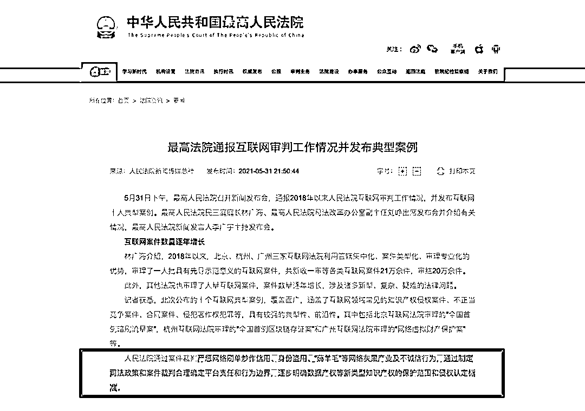
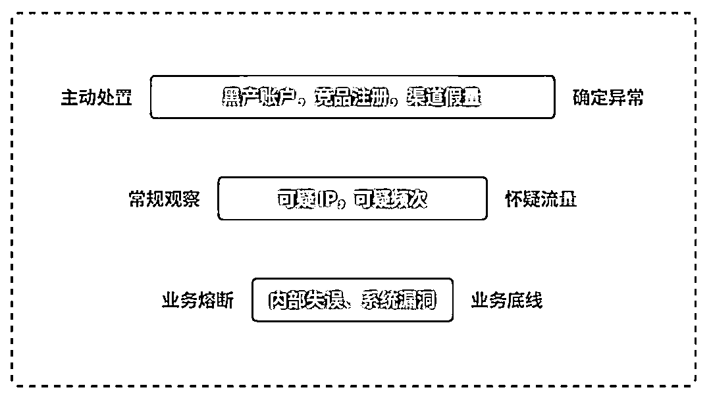
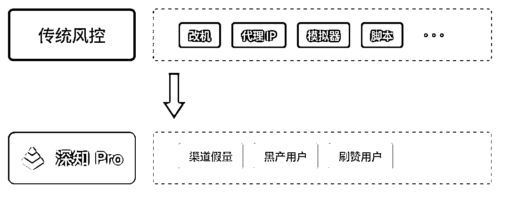

# 最高法点名电商黑灰产，电商圈如何借好东风

> 原文：[`mp.weixin.qq.com/s?__biz=MzIyMDYwMTk0Mw==&mid=2247515723&idx=5&sn=f50946a3cf2e04239be569f4674692fd&chksm=97cb7573a0bcfc65d2f6fdf3a16e932027387373d816e09afcce7504ff7ea2c87d3555436ad7&scene=27#wechat_redirect`](http://mp.weixin.qq.com/s?__biz=MzIyMDYwMTk0Mw==&mid=2247515723&idx=5&sn=f50946a3cf2e04239be569f4674692fd&chksm=97cb7573a0bcfc65d2f6fdf3a16e932027387373d816e09afcce7504ff7ea2c87d3555436ad7&scene=27#wechat_redirect)

"中国最高人民法院在 5 月 31 日发布互联网十大典型案例，其中电商行业刷单炒信、身份盗用、薅羊毛以及为店铺刷好评等电商灰黑产业及不诚信行为均在其中。行业人士分析，最高法对电商行业黑灰产的严惩态度，释放了加强互联网司法规制的明确信号。或将成为继全国「断卡」专项行动之后，针对网络黑灰产的再一次围剿肃清。"

来源：中华人民共和国最高人民法院

**01**

**电商黑灰产治理之重罚**

## **1.1 刷单**

刷单，作为电商行业衍生词，指的是刷单平台，帮指定网店商家购买商品提高销量和信用度。通过这种方式，网店可以获得较好的搜索排名，比如，在平台搜索时「按销量」搜索，会更容易被消费者找到。

**案例：**

2020 年 11 月，「净网 2020」专项工作中，广东省公安厅和肇庆市公安局成功破获一起由开发系统、开设培训、组织「刷手」、派发订单等环节组成的犯罪产业链的案件。刷单平台，累计服务 2 万多家网店商铺，旗下「刷手」4 万多人，涉案金额达到 1 亿多元，非法获利 5000 多万元。

##### **刷单犯法，最高罚 200 万**

其实，早在 2018 年 1 月 1 日新修订的《反不正当竞争法》中，就曾对网络刷单行为作出明确规定。其中，第八条与第二十条明确指出，经营者通过虚假交易等方式，误导消费者的行为，由监督检查部门责令停止违法行为，**情节严重的，处一百万元以上二百万元以下的罚款，并吊销营业执照。**

然而，截至当前，电商刷单依然生意红火，一来，存在法律盲点，大家并不知道刷单违法；二来，巨大的利益驱动下，黑灰产仍会前赴后继。根据艾瑞网数据显示，2016 年仅淘宝单个平台，刷单产业规模已经突破 6000 亿。

## **1.2 薅羊毛**

薅羊毛，兴起于 2013 年-2015 年期间的 O2O 混战，并从中走出一个杀伤力巨大的黑灰产团伙——「职业羊毛党」。与刷单不同，「薅羊毛」早已渗透互联网各个行业，从 P2P 到出行，再到电商，「职业羊毛党」所到之处，寸草不生。

**案例：**

作为互联网规模最大，攻击最为频繁的黑灰产团伙之一，「职业羊毛党」在历史上战果累累：

*   2016 年 8 月，某上市公司旗下的全资子公司力推直播软件，在其投入 16 亿推广资金后，仅得到了 112 万的活跃用户转化以及千万僵尸用户。根据统计机构的数字，由于遭遇「职业羊毛党」攻击，该上市公司净亏损约 10 亿元；
*   2018 年 12 月，星巴克上线「星巴克 APP 注册新人礼」营销活动，遭受「职业羊毛党」攻击。黑产利用大量手机号注册星巴克 APP 的虚假账号，并成功领取活动优惠券。短短一天半时间，保守估计星巴克损失 1000 万；
*   2019 年 1 月，网友曝出某电商平台存在平台优惠券漏洞，用户可免费领取 100 元无门槛券，「职业羊毛党」通过话费充值等方式迅速获利，平台损失千万。

「职业羊毛党」一般具备如下特征： 

1.  主动寻找漏洞；

2.  进行系统破坏和篡改；

3.  主观上知道是漏洞；
4.  客观上利用漏洞牟利；
5.  优惠券应当是具有一定价值的财物。

##### **返还不当得利，5 年刑期起步**

中国政法大学传播法研究中心副主任朱巍则表示，针对羊毛党攻击，且原因不明时，分两类情况：

*   第一，若是不涉及系统破坏，仅是利用漏洞，这类情形严重的话，实践中涉及盗窃罪、侵害知识产权罪，不严重的话，薅到的券属于不当得利，应予返还，情节严重或者数额巨大的则可能触犯刑法；
*   第二，若是涉及计算机系统破坏出现 Bug 的，属于《刑法》破坏计算机信息系统罪，情节特别严重有五年以上的刑期；
*   第三，传播这类信息的可能涉及前面罪名的共犯，也可以单独构成传授犯罪方法罪，或构成扰乱市场秩序的行政处罚。

## **1.3 虚假评价**

虚假评价，刷好评这类行为，属于信用炒作的一个分支。指在电商平台，买、卖双方以提升口碑信用为目的，或双方在无实际成交的情况下做出「满意」、「好评」等评价行为。商家通过雇佣人员有意发表虚假的、有欺骗性质的评论，进而误导潜在消费者做出可能具有风险性的消费决策。**案例：**据大众点评公布的「清风行动」半年治理结果显示，针对刷单炒信网络灰黑产问题，大众点评过去五个月处罚「刷好评」用户账号 5 万个，处罚「刷单」「刷评」商户 1 万余家，协同执法机关打击 29 个非法刷单网络灰黑产团伙。其中，协同各地市场监管局查处 27 家非法刷单网络灰黑产公司，涉案金额逾 1000 万元；协助各地公安打击 2 个刷单炒信团伙，刑事拘留 11 人。

##### **20 万以上，200 万以下罚款**

目前杭州市市场监管局将根据反不正当竞争法第八条和第二十条的规定，对涉嫌虚假宣传和涉嫌组织虚假交易的经营者处以人民币 20 万元以上，200 万元以下的罚款，案件结束后会对相关企业的违法行为进行公示。

**02**

**电商黑灰产治理之对抗**

## **2.1 全面监控，梯度防御**

过去的风控思路倾向于通过某一规则或者策略拦截所有黑产，这其实是难以实现并且被攻破的风险系数很大。现在的风控思路则更加倾向于全面监控，有梯度的防御。在腾讯云的安全分享会上，京东的风控安全人员表示：目前京东有 2000 多个不同维度的数据指标去做安全评估。一批订单过来之后可以在 30 到 50 毫秒的时间内通过规则的模式去做实时的识别，如果有问题的话会过滤掉，到下一批大概在 10 分钟到 1 小时之间再做识别。这是目前较为有效的防御策略，**极验业务安全研究专家认为可以对流量进行分层，最底层要做好业务底线，防止业务熔断；然后是常规观察，将可疑流量分离出来做进一步的精准分析；最后，对可以确定的黑产流量直接进行封禁。******

## ****2.2  多维度联控，精准防御****

**传统风控更专注于通用性，利用很多规则识别可能有异常表现的账户，然后利用策略引擎对这些账户进行封禁。比如，有的风控策略是对改机软件进行检测，一旦设备有改机现象，就会标记为异常进而封禁。这种一刀切的做法在很大程度上确实可以打击黑灰产用户，但是也会造成误封。********所以传统风控很明显的硬伤就是用户体验。互联网产品有一个很大的特点是必须注重用户体验，误封会极大的伤害用户体验，尤其是在大流量的互联网时代。所以新的风控思维应该由通用性转向精准性，也就是我们深知 Pro 提出的流量识别。**流量识别不仅仅是发现可能异常账号，还会结合包括业务行为、业务逻辑以及账户的关联数据等多个维度来分析，精准识别不同类型的流量。比如在一批改机流量中，可以定位到哪些是竞争对手恶意请求，哪些是无恶意行为用户，哪些是渠道假量，哪些是恶意攻击。**然后再针对不同类型的流量实施不同策略的风控方案。在必须兼顾用户体验和安全性的未来，精准性是风控发展的必然。**

## ****2.3 引入多种 AI 技术，智能防御****

**近两年，风控与黑产的对抗已经转入 AI 战场，各种 AI 算法在风控中的应用成了新兴的研究热点。AI 技术在风控中的应用有很成熟的，也有在不断探索的。AI 技术的引入为风控带来了很大的提升。******提高了风控运行效率：******AI 模型的引入可以迅速提取怀疑样本，缩小后续的观测范围。比如一些基础模型可以直接过滤掉自动化脚本简单粗暴的作弊，并且准确率很高。这也是近年来，自动化脚本成本逐渐增加的一大原因。******加速了精准策略的产出：******过去由专家根据经验、数据分析提取规则，设置策略。黑产在对抗过程中不断试探风控规则，一旦黑产发现规律，策略就很可能失效，那么又需要再想新的防御策略，这其实是很难的。有了 AI 模型，它也可以输出学习到的规则策略，或者辅助专家进行规则的提取，这给防御带来了很大的产出提升。******提升风控系统自检能力：******一个完备的风控系统有很多规则策略，比如某天出现了异常流量，那排查是什么策略失效其实非常依赖风控人员丰富的经验和风险感知能力，这是很被动的。AI 模型独立于人工经验之外，可以利用 AI 模型建立一套有效的参考机制，比如规则筛选和模型筛选异常比例，这种自检能力能够帮助我们快速排查问题，及时找到应对策略。****  **结语******近年来，我国打击电商平台黑灰产取得了不错的成效，这得益于相关监管部门以及平台的合力出击。一方面，补充与完善法律规范，将黑产链条上的所有行为都纳入相关法律规制之下。清晰相关职能部门的监管权责，提高打击效率与效力；另一方面，针对黑灰产恶意流量攻击，平台方需要提高对于风险流量的识别能力，不断加强技术支撑。****此次最高法在 618 前夕再次点名刷单，相信接下来不论是从互联网司法规制上，还是执法力度上都将会加强。从而，通过制定司法政策和案件裁判合理确定平台责任和行为边界，保护消费者以及平台的合法权益。与此同时，在作为电商平台，技术上需要尽快完成由技术分析向多维度、关联数据分析转变，借好国家政策东风，重拳出击肃清黑灰产，实现顺势谋增长。****来源：极验******

**← 向右滑动与灰产圈互动交流 →**

****