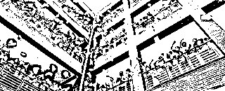
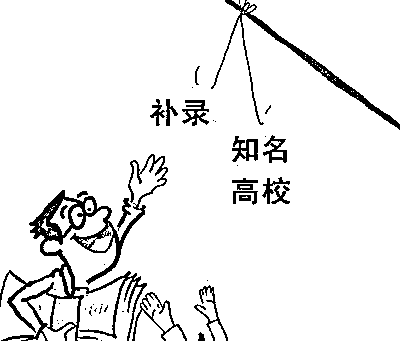
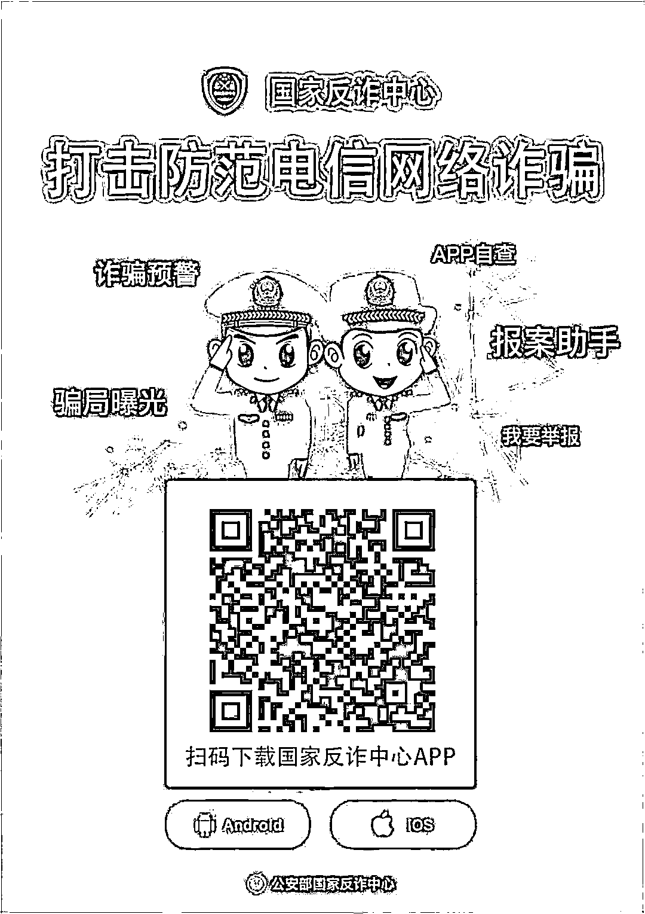
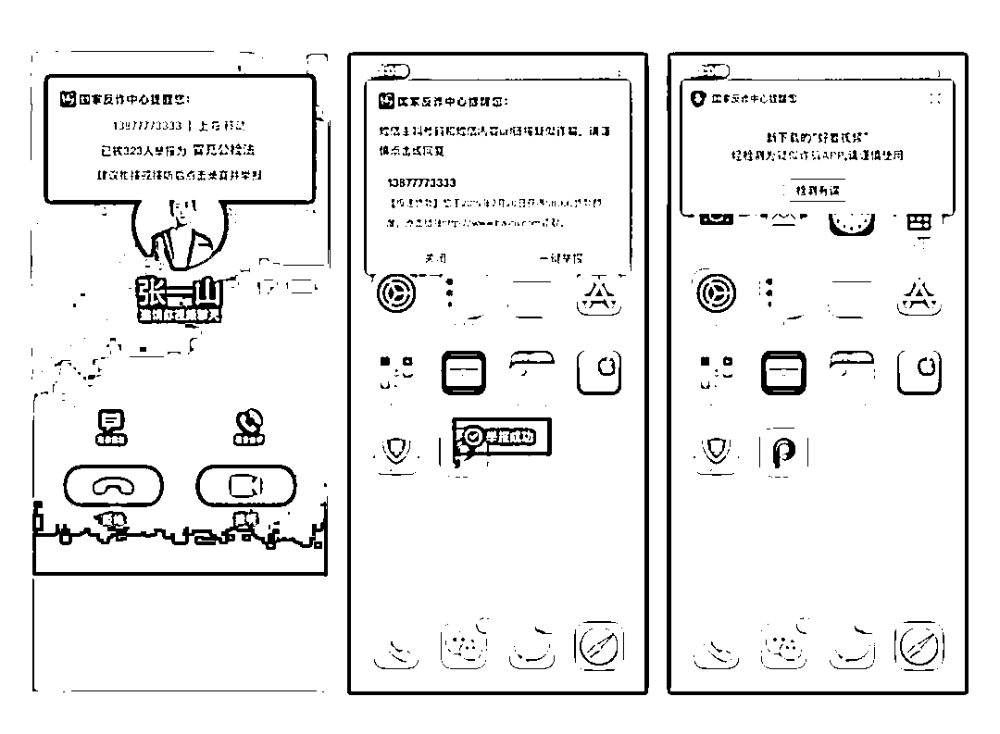

# 他们又伺机而动了，高考后小心这些骗局！

> 原文：[`mp.weixin.qq.com/s?__biz=MzIyMDYwMTk0Mw==&mid=2247515723&idx=6&sn=d705f9b1b31a6823b1555b079eb5b854&chksm=97cb7573a0bcfc656bc67463e6d0382ffce1c0f4c85de294634d033dfb68d2115b7f81d6570a&scene=27#wechat_redirect`](http://mp.weixin.qq.com/s?__biz=MzIyMDYwMTk0Mw==&mid=2247515723&idx=6&sn=d705f9b1b31a6823b1555b079eb5b854&chksm=97cb7573a0bcfc656bc67463e6d0382ffce1c0f4c85de294634d033dfb68d2115b7f81d6570a&scene=27#wechat_redirect)

昨天下午 6 点 15 分

随着铃声作响

2021 年高考结束了！

今年高考热度爆棚

除了最近有考生上传真题搜答案一事外

网友们也开始分享自己当年高考完的情形

**#高考结束当晚都做了什么#**

**#高考结束干的第一件事#**

**#高考时爆了冷门的科目#**

甚至还有**#高考完被骗的经历#**……

无数学子为求学梦想努力拼搏时

一些心怀叵测的诈骗分子

也正在搜寻合适的“猎物”

**提前查考分**

每次考试完

鹏哥理解大家架不住激动的心情

想赶快知道自己成绩

**而骗子就是利用家长和考生**

**“熬”不住的焦躁情绪作案**

**通过伪基站群发短信**

**称可查询高考成绩**

**并附有一个网址链接**

不小心点开网址链接

手机便会被偷偷**植入病毒**

有的甚至还会**引诱输入身份证号、**

**姓名、手机号、银行账号等信息**

将这些信息记录并贩卖

或者根据这些信息进行精准电信诈骗

 **提醒** 

查分要在教育部门指定的官方渠道，不要随意点击来历不明的链接。

**大数据精准填报志愿**

在查分数与志愿填报的空档期

总有中介或网站宣称

**有所谓“内部大数据”**

**“精准填报志愿、一分不浪费”等服务**

考生可以一次购买 1 万、2 万

等不同面额的 VIP 卡

享受一对一的“精准”指导……

 **提醒** 

教育部门已经明确表示，不会跟任何社会性质机构或企业合作，商家所谓的“内部大数据”纯属营销口号，甚至有可能是诈骗陷阱！

**提前获知录取结果**

利用大家不熟悉招生程序

骗子鼓吹自己**“上面有人”**

**“保证录取”**等公开叫价

实际上

教育部门是进行网上录取

不会私下打电话

 **提醒** 

考生及家长应该以本地教育部门官方网站或者报考院校的官方网站公布的录取信息为准，切勿听信提前获取的谣言。

**冒充高校招生人员**

骗子伪造文件、私刻印章

设立报名处和咨询电话

**假冒高校招生人员**

**谎称手中掌握高校“内部指标”**

**“机动计划”“定向招生计划”等情报**

以此骗取家长支付的“定金”

有的还自称是高校或招生办

**某领导的熟人、亲戚、朋友**

**有办法“低分高录”或争取特长生加分**

**让二本分数线考生录取到重点院校**

**让专科分数线的考生录取到本科院校**

**或从普通专业调到热门专业等**

以此实施诈骗

 **提醒** 

现在都是电脑录取，考生分数没到投档线，无法提档。不要相信所谓的“低分高录”等。

**补录**

**骗子谎称某高校名额没能招满**

**通过花钱“打点”**

**可让考生获得补录名额**

以此骗取考生家长钱财

也有的考前就用各种借口

**让家长交钱保留名额**

 **提醒** 

正规的招生录取不会产生任何附加费用，凡是需要收取保证金、录取费、指标费等等的，一律不要相信。

**伪造录取通知书**

骗子向考生**寄送伪造的录取通知书**

**让考生将学杂费打入指定的银行账号**

**以骗取钱财**

类似的手法还有制造虚假的钓鱼网站

目的在于骗取学生的生活费、学杂费

 **提醒** 

切勿相信自身没有报考的院校所投递来的录取通知书，转账汇款时要通过多途径核实账号真伪。

**提前发放助学金**

骗子**针对一些经济困难的考生**

自称高校或教育部门工作人员

可以对困难考生或成绩优异考生

提前发放助学金

再不领就要过期

然后引诱转账汇款

 **提醒** 

助学金的发放需要从申请到评审，再经过公示才能发放到学生手中，而整个过程都是所在学校参与的，而且助学金是要记入学生档案的。

**鹏哥提醒**

**高考骗局虽然花样繁多**

**但都围绕一个“钱”字**

**凡是涉及钱财**

**考生和家长一定要提高警惕**

**不要轻易将考生及家人的**

**身份信息、准考证号、**

**银行账户等信息泄露给他人**

**若不幸被骗一定要保留好证据**

**及时到派出所报警。**

在这里再给大家推荐一个

超级防护盾

—— **“国家反诈中心”APP**

手机安装此 APP

实名注册并开启**“预警防范”**之后

**可自动检测手机上可疑 APP**

**对可疑来电、短信进行弹窗提醒**

**还可用于聊天对象身份验证**

提前预警，**大大降低被骗风险**

学生们、家长们

赶快行动起来吧

来源：中山市反诈骗中心

← 向右滑动与灰产圈互动交流 →

