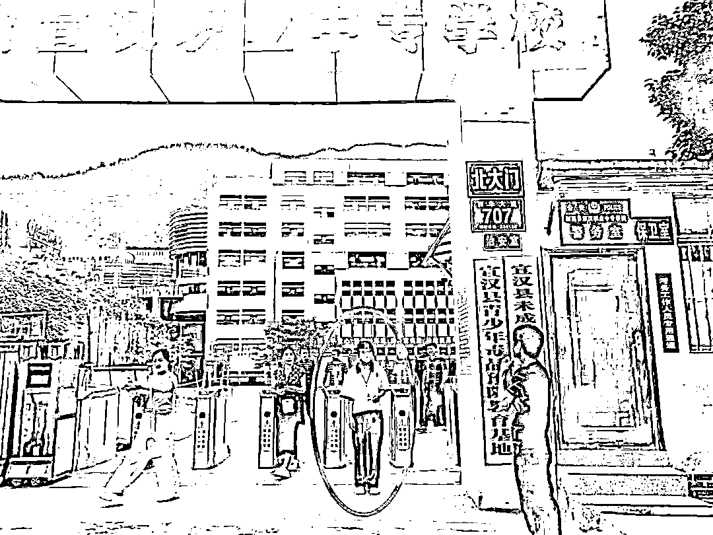

# 参加高考，才发现自己是网上逃犯！

> 原文：[`mp.weixin.qq.com/s?__biz=MzIyMDYwMTk0Mw==&mid=2247515767&idx=2&sn=7ac9233a840bec5facc15f6fcdb52c6f&chksm=97cb754fa0bcfc59271ce7007165750897336772376f23e1a6ff21a9df347936b433b1184115&scene=27#wechat_redirect`](http://mp.weixin.qq.com/s?__biz=MzIyMDYwMTk0Mw==&mid=2247515767&idx=2&sn=7ac9233a840bec5facc15f6fcdb52c6f&chksm=97cb754fa0bcfc59271ce7007165750897336772376f23e1a6ff21a9df347936b433b1184115&scene=27#wechat_redirect)

十年磨一剑，一朝试锋芒。6 月 7 日，一年一度的高考如期而至。

然而，在这关乎考生命运的关键时刻，四川达州的高考考生黄某，却因涉嫌电信网络诈骗被浙江警方列为网上在逃人员。对此，考生本人却毫不知情。

面对警方的到来，黄某坚称自己从未从事过任何违法活动，只承认曾帮一位“店主”实名认证过相关账号。警方认为，其违法事实还有待进一步查证。高考前，浙江警方联合达州警方调查后，决定变更强制措施，让她先参加高考。

6 月 7 日下午，黄某走出考场

进城赶考 考生办理入住时被民警带走

黄某出生在四川省达州市宣汉县一个乡镇，与许多同班同学一样，几乎没有出过远门，去过最远的地方，也在四川省内。

6 月 5 日，高考前夕，按照学校的统一安排，黄某和同学们一起，在老师的带领下乘车到达宣汉县城，打算休整两天后参加高考。

“大家都很意外，上百名同学办理入住的时候都没出现异常情况，只有她一个人无法办理入住手续。”宾馆前台工作人员介绍，5 日下午，他们在为这些学生办理入住时，发现黄某竟然是一名“逃犯”。

“她是浙江警方的网上追逃人员。”宾馆工作人员称，他们第一次遇到这种情况，立即找老师和学生本人了解情况。蹊跷的是，黄某本人对此毫不知情，同学和老师也称，黄某平时是个“乖乖女”，都不相信她做过违法犯罪的事情。出于无奈，宾馆选择了报警。

很快，宣汉县公安局蒲江派出所的民警赶到现场，将黄某带走。

警方调查 该考生曾做“兼职”赚过钱

“怎么可能？我连校规校纪都不敢违犯，为啥就成了网上逃犯了？”在派出所，民警向黄某解释了相关法律法规，并依法按程序对其展开调查询问，第一次进派出所接受调查，黄某几乎崩溃，坚称自己从来没有从事过任何违法活动。

黄某是高考考生，身份特殊。为确保万无一失，宣汉公安局刑侦大队、蒲江派出所民警仔细查询了相关信息，确认黄某的确被浙江警方列入了在逃人员名单，“网上追逃”的时间是 2021 年 4 月，理由是“涉嫌电信网络诈骗”。

“作为中学生，黄某没有足够的社会经验，有可能存在身份信息被盗用等情况。我们根据以往的办案经验，帮她分析了几种可能性。”宣汉县公安局刑侦大队民警介绍，通过耐心解释和长时间沟通，**黄某想起一件通过网络做“兼职”的事，觉得很可能与自己被网上追逃有关。**

黄某回忆，**2020 年 12 月，她在同学的推荐下，结识了一位某电商平台的“店主”。该店主让黄某将其本人的身份证拍照发给他，然后发给黄某多个****网络账号****，让其用相关账号登录电商平台，并进行了刷脸认证和实名认证。**

**“整个过程都是通过手机完成的，后来我也没联系过对方了。”黄某称，她帮助这位“店主”完成实名认证后，对方通过微信给她发了****200 多元****的“辛苦费”。**

川浙联动 变更强制措施让她先参考

简单的操作，蝇头小利，却让身为高中生的黄某，成了连自己都毫不知情的“诈骗犯”。

6 月 5 日当天，高考在即，宣汉警方与时间赛跑，立即与浙江警方取得联系，并第一时间将调查结果告知对方，建议浙江警方赴四川联合调查，在高考前尽快商定一个最佳解决方案。

高考前黄某在派出所内复习

“我们很同情你的遭遇，但仍需要进一步调查。马上就要高考了，我们看能不能找到办法让你先参加高考。”按照法律相关规定，派出所民警暂时将黄某留置在派出所，专门为她准备了一个临时自习室，嘱咐其不要有心理负担，安心复习，以最好的状态迎接高考。

6 月 6 日 18 时许，浙江警方赶到宣汉县公安局蒲江派出所，在核实相关情况并征求当地警方意见后，浙江警方决定为黄某变更强制措施为取保候审。当晚，黄某被家人接回家中复习。警方表示，待高考结束后，将会再对黄某作进一步调查。

6 月 7 日，黄某顺利跨进高考考场。

警方提醒：

**不得将本人所办理的****银行卡、电话卡、支付账户、网络账号****等****出售、出租、转借****给他人，如果被****用于信息网络犯罪或其他犯罪，公安机关将依法追究提供者****的法律责任。**

依照最高人民法院、最高人民检察院《关于办理诈骗刑事案件具体应用法律若干问题的解释》第七条规定：“明知他人实施诈骗犯罪，为其提供信用卡、手机卡、通讯工具、通讯传输通道、网络技术支持、费用结算等帮助的，**以共同犯罪论处”。**

来源：天下有诈、熊猫反诈

← 向右滑动与灰产圈互动交流 →

