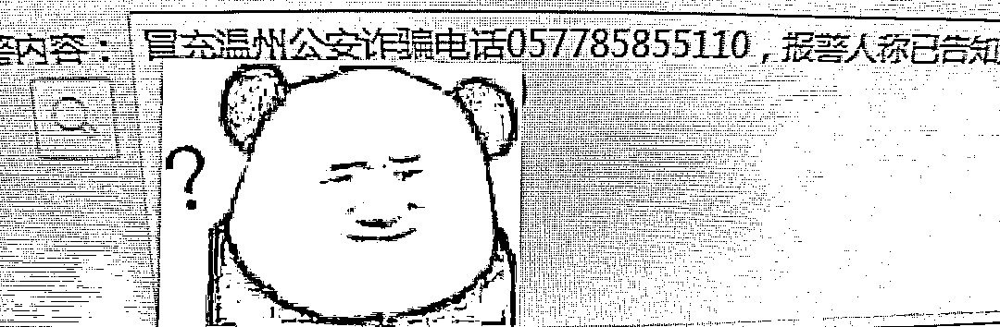
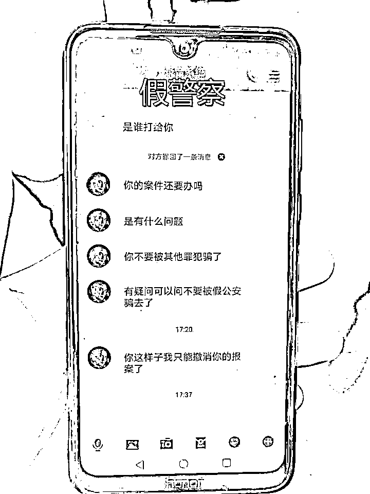
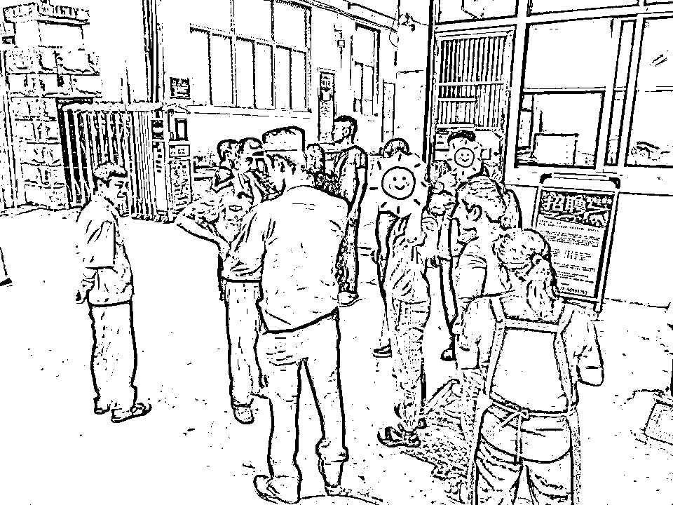
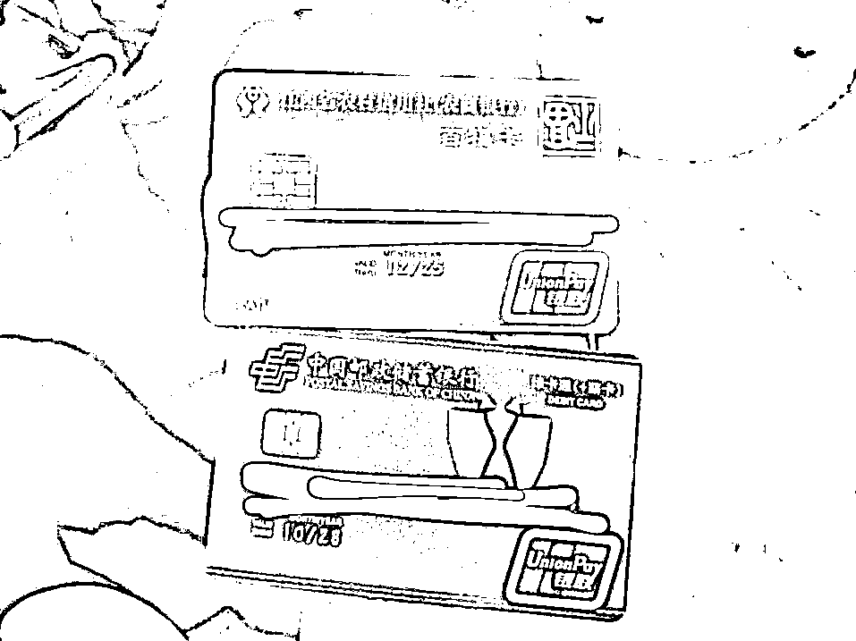
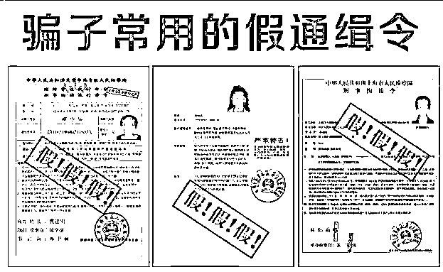
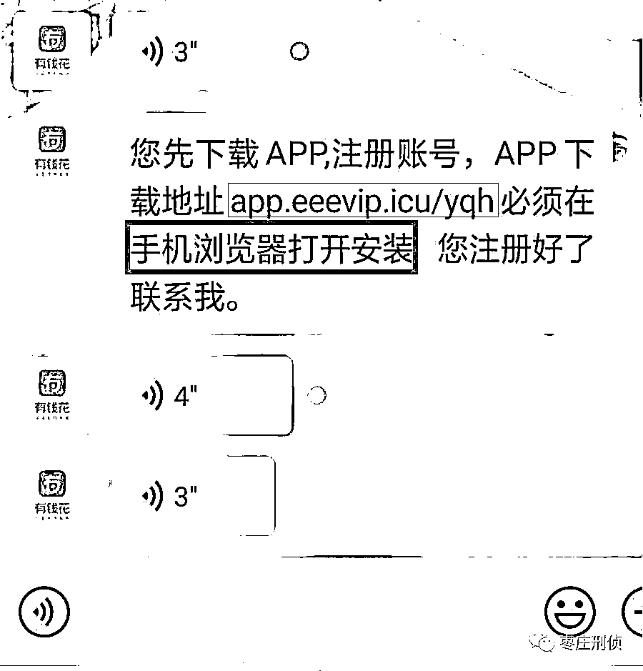

# 一女子拉黑民警，举报反诈中心…

> 原文：[`mp.weixin.qq.com/s?__biz=MzIyMDYwMTk0Mw==&mid=2247515767&idx=4&sn=f3f4eb1cd7e429e77ad34a59e1fdb9d9&chksm=97cb754fa0bcfc594c86fadb088f4ed204e0e650f15386ebfc99043d595dfdddaf2736b3c627&scene=27#wechat_redirect`](http://mp.weixin.qq.com/s?__biz=MzIyMDYwMTk0Mw==&mid=2247515767&idx=4&sn=f3f4eb1cd7e429e77ad34a59e1fdb9d9&chksm=97cb754fa0bcfc594c86fadb088f4ed204e0e650f15386ebfc99043d595dfdddaf2736b3c627&scene=27#wechat_redirect)

**配合调查、后果严重、自己负责** 

**……** 

一边是来势汹汹的**“陈警官”**

一边是不停劝阻的**反诈中心**

一通操作后

她却拉黑、举报了真警察

所幸民警及时赶到

避免了一场**10 万元**的损失

[`mp.weixin.qq.com/mp/readtemplate?t=pages/video_player_tmpl&action=mpvideo&auto=0&vid=wxv_1903649452347703309`](https://mp.weixin.qq.com/mp/readtemplate?t=pages/video_player_tmpl&action=mpvideo&auto=0&vid=wxv_1903649452347703309)

6 月 3 日下午，瓯海区反诈中心预警系统侦测到一条预警信息：在潘桥辖区，市民吴女士正在跟可疑号码长时间通话，可能已步入骗局！情况紧急，反诈中心立即将支援指令发送到潘桥派出所。

同时，潘桥派出所接到一条报警：举报 057785855110（瓯海区公安分局反诈中心）电话号码涉嫌诈骗。举报人正是吴女士。

**反诈中心号码反被受害人举报，这是怎么一回事？**

值班民警郑良亮意识到吴女士可能已经深陷骗局，立即出警。在吴女士工作的公司门口，民警“巧遇”了一脸茫然的吴女士，赶忙跑上前“抢”过她的手机。打开手机，郑良亮发现一名自称是“北京公安局”的骗子“陈警官”正在跟吴女士激烈地对话：

**“你名下银行卡涉嫌洗钱，请配合调查。”**

**“你不要被‘假公安’骗了！”**

**“如果你不配合的话，后果很严重。****”**

这位“陈警官”不仅对吴女士实施诈骗，还误导她称反诈中心的电话是骗子来电……难辨真假的吴女士信以为真，将反诈中心号码拉黑、举报给了 110，并且积极配合“陈警官”“办案”，按照对方的要求如实提供了自己的银行卡号及密码，准备转账 10 万元。

好在民警及时赶到，终止了吴女士的转账操作，冻结了她的银行卡账户，并向她耐心讲解了骗子的惯用手段，“你看这些证件都是假的，无论哪里的电话，涉及转账、提供信息的都不要相信！公安机关是不会要求任何人转账的！”借此机会，他还向吴女士及同事们进行了防诈骗知识宣传。

“多亏了你们，不然我和老公辛辛苦苦打工几年的钱就被骗走了！”半个小时后，被深度“洗脑”的吴女士彻底醒悟，认清了“陈警官”才是骗子，对民警以及反诈中心的帮助表示由衷感谢。

**他们的诈骗经一般是这样念的**

**第一步：意外来电**

意外来电

诈骗分子会自称是某某部门（如公安部门、通信部门、金融部门等），先报上你的个人信息，取得初步信任，然后以各种名义声称你涉嫌违法犯罪，例如说你用身份证在某地开通银行卡进行诈骗活动，用你的银行卡开展洗黑钱，你参与涉毒、贩卖妇女儿童等，多种多样的话术版本。

**第二步：电话转接**

对方会问你能否立即赶到比较远的某某地公安局或派出所，对方紧接着就会“好心”地告诉当事人可以将电话直接转接到办理案件的“某某公安局”，转接过后会有自称公安民警的诈骗分子询问你的信息，这时对方还会强调，案件涉密，不得透露任何信息，要时刻保持联系，否则就要对你进行抓捕，冻结你的资产，造成受害人的恐慌心理，从而达到控制受害人的目的。

**第三步：领导登场**

对方会转接到上一级的人员让你自证清白，自称“某某科长、某某大队长”的诈骗分子会通过添加 QQ、微信或其他聊天软件与受害人语音或视频通话给你做电话笔录，并向受害人发送虚假的警官证、通缉令、带有“某某市公安局、某某市检察院、法院”等公章的文件。大多数受害人在看到带有自己身份信息的这类文件后会陷入恐慌并开始对诈骗分子的话深信不疑。

** 骗子常用的经查证假通缉令图片 **

**第四步：洗脱罪名**

诈骗分子会要求受害人下载带有类似“警政安全”和“安全防护”等字眼的 APP，并表示只要配合警方调查就可以洗脱罪名。洗脑成功后，诈骗分子会告诉受害人要对其进行资金清查来确认受害人的钱没有犯罪往来，来证明受害人的清白，到这一步，受害人一般急于证明自己的清白，就会完全听从诈骗分子的指挥。

**第五步：资金转移**

诈骗分子要么是要求受害人直接转账，要么是让受害人将所有资金全部集中到一到两张卡上，然后诈骗分子会远程指导受害人独自前往银行开通网银办理 U 盾，直至受害人资金集中完毕。此时对方会给受害人发送带有木马链接的信息，点击链接下载一款 APP 获取你手机的各种权限之后，一般会有一个所谓的资金清查界面，或者直接登录一个网页，按照对方指示，填写银行卡账号、密码、手机验证码等信息，到了这一步，填完之后，受害人卡上的资金就会被诈骗分子在后台进行转款操作，受害人的资金就这样被诈骗分子转移出去了。

** **此类诈骗案件的特点：****

**1、通话时间长，一般持续通话时长在 3-5 小时，有的甚至会隔天或数日继续通话实施诈骗。**

**2、骗局多为诈骗分子分工合作，扮演不同角色，语气强硬，环境背景音欺骗度高，包括对讲机、警报声等，还分为话务一线二线三线等。**

**3、诈骗分子要求受害人下载可远程操控、访问手机设备获取信息各种手机权限的 APP 软件，便于控制受害人，完成转账行为。**

**** 警方提醒：******下面此********类电话绝对是骗子！******

**1、要求你绝对不能挂掉电话，并为你转接电话的；** 

**2、要求你绝对不能和别人（尤其是警察）透露通话内容的；**

**3、要求你先找一个隐蔽的地方和他继续通话的；**

**4、要求加你 QQ、微信向你发送所谓的通缉令、逮捕令等文书的；**

**5、要查你银行账户，或者提及“安全账户”的。**

****

**** 识骗宝典****

**此类骗子隐蔽性强、威胁性高，群众很容易上当，但是也很容易被识破：**

**1、外地号码：前方带有 00 或者“+”的电话，该类电话为国际长途电话，香港、泰国、马来西亚，一律是骗子。**

**2、外地口音：南腔北调，普通话生硬，一律是骗子。**

**公安部门办案必须见到当事人和出示警官证等相应证件，不见本人或网上出示证件的一律是骗子。**

****警方提醒：****

****

****民警办案一律面对面****

****民警办案一律面对面****

****民警办案一律面对面****

****民警办案一律面对面****

****民警办案一律面对面****

****谨防冒充公检法诈骗
一起保护我们钱袋子****

**来源：平安瓯海、枣庄刑侦**

****

**← 向右滑动与灰产圈互动交流 →**

****