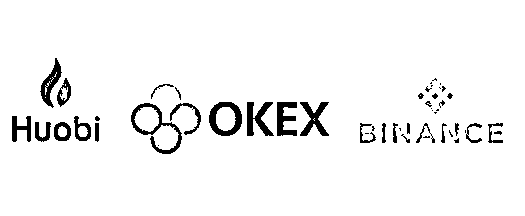
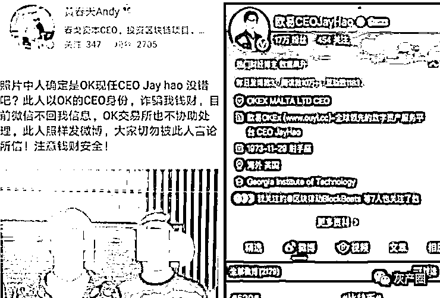
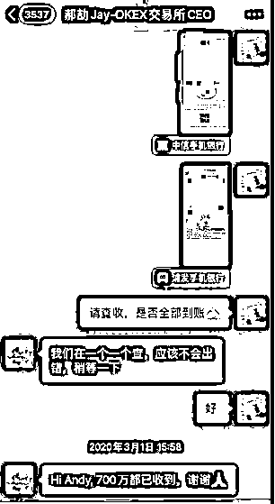
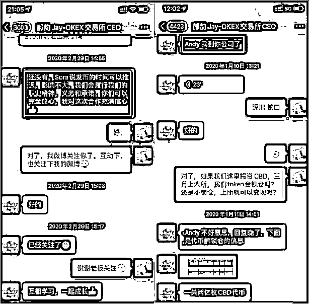
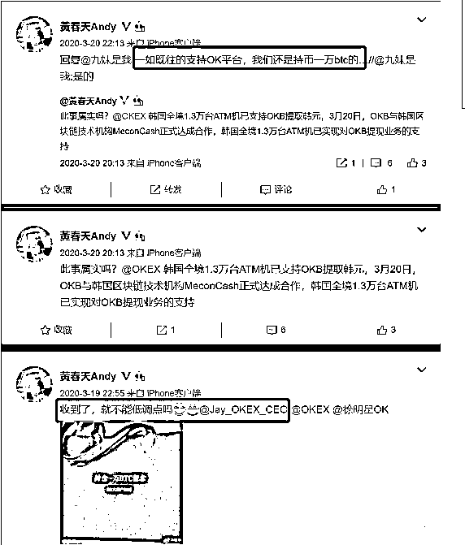

# ”OKEX 交易所“现任 CEO 诈骗 700 万？恐要退出“三大”了

> 原文：[`mp.weixin.qq.com/s?__biz=MzIyMDYwMTk0Mw==&mid=2247515818&idx=2&sn=431e7063db1b84cbb967bc5cb7902a1f&chksm=97cb7592a0bcfc84b20207fd37e4174e239d67ef709a14b81db1c0f7a71d12e171c2c661c57c&scene=27#wechat_redirect`](http://mp.weixin.qq.com/s?__biz=MzIyMDYwMTk0Mw==&mid=2247515818&idx=2&sn=431e7063db1b84cbb967bc5cb7902a1f&chksm=97cb7592a0bcfc84b20207fd37e4174e239d67ef709a14b81db1c0f7a71d12e171c2c661c57c&scene=27#wechat_redirect)

2020 年的 DeFi 热潮在币圈掀起了一阵“去中心化”的雷霆飓风，带动数字货币蓬勃发展的同时，也推动了 2021 年前期“大牛市”的形成，打破了曾经“三足鼎立”的交易所格局。 

**顺应潮流，币安抢先在去中心化的变革中占领高地推出币安智能链 BSC，赢得大批市场流量；随后，火币也姗姗来迟推出平台生态链 HECO 来争夺市场，尽管争议颇多，但也略有成效；反观 OKEX，自暂停提币的黑天鹅事件拖累之后，面对突如其来的 DeFi 大牛市，显然有点措手不及。**

在这场流量争夺战中，OKEx 毋庸置疑落后太多，前面有火币和币安逐渐拉开了身位，后面有 FTX 和 MXC，分别在衍生品和山寨现货进行了超越。 

**而 OKEX，除了输了流量，更是输了用户的信任！**

**2021 年 6 月 2 日， 微博名：黄春天 Andy 发博控诉被 OK 现任 CEO Jay hao 诈骗 700 万****，舆论一片沸腾，币圈争议不止。**

对于 OKEx 交易所来说，**“CEO 杰伦身陷诈骗舆论漩涡”**显然是个雪上加霜，利空不利好的消息。毕竟这么大的交易所，这么大的一个公众人物，如果真的是诈/骗被捅出来的话，用户信任何在？还有谁敢把资产存在 OKEx 里呢？

不过，有一句话说的好：让子弹飞一会儿~

先回到上面的微博内容，我们一起看看发生了什么。

**在上面的微博内容里，Andy（当事人）贴出了几张图片，分别是跟欧易 CEO Jay 的合照微博互相关注、还有一些聊天记录等信息。**

从这三张图披露出来的信息，我们可以确认两点：

第一，Andy 和 Jay 之间是认识的，线下见过面，有合照为证。

第二，Andy 和 Jay 微博互相关注，线上也有沟通。

但有一点不确定的是：微信上的那个 Jay，是不是真的 OK 的 CEO？

要知道，现在这年头骗子高明的很，山寨头像，仿照微信名造假借钱的骗局比比皆是。

**虽然我们常说 OK 后续发展如果跟不上的话，非常有可能退出三大交易所，但，瘦死的骆驼比马大，OKEx 的 CEO 应该也不至于为了区区几百万而诈骗吧。**

当然，这是大多数人听到爆料后的第一反应，但，猜测归猜测，事实究竟如何，目前也未可知。

并且，随着对方 Andy 摆出的越来越多和 OK 相关的信息资料，和 CEO 杰伦的往来交流，真相也似乎变得扑朔迷离。

**因为无论是微博互关，还是在 OKEx 持仓记录和 OKEx 的往来互动，似乎都标志着 Andy 和 OK 和 CEO 杰伦的紧密联系。**

**毕竟，说句心里话，在币圈真的会有这么一个原本不怎么缺钱的骗子为了 700 万的资产处心积虑接近 OKEx，维持良好关系长达一年之久吗？**

**既然本身就是 OKEx 的持仓大户了，抹黑 OK 对他又有什么好处呢？**

孰是孰非，尚未可知，毕竟吃瓜群众难知事情真相，但币圈套路多，多留个心眼，肯定不是坏事。

来源：金融项目深度分析，利箭在出击

← 向右滑动与灰产圈互动交流 →

