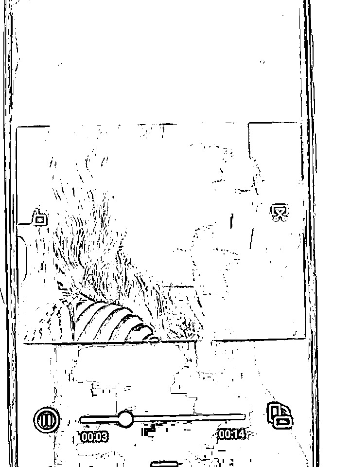
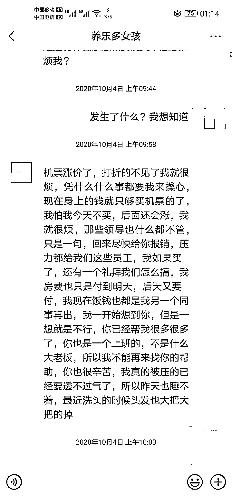
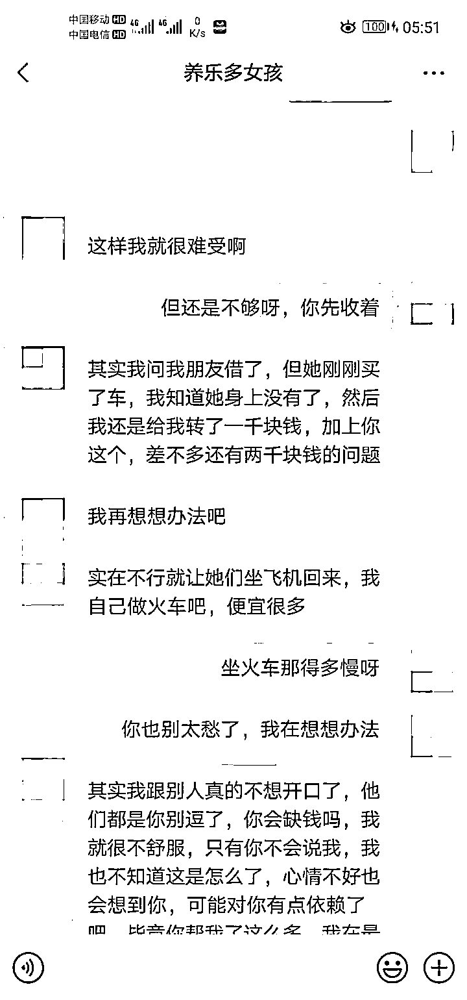
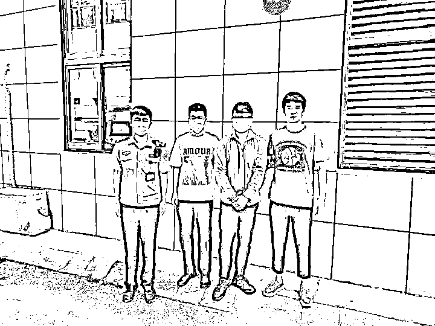
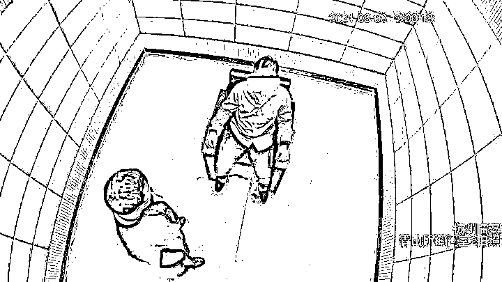

# 长相甜美的高学历女友，竟是我的男同事！

> 原文：[`mp.weixin.qq.com/s?__biz=MzIyMDYwMTk0Mw==&mid=2247515818&idx=3&sn=598067364c8f3add6eaa16f7404f26e1&chksm=97cb7592a0bcfc846b79b30dfdf052cc7ea753406f1b868194b3f380d97176afbfec703329b0&scene=27#wechat_redirect`](http://mp.weixin.qq.com/s?__biz=MzIyMDYwMTk0Mw==&mid=2247515818&idx=3&sn=598067364c8f3add6eaa16f7404f26e1&chksm=97cb7592a0bcfc846b79b30dfdf052cc7ea753406f1b868194b3f380d97176afbfec703329b0&scene=27#wechat_redirect)

在杭州临安上班的湖南人小黄怎么都想不到，自己的一场“恋爱”，竟是《梁祝》里桥段的另类翻版：跟他很要好的男同事，给他介绍了一个“高知女友”，随后小黄在微信上和她陷入一场网恋，还花钱通过了她提出的各种“要求”，被骗 7.1 万元后，他才发现这所谓的“女友”竟是同事本人。

来自湖南的小黄，今年 29 岁，是临安某公司的职工，虽然长相普通，但是老实本分，工作也算勤勤恳恳，随着年纪不断增长，这几年来他一直盼望着自己的那个“她”能早日出现。 

小黄的同事王某，时常听他说起要找女友的事。过去，王某曾帮小黄介绍过女孩子，可是女孩子看了小黄的照片就拒绝了，几次下来，小黄一直形单影只。 

去年 5 月中旬，王某和小黄说，自己家邻居小姑娘还是单身，浙江大学研究生毕业，目前在阿里巴巴工作，叫“王怡璐”，今年 28 岁，长相甜美，可以介绍给他认识。“王怡璐”目前在杭州上班，经常出差，可以通过该微信先聊天认识。当天，渴望爱情的小黄就加了“王怡璐”的微信。 

两人一来二去蛮聊得来，“王怡璐”还发了照片过来，小黄发现照片里的她，竟然是如此漂亮，一看就是“高知”。小黄立马就动心了，认定了对方就是自己要寻觅的另一半，并将她的微信备注为“养乐多女孩”。 

而后的事情，更让小黄心动不已，俩人不仅聊得来，似乎还有相见恨晚的感觉，几次下来，便开始“谈情说爱”了。 

2020 年 5 月 20 日那天，小黄给“王怡璐”发了 520 元的红包，“王怡璐”刚开始是拒绝的，认为两个人相处不能涉及钱。小黄解释称这么重要的节日应该一起度过，既然不能见面送礼物，只能通过发个红包表达下小小心意。在小黄的劝说下“王怡璐”收下了这红包。 

2020 年 6 月 8 日，“王怡璐”告诉小黄她邀请同事到一高端餐厅吃饭，担心钱不够，小黄不假思索地转了 5000 元给他。 

过了两天，“王怡璐”称前几天到邻居王某家里玩看到他家的冰箱特别高级，也想买一台，小黄马上转了 5000 元。之后又称手机摔坏了小黄转了 10000 元，垫付公司机票钱、请同事吃饭等等理由……这样持续到今年 4 月小黄陆陆续续转给“王怡璐”71000 元。 

对于“王怡璐”借钱一事，小黄也曾对王某提及，王某说，“王怡璐”都告诉他了，觉得小黄是好人，并表示一定会将钱还给小黄。小黄听后，更是信心倍增。 

随着俩人“感情”的升温，小黄所有心思和钱都花在“王怡璐”身上，一有时间就找她聊天，而“王怡璐”多次向他提出了“借钱”。 

到了今年 4 月，小黄实在没有钱了于是向“王怡璐”提出能否归还部分钱，同时要求见面。“王怡璐”起初是答应的，但每次到见面时间都是以各种理由拒绝，而后“王怡璐”对小黄越来越冷淡，慢慢地没了消息。 

小黄向王某询问原因，王某称事情是因他而起，他愿意帮"王怡璐"还钱同时写了借据，但是到了还款日，无论王某还是“王怡璐”都毫无反应。 

小黄越想越不对劲，选择了向临安公安分局青山派出所报警。 

民警在了解情况后，认为作为介绍人的王某有嫌疑。民警通过深入调查发现，去年同时段王某资金流动异常，就此判断王某有重大嫌疑。 

6 月 8 日，王某在临安某公司被临安警方抓获。 

经审讯，王某如实交代了其诈骗同事小黄的整个经过。 

据王某交代，起先他的确是出于好心为小黄介绍女朋友，介绍了几个都不成功后，他突然想到自己有一个另外的微信号，何不借此骗小黄。他在微信上以“王怡璐”的身份与小黄联系，想不到 5 月 20 日当天，小黄就主动发现 520 元的红包，之后，王某以各种理由借钱也是极为顺利。他想，既然钱来得这么容易，何不多借几次，而被蒙在鼓里的小黄，每次都答应了。 

事后，王某用“借”到的钱，到处吃喝玩乐，他就将骗得的 7 万余元钱挥霍得所剩无几。 

目前，王某因涉嫌诈骗已被临安警方依法刑事拘留，案件正在进一步办理中。 

警方提醒：网恋有风险，交友需谨慎！你以为的清纯美女，很可能是个“抠脚大汉”，在涉及财物问题时，更要提高警惕，千万不要被甜言蜜语和虚假的承诺冲昏头脑。

来源 ：钱江晚报

← 向右滑动与灰产圈互动交流 →

