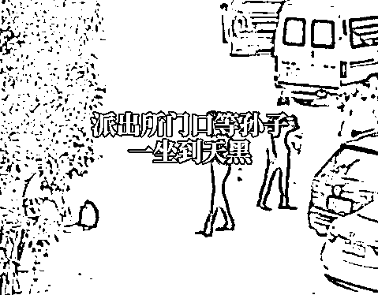
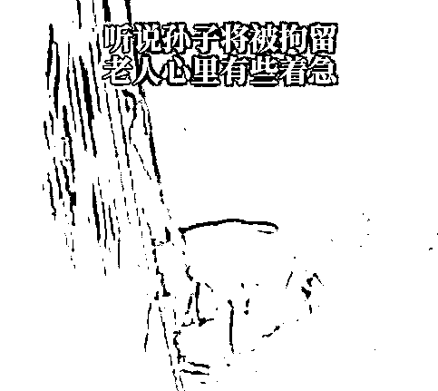

# 00 后打工小伙被骗后反骗他人 4738 元，爷爷跋涉千里带他自首，一句话让人心酸…

> 原文：[`mp.weixin.qq.com/s?__biz=MzIyMDYwMTk0Mw==&mid=2247515818&idx=4&sn=9c9f3646d86f475506d9c65235eed167&chksm=97cb7592a0bcfc84a97ce64cc7319e209768fbec8379c9bbfa552ea9e6c1dc03cc7f452c9f19&scene=27#wechat_redirect`](http://mp.weixin.qq.com/s?__biz=MzIyMDYwMTk0Mw==&mid=2247515818&idx=4&sn=9c9f3646d86f475506d9c65235eed167&chksm=97cb7592a0bcfc84a97ce64cc7319e209768fbec8379c9bbfa552ea9e6c1dc03cc7f452c9f19&scene=27#wechat_redirect)

**“是我没有带好孙子，这孩子是自首的，你们一定要考虑从轻处理。”** 

[`v.qq.com/iframe/preview.html?width=500&height=375&auto=0&vid=g3252ryb1yt`](https://v.qq.com/iframe/preview.html?width=500&height=375&auto=0&vid=g3252ryb1yt)

6 月 8 日，台州临海，沿江派出所大门外的绿化带边，一名白发苍苍的老汉面对民警送来的水，双手颤抖，表情难过，用带着山东口音的普通话向民警表达自己的请求。

这位白发老人姓吕，今年已年过七十。烈日当头，他却在派出所门口的绿化带坐了一个多小时。他说，他的孙子小吕正在派出所里接受调查，他则在门口等孩子出来。 

“大爷，您坐在这会中暑的。”民警程思叶给老人递过一瓶水，并邀请他到派出所值班室里面坐，被老人拒绝。

让民警意外的是，这位白发老人竟然是从山东特地带着孙子找到临海的沿江镇派出所投案自首的。

**“我一辈子老老实实，工作 40 多年到退休，从没干过一件坏事，他干了坏事，必须要对社会有个交代！”**他说，他的孙子小吕在网络上骗了别人的钱，受骗者就在沿江镇。

老人的孙子小吕，今年 19 岁，祖孙俩老家在山东济南。

数天之前，老人听孙子说银行卡不能用了，因涉案被银行冻结了，而办案的民警是远在千里之外的浙江临海市公安局沿江派出所的民警。

老人正要询问原因，**孙子小吕说自己要到浙江去自首，因为自己在网上骗了别人 4738 元钱。**

**小吕自小父母离异，由爷爷抚养长大。**奶奶常年卧病在床，爷爷曾患心梗、脑梗，术后一只腿发麻行走不便。为了给爷爷减轻负担，小吕中专毕业后就在理发店工作，洗头工、打杂工哪个岗位都干，得空还会在家帮爷爷做家务。

多年来，在爷爷眼里，小吕一直是一个听话乖巧的孩子。也正因为如此，当老人得知孙子骗了别人钱，心中懊恼自己没有教育好他，当听到孙子说要去自首，老人松了一口气，但听说要去自首的地方是远在千里之外的浙江，老人的心又提了起来。

孩子从未出过远门，这一走就是这么远，**老人放心不下，决定亲自送孙子南下。**

“我告诉他，这样做是对的，做错了事情要勇于承担责任。”老人说，他答应孩子，向民警请求宽大处理。

记者从办案民警处了解到，实际上，今年 4 月 11 日，沿江镇村民小任曾到派出所报警，说他在网络上卖游戏账号的时候被骗 4738 元。民警接警后展开调查，迅速锁定了嫌疑人，并计划在最近几日实行抓捕。

“我们正准备赶赴山东抓人，他却先一步来派出所投案了。”民警朱家俊说。

6 月 8 日，小吕到沿江派出所自首。

沿江派出所审讯室里，小吕交代了自己骗人的过程。他说，他去年在网上卖游戏账号的时候，被人骗走了 1400 元钱，这些钱都是他打工辛苦赚来的，本可以用于改善家里的生活，所以心中颇是不甘，决定要用同样的方法把钱“骗回来”，一念之差误入了歧途。

民警程思叶在了解情况之后告诉老人，小吕将被拘留，一时间无法返回山东了。 

这让老人心里有些着急，他原想着，孩子自首，把钱退了，接受了批评教育，也就可以和他一起回山东了。

“我老伴瘫痪在床，我也没法在这里等他。”老人说，实在不行也只能自己先行回去了。

当天，民警帮老人看好了返回山东的班次，并将他送到车站。进站前，老人委托民警给孙子小吕带话：“在里面要好好听话，好好改造，争取宽大处理。”

6 月 9 日，临海警方已依法对小吕处以刑事拘留。

来源 ：台州公安、都市快报

← 向右滑动与灰产圈互动交流 →

