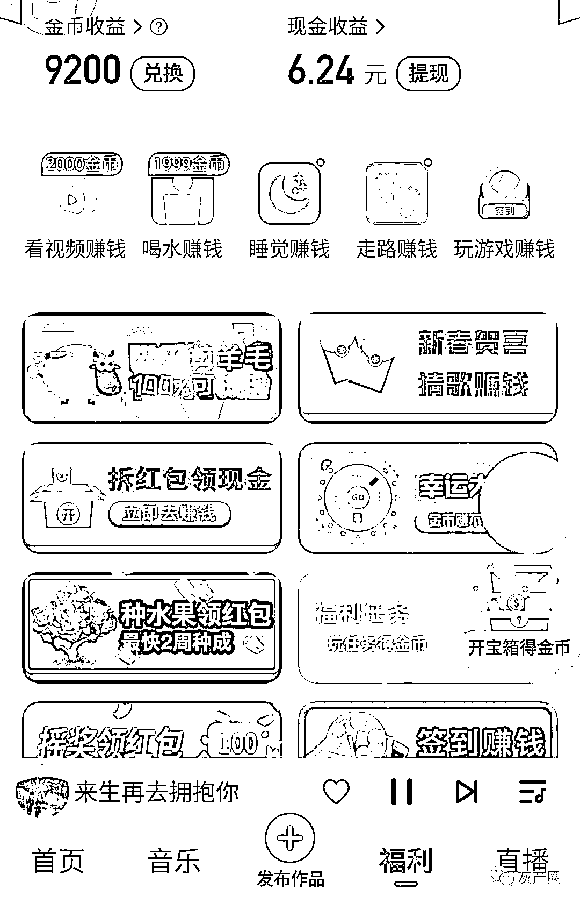
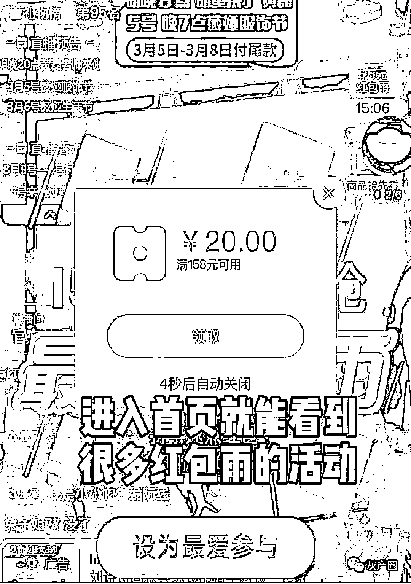
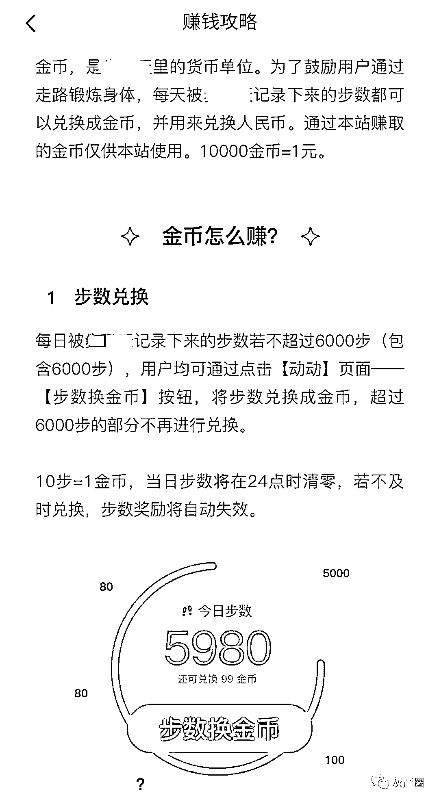
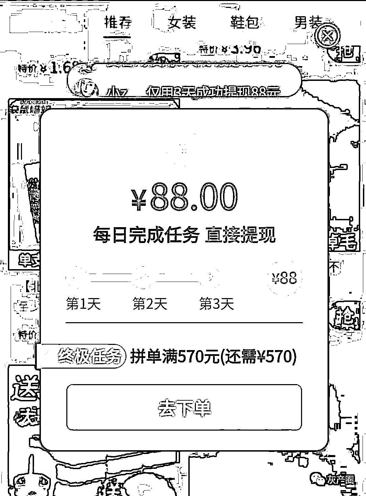
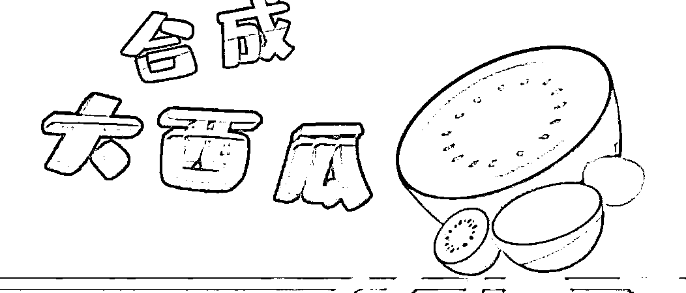

# 刷下手机就赚钱？你正在变成它们的“韭菜”…

> 原文：[`mp.weixin.qq.com/s?__biz=MzIyMDYwMTk0Mw==&mid=2247515818&idx=5&sn=920e0172fd3b03b19fbfeb608f0cccee&chksm=97cb7592a0bcfc8413fc73c2f85e65f0007b5aebf90132a156a6773b26be2f9e7667ce2a52d1&scene=27#wechat_redirect`](http://mp.weixin.qq.com/s?__biz=MzIyMDYwMTk0Mw==&mid=2247515818&idx=5&sn=920e0172fd3b03b19fbfeb608f0cccee&chksm=97cb7592a0bcfc8413fc73c2f85e65f0007b5aebf90132a156a6773b26be2f9e7667ce2a52d1&scene=27#wechat_redirect)

  看视频赚钱、玩游戏赚钱、

喝水赚钱、睡觉赚钱、走路赚钱……

居然有这么好赚的钱？

如今，不少老年人沉迷于

刷手机完成“赚钱任务”，

然而实际上套路多多！

越来越多老年人

正沦为网络江湖的“韭菜”。

强制看广告 诱导乱下载

“猜歌名就能领福利赚钱！”退休的老朱在家刷手机时，偶然发现了这样一则广告——只要下载 APP，猜对 50 首歌，就能提现。 

“50 首歌有什么难的？”老朱一开始很顺利，每猜对一首歌，系统都会显示老朱获得了 1 到 2 块钱。但很快困难就出现了。当歌曲猜错时，系统就会强制播放一段广告；即使猜对了，每猜对三四首歌，系统同样会播放一段广告。 

不知道同样的广告看了多少遍，老朱磕磕绊绊地终于把 50 首歌猜完。系统显示，可提现的金额达到了 93 元，但就在点击提现键之后，系统却显示一次居然只能提现 0.3 元！生气的老朱想要找客服理论，发现根本找不到客服通道。更让老朱郁闷的是，那好不容易赚来的 0.3 元声称 10 分钟就会转到微信，可老朱也一直都没有收到。

所谓的赚钱 APP 几乎都是强制看广告

被广告“轮番轰炸”的还有 68 岁的徐淑华。“名义是每隔一段时间喝水打卡赚金币，可真要领，还得看完 46 秒的广告视频，中间也不能退出。” 

徐淑华原本打算用一款走路赚钱的 APP 督促自己锻炼身体，可一看规则，并不是“走得越多赚得越多”，“每天能兑换的步数不超过 6000 步，对应下来就是不超过 600 金币，而 10000 金币才能兑换 1 元，这样算来哪怕天天走满，17 天才能攒够 1 元？” 

所谓的走路赚钱，实则规则苛刻

**提现门槛高 读取信息多**

前两天，白阿姨在某购物 APP 上发现了一个领 88 元红包的活动。点进去，系统就显示白阿姨“手气很好”，已经获得 70 多块钱，再根据指示往下操作，就可以领走全部现金。

“浏览商品页面 60 秒就能加快提现”“陪财神玩游戏就能加快提现”刚开始的几个任务比较简单，白阿姨的提现账户很快涨到 80 多元，可之后，系统发布了必须要在当前页面下单买东西的任务。

虽然不太愿意买，但一想到离 88 元就差几块钱，白阿姨还是按照规则，连续两天都下单完成任务，却发现第三天的任务是要买足 570 元的东西才能获得 88 元现金，她顿时有种上当受骗的感觉。

为了获得 88 元红包，居然要买够 570 元的商品

更让人气愤的是，忙活半天没把钱提出来，还可能把自己的信息给“卖”了。在安装一款宣称走路赚钱的 APP 时，屏幕上弹出需要选择是否允许获取手机号、IMEI、IMSI，甚至读取设备上的照片及文件。

**抽奖套路深 申诉退回难**

不久前，一款“合成大西瓜”的小游戏爆红。但游戏结束后弹出的广告页面，以“抽奖”为诱饵，声称付款 19.9 元可得到 100 元话费，遭到大量用户投诉。

详情点击下方标题/照片

## 还有这种套路…8000 万人玩过的"合成大西瓜"，竟是"做局骗财"？

类似套路在网络中并不少见。由于老年人接触智能手机相对较晚，对于网上信息难辨真伪，面对“数字鸿沟”往往倍感无助，而通常又会把钱看得很重，结果很容易被一些噱头诱导或欺骗，落入某些 APP 设下的圈套。

我们觉得要想减少此类事件，除了提醒老年人多加防范以外，还需要相关部门完善标准，加强监管、严厉查处。你有下载过此类 APP 赚钱吗？

来源：北京晚报

← 向右滑动与灰产圈互动交流 →

