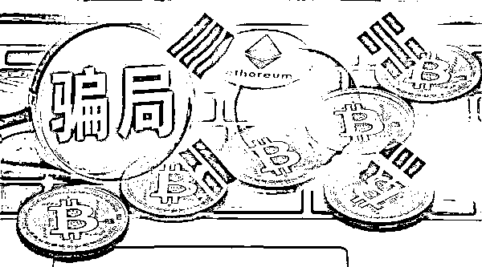
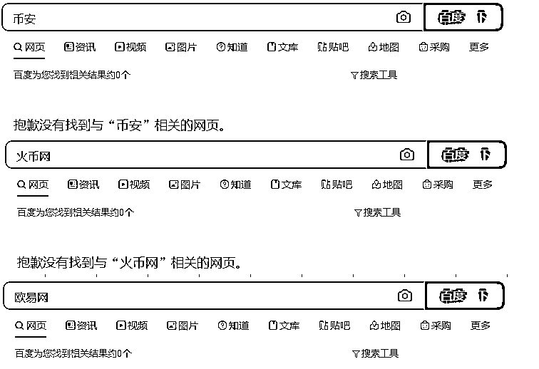
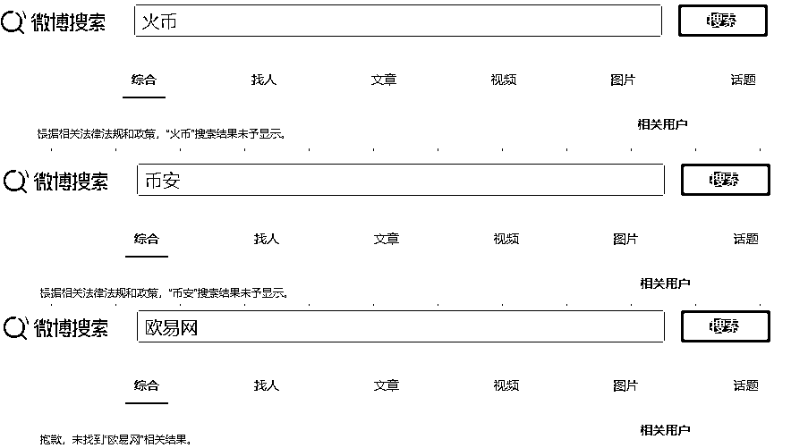
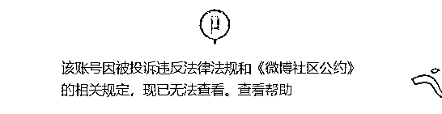

# 震惊！6.9 万人被骗 221 亿，不少老年人中招！

> 原文：[`mp.weixin.qq.com/s?__biz=MzIyMDYwMTk0Mw==&mid=2247515818&idx=6&sn=227727a03daef2e056bf258c6858e312&chksm=97cb7592a0bcfc848a90658edb82e49118801cbcf8d4005eafcdec7976d69003e126c23bc547&scene=27#wechat_redirect`](http://mp.weixin.qq.com/s?__biz=MzIyMDYwMTk0Mw==&mid=2247515818&idx=6&sn=227727a03daef2e056bf258c6858e312&chksm=97cb7592a0bcfc848a90658edb82e49118801cbcf8d4005eafcdec7976d69003e126c23bc547&scene=27#wechat_redirect)

诈骗、洗钱、价格操纵……虚拟货币市场乱象丛生，而“山寨币”大行其道，也让普通民众成为被收割的目标。

近日，韩国曝出一桩打着虚拟货币幌子的庞氏骗局，6.9 万人被骗了 3.85 万亿韩元，约合人民币 221 亿元。其中，不少受骗者是老年人。

一家名叫“V Global”的公司声称运营虚拟货币交易平台，劝说人们在该平台开户投资，并承诺投资者可在短时间内收获几倍回报。一名韩国警官说：“这看起来是一桩庞氏骗局。我们正在进一步调查，预期会发现更多受骗者。”

值得关注的是，6 月 10 日，在第十三届陆家嘴论坛上，中国银保监会主席郭树清在视频致辞中表示，要时刻警惕各种变换花样的“庞氏骗局”。当下，各种以高息回报为诱饵，打着所谓的金融科技、互联网金融等旗号的骗局层出不穷，其实质都是击鼓传花式的非法集资活动。大家一定要牢记，天上不会掉馅饼，宣扬“保本高收益”就是金融诈骗。

据了解，庞氏骗局是指以承诺高额回报骗取投资者资金，并将新加入投资者的资金用于支付老客户投资回报，却几乎不从事实际投资。这种金字塔式累积资金的骗术在 20 世纪 20 年代因行骗人查尔斯·庞齐而得名。

6.9 万人被骗 221 亿元

虚拟货币市场乱象丛生，暴涨暴跌的价格，以及马斯克等网红的带货，还有坊间流传的一些币圈“造富神话”，让炒币进入普通民众的视野，不少人抱着一夜暴富的心态冲了进去，结果却损失惨重，一夜报“负”。

同时，“山寨币”大行其道，不少虚拟币公司打着“虚拟货币能发横财”的旗号，发行各种虚拟货币。缺乏辨别能力的投资者，正成为它们的围猎目标。

近日，韩国曝出一桩打着虚拟货币幌子的庞氏骗局。初步调查显示，大约 6.9 万人合计被骗 3.85 万亿韩元（约合 221 亿元人民币），其中不少受骗者是老年人。

新华社援引韩国《中央日报》报道称，韩国警方频繁接到来自各地的相关举报，于上月在全国范围内就此案启动调查。京畿道警方 7 日披露，罪魁祸首据信是一家名叫“V Global”的公司，其首席执行官以及大约 70 名员工正在接受警方调查。

警方说，这家公司声称运营虚拟货币交易平台，劝说人们在该平台开户投资，最低投资额为 600 万韩元（约合 3.4 万元人民币），并承诺投资者可在短时间内收获几倍回报。

一名警官说：“这看起来是一桩庞氏骗局。我们正在进一步调查，预期会发现更多受骗者。”不过，由于许多受骗者、尤其是老年人迟迟不肯报案，警方调查面临不小难度。

一名 40 多岁男子说，他的母亲被骗投资 1300 万韩元（约合 7.5 万元人民币），“我劝她报警，但她总觉得能把钱拿回来，所以拒绝报警。据我所知，还有许多像她这样的老年人上当，‘虚拟货币’对这些老年人来说是新玩意儿”。

这名男子说，那家诈骗公司最近还试图让他母亲在一份文件上签字，文件内容是声明签字人没有受骗上当。“那家公司不断劝说投资者别着急，再等等（投资）结果。”这样一来投资者存有侥幸心理，不太愿意报警。

**一名五旬妇人说：“有个熟人告诉我这个投资机会，我就投了大约 6000 万韩元（约合 34.4 万元人民币）……现在我想报警，但是她劝我再等等，等赚回钱再说。当我又表达疑虑，她质问我是不是信不过跟她的交情。于是，我一直没有报警。”**

郭树清：时刻警惕各种变换花样的“庞氏骗局”

据新华社报道，大量虚拟币公司打着“虚拟货币能发横财”的旗号，发行各种虚拟货币。幻想一夜暴富的投资者趋之若鹜，深陷庄家和吹鼓手编织的幻梦，成为“山寨币”的受害者。如雷达币、KUN、火神币等虚拟币，通过嘘寒问暖拉老年人投资，利用老年人有退休金但嫌银行利息低的心理，不断编织创富神话，引诱他们购买“山寨币”“空气币”。虚拟货币爆款之一的英雄链（HEC），其网络诈骗案的受害人达数百万人，涉案资金达 3 亿余元。

6 月 10 日，在第十三届陆家嘴论坛上，中国银保监会主席郭树清在视频致辞中表示，要时刻警惕各种变换花样的“庞氏骗局”。

郭树清表示，当下，各种以高息回报为诱饵，打着所谓的金融科技、互联网金融等旗号的骗局层出不穷，其实质都是击鼓传花式的非法集资活动。大家一定要牢记，天上不会掉馅饼，宣扬“保本高收益”就是金融诈骗。要自觉提高警惕，增强风险防范意识和识别能力，远离各类非法金融活动。

郭树清还表示，要切实防范金融衍生品投资风险。在前期发生风险的金融衍生品案例中，有大量个人投资者参与投资。从成熟金融市场看，参与金融衍生品投资的主要是机构投资者，非常不适合个人投资理财。道理在于，受不可控制甚至不可预测的多种因素影响，金融衍生品价格波动很大，对投资者的专业水平和风险承受能力具有很高要求。普通个人投资者参与其中，无异于变相赌博，损失的结果早已注定。

“那些炒作外汇、黄金及其他商品期货的人很难有机会发家致富，正像押注房价永远不会下跌的人最终会付出沉重代价一样。”郭树清说。

我国对虚拟货币监管加码，币安、火币等被屏蔽

我国监管部门早已意识到虚拟货币交易炒作带来的风险，及时预警，多次出台举措予以整治。2013 年，中国人民银行等五部门就联合发布《关于防范比特币风险的通知》，要求各金融机构和支付机构不得开展与比特币相关的业务。2017 年央行等七部门叫停各类代币发行融资，并开展专项整治。随后，我国的虚拟货币交易平台和 ICO 交易平台基本实现无风险退出，人民币交易的比特币全球占比一度降至不足 1%。

不过，今年以来，虚拟货币交易炒作活动有所反弹，从 5 月 18 日开始，我国又密集释放对于加密货币的监管政策：

5 月 18 日，内蒙古发改委设立虚拟货币“挖矿”企业举报平台；同日，中国互联网金融协会、中国银行业协会、中国支付清算协会发布“关于防范虚拟货币交易炒作风险的公告”。公告指出，虚拟货币无真实价值支撑，价格极易被操纵，相关投机交易活动存在虚假资产风险、经营失败风险、投资炒作风险等多重风险。广大消费者要增强风险意识，树立正确的投资理念，不参与虚拟货币交易炒作活动，谨防个人财产及权益受损。

5 月 21 日，国务院金融委要求打击比特币挖矿和交易行为，坚决防范个体风险向社会领域传递。值得注意的是，这是金融委首次提出打击比特币挖矿和交易行为。

5 月 26 日，内蒙古发改委发布关于坚决打击惩戒虚拟货币“挖矿”行为八项措施征求意见。对工业园区、数据中心、自备电厂等主体为虚拟货币“挖矿”企业提供场地、电力支持的，核减能耗预算指标；对存在故意隐瞒不报、清退关停不及时、审批监管不力的，依据有关法律法规和党内法规严肃追责问责。

6 月 9 日，青海省工信厅下发《关于全面关停虚拟货币“挖矿“项目的通知》提出，对有关虚拟货币挖矿行为开展清理整顿。

同样是在 6 月 9 日，中国支付清算协会发布“关于加强行业信息共享 有效防范支付风险的提示”，再次提示虚拟货币的风险。上述风险提示指出，利用虚拟货币等形式实施违法犯罪活动逐渐上升，因其交易具有匿名性，便捷性和全球性，逐渐成为跨境洗钱的重要通道。同时，已出现使用虚拟币作为赌博跑分媒介的模式。

当天，在微博和百度上，输入“火币”“币安”“欧易”等关键词时，弹出的是“搜索结果未予显示”等提示。截至券商中国记者发稿，上述关键词仍被百度、微博屏蔽。

 

稍早之前的 6 月 5 日，不少币圈大 V 的微博账号被封，包括交易员小侠、肥宅比特币、八哥谈币、超级比特币、区块链威廉等，这些账号的粉丝多在十万以上。相关页面显示，账号因被投诉违反法律法规和《微博社区公约》的相关规定，无法查看。

 

加密货币成黑客勒索“工具”

随着虚拟货币交易炒作活动的反弹，利用虚拟货币等形式实施违法犯罪活动逐渐上升。

加密货币市场的欺诈活动日益猖獗。据《华尔街日报》报道，美国联邦贸易委员会(FTC)统计的数据显示，在 2020 年第四季度和 2021 年第一季度的六个月中，美国消费者因加密货币骗局损失了近 8200 万美元，是去年同期的 10 倍。根据 FTC 的报告，最容易被加密货币投资诈骗侵害的群体是 20-49 岁的美国人。

**另据统计，截至去年 12 月底，全球范围因加密货币诈骗遭受的损失近 40 亿美元，诈骗手段包括“空气币”诈骗、社交媒体诈骗、加密劫持、非法应用程序等。今年以来，也有不少知名企业被勒索软件攻击并索要比特币等加密货币。**

当地时间 6 月 9 日，全球最大肉类供应商 JBS 宣布，已向黑客支付了价值 1100 万美元（（约合人民币 7028 万元））的比特币赎金。此前，因遭受黑客攻击，JBS 一度关闭了全美工厂，导致牛肉、猪肉产量大跌，甚至危及美国肉类供应链。

今年 5 月 7 日，美国最大燃油管道运营商科洛尼尔管道运输公司遭遇黑客攻击，被迫关闭整个管道系统。在遭到黑客攻击的数小时后，该公司向黑客组织支付了 75 枚比特币（当时价值 440 万美元，约合人民币 2814 万元）。

不过，当地时间 6 月 7 日，美国司法部表示，目前已追回科洛尼尔管道运输公司上个月付给黑客组织的 63.7 枚比特币，价值约 230 万美元。

消息发布后，币圈为之震动，有评论表示，如果 FBI 是通过技术手段破解了秘钥，就等于说，比特币底层逻辑被破解，底层逻辑便会不复存在，比特币等加密货币的抗审查性受到了挑战。随后，大量投资者选择抛售、做空比特币，当天比特币一度暴跌近 10%，其他加密货币也集体暴跌。

来源：券商中国，中国基金报

← 向右滑动与灰产圈互动交流 →

