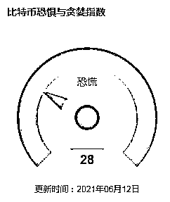
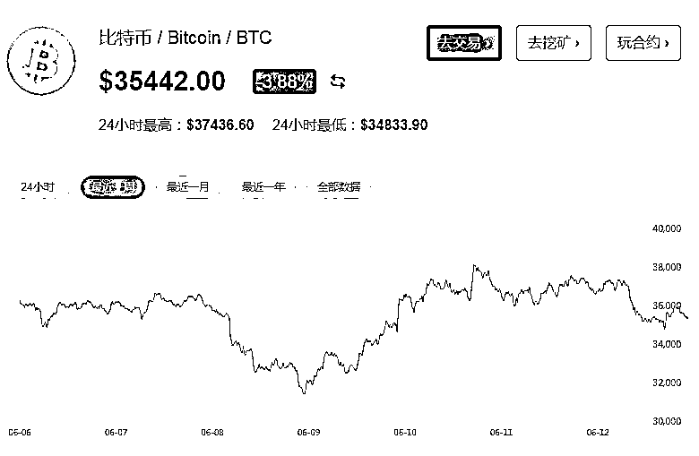
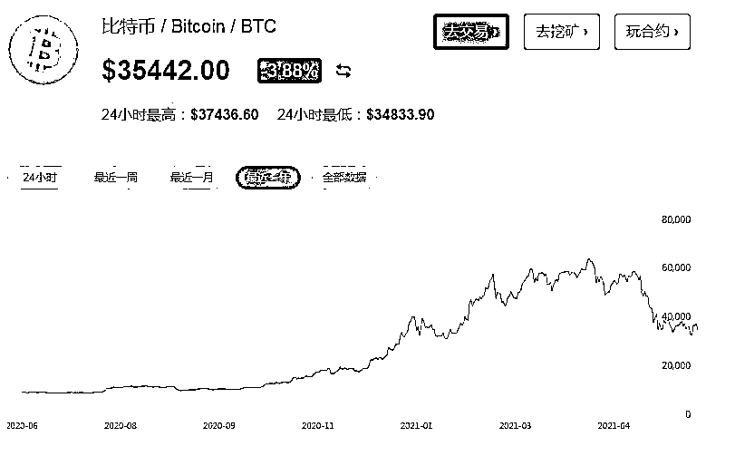
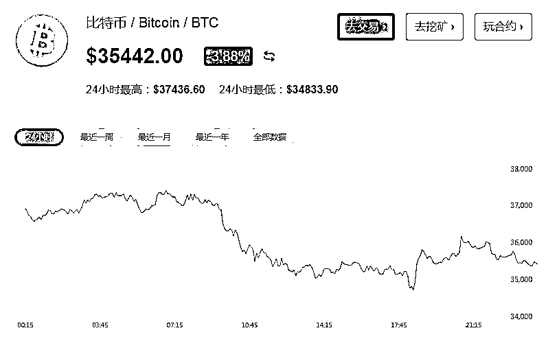

# 多国“围剿”虚拟货币

> 原文：[`mp.weixin.qq.com/s?__biz=MzIyMDYwMTk0Mw==&mid=2247515871&idx=2&sn=0e845c07b8c141e49940e124f14fba71&chksm=97cb75e7a0bcfcf199548ce616533318cef41506cb5d2822d576c751c49cb51ffbf1d0445f0b&scene=27#wechat_redirect`](http://mp.weixin.qq.com/s?__biz=MzIyMDYwMTk0Mw==&mid=2247515871&idx=2&sn=0e845c07b8c141e49940e124f14fba71&chksm=97cb75e7a0bcfcf199548ce616533318cef41506cb5d2822d576c751c49cb51ffbf1d0445f0b&scene=27#wechat_redirect)

“涨得有多疯狂，跌得就有多绝望。”如今，用这句话形容坐上了比特币“过山车”的炒币者们的心情，再合适不过。 

近期，虚拟货币价格剧烈波动再次引发广泛关注。从去年年末开启疯狂上涨模式的比特币曾让无数抛币者后悔不已，但今年 4 月涨至近 65000 元/枚后，比特币的价格从历史最高位一路下跌，到目前的 35000 美元/枚左右，跌幅近半。

正是这种疯狂的行情，这种“野蛮生长”的态势，让不少人滋生出一夜暴富梦。

而民众的金融知识水平普遍有限，大多数人并不了解虚拟货币（加密货币）为何物。而该领域缺乏监管和价格剧烈波动也让不法分子嗅到了机会。因此，除了多数投资者在虚拟货币的价格波动中赔得倾家荡产外，虚拟货币还成为了圈钱诈骗的重灾区，不少人都在高收益的诱惑之下，掉进了别人精心布局的陷阱。

2021 年陆家嘴论坛上，央行党委书记、银保监会主席郭树清表示，那些炒作外汇、黄金及其他商品期货的人很难有机会发家致富，正像押注房价永远不会下跌的人最终会付出沉重代价一样。博鳌亚洲论坛副理事长周小川表示，不要老想着一夜暴富，不要从事过度的投机活动。炒币更是如此，这种过度投机的市场不仅很难有发家致富的机会，稍不留神便可能万劫不复。

周小川还提到，加密货币从原来的设计思想看，还是有可能成为为实体经济服务的有用工具，例如在支付领域中起到一定作用。前期来看，加密货币设计有些不足，比如每秒钟所处理的交易笔数还不够高、占用较多网络资源和处理能力、去中心化强调去监管等。有些加密货币的参与者把它看作赚快钱的手段，就会把加密货币搞成数字资产。现在来看，一些加密货币想回支付领域已经失去了机会，已经不太合适了。

虚拟货币骗局层出不穷

我国国家区块链漏洞库发布的报告指出，据不完全统计，2020 年度区块链领域发生的安全事件数量达 555 起，相比 2019 年安全事件增长了近 240%，主要包括诈骗/钓鱼事件 204 起、勒索软件事件 143 起、交易平台安全事件 31 起，所造成的经济损失高达 179 亿美元，较 2019 年增长 130%。

暴涨暴跌的价格，还有马斯克等大佬级网红带货，虚拟货币市场乱象丛生，“山寨币”大行其道，不少虚拟币公司打着“虚拟货币能发横财”的旗号，发行各种虚拟货币。

韩国《中央日报》报道，近日，韩国一桩打着虚拟货币幌子的庞氏骗局曝光。京畿道警方 7 日披露，罪魁祸首是一家名叫“V Global”的公司，其首席执行官以及大约 70 名员工正在接受警方调查。初步调查显示，大约 6.9 万人合计被骗 3.85 万亿韩元（约合 221 亿元人民币），其中不少受骗者是老年人。可叹的事，不少人相信自己的钱能拿回来，不愿意报警。

据《华尔街日报》报道，美国联邦贸易委员会（FTC）数据显示，在 2020 年第四季度和 2021 年第一季度，美国消费者报告的加密货币骗局相关损失总计近 8200 万美元，同比增加逾九倍。

多国“围剿”虚拟货币

德银分析师 Marion Laboure 在最新的报告中写到，比特币以及其他少数虚拟货币已经穿越了广泛使用的“临界线”，无法再被忽视，但因威胁到法定货币（法币）的地位，虚拟货币将会在越来越多的国家受到打压。Laboure 认为，2021 年下半年和 2022 年年初可能是全球虚拟货币的转折点。

5 月 18 日，中国互联网金融协会、中国银行业协会、中国支付清算协会三部门联合发布关于防范虚拟货币交易炒作风险的公告。公告明确指出，近期虚拟货币价格暴涨暴跌，虚拟货币交易炒作活动有所反弹，严重侵害人民群众财产安全，扰乱经济金融正常秩序。

5 月 21 日，国务院金融稳定发展委员会（金融委）召开第五十一次会议，会议要求要坚决防控金融风险，打击比特币挖矿和交易行为，坚决防范个体风险向社会领域传递。

巴塞尔银行监管委员会提议将虚拟货币在银行资本中列为最高风险类别，增加其风险权重到 1250%。

英国金融行为监管局警告称，相当多的虚拟货币公司未能满足英国的反洗钱要求。英国监管部门提示投资虚拟货币通常会承担非常高的风险，并称“如果消费者投资于这类资产，他们应该准备好赔光所有的钱”。

美国财政部称将要求单笔等值 1 万美元以上的虚拟货币交易必须上报至美国国税局。

伊朗发布挖矿禁令严打加密货币。6 月 12 日，伊朗总统哈桑·鲁哈尼表示，该国需要为数字货币和相关活动建立一个法律框架，以保护国家利益，同时确保数字货币挖矿仍然被禁止。鲁哈尼呼吁尽快进行监管，并表示这些措施对于保护投资者免受数字货币交易风险的影响是必要的。

同日，纳米比亚央行 (BON) 警告投资加密货币的个人，如果他们被骗，该银行不会受理他们的投诉。该机构称，由于其职责目前不包括数字货币，它缺乏跟进此类投诉的“法律权力”。与此同时，在回应当地一家媒体的质询时，纳米比亚央行发言人 Kazembire Zemburuka 声称，作为纳米比亚唯一的法定货币发行机构，BON 不承认、支持和推荐公众持有、使用和交易加密货币。然而该发言人透露，尽管对数字货币持怀疑态度，但纳米比亚央行目前正在对加密货币进行进一步的研究。媒体报道称，一旦这项额外的研究完成，BON 将在必要时更新其立场。

“挖矿”遭遇强监管

据中国支付清算协会官网 5 月 18 日消息，近期，虚拟货币价格暴涨暴跌，虚拟货币交易炒作活动有所反弹，严重侵害人民群众财产安全，扰乱经济金融正常秩序。为进一步贯彻落实中国人民银行等部门发布的《关于防范比特币风险的通知》《关于防范代币发行融资风险的公告》等要求，防范虚拟货币交易炒作风险，中国互联网金融协会、中国银行业协会、中国支付清算协会联合就有关事项发布公告。公告指出，虚拟货币是一种特定的虚拟商品，不由货币当局发行，不具有法偿性与强制性等货币属性，不是真正的货币，不应且不能作为货币在市场上流通使用。

另外，虚拟货币挖矿最重要成本是“矿机”运行所需的电费，因此“矿场”聚集在电力充足且电费便宜的地区，例如国内火电丰富的新疆、内蒙古，以及水电丰富的云南、四川、贵州。火电的能耗大，与近期碳达峰、碳中和等国家政策相违背。挖矿不仅消耗大量电能，更加剧了二氧化碳的排放量。据了解，去年挖矿产生了 6900 万吨二氧化碳，占全球排放量的 1%，20 年内可将全球气温提高 2℃。

云南省能源局办公室人士 6 月 12 日确认，根据通知要求及时组织各用电部门开展联合检查，在今年 6 月底完成比特币挖矿企业用电清理整顿，严肃查处比特币挖矿企业依托发电企业、未经许可私搭私接用电、逃废国家输配电费、基金以及附加牟利的违法行为，一经发现，立即中止供电；严肃查处发电企业未经许可，利用所发电量私自向比特币挖矿企业供电谋取不正当利益的违法行为；严肃查处比特币挖矿企业用电安全隐患，一经发现，立即责令关停整改，“目前比特币挖矿清理整顿进展需等进一步回访才能确定”。

6 月 9 日，网传新疆昌吉回族自治州发展和改革委员会发布了《关于立即对虚拟货币“挖矿”行为企业进行停产整顿的通知》，要求新疆准东国家经济技术开发区管委会立即责令虚拟货币“挖矿”企业于该日 14 时之前全部停产整顿。

此外，网传青海省工信厅也下发了《关于全面关停虚拟货币“挖矿”项目的通知》，严禁各地区立项、批复各类虚拟货币“挖矿”项目，对现有的各类虚拟货币“挖矿”项目全面关停，还要求坚决查处纠正以大数据、超算中心等名义立项但从事虚拟货币“挖矿”的项目主体、制止向虚拟货币“挖矿”行为提供场地、电力支持，发布时间同样为 6 月 9 日。

6 月 2 日，为摸底四川虚拟货币“挖矿”相关情况，国家能源局四川监管办公室已召开小范围调研座谈会，进行关停虚拟货币“挖矿”对今年四川弃水电量的影响分析。

5 月 25 日，内蒙古发改委发布《关于坚决打击惩戒虚拟货币“挖矿”行为八项措施（征求意见稿）》，根据八类对象分别提出不同的打击惩戒策略。

萨尔瓦多宣布比特币成为法币

在各国“围剿”虚拟货币之际，本周三，萨尔瓦多宣布比特币成为法币，这也是世界上第一个赋予虚拟货币法定地位的国家。萨尔瓦多总统布克莱（Nayib Bukele）宣布，萨尔瓦多国会以绝对多数赞成票通过《比特币法》。

“本法律的目的是将比特币规定为具有自由权利的不受限制的法定货币，其在任何公共或自然人或法人需要进行的交易中都不受限制。”《比特币法》规定，比特币和美元之间的汇率将由市场自由确定。

6 月 12 日，比特币矿业巨头 Bitfury 副董事长 George Kikvadze 发推表示：“如果有廉价或搁浅的能源，呼吁所有国家的领导人，效仿萨尔瓦多总统的做法，建立合资企业来开采比特币，这可以帮助你摆脱国际货币基金组织（IFM）的贷款，改善公民的生活。”

不知道是不是受此消息影响，比特币跌幅收窄，截至记者发稿，一枚比特币的价格由此前跌破 32000 美元回升至 35000 美元之上。

另外，加密货币交易所超乎想象的暴利惹得其他交易所羡慕不已，富途证券、老虎证券宣布计划推出加密货币交易平台。数据显示，美国最大的加密货币交易所 Coinbase 今年一季度净利润为 7.715 亿美元，日均 857.2 万美元；全球最大的加密货币交易所币安今年一季度利润为 30 亿美元，换算成人民币为 192 亿元。

来源：期货日报

← 向右滑动与灰产圈互动交流 →

