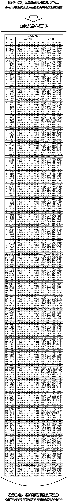

# 失联未归、久劝不回，202 人银行账户被冻结，亲属银行账户被提高风险等级

> 原文：[`mp.weixin.qq.com/s?__biz=MzIyMDYwMTk0Mw==&mid=2247515871&idx=3&sn=be2a8c3af507f6bd5e89805c858b3b25&chksm=97cb75e7a0bcfcf17f604ace47da6dca311b0cabbf12763ccb96cec6589619ef86a67b7daa49&scene=27#wechat_redirect`](http://mp.weixin.qq.com/s?__biz=MzIyMDYwMTk0Mw==&mid=2247515871&idx=3&sn=be2a8c3af507f6bd5e89805c858b3b25&chksm=97cb75e7a0bcfcf17f604ace47da6dca311b0cabbf12763ccb96cec6589619ef86a67b7daa49&scene=27#wechat_redirect)

  6 月 8 日，公众号**长汀公安**的一则消息，对于滞留缅北地区的长汀籍人员中失联未归、甚至久劝不回人员，由县反诈联席办牵头，长汀县公安局、人民银行长汀支行、龙岩银保监分局长汀监管组联合开展对外滞留境外汀籍人员相关银行账户进行冻结，并采取了提高亲属银行账户风险等级、限制其非柜面业务等级等强制措施。

截止 2021 年 6 月 6 日共对滞留缅北汀籍人员 202 人的 972 个银行账户给予冻结，同时提高其亲属 1622 个银行账户的风险等级、限制其亲属 2416 个银行账户非柜面业务。

以下涉及人员在 6 月 30 日前入境后回户籍所在地派出所如实说明情况的将视情给予解封

对于非法滞留缅北地区汀籍人员，6 月 11 日，公众号长汀公安又一则消息，要求凡非法滞留缅北的汀籍人员，在 2021 年 6 月 30 日前主动入境回国并说明情况的，根据有关规定，视情给予从轻、减轻处罚。

逾期未回国的，县反诈联席办将联合县教育局，根据“十二个一律”的惩戒措施，从 2021 年秋季学期入学前起，对仍然滞留缅北涉诈高危人员子女的城区学校就学资格进行严审，其子女在新生录取和开学时，父母双方（凭身份证、户口本）未共同到学校当面申请提交入学就读手续或面谈注册报名，**一律不得安排在城区中、小学及城区公办幼儿园就读**。

来源：长汀公安

← 向右滑动与灰产圈互动交流 →

