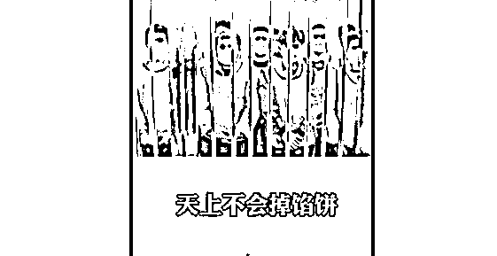
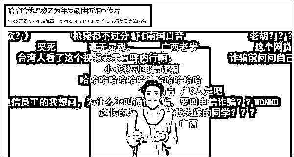
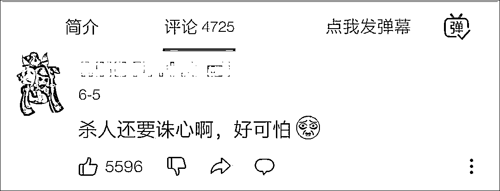
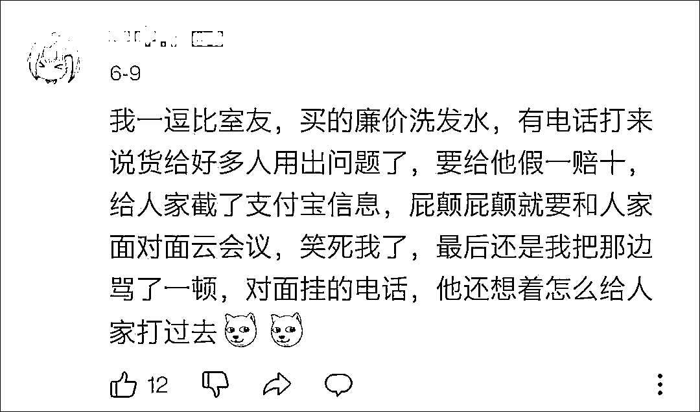
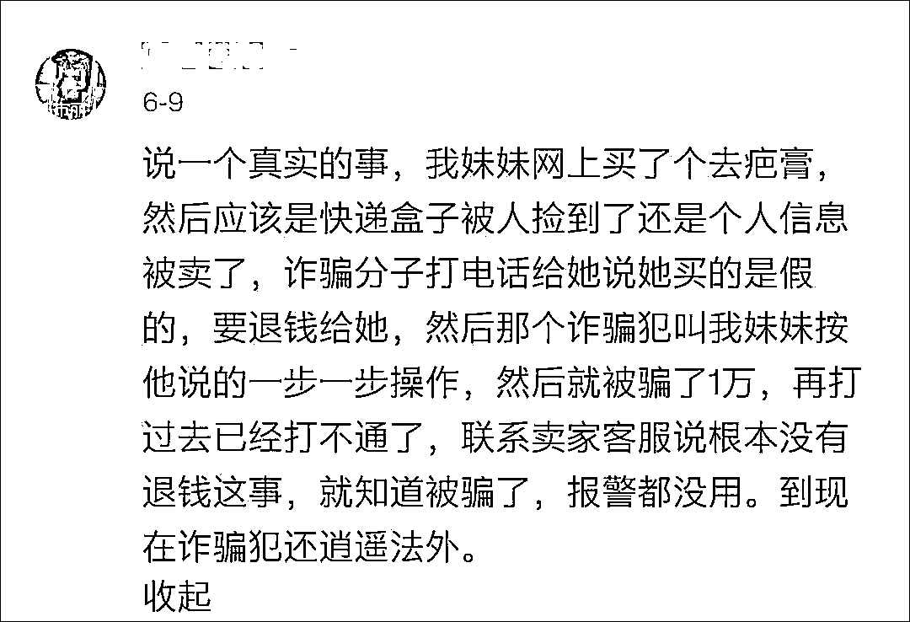
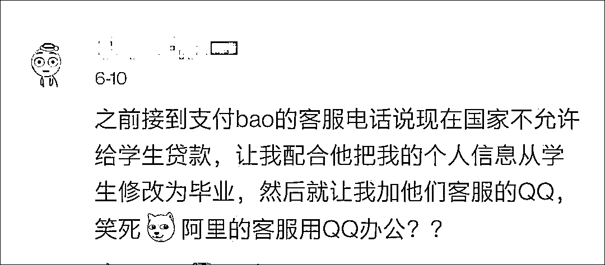
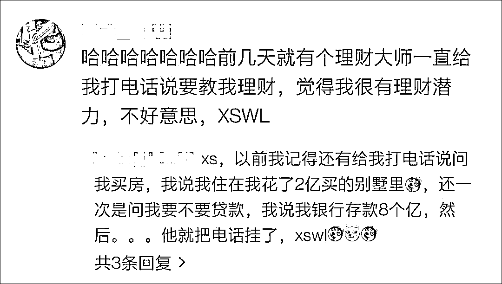
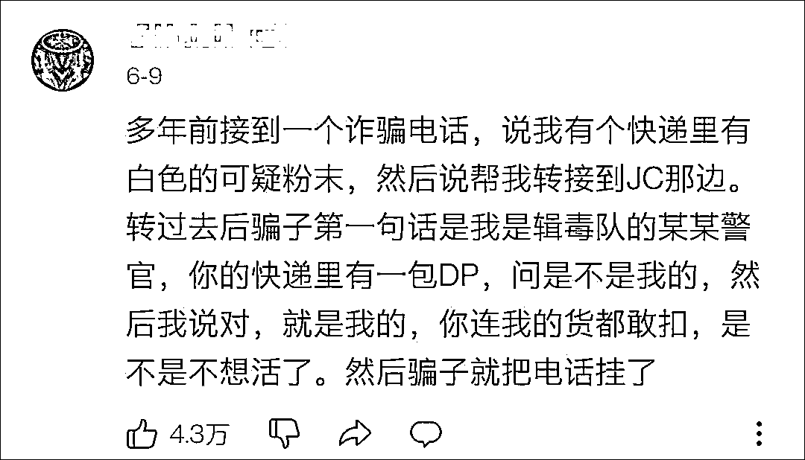

# 最硬核反诈骗宣传，句句直击灵魂

> 原文：[`mp.weixin.qq.com/s?__biz=MzIyMDYwMTk0Mw==&mid=2247515871&idx=4&sn=aee1952afd99ab7df9ffe71b29194196&chksm=97cb75e7a0bcfcf1ccd48d2343c0648bb070e1a6172b0974cda24ac91edc29da28f22bb67f7d&scene=27#wechat_redirect`](http://mp.weixin.qq.com/s?__biz=MzIyMDYwMTk0Mw==&mid=2247515871&idx=4&sn=aee1952afd99ab7df9ffe71b29194196&chksm=97cb75e7a0bcfcf1ccd48d2343c0648bb070e1a6172b0974cda24ac91edc29da28f22bb67f7d&scene=27#wechat_redirect)

“点击陌生链接前先问问自己，查信息就查信息，为啥还要下载一丢东西？”

“网贷前问问自己，无抵押还有免息的贷款，为啥不干脆直接送钱给你？”

“裸聊前问问你自己，你的身材你的颜值，值不值得貌美如花的我不顾一切地与你坦诚相见？”……

继[反诈奶茶、反诈鸡蛋、扫码摸狗反诈](http://mp.weixin.qq.com/s?__biz=MzIyMDYwMTk0Mw==&mid=2247513491&idx=6&sn=0c6a65d13f77e926695deb2c7d66985a&chksm=97cb7eaba0bcf7bd617b5aa7719b1610842cb320cbab4f5f2a2735a1d28e0ca69f27b572a1f9&scene=21#wechat_redirect)以及[南京警方的“防范电信网络诈骗之不要裸聊”系列](http://mp.weixin.qq.com/s?__biz=MzIyMDYwMTk0Mw==&mid=2247509435&idx=2&sn=bc4d8a11bc176a3283c91e7cc338d4d5&chksm=97cb6e83a0bce7951ee4a07ee3f4e7ffccf03082d96b7db19622e3b38c84f72445f9cd819a86&scene=21#wechat_redirect)等各式各样的反诈宣传之后，合肥警方来了一拨最硬核的反诈宣传，他们直接让犯罪嫌疑人在线说法，灵魂发问。

[`v.qq.com/iframe/preview.html?width=500&height=375&auto=0&vid=y32521kgsj9`](https://v.qq.com/iframe/preview.html?width=500&height=375&auto=0&vid=y32521kgsj9)

来源：@合肥警方 

6 月 10 日，合肥市公安局官方微博@合肥警方 上传了一条反诈宣传视频，视频的主角，则是一群身穿囚服，手戴镣铐的诈骗嫌疑人。

据合肥警方介绍，2021 年 4 月 26 日，合肥警方打掉一个“杀猪盘”诈骗团伙，就安排犯罪嫌疑人现身说法，讲述防骗注意事项——“灵魂八问”：

“刷单前问问自己，动动手指就能赚钱的好事，为啥就能轮到你？”

“点击陌生链接前先问问自己，查信息就查信息，为啥还要下载一丢东西？”

“网贷前问问自己，无抵押还有免息的贷款，为啥不干脆直接送钱给你？”

“网恋前问问自己，人靓声甜的小姐姐，温柔帅气又有钱的小哥哥，还需要网恋吗？”

“裸聊前问问自己，你的身材你的颜值，值不值得貌美如花的我不顾一切地与你坦诚相见？”

“理财前问问自己，战无不胜的投资大师，为啥要苦口婆心地帮助非亲非故的你？”

“给领导转账前先问问自己，用自己的微信收受巨额资金，领导是不是嫌自己官儿干久了，不想干了？”

“收到‘逮捕令’时问问自己，警察抓你前，为啥还要提前通知你，是不是嫌工作不够刺激？希望你先跑，然后再来抓你？”

最后，这群诈骗嫌疑人齐聚铁窗内，对着镜头齐声劝诫：“天上不会掉馅饼，网上处处是陷阱，我们提醒正在看视频的你，不轻信不透露不转账，全民反诈，人人有责！”

这条反诈视频发布后，引发网友热议。

有 B 站网友将这条视频封为“年度最佳防诈宣传片。”

“笑死，拍得真好！”

有网友调侃：“虾仁猪心（杀人诛心）。”

有人已经总结出了防诈骗的终极奥义：“凡事先问问自己配不配。”

还有许多网友分享了自己遇到的各式各样的电信诈骗。

值得一提的是，请犯罪嫌疑人现身说法，合肥警方并不是第一这么操作了，此前就有“当电信诈骗分子说真话”、“裸聊敲诈团伙集体出镜说套路”等反诈骗宣传视频。

[`mp.weixin.qq.com/mp/readtemplate?t=pages/video_player_tmpl&action=mpvideo&auto=0&vid=wxv_1907975621977128962`](https://mp.weixin.qq.com/mp/readtemplate?t=pages/video_player_tmpl&action=mpvideo&auto=0&vid=wxv_1907975621977128962)

[`mp.weixin.qq.com/mp/readtemplate?t=pages/video_player_tmpl&action=mpvideo&auto=0&vid=wxv_1907873640746926083`](https://mp.weixin.qq.com/mp/readtemplate?t=pages/video_player_tmpl&action=mpvideo&auto=0&vid=wxv_1907873640746926083)

视频来源：合肥警方微信公众号 

来源：观察者网

← 向右滑动与灰产圈互动交流 →

