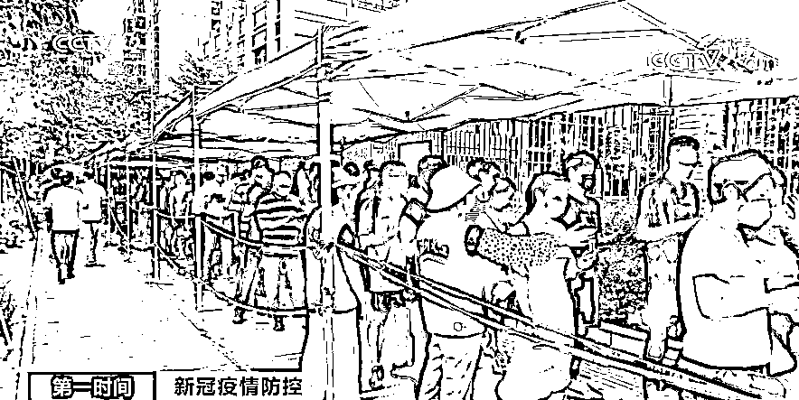
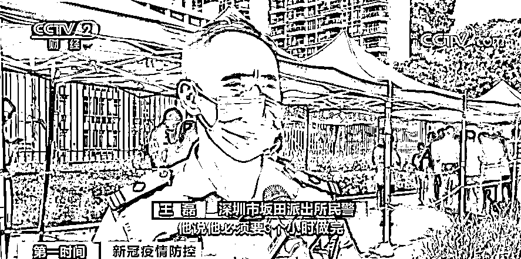
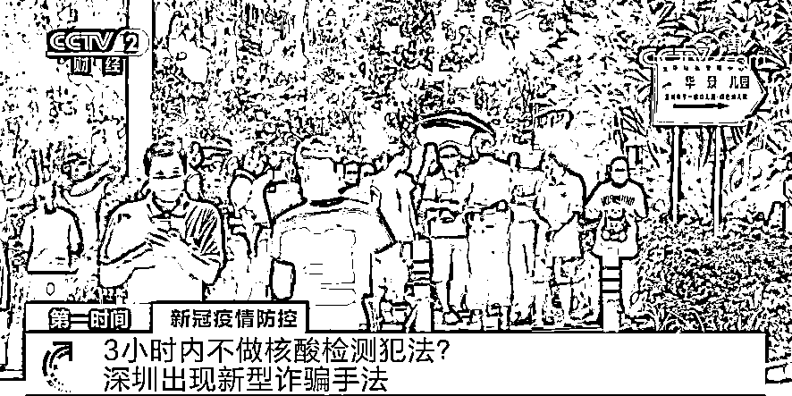
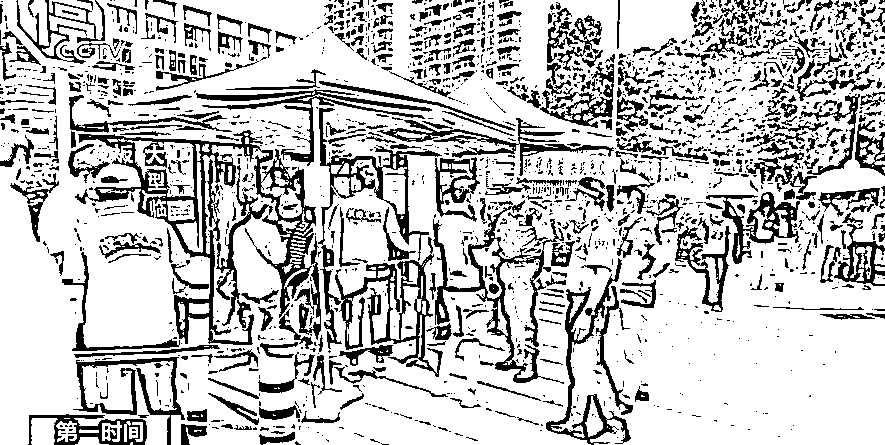

# 3 小时内不做核酸检测犯法？

> 原文：[`mp.weixin.qq.com/s?__biz=MzIyMDYwMTk0Mw==&mid=2247515871&idx=6&sn=341d662874ed33b408a6353ed2ea9ef0&chksm=97cb75e7a0bcfcf1494cdf4f0131d5f18b3fdf91bf57223d550c6265903a6b58b08691de2460&scene=27#wechat_redirect`](http://mp.weixin.qq.com/s?__biz=MzIyMDYwMTk0Mw==&mid=2247515871&idx=6&sn=341d662874ed33b408a6353ed2ea9ef0&chksm=97cb75e7a0bcfcf1494cdf4f0131d5f18b3fdf91bf57223d550c6265903a6b58b08691de2460&scene=27#wechat_redirect)

核酸检测、新冠疫苗接种是当下的热点，诈骗分子紧跟“潮流”，把一些不新鲜的诈骗套路换上“新装”重新登场，借着疫情实施诈骗。

**警方近日发现一种新型的诈骗手法，不法之徒将诈骗短信包装成防疫提示来行骗****。**

[`mp.weixin.qq.com/mp/readtemplate?t=pages/video_player_tmpl&action=mpvideo&auto=0&vid=wxv_1909089970602967043`](https://mp.weixin.qq.com/mp/readtemplate?t=pages/video_player_tmpl&action=mpvideo&auto=0&vid=wxv_1909089970602967043)

**△央视财经《第一时间》栏目视频**

近日，深圳居民邱先生慌张地来到核酸监测点，希望民警能安排他插队检测。

深圳市坂田派出所民警 王磊：我说做核酸要排队，**他说必须要 3 个小时做完，我问他为什么，他把手机的短信给我看，上面写着要求他在福田区莲花街道，3 小时内要把核酸做了，如果不做要承担法律责任。**

明明是龙岗区的居民，短信为什么会要求他到福田区呢？而且还必须要在 3 小时内做完检测。民警现场再次核对该短信，发现短信的后面还附有一条链接，要求按提示输入个人身份证、银行卡等信息。 

深圳市坂田派出所民警 王磊：**打开链接我就跟他说，链接需要输入个人资料，还有银行卡，我就果断跟他说“你先不要焦急不要慌，十有八九是诈骗”。**

据了解，**近期公安部已发布紧急预警，全国多地出现涉疫情骗局。**警方提示，无论是骗子冒用哪个机关的名义，骗局的最后一步一定是诱导填写银行账号、密码、手机验证码等或转账。大家切勿上当。

来源：央视新闻、中国警察网

← 向右滑动与灰产圈互动交流 →

