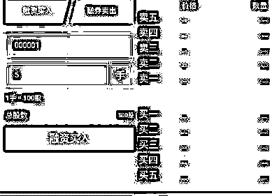
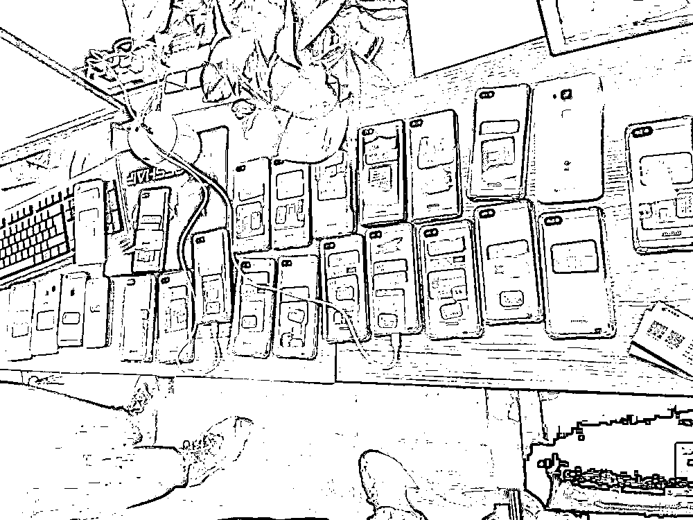
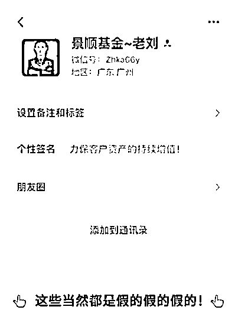
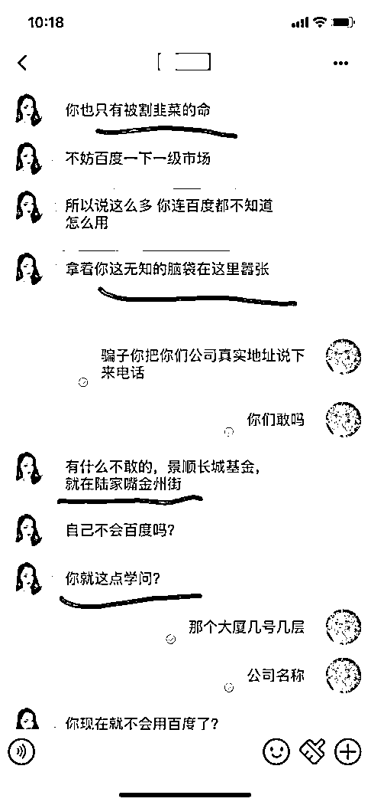
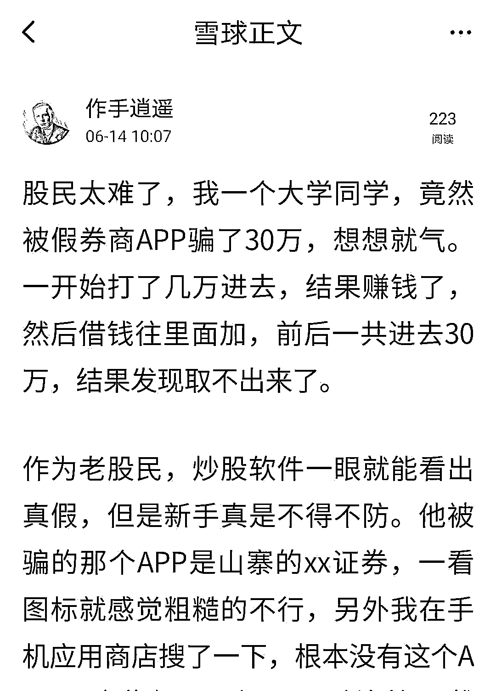

# 清 X 大学、中 X 大学毕业生组团作案，开发证券投资诈骗 APP，涉案金额过亿！

> 原文：[`mp.weixin.qq.com/s?__biz=MzIyMDYwMTk0Mw==&mid=2247515924&idx=1&sn=b2a121a5d52042dea017fef9463bc324&chksm=97cb742ca0bcfd3a6910a59623e9176bf67ecd2f8227f636c00c39d9e5015e0b072c3b4cf997&scene=27#wechat_redirect`](http://mp.weixin.qq.com/s?__biz=MzIyMDYwMTk0Mw==&mid=2247515924&idx=1&sn=b2a121a5d52042dea017fef9463bc324&chksm=97cb742ca0bcfd3a6910a59623e9176bf67ecd2f8227f636c00c39d9e5015e0b072c3b4cf997&scene=27#wechat_redirect)

有没有想过，你炒股投资的 APP 可能是假的？ 

骗子不可怕，就怕骗子有文化！日前，公安部网安局公布了一则大学毕业生组团开发投资诈骗类 APP，骗取投资人亿万钱财的案件，而犯罪的主角竟然多来自清 X 大学、中 X 大学等国内名校。警方查明，该犯罪团伙在实施犯罪中分裂出多个投资诈骗类 APP，可以做到“骗完一人即抛弃整个 APP”。

名校毕业，团伙成员实属高端人才

据公安部网安局报道，2020 年末，浙江宁波慈溪的刘女士经好友推荐，下载了一款名为“富强证券”的投资 APP。看着账户里不断上涨的数字，刘女士欣喜若狂。

图片来源：公安部网安局

于是在短短 10 天时间里，她不断加大投入，接连充值 18 万元。

然而，当她申请提现的时候，却发现无论如何也不能操作成功。又过了一阵子，竟然连 APP 也无法打开了。意识到自己受骗了，刘女士立马报了警。

接到报案后，网安民警立即与对方展开了一场没有硝烟的技术较量。

民警顺着网线溯源分析、追踪线索，发现对方的软件后台的确做得天衣无缝，一时很难追寻。

但再狡猾的狐狸也会露出马脚，最终民警成功锁定一个为境外诈骗集团开发和制作非法 APP 的犯罪团伙。

2020 年 12 月，民警奔赴湖南等地，成功抓获彭某等犯罪嫌疑人 3 名，扣押手机 30 余部，缴获违法 APP 源代码 10 余套。

令人唏嘘的是，该团伙成员均为清 X 大学、中 X 大学等国内顶级重点大学计算机系研究生，技术实力处于行业第一梯队，实属高端人才。

图片来源：公安部网安局

经调查发现，他们通过基础源代码，可以分裂出多个投资诈骗类 APP，甚至可以做到“骗完一人即抛弃整个 APP”！

还不只这些！他们自行搭建了多个“跑分”平台，为境外网络诈骗团伙提供跑分业务，也就是俗称的“洗钱”。被这个团伙坑过的受害人遍布全国，涉案金额超 1 亿元！目前，案件还在进一步调查中。

冒名顶替，人民银行都敢冒充

据证券时报报道，除了诈骗投资类 APP 外，还有一些不法分子直接假冒金融机构 APP 来实施金融诈骗，多家机构也对这种行为进行谴责。

今年 4 月份，长城国瑞证券在官网发布严正声明，称发现有不法分子冒用“长城资产”名义通过 APP、微信群等渠道，以股票开户、投资指导、理财资讯服务等为诱饵实施金融诈骗，谋取非法利益。

今年 5 月份，中原消费金融发布关于不法分子以“河南中原消费金融公司” 名义实施诈骗的声明。声明称，“中原消费”“中原消金”APP 与本公司无任何关系。对“中原消费”“中原消金”APP 非法冒用本公司名义及 Logo、使用与本公司名称相似的 APP 名称欺骗消费者的行为，公司已向公安机关报案，并将采取进一步措施维护本公司的合法权益。

2 月 20 日，浦发银行发布通告称，近日该行监测发现数家媒体的自媒体账号发布冒用该行名义的虚假营销活动宣传，内容为通过扫描二维码下载 APP，注册后连续签到领取奖品。今年以来，除浦发银行外，华夏银行、农业银行泰安分行等也都曾因“冒名”虚假营销发布各类提醒意。

不仅银行会被“冒名”进行营销宣传，更有甚者冒用监管名义实施诈骗。

2019 年 12 月，人民银行曾发布风险提示称，一些不法商家冒用人民银行名义，声称发行“第某套人民币珍藏册”等人民币类收藏品，欺骗消费者。以人民银行名义进行宣传的人民币类收藏品均为虚假宣传，请公众注意防范。

2020 年，部分地区还出现了不法分子伪造中国银保监会文件，谎称账户被冻结向消费者实施诈骗的情况。就此，中国银保监会消费者权益保护局发布风险提示。

刘彦春”带你搞短线，靠谱吗？

不仅 APP 被山寨，就连基金经理也被冒充，尤其是明星基金经理。

据中国证券报报道，去年景顺长城基金经理刘彦春就被“冒名建群荐股”，当时不仅组建了微信荐股群，刘彦春也被冒名“现身”，这些骗子往往借用明星基金经理的名气来诱骗投资者。

而且最近景顺长城又被骗子盯上了，骗子还对话术进行了升级，不再使用温和的推销话术，而是将 PUA（PUA 现多用于形容通过情感打压、价值否定等手段，控制对方情感、情绪）引入到金融诈骗中。言语间充斥着“只有被割韭菜的命”“无知的脑袋”“就这点学问”等语句，大有以傲慢气势压服投资者之意。

不过骗子搞错了景顺长城基金公司地址，把深圳的基金公司当成了上海陆家嘴的公司，露出了马脚。

景顺长城基金公司表示，近期发现有网络平台仿冒公司名义向投资者进行不法活动。主要行骗手段，是冒用“景顺”“景顺资管”“景顺长城基金”等名义，通过微信引诱转账打新，通过直播间荐股。

实际上，基金经理荐股是有着明确的条文约束的。《基金法》第二十一条指出，公募基金相关从业人员，不得泄露因职务便利获取的未公开信息，不得利用该信息从事或者明示、暗示他人从事相关的交易活动。

防骗经验

球友@作手逍遥：我一个大学同学，竟然被假券商 APP 骗了 30 万，想想就气。一开始打了几万进去，结果赚钱了，然后借钱往里面加，前后一共进去 30 万，结果发现取不出来了。

作为老股民，炒股软件一眼就能看出真假，但新手真是不得不防。他被骗的那个 APP 是山寨的 xx 证券，一看图标就感觉粗糙的不行，另外我在手机应用商店搜了一下，根本没有这个 APP。这些假 APP 一定要留心，自己不懂的话，一定要问问周围的老股民，虽然不能帮你们赚钱，但是老股民被坑的经历，绝对能让你少上几次当。

球友@她汇理财 MsC：炒股之前选对平台是关键，务必选择正规券商进行开户交易，毕竟你是把真金白银往放在那里的，不要去相信那些没有从业资质、不合规、甚至是空壳的平台。

一旦遇到那些不知名的“券商”比如“稳赚证券”、“暴富证券”等等(纯属举例，并非实例)，那你就要提高警惕，不受诱惑。最简单的方法就是去中国证监会、中国证券业协会等网站查询其是否具备合法合规资格。

有时候可能“不怪自己不努力，只怪对手太强大”，教你一个万能的防骗术——“不花一分钱”，用上海话来说就是“做一个坑子”，用饭圈的话来说就是“做个白瞟粉”。

作为新股民如果无法判断是否是荐股骗术的时候，一旦发现要你交钱，就算一块钱也不要给，立马闪人，走为上策。你冷静想想，如果这些所谓的“荐股大师”手握“牛股”,干嘛要“肥水流外人田”呢？不应该砸锅卖铁满仓干发大财吗？所以有时候换位思考想想，其实也没那么容易上当受骗了。

来源：雪球网

← 向右滑动与灰产圈互动交流 →

