# 莫文蔚道歉

> 原文：[`mp.weixin.qq.com/s?__biz=MzIyMDYwMTk0Mw==&mid=2247515924&idx=3&sn=e6adf29f499767d606d6a57318f325be&chksm=97cb742ca0bcfd3ac227d39791011d23f1307f7280d2ea1891bc3e9da7f94b9f6d4619b52411&scene=27#wechat_redirect`](http://mp.weixin.qq.com/s?__biz=MzIyMDYwMTk0Mw==&mid=2247515924&idx=3&sn=e6adf29f499767d606d6a57318f325be&chksm=97cb742ca0bcfd3ac227d39791011d23f1307f7280d2ea1891bc3e9da7f94b9f6d4619b52411&scene=27#wechat_redirect)

6 月 11 日

莫文蔚新歌 MV 造型曝光

却被网友骂上热搜第一

↓↓↓

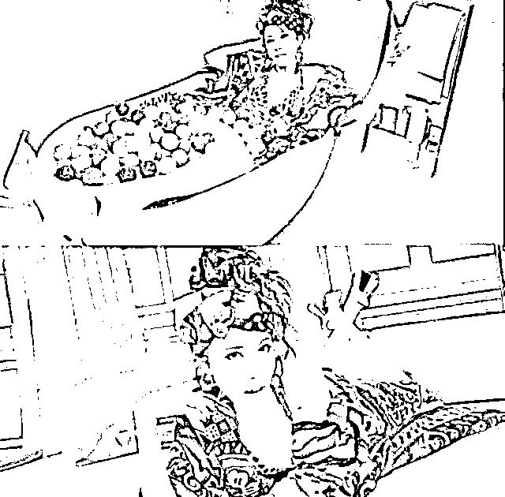

MV 截图 

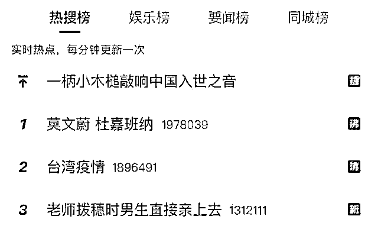

据港媒报道

莫文蔚于 6 月 11 日晚在香港红磡体育馆

举行一连 3 场演唱会

为了此次演唱会她接连推出多首新歌

其中一首叫《妇女新知 2021》

有细心的网友发现莫文蔚在

**该歌 MV 其中的一个造型**

**是身穿国际品牌 D&G 的新款衣服**

随后该造型图被设为了头像

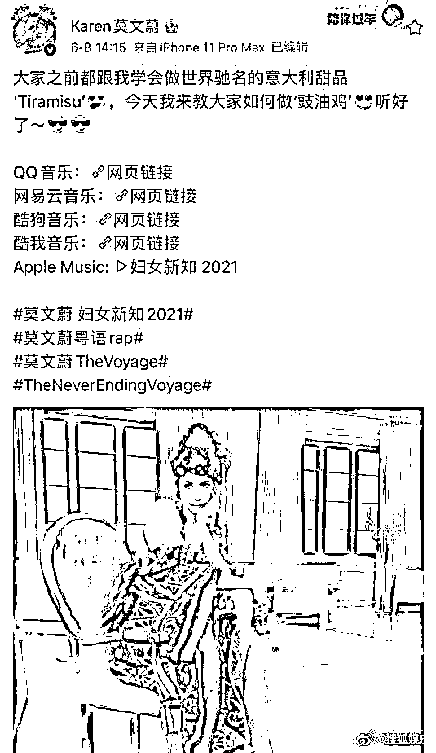

由于该品牌曾涉嫌辱华

所以令许多网友不满

纷纷留言指责并表示抵制莫文蔚

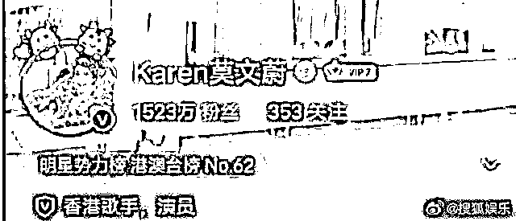

莫文蔚身穿 D&G 服装图片被设为头像

此事引起了巨大争议

网友们纷纷表达不满，进行公开抵制

莫文蔚也被骂上了热搜第一

随后，莫文蔚更换了头像

相关博文内容也已删除

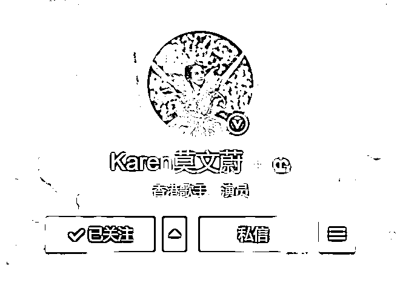

更换后的头像 

莫文蔚为什么会因为一套服装被骂？

这事要从 2018 年说起 

☟

2018 年杜嘉班纳上海大秀举行前，发布了一则“筷子视频”。其构思、文案、表演、布景、配音等表达，均引起广大中国网友的反感、不适，被质疑为歧视与丑化中国文化。

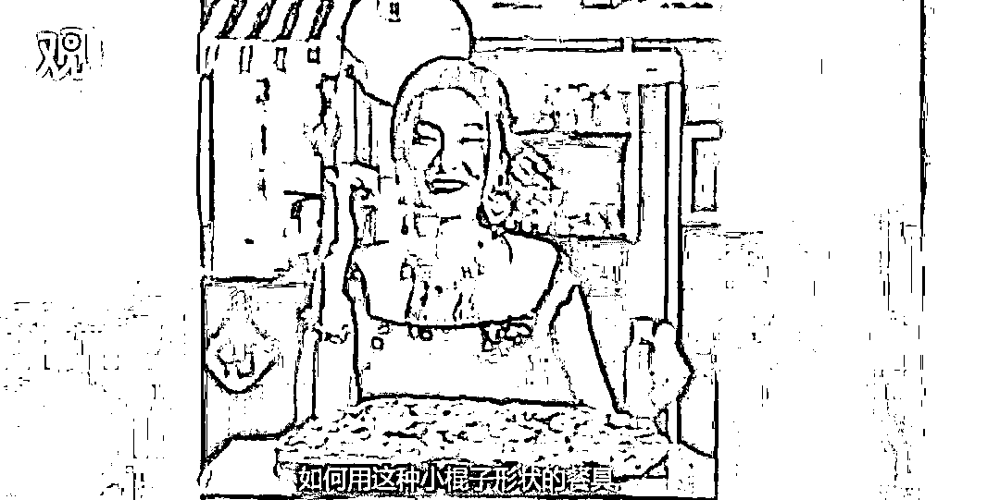

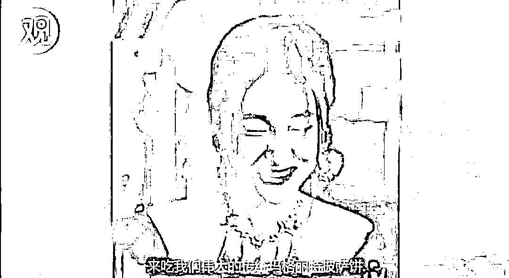

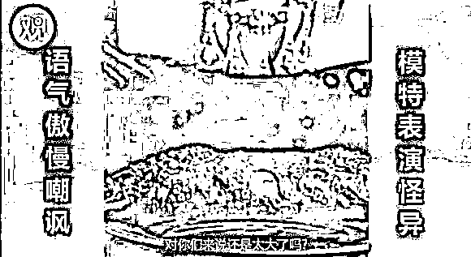

事发后，该品牌不仅没有第一时间表达歉意，其创始人&设计师 Stefano Gabbana 还公开发表不当言论，网友纷纷开始进行抵制。随后，**众多原本计划参加 D&G 上海大秀的中国演艺界人士，包括陈坤、章子怡、李冰冰、迪丽热巴等纷纷表态退出当晚活动**；文旅部也正式下发通知，取消 D&G 的相关活动。

而如今**莫文蔚也成为在这一事件后**

**首位穿杜嘉班纳服装的国内艺人**

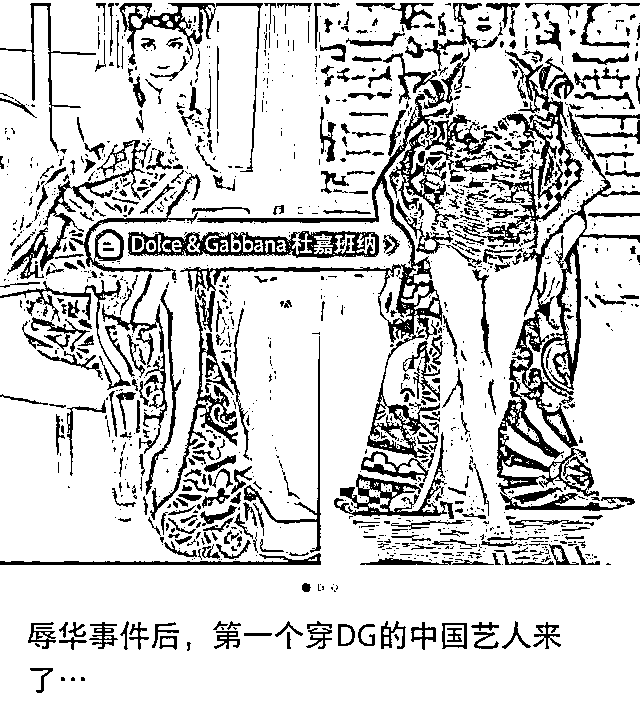

**莫文蔚工作室道歉并下架 MV**

6 月 12 日下午，莫文蔚工作室发文回应新作品 MV 服装引发的争议并道歉，“针对《妇女新知 2021》MV 中的服装审核出现问题，**工作室此次没有严格替艺人把关，疏忽对于品牌的问题的深入调查，造成大众十分不好的观感，对此表示万分的歉意**，希望得到公众、媒体以及一直以来支持艺人的粉丝朋友们的原谅。**相关 MV 已经第一时间通知各平台下架。**”

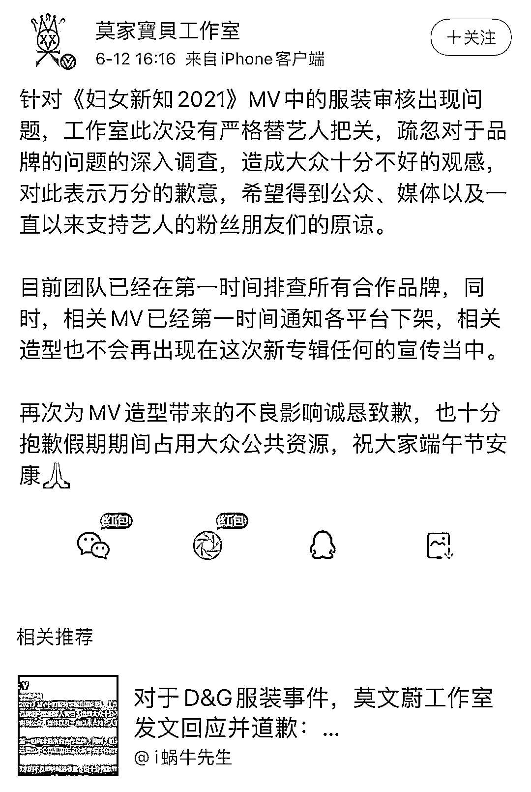

此外，相关造型师 12 日下午也发文道歉：“本工作室旗下造型师 Yoyo 关诺衡作为此次新 MV 的造型设计，因考虑不周导致极其恶劣影响，对莫文蔚小姐以及大众表示十分诚恳的歉意，对不起！**对于部分选用服装并未充分考虑到品牌形象及历史是极其严重的疏忽。**”

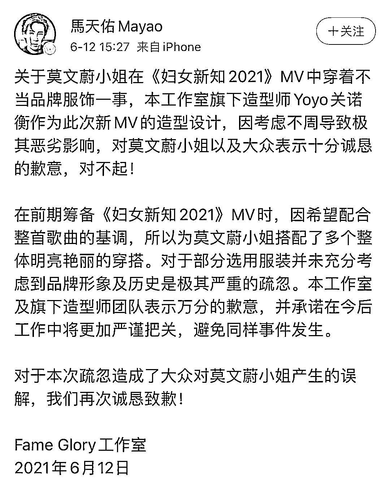

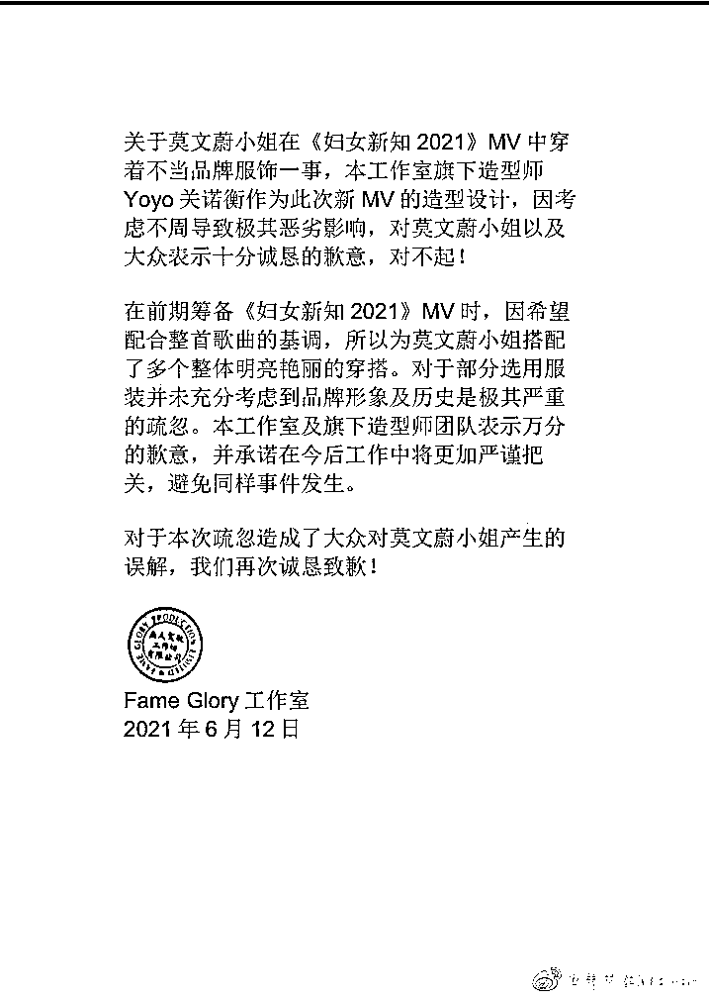

据香港“东网”14 日报道称

在完成一连 3 场的演出后

莫文蔚在后台接受采访时首度回应此事

**她说好内疚，承认是自我疏忽**

又称此次是个好好的教训

****莫文蔚表示自己错了，并不抵赖****

**这半年时间一直都在筹备演唱会**

**才会将衣服的事都交给造型师做**

**但其实她需要关注这些**

**最后莫文蔚称**

****没有人想发生这事****

****我们整个团队都有责任****

**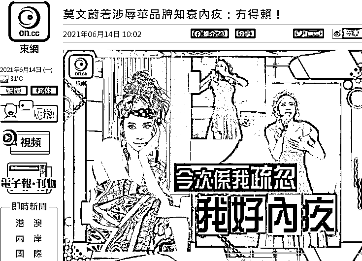**

**东网报道**

**来源：封面新闻、观察者网、大河报、新晚报、环球网、新浪娱乐等**

****

**← 向右滑动与灰产圈互动交流 →**

****