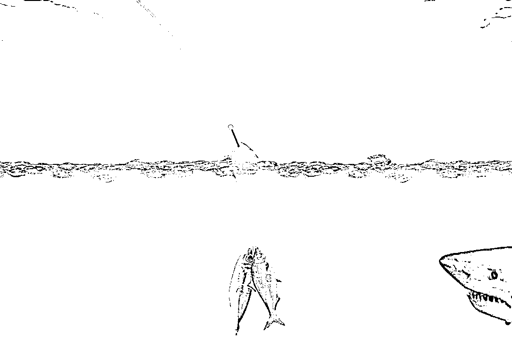

# 蒙古国派了一辆专列给我国送骗子！

> 原文：[`mp.weixin.qq.com/s?__biz=MzIyMDYwMTk0Mw==&mid=2247515924&idx=5&sn=6128f60463bc4a1418af441e05473543&chksm=97cb742ca0bcfd3af8618ceb6b4deb6d86cad6ffc02bc692e6812b139fc215bec7660bc541b1&scene=27#wechat_redirect`](http://mp.weixin.qq.com/s?__biz=MzIyMDYwMTk0Mw==&mid=2247515924&idx=5&sn=6128f60463bc4a1418af441e05473543&chksm=97cb742ca0bcfd3af8618ceb6b4deb6d86cad6ffc02bc692e6812b139fc215bec7660bc541b1&scene=27#wechat_redirect)

说好的投资新渠道

一次次充值后频频亏损

想退出时却屡遭阻挠

最后“竹篮打水一场空”

300 余名“投资者”被骗上亿元

……

蒙古国派了一辆专列，将该案犯罪嫌疑人移交我国。

    2018 年 9 月至 2019 年 9 月，黄某某、郭某（均在逃）纠集刘正飞、魏景双、罗森俊、谢绍林等 100 余人利用投资微信群以“荐股”、炒“区块链”、“欧洲平均工业指数”等方式进行诈骗，故意指导反向操作导致被害人亏损，并阻止出金，犯罪行为地跨中国、蒙古、柬埔寨三国，涉案人员 700 余名。

    2019 年 10 月，上述团伙在蒙古国乌兰巴托市欲继续诈骗时，被当地警方查获并移送我国。其中，由公安机关移送江苏省无锡市滨湖区检察院审查起诉的犯罪嫌疑人有 60 名，涉案金额达 1.2 亿余元。2021 年 3 月 25 日至 4 月 13 日，这起涉及 60 名被告人的特大跨国网络诈骗案相继 4 次在法院开庭审理。目前，该案尚未宣判。

精心炮制的跨国骗局

图片来源于网络，与正文无关

黄某某原是国内一家生态农业有限公司的老板，主营农副产品贸易，郭某为黄某某属下。在 2018 年初的公司员工大会上，他提出了新规划：下一步要到境外“发展业务”，如果有人愿意继续跟着他干，不但包吃包住，薪资还会上涨。优厚的条件吸引了不少老员工参与。 

随后，黄某某又在网上打出“出国工作，薪资上万”的诱人广告，该“项目”先后招揽了 100 余名年轻人，这些人最终都被送到了柬埔寨金边的一家酒店里。自 2018 年 9 月起，其中的刘正飞、魏景双、罗森俊、谢绍林等人开始带着各自“团队”跟着老板黄某某与郭某开展“业务”，工作内容是每天在手机、电脑上与客户聊聊天，按上层给的要求答复客户，表面看来不但轻松，还有底薪加提成。

刘正飞等“组长”告诉业务员，要学会将自己包装成某个身份假装与客户“邂逅”，如扮成美女、快递员，以聊天、收快递为名要到对方微信，先微信聊天，再把对方拉进微信群培养感情。这些“组长”们还要求业务员在群里当好“水军”，按照“话术 QQ 群”统一提供的范本聊天，伺机将群友引至某操作软件、某国际期货平台等投资理财平台，给客户开设账户并引导充值，这样基本上就算大功告成了。

客户向这些虚假平台注入的资金并未进入任何真实的期货市场，而是通过第三方支付平台转到该团伙控制的多个银行账号上，同时虚假平台后台会生成虚假账号并填入相应资金数字。接着，该团伙利用事先知晓的数字货币或“欧洲平均工业指数”、区块链走势，故意指导被害人反向操作致其亏损，并在被害人申请出金时操纵平台，以各种事由阻碍被害人出金，由此获利。

放长线钓“大鱼”

图片来源于网络，与正文无关

该团伙分工明确，每个“组长”负责带领若干个小组行动。从“养号”到“杀猪”步骤清晰——

第一步“养号”：给每名组员（业务员）发放 10 部到 15 部手机，购买微信账号登录微信，每天用这些微信号看视频、打游戏、发朋友圈，保持活跃度。

第二步“灌人”：每人以手中数个微信号组建微信群，设群名、编号，将二维码发给“组长”，再由相关人员将二维码交外包团队用于添加人员。

第三步“筛选”，又称“拉精准群”：微信群里有人自称“老师”，业务员按统一培训过的“话术”发股票内容聊天，同时作为“水军”负责吹捧“老师”。将加“老师”好友的客户筛选出来单独拉群，每群约 40 个股民，群里股民与“水军”比例为 1∶1 到 1∶2。每天，群里“老师”会推股票、讲股市，“水军”烘托氛围同时添加客户个别聊天，以拉近距离获取信任，方便下一步操作。

第四步“开直播间”：“老师”应“水军”要求，在一个月内每天定时在群里开设直播间课程，传授炒股经验，设法鼓吹区块链优势，“水军”趁机抛出公司相关平台，鼓动客户投资。

第五步“营销”，俗称“杀单”：待客户被业务员引入专门诈骗平台并充值后，后台通过修改参数，操控盘面走势，让客户小赚大亏，同时阻止出金，以此营利。

为躲避打击，该诈骗团伙以 2 至 3 个月为一个周期，到期解散所有微信群，重新开始诈骗流程。

多人落入陷阱

图片来源于网络，与正文无关

办案检察官介绍，这种俗称“杀猪盘”的诈骗方式以网络交友起始，进而诱导投资赌博，以“放长线”为特征，“养”得越久，骗得越狠。

2019 年 8 月，无锡宜兴的股民李先生发现自己被拉进一个叫“某某证券擒龙实盘”的微信群，群友“杨老师”自称股票专家，群里不少人称赞说跟着他炒股赚了钱。李先生将信将疑，在股市暗中关注“杨老师”推荐的几只股票后，发现有的确实有一定涨幅，便深信不疑了。随后，群友 A 拉李先生进小群“探讨炒股技巧”，不久群里开直播，老师开始推荐区块链。李先生发现网上有人说“杨老师”是骗子，便向 A 求证，A 一口咬定是网友造谣。李先生最终跟着注册了投资平台。

该平台注册方式方便快捷，提供身份证、银行卡图片后，对方发来账号密码，点击随附链接下载某平台登录后，李先生充值 10 万元人民币（平台换算成 1.4 万美元），按群友 A 及“杨老师”的指示炒区块链小赚后，大跌到 8000 美元左右。经过“杨老师”开导与怂恿，心有不甘的李先生再次投资 10 万元人民币，不想仍不涨反跌。心灰意冷提出退出后，李先生在当天傍晚收到群客服提示“国庆平台升级账户清零，需客户提供账户密码提前备份”，同时告知当天客服已下班不能出金。为拿回钱款，李先生只能提供账户密码。第二天凌晨，李先生发现账户被清空，自己被拉黑，方知被骗。

像李先生类似遭遇的人还有很多，统计截至目前，滨湖区检察院审查起诉部分该案的被害人达 300 余名，涉案金额逾 1.2 亿元。

原标题：将这起案件犯罪嫌疑人移交我国时，蒙古国派了一辆专列｜今晚九点半

来源：检察日报

← 向右滑动与灰产圈互动交流 →

