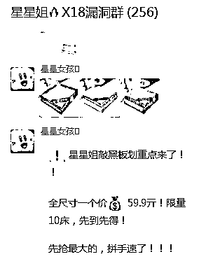
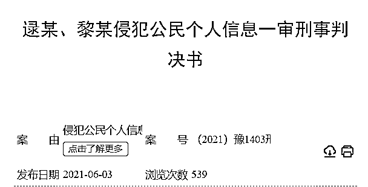
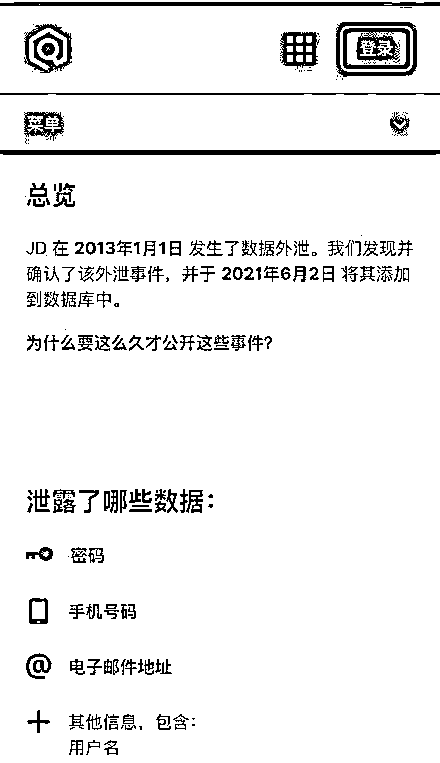

# 某宝 12 亿条用户数据被泄露

> 原文：[`mp.weixin.qq.com/s?__biz=MzIyMDYwMTk0Mw==&mid=2247515924&idx=6&sn=d6e6bd51b14f2e3dcf6dbc2e1066c06b&chksm=97cb742ca0bcfd3a79b24dbd6acc1c53ee58b09209ab50142ccb45d323e79c0479d29ba481a3&scene=27#wechat_redirect`](http://mp.weixin.qq.com/s?__biz=MzIyMDYwMTk0Mw==&mid=2247515924&idx=6&sn=d6e6bd51b14f2e3dcf6dbc2e1066c06b&chksm=97cb742ca0bcfd3a79b24dbd6acc1c53ee58b09209ab50142ccb45d323e79c0479d29ba481a3&scene=27#wechat_redirect)

**惊天大案！某宝 12 亿条用户数据泄露。**

大数据时代，你的数据属于谁？ 

答案显而易见，数据是属于大家的......

据悉，在 2020 年 8 月 14 日，淘宝网报警称：有不明人员通过订单评价接口，绕过平台风控，大批量的爬取加密数据，并且爬取数量较大，7**月 6 日-7 月 13 之间平均每天爬取数量高达 500 万条**。 

该黑产人员爬取的内容包括用户的**昵称、评价内容、手机号码**等隐私字段。

经排查后发现，作案地点在河南省商丘市某居民楼，嫌疑人逯某本身是一家公司的程序员，2019 年末，利用自己开发的爬虫软件，获取淘宝用户的个人信息。

逯某将获取到的信息，提供给黎某，用于公司的经营，从 19 年到将嫌疑人抓获，**爬取到的用户数据高达 12 亿条。** 

好家伙，都被获取了 12 亿条了，淘宝网风控人员才发现？！

该嫌疑人员是做优惠券返利的，他们通过采取到的个人信息，共创建了 1100 个微信群，每个群人员控制在 90-200 人，每天利用机器人在群里发优惠券来获得返利佣金。

6 月 3 日，这起持续这么久的信息被盗案件一审判决书终于下来了

商丘市雎阳区人民检察院指控，逯某一直以来是受雇与黎某的，**该公司自 2019 年 11 月至 2020 年 7 月非法获利共 34 万元**。

一审并未直接对嫌疑人做出处罚，据获取的信息量以及获利金额来看，几年的牢狱之灾是跑不掉了。 

其实不止淘宝出现这类情况，在 13 年时，京东也发生过类似案件。 

在 13 年 1 月 1 日发生了数据外泄，**其中包括密码、手机号码、电子邮件地址、用户名**。京东于 2021 年 6 月 2 日将这些被泄露的信息添加到了数据库中。

数据安全，网络安全维护起来确实很难，但是也很重要。

你有收到让加微信送礼品或者刷单的短信吗？有的点个**在看**

**来源：科技营地，反诈骗先锋**

****

**← 向右滑动与灰产圈互动交流 →**

****