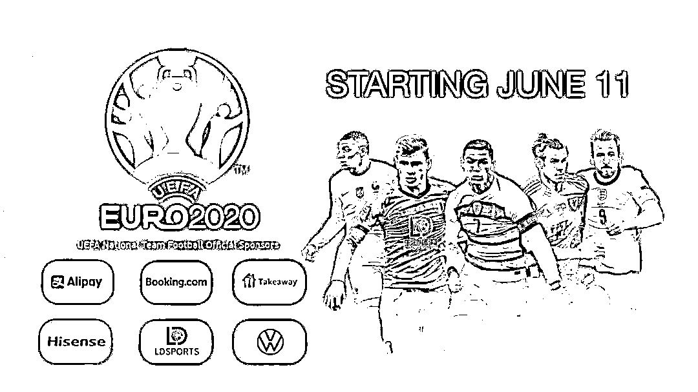

# 别让欧洲杯变成欧洲“悲”

> 原文：[`mp.weixin.qq.com/s?__biz=MzIyMDYwMTk0Mw==&mid=2247516021&idx=2&sn=aeb67e50d58cf103824f953d802c700d&chksm=97cb744da0bcfd5b3fb7159a573f9dfcd466aaec98085d9f31fa3e1dc1929f0948920340e36f&scene=27#wechat_redirect`](http://mp.weixin.qq.com/s?__biz=MzIyMDYwMTk0Mw==&mid=2247516021&idx=2&sn=aeb67e50d58cf103824f953d802c700d&chksm=97cb744da0bcfd5b3fb7159a573f9dfcd466aaec98085d9f31fa3e1dc1929f0948920340e36f&scene=27#wechat_redirect)

**欧！洲！杯！**

这场足球的狂欢节

终于要开启了

从北京时间

**6 月 12 日至 7 月 12 日**

每晚都是全世界球迷

狂欢时刻

欧洲杯一向是黑马的温床

1992 年的“丹麦童话”

2004 年的“希腊神话”

1996 年捷克杀入决赛加时遗憾败北

经典比赛令人至今难忘

 然而，欧洲杯开踢

骗子也要趁机下手啦！

近期出现一种新的诈骗手段，骗子会发送有“欧洲杯”相关的短信，短信内附着非法网站链接， 一旦点击被骗，别说看球嗨皮了，一个夏天只能忧伤郁闷。

今天小编跟大家道一道

忘我追“球”期间

要提防的三**个骗术**

**1、网上博彩等你来**

首先要把重要的事情告诉你：

**赌！球！是！犯！法！的！**

**赌！球！是！犯！法！的！**

**赌！球！是！犯！法！的！**

“我们是最具影响的博彩公司，专营百家乐、老虎机、足球、时时彩等赌博游戏。欧洲杯期间活动更给力：**存 1000 元送 1000 元**。”收到这样的短信，千万不要去点击，短信中可能附带病毒链接。这是要把你骗进网站，再一步步挖陷阱等你跳。

**网上博彩是违法活动，开心看球就好，不要沉迷赌球违法活动。收到这类短信，你还是赶快删除为妙。**

**2、“足球比赛内幕”**

有骗子将赌球信息通过网络到处播撒，号称享有**“独家内幕”**，点击信息内的链接，那就正中骗子下怀。让你的手机中木马，自动将手机中存储的隐私信息发送到骗子手中。网站后台可能偷偷记录下相关信息，继而窃取你的银行账号、密码，后果不堪设想。

**观看足球比赛是一场痛快淋漓的狂欢，看球就在于享受球队征战跌宕起伏的赛况，是一种高级的精神活动，千万不要好奇心作祟，因小失大。**

**3、“直播链接在这里”**

狂热的球迷们，观看重点赛事那必须是直播，这增加了球迷对直播网站的需求，但有些直播链接，未必就真的是赛事直播，它也很有可能是一个骗局。

**大家看球，一定要警惕这些发送直播链接的讯息，不要轻易去点击，看球请到正规的体育网站。**

兴奋时刻最容易放松警惕，诈骗往往就在精彩纷呈中产生。观看赛事固然重要，但千万要记得多个心眼。害人之心不可有，防人之心不可无。

**特别提醒广大球迷朋友**

**啤酒足球最般配**

**情到深处容易醉**

**记得喝酒不开车**

**开车不喝酒！**

来源：平安常州，反诈骗先锋

← 向右滑动与灰产圈互动交流 →

