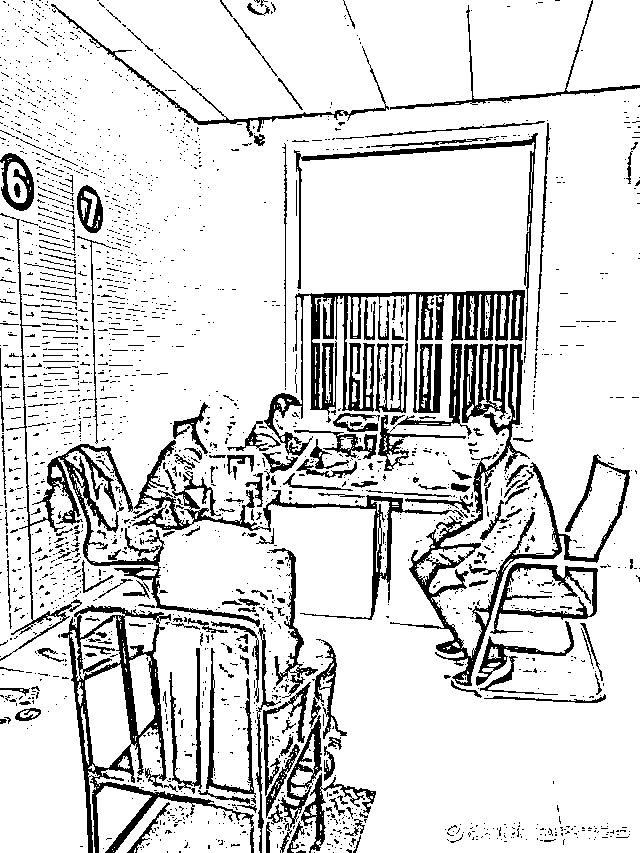
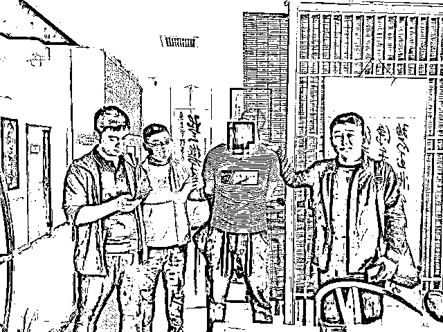
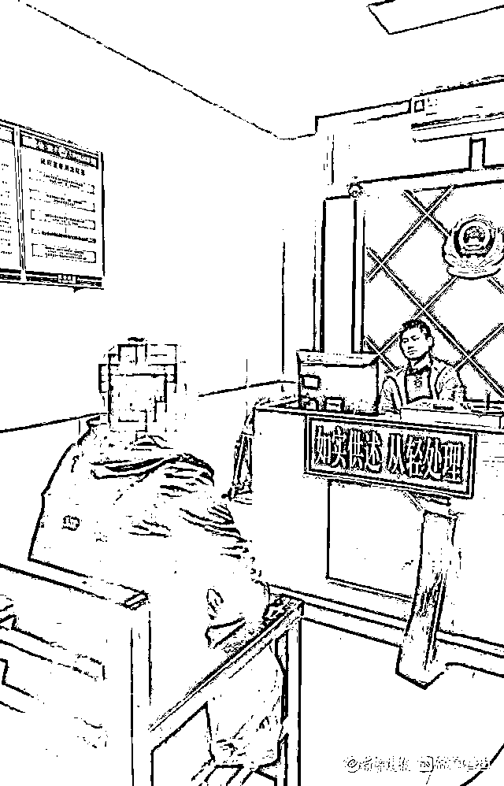

# 男子被骗往柬埔寨搞杀猪盘，交 2 万赎金才被允回国，刚回就被抓

> 原文：[`mp.weixin.qq.com/s?__biz=MzIyMDYwMTk0Mw==&mid=2247516021&idx=3&sn=9e0d419c92e44dcface39bd0452dcf54&chksm=97cb744da0bcfd5befa4c1869b774b4c12c33e84f31a07b5a3c204c675ed6bc209ee9c60323a&scene=27#wechat_redirect`](http://mp.weixin.qq.com/s?__biz=MzIyMDYwMTk0Mw==&mid=2247516021&idx=3&sn=9e0d419c92e44dcface39bd0452dcf54&chksm=97cb744da0bcfd5befa4c1869b774b4c12c33e84f31a07b5a3c204c675ed6bc209ee9c60323a&scene=27#wechat_redirect)

**“要么在这里跟着我们搞电诈，要么给家里要钱赎人。**”

赵亮（化名）在朋友的“诱骗”下来到柬埔寨当地的一家公司工作，可万万没想到的是，他刚进入公司就被限制了人身自由。

在打骂胁迫之下，赵亮利用网络交友软件走上了电信网络诈骗的道路，期间，他冒充成功人士以“杀猪盘”的模式骗取了枣庄市滕州市一名女子 20 万元。

被高薪工作吸引，男子国外谋发展

“**公司全是保安人员，如果没有按照他们的要求完成业务，就会遭遇棍棒的毒打，我身上的伤就是这么来的。**”在滕州市公安局审讯室里，回忆起此前在柬埔寨的生活，赵亮至今难以忘怀。

大概是去年 10 月份的一天，30 岁的赵亮在与朋友闲聊时，朋友无意间提到了一份高薪工作。

说者无意听者有心，朋友的一席话引起了赵亮的兴趣，便主动询问起高薪工作的相关事宜。

期间，朋友告知赵亮，这份工作其实就是一份简单的烧烤工作，工作地位于柬埔寨，**入职后，不用担心生活方面，来回机票和食宿公司全包**。

至于待遇方面，基本工资至少 5000 元，关键是提成丰厚，一般情况下，很轻松的就可月入万元以上。

听完朋友的全面介绍，赵亮对这份高薪工作心动不已，在几番考虑下，他决定勇敢迈出这一步，去国外谋求发展。

他未曾想到，从这一天开始，一场“噩梦”悄然降临。

一到“公司”就被限制人身自由

带着满满的自信，赵亮跟随朋友踏上了前往柬埔寨的航班，经历了数次奔波，一座位于柬埔寨偏僻地带的山间小楼走进了他的视野。

小楼虽然不大，但满是保安人员，空气里弥漫着诡异的气氛，种种情节顿时让赵亮产生不安。

更令他感到害怕的是，刚进入公司自己就被公司管理人员严加看管起来，甚至收走了随身携带的护照、手机及钱物等。

在入职后的几天里，赵亮被公司限制了活动，每天就是吃饭、睡觉和培训，过程中他终于知道自己入职的其实是一个通过网络聊天交友实施电信网络诈骗的窝点，只不过这些诈骗分子把窝点包装成公司罢了。

“**为了骗取更多人的钱财，他们收走我们身上的所有钱物，限制我们的活动，要求我们每人每天联系 50 个人，完不成任务就暴打我们，如果想离开就要交钱，我身上的伤就是他们用棍棒打的**。”

赵亮回忆，在柬埔寨时，他被编进了公司下设的其中一个工作小组，对于新入职的员工，小组展开了培训，内容就是学习电信网络诈骗的话术等，由于入职时他的手机被上缴，为了实施电诈，公司给每人发了一部带有各种网络社交软件的手机，要求他们在社交软件上寻找目标聊天，而且在此期间，必须得到目标的回复（即双方建立初步联系）才算完成任务。

按照电信网络诈骗分子的要求，赵亮必须缴纳不菲的金钱才被允许离开，随后本就不富裕的赵亮走上实施电信网络诈骗的道路。

网络社交认识“老板”，女子被骗 20 万

工作期间，面对电信网络诈骗分子的打骂胁迫，赵亮完成着每日的任务，这其中就包括年轻貌美的小美（化名）。

在双方聊天的过程中，赵亮按照要求把自己包装成一名从事餐饮行业的成功人士，并且根据电信网络诈骗分子设定好的剧本和话术，向小美讲述自己是如何从一个穷小伙变身为餐饮老板的经历。

渐渐地，美丽的小美对网络社交平台上的帅气“老板”产生了好感。

然而她不曾想到，此时自己已经成为电信网络诈骗分子眼中“上钩的鱼”。

取得小美的信任后，赵亮谎称自己的朋友有一款挣大钱的投资项目，而且操作起来很简单，只需按照指导在平台上买大买小或买单买双即可，在种种诱惑之下，小美选择了投资。

一开始，抱着试一试的态度，小美将少量的金额在平台上兑换成彩金，然后按照指导进行了操作，没想到一番操作下来，她果真拿到了利润，对此小美很是高兴，不过此时远在境外电信网络诈骗窝点的赵亮再次抛出了诱饵，他告知小美，最近公司在做活动，投资金额越大，获利就越大，而且公司还会赠送彩金，在某种意义上，即使小美不进行操作就会获得利润。

于是，小美分多次将 20 万元投入该平台。

但当她输入银行卡号进行提现时，却遭遇了失败。

按照平台给予的答复，因银行卡号输入错误，小美的银行账户被冻结，需缴纳数十万元才可解封，看着平台的答复，小美如梦初醒，最终选择向警方报案。

交了 2 万元才允许回国，结果刚回来便被抓了

“**利用网络社交软件，通过聊天博取受害人的信任和感情从而诈骗，这就是典型的杀猪盘式电信网络诈骗**。”

枣庄市滕州市公安局刑警大队一中队副中队长韩孝培告诉记者，在接到报警后，滕州市公安局多警种立即成立专案组合成作战，对涉案银行账户、资金流水等进行分析研判，想尽一切办法侦破此案。

在警方对案件侦办的同时，为了尽快挽回自己的损失，作为受害人的小美一直与骗子（即赵亮）进行着沟通。

期间，面对年轻貌美的小美，单身的赵亮动了回国的心思，因此，他向藏匿在柬埔寨的电信网络诈骗分子缴纳了 2 万余元后，终于踏上了回国的路程，此时此刻，他可能在心里期盼着与小美见面，然而，他的一切行踪早已进入到警方的视线。

就在前不久，在国外遭受数月限制式生活的赵亮来到枣庄，但他万万没想到，自己刚入住宾馆就被民警抓获了。

在审讯室里，赵亮向民警诉说着自己在柬埔寨经历的一切，与此同时，他也如实供述了自己实施电信网络诈骗的违法犯罪行为。

韩孝培表示，经审讯，犯罪嫌疑人赵亮交代，在境外电信网络诈骗窝点下设的工作组实施违法犯罪时，每成功骗取受害人的钱财后会有提成，不过大部分都交给了上家，剩余部分会由工作组负责人进行利润分配。

在犯罪嫌疑人赵亮返回国内时，在扣除伙食费、住宿费等费用后，**他还向电信网络诈骗分子缴纳了 2 万余元才被允许回国，因而原本想挣钱的他，在回国时几乎是一分钱未挣到**。

此外，犯罪嫌疑人赵亮还供述出了，介绍其出国工作的朋友的相关线索。

扮演“代理商”角色，警方又抓了三人

“我们对线索展开了进一步的分析研判，最终确定了此案另一名犯罪嫌疑人的藏匿位置。”

枣庄市滕州市公安局刑警大队反诈中队副中队长张帅表示，结合前期的调查结果，以及手中掌握的线索，他和同事们立即赶赴至湖南省，并在当地警方的配合之下，成功抓获犯罪嫌疑人李力（化名）。

经审讯，犯罪嫌疑人李力负责给境外电信网络诈骗分子介绍人员，**每介绍一名人员就获利 3000 余元，并且其介绍的人员如果成功骗取了钱财，犯罪嫌疑人李力还会获得相应的提成**。

“犯罪嫌疑人李力如实供述了自己的犯罪行为后，还交代了境外电信网络诈骗窝点下设一个工作组的两位负责人的线索。”

张帅介绍，根据该线索，他们很快就确定了两名犯罪嫌疑人的踪迹，对此他们兵分两路到达陕西省，在当地警方的配合下抓获了犯罪嫌疑人孙刚（化名）和周武（化名）。

通过审讯，犯罪嫌疑人孙刚在工作组里扮演者“代理商”的角色，他负责对接境外电信网络诈骗分子，与此同时还管理着工作组所有成员的衣食住。

此外，在员工成功骗取钱财后，他还负责分配提成。

而犯罪嫌疑人周武则负责工作组培训工作，即对新入职员工培训话术等，同时他也实施电信网络诈骗。

目前，四名犯罪嫌疑人已被滕州警方刑事拘留，迎接他们的将是法律的严惩。

通过此次案件，警方也提醒广大市民，务工一定要到正规合法的劳务中介公司，切不可轻信道听途说的招聘信息，如遇此情况请到劳务监管部门核实或通知公安部门。

与此同时，针对电信网络诈骗一定要有防范意识，对于不明来电、信息或是链接等要核实查证，切勿不加核实盲目转款，最后天上不会掉馅饼，掉下来的只能是“陷阱”。

来源：齐鲁晚报 ·齐鲁壹点

← 向右滑动与灰产圈互动交流 →

