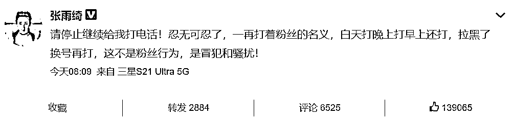
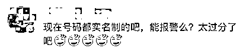
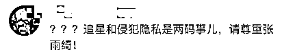
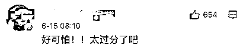
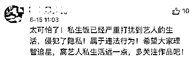
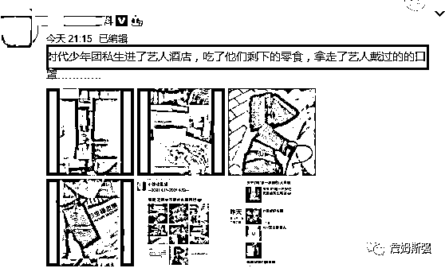
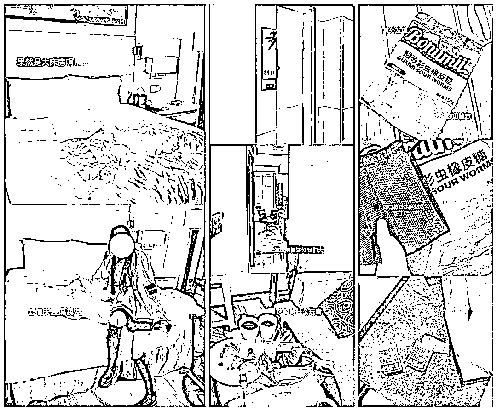
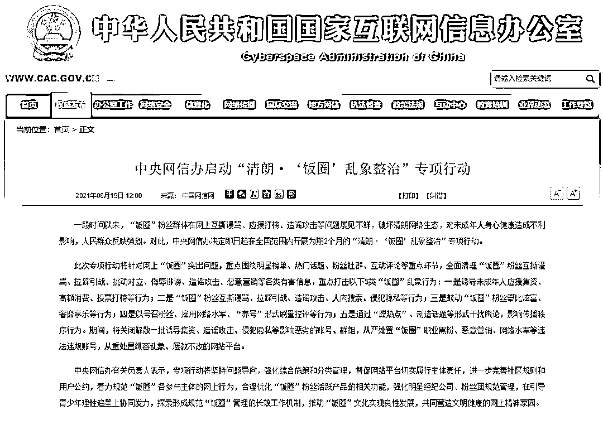

# 知名女演员发文怒斥！这些乱象，重点打击！

> 原文：[`mp.weixin.qq.com/s?__biz=MzIyMDYwMTk0Mw==&mid=2247516021&idx=4&sn=a8939423fbb9e45490b46367219a3349&chksm=97cb744da0bcfd5b7c317af5d7cea883ee89a0882152151b4fb55fe9103e547ab02c2c317f5a&scene=27#wechat_redirect`](http://mp.weixin.qq.com/s?__biz=MzIyMDYwMTk0Mw==&mid=2247516021&idx=4&sn=a8939423fbb9e45490b46367219a3349&chksm=97cb744da0bcfd5b7c317af5d7cea883ee89a0882152151b4fb55fe9103e547ab02c2c317f5a&scene=27#wechat_redirect)

6 月 15 日中午

知名女演员张雨绮一条微博

冲上热搜第一

在微博中

张雨绮表示

自己遭遇电话骚扰

对方不分昼夜给她打电话 

拉黑后还换号继续打 

她还斥责骚扰者： 

**这不是粉丝行为**

**是冒犯和骚扰！**

在评论区 

不少网友也表示 

“私生饭不是真粉丝” 

“私生饭”，当心违法！

“私生饭”是艺人明星的粉丝里行为极端、作风疯狂的一种人。随着国内粉丝文化的不断发展，有的粉丝不再满足于常规的追星操作，开始寻求与偶像更近距离的接触，采取非常手段去跟踪、偷拍艺人明星，骚扰自己喜欢的明星及其家人。

今年 4 月，一条“私生饭”进入艺人住过的酒店房间进行拍照打卡的消息引发热议。该“私生饭”不仅翻动了房间内留下的零食，在床上摆姿势自拍，还带走了艺人用过的口罩，并发朋友圈称，“香水味别这么甜”。

对于此事的相关法律问题，律师表示要根据情况分析，

一种是在艺人尚未退房的情况下，“私生饭”擅自闯入，则其行为涉嫌违法。而如果进入房间的目的是偷拿东西或者偷拍隐私，则视情节轻重，可处以拘留罚款，严重的还涉嫌犯罪。

另一种是在艺人已经退房的情况下，“私生饭”趁服务人员打扫间隙未经许可私自进入。如果没有艺人遗漏的贵重物品被拿走，那么“私生饭”侵犯的是酒店的合法权益，酒店可以报警；如果“私生饭”是通过拍摄艺人的遗留物品、现场的布置和状态，对外公开发布相关信息，则有侵犯艺人隐私权的嫌疑。

“饭圈”乱象被点名！

中央网信办出手

昨日，中央网信办宣布即日起启动“清朗·‘饭圈’乱象整治”专项行动。

通知指出：此次专项行动将针对网上“饭圈”突出问题，重点围绕明星榜单、热门话题、粉丝社群、互动评论等重点环节，全面清理“饭圈”粉丝互撕谩骂、拉踩引战、挑动对立、侮辱诽谤、造谣攻击、恶意营销等各类有害信息，重点打击以下 5 类“饭圈”乱象行为：

> **一是诱导未成年人应援集资、高额消费、投票打榜等行为；**
> 
> **二是“饭圈”粉丝互撕谩骂、拉踩引战、造谣攻击、人肉搜索、侵犯隐私等行为；**
> 
> **三是鼓动“饭圈”粉丝攀比炫富、奢靡享乐等行为；**
> 
> **四是以号召粉丝、雇用网络水军、“养号”形式刷量控评等行为；**
> 
> **五是通过“蹭热点”、制造话题等形式干扰舆论，影响传播秩序行为。**

期间，将关闭解散一批诱导集资、造谣攻击、侵犯隐私等影响恶劣的账号、群组，从严处置“饭圈”职业黑粉、恶意营销、网络水军等违法违规账号，从重处置纵容乱象、屡教不改的网站平台。

中央网信办有关负责人表示，专项行动将坚持问题导向，强化综合施策和分类管理，督促网站平台切实履行主体责任，进一步完善社区规则和用户公约，着力规范“饭圈”各参与主体的网上行为，合理优化“饭圈”粉丝活跃产品的相关功能，强化明星经纪公司、粉丝团规范管理，在引导青少年理性追星上协同发力，探索形成规范“饭圈”管理的长效工作机制，推动“饭圈”文化实现良性发展，共同营造文明健康的网上精神家园。

**你还见过哪些“饭圈”乱象？**

来源：政法频道、中国青年报、中国网信网、法治日报、微博等

← 向右滑动与灰产圈互动交流 →

