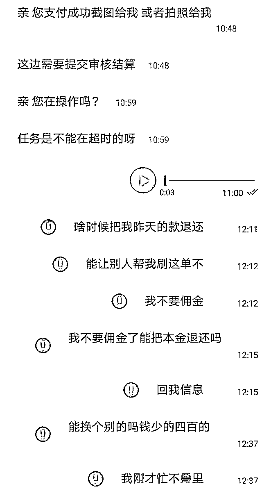
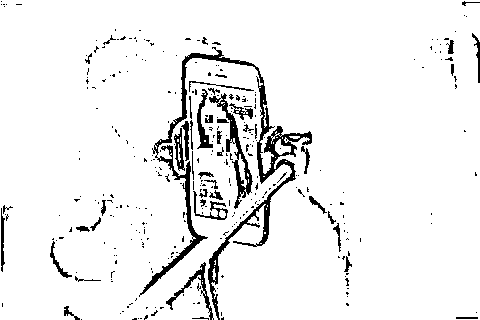
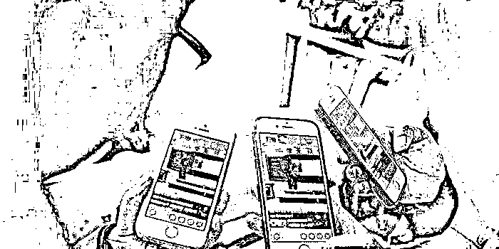
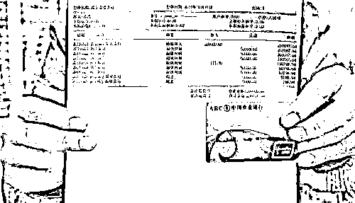

# 刷礼物点赞轻松赚钱？刷流量提升额度？醒醒吧！

> 原文：[`mp.weixin.qq.com/s?__biz=MzIyMDYwMTk0Mw==&mid=2247516021&idx=6&sn=456f19c4e86b189c88bbf068cafd5b7d&chksm=97cb744da0bcfd5b5a77f7cb3cb5af88cb5e458aea45e9e3bfa508e578e238062ea6fb733e68&scene=27#wechat_redirect`](http://mp.weixin.qq.com/s?__biz=MzIyMDYwMTk0Mw==&mid=2247516021&idx=6&sn=456f19c4e86b189c88bbf068cafd5b7d&chksm=97cb744da0bcfd5b5a77f7cb3cb5af88cb5e458aea45e9e3bfa508e578e238062ea6fb733e68&scene=27#wechat_redirect)

兼职刷单诈骗

**据杭州中院，骗子通过不同渠道推广兼职广告，以刷新交易量、提高信誉度等为由，招募人员进行网络兼职刷单，承诺在交易后返还购物费用并有额外提成，后通过话术诱骗受骗人刷单。同时拉受骗人入群，在群里营造每个人都拿到大额返利的假象，实则除了受骗人，其他人都是骗子操控的“托”。**

**刷第一单时骗子会小额返款让受骗人尝到甜头，当受骗人刷单交易额变大后，骗子就会以各种理由拒不返款，而且会想方设法让你继续转账。如果你急于要回前面的本金，那么很不幸，你已经落入了骗子的圈套。**

**你越想要回前面的本金，骗子就会让你掏更多的钱，直到你醒过来的时候，你的钱已经被骗的差不多了，此时骗子已将你拉黑。**

****

****只要给主播刷刷礼物就能赚提成？************

****“关注小主播，礼物走一波。”网络直播行业的兴起，不仅为主播创造了流量，也给诈骗分子提供了“商机”。“只要动动手指给主播刷礼物，就能足不出户拿提成。”这样的好事你心动吗？正在找兼职的圆圆（化名）就心动了。****

****2019 年 8 月的一天，圆圆在朋友圈看到一则招兼职广告，发布者正是本案被告人小江。按照小江的说法，只要把钱给他用于给网络主播刷礼物，就可以拿提成。****

*****小江：“一周返利三次，一个月后还本金。”**********圆圆：“这么简单吗？我只要把钱转你就行？”**********小江：“你看，这是别人兼职刷礼物的截图，不光是你一个人在做，我手下还有好几个兼职的人。”*****

****为了让圆圆相信兼职的可靠性，小江给其看了很多别人转钱过来的截图。圆圆觉得这个兼职不错，不用付出任何劳动就能坐等收钱，当场转了 12000 元过去，后来小江提出要再投 4000 元才能把本金转出来，圆圆照做了。可想而知，这个钱后来打了水漂。****

****这是小江的诈骗“套路”之一，他多次在互联网及朋友圈发布招聘主播、提供兼职岗位等虚假信息，当求职者主动联系后，又虚构投资网络主播刷单可获取现金返利，诱骗求职者向其转账资金，前后共计骗取 11 万余元。****

****96 年的小江年纪不大，“套路”却层出不穷。除了兼职刷礼物诈骗，他还通过社交软件结识多名女性，以父亲做手术、解冻银行卡、购买手机摩托车等各种理由骗取女孩们转账；通过网上虚假出售二手摩托车，以上牌过户、代缴保险等各种理由骗取买家钱款。****

********

****经审理，被告人小江以非法占有为目的，采取虚构事实、隐瞒真相的方式骗取他人财物，向多人实施诈骗，数额特别巨大且主要用于个人挥霍，最终下城法院以诈骗罪判处小江有期徒刑十一年九个月，并处罚金 11 万元，责令小江退赔被骗人相应钱款。****

******点赞就能日赚百元？别做梦了！******************

******2018 年 3 月，陈某在同学群看到一则网络刷单兼职招聘广告，只要在抖音、快手等视频软件上点赞、评论等，就能日赚几百元，并且时间自由、及时返佣。陈某心念一动，觉得试试也无妨。******

******于是，陈某通过广告上的联系方式，加了对方 QQ。在对方的指导下，陈某开始下载“微信息”“微助手”软件进行注册。注册后，陈某进入类似于直播间的“房间”，“房间”内的接待人员告知陈某需交纳 99 元会员费，因为“只有升级为会员才能做任务”，陈某便同意了。******

******做了一些兼职任务后，陈某又被告知“这个级别的会员任务量少且有限制，再升级成为钻石会员的话，就可以持续不断做任务，能赚更多”，于是陈某再次交纳了 99 元会员费。******

******之后，陈某做了视频点赞、软件下载等任务，但做了一段时间后，就发现平台里兼职任务长期不更新，当初广告宣传的薪酬根本不可能实现，提现的金额门槛很难达到，和平台要求返还会员费也没有人理，至此，陈某才意识到被骗了。******

******陈某发现被骗后并没有选择报警，竟为了挽回损失，应聘成为了诈骗集团的工作人员。“我主要负责培训工作，按照主管教给我们的话术给‘小白’培训，就像自己第一次被骗一样，让‘小白’相信真的有兼职可以做，可以赚到钱，让他们交钱成为会员，每培训成功一个会员我就有提成。”陈某口中的“小白”，就是像她最初那样，“啥也不懂，交了钱准备找工作，被骗的对象”。******

************

******涉案的 30 余名被告人中，很多是和陈某一样的被骗人，发现被骗后反而选择加入团伙实施诈骗，其中更有不少是在家带孩子的年轻妈妈和在校大学生，他们在孙某（已另案处理）等人组建的诈骗集团中分别扮演着不同“角色”，上演“招聘”戏码，实施诈骗并获利。该诈骗集团在社交软件发布虚假网络兼职信息，通过收取会员费在全国各地行骗，诈骗金额达 3.16 亿元，被骗人达 190 余万人。******

******临安法院经审理认为，被告人陈某等 38 人以非法占有为目的，虚构事实、隐瞒真相，通过网络骗取他人财物行为均已构成诈骗罪，且均为从犯。其中 37 名被告人自愿认罪认罚，根据各被告人的犯罪情节、认罪悔罪态度，对该 38 名被告人分别判处拘役三个月至有期徒刑四年四个月不等刑期，并处罚金。******

******贷款公司刷流水就能提升信用卡额度？******************

******32 岁的李先生出于个人资金需要，向朋友老王咨询有没有办法可以提高信用卡额度。老王随即推荐了一个微信号，称“可以加这个微信试试”，当天李先生就加上了这个人。******

*******某信贷公司：“我们贷款公司是专门为客户办信用卡和信用卡提额的，你可以放心。”**************李先生：“具体怎么操作？需要手续费吗？”**************某信贷公司：“很简单的，比如你想提 1 万的额度，就先转 30%给我，也就是 3000 元，用来刷银行流水。不管能不能提额成功，这笔钱都会返还给你。不过你要给我提额额度的 3 个点作为佣金，1 万块就是 300 元的佣金。”*******

******就这样，通过微信一来一回，李先生将 4500 元转给了这个自称贷款公司员工、素未谋面的张某。对方表示 7 个工作日就会出提额结果，到时候会有银行短信提示。谁知，这 4500 元却成了“打狗的肉包子”——有去无回。******

************

******说好的 7 个工作日，过了两个星期也没见到银行短信，李先生开始生疑，多次发微信向张某询问提额进度，催促他尽快办理。一开始，张某还会回复让他耐心等待，不要着急，到了 3 月 10 日，微信不回、电话不接，张某就这样失联了。“上当了！”李先生这才醒悟，赶紧向派出所报案。经过侦查，警方在四川成都将犯罪嫌疑人张某抓获。******

******案件审理过程中，被告人张某家属代其向两名被骗人退还了全部涉案金额 7498 元，并取得两名被骗人的谅解。最终，下城法院以诈骗罪判处被告人张某有期徒刑七个月，缓刑一年，并处罚金 7000 元。******

******法官郑重提醒******************

******随着互联网技术的发展，不少网络平台确实能为社会公众提供一些兼职工作，这也恰好符合诸如学生、宝妈、自由职业者等群体的切实需求，但网络上发布的信息良莠不齐，真伪难辨，一定要审慎判断，不要轻易上当。******

******（本文转自防骗大数据：FPData）******

*******1、寻求网上兼职一定要通过正规可靠的平台，对于需要预付保证金、先行垫付资金的兼职工作可以果断拒绝。*******

*******2、要记住天下没有免费的午餐，对于可以轻易获取高额回报的工作要保持高度的警惕，不要轻易相信。*******

*******3、寻找网上兼职时不要轻易泄露自己的个人信息，也不要轻易点击对方发过来的链接，不要在链接的页面上填写自己的银行卡号、支付宝账号及密码等信息。*******

*******4、如果不慎被骗应及时报警，并注意收集证据，如聊天记录、交易记录、联系方式等。*******

*******5、发现被骗后，切莫抱有侥幸心理，企图通过拉拢更多受骗者入局回本，这样损失的不仅是金钱，还可能走向犯罪，面临刑事处罚。*******

******文章来源：杭州中院 防骗大数据******

************

******← 向右滑动与灰产圈互动交流 →******

************