# 这种是诈骗群！在里面的人赶快退群！

> 原文：[`mp.weixin.qq.com/s?__biz=MzIyMDYwMTk0Mw==&mid=2247516021&idx=8&sn=66760288279ec875c30e4f15bc4b700e&chksm=97cb744da0bcfd5b3570f3b9243de825fb0df7e2a71e02a5090af594246ff99409f3ee162699&scene=27#wechat_redirect`](http://mp.weixin.qq.com/s?__biz=MzIyMDYwMTk0Mw==&mid=2247516021&idx=8&sn=66760288279ec875c30e4f15bc4b700e&chksm=97cb744da0bcfd5b3570f3b9243de825fb0df7e2a71e02a5090af594246ff99409f3ee162699&scene=27#wechat_redirect)

最近

股市行情一片红火

很多小伙伴都表示借机赚了一把

**▼**

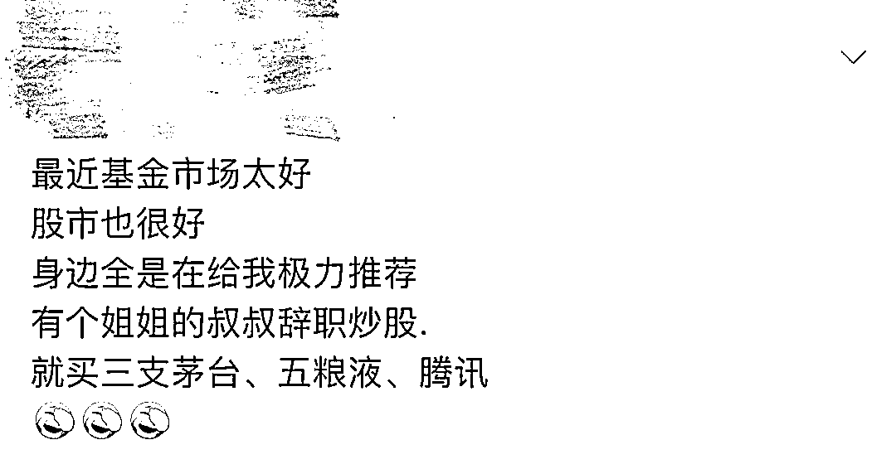

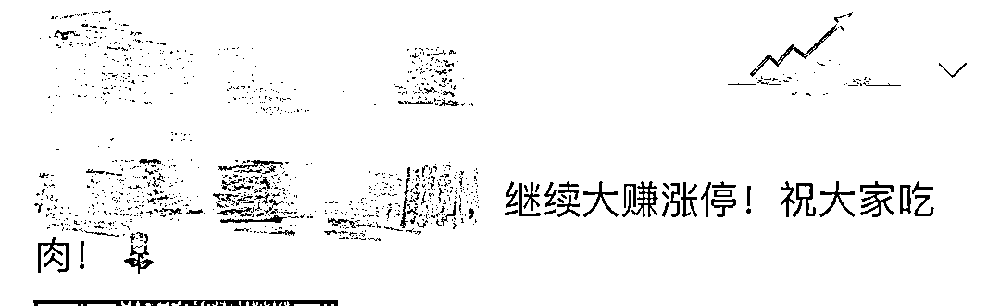

于是

也有不少股市小白跃跃欲试

可是不懂股票怎么办？

这时候要是有“老师”加你

说手把手指教你赚钱方法

几天就能赚上几十万

你心动吗？

没错！真的有这样的事

就有人遇上了

只不过结局有点惨…

谎称加群炒股

已多人被骗

最近，随着股市行情的变化

网络社交平台上的一些

**“荐股黑群”**开始活跃

群内所谓的“庄家”“大 V”进行忽悠式荐股

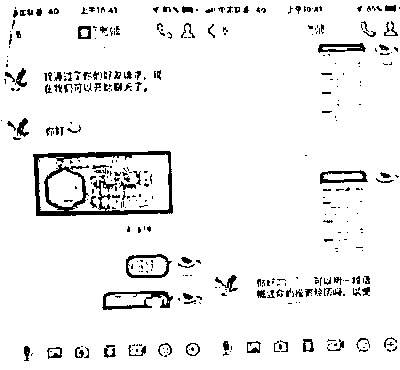

已多人上当

涉案金额高达 100 多万

**进炒股群后被骗**

**一男子损失 30 万**

6 月 10 日，某地派出所接到一名受害人报案，**称有人拉他进了一个群，里面都是讲股票 K 线图之类的，**还有一些股票的代码，让群里人尝试购买。其在购买了几只股票后小赚了一笔，群管理员便让其购买该群公司的股票，同时下载一个投资软件 APP。

受害人通过该 APP 第一次投入了 3 万元人民币，看到自己账面赚了 1 万多人民币，更加信任这家公司。这时对方告知有一支股票会有好几个涨停板，赶紧入手。

受害人毫无顾虑地在该 APP 内**投资了 30 万元**人民币，却发现该投资软件打不开了，联系其管理员，对方告知需要继续投钱才能提现，这才发现被骗。

无独有偶

隔壁派出所也接报一起类似的案件

**微信加“炒股老师”**

**男子被骗 66 万**

6 月 13 日，受害人报警称自己在微信上加了一人，对方称是一个**从事直播的炒股老师**，受害人会每天到其直播间去签到，在几次签到后，对方给他推了一个助理的 QQ 号，让其找助理拿一个直播平台的账号密码，随后，该助理发了一个网址，在网页中继续观看直播。

几日后，该助理让受害人去开通港股账户，并推了一个证券客服帮其开户，之后该客服发送一条链接，受害人点击后下载并注册了一个 app，同时往里面充值了 10 万元人民币。

其后多次转账至平台账户上并按照“炒股老师”的指示进行股票交易买卖，几日后收益就达到了 38 万元港币。

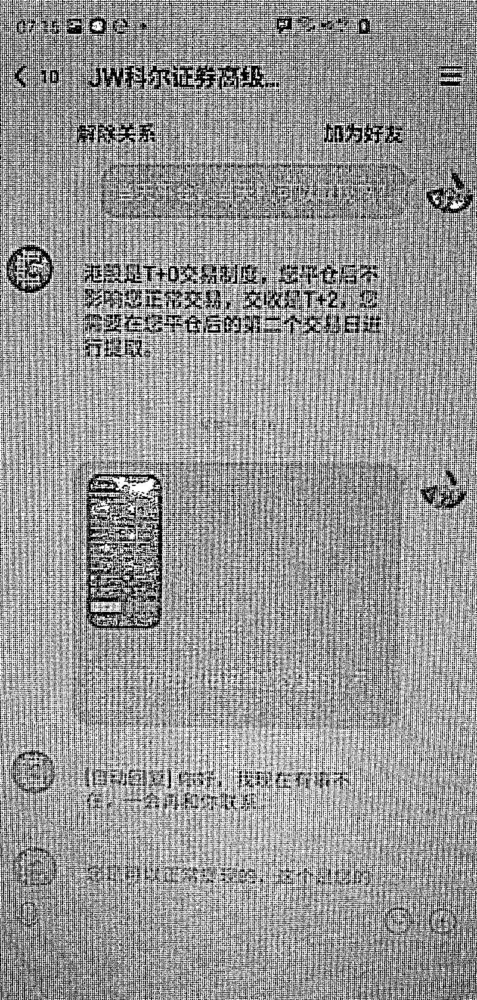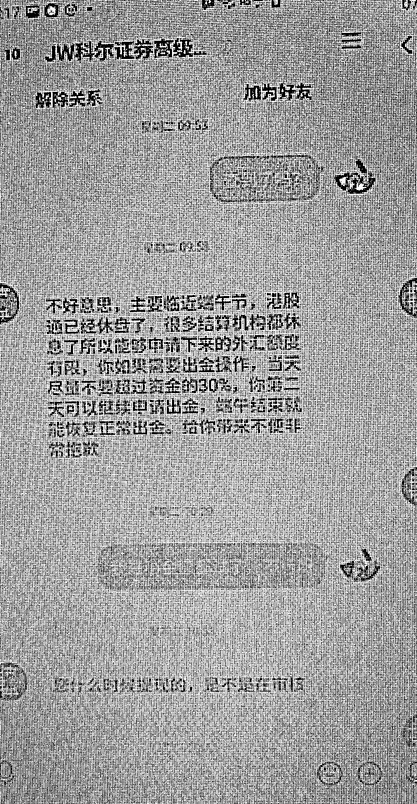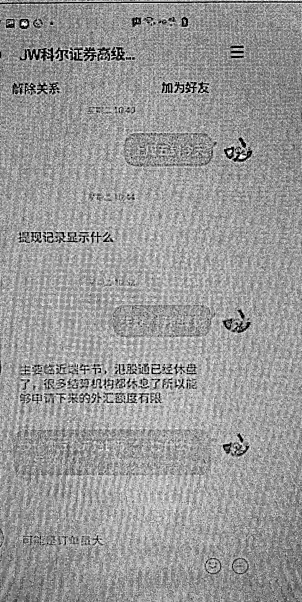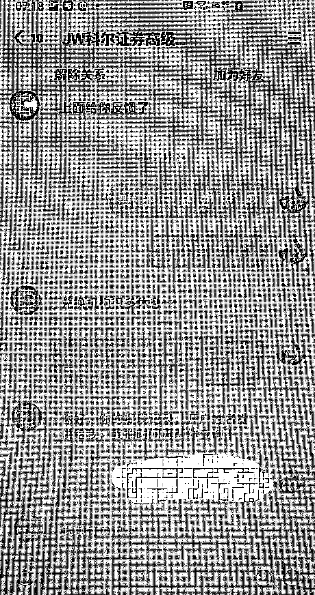

这时受害人想提现，页面却显示“等待中，预计下周到账。”不日，受害人所购买的股票开始下跌，其咨询“炒股老师”，对方告知是**主力股在清仓，其账户在大跌后被系统自动卖出。**

这时，受害人尝试将所有账户的资金进行提现，却发现显示**提现等待中或是提现失败。**找客服询问，客服便找理由推脱。

受害人随即报警，**其被骗金额达 66 万元人民币。**

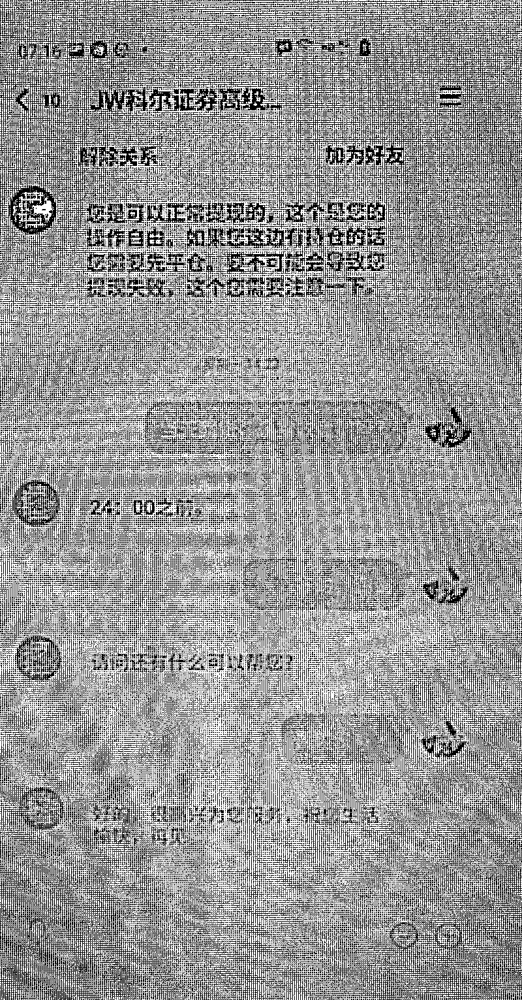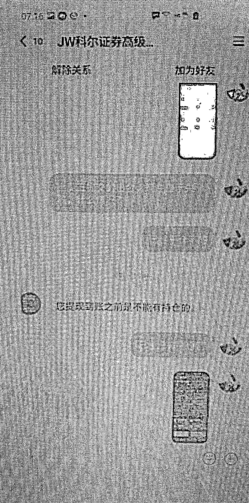

其实

“荐股诈骗”是反诈界的行话

也就是“通过推荐股票来进行诈骗”

这类诈骗大概有三种类型

01

**卖会员**

骗子通过购买一些股票开户人的信息，随机分成若干组，并向这些人发送股票上涨信息。

比如把 1000 人分成 100 组，每天选取 100 个有上涨潜力的股票分别推送给这 100 组人，总有几个组的人每天接到的都是股票上涨的信息，进而对骗子的“专业性”深信不疑，便要求交钱开通高级会员。其实骗子都是瞎蒙的，会员和非会员没什么差别。

02

**炒软件**

这种方式很多人都遇到过，骗子通过各种手段推荐所谓“牛股”、“黑马”等预测软件，开始会让免费试用。

一旦有人使用后受到损失，就说软件版本不够高，需要升级才行。等缴纳了高额升级费以后发现，还是一样。毕竟中国的股票，是没有任何一个人能够向他承诺的一样“神预测”的。

03

**假平台**

这是当前荐股诈骗的最高级手段。诈骗团伙通过各种平台筛选目标，搭建一个虚假股票交易平台后迅速把目标拉进微信群。为了获得受害者信任，他们往往会建一个数十人的微信群，专门蛊惑一个投资人，把虚假的平台推荐给受害者，把跌率较高的股票推荐给受害者。

最后利用投资者越亏越想回本的心理，蚕食受害者的资金。等到资金差不多耗尽时，他们再以平台维护为由，强制结束交易。

**今天我们主要来说一说**

** 假平台荐股诈骗的主流套路 **

一般说来，目前这些假平台的“身份”其实并不假，他们不但都注册了正规的公司，还招聘了诸多业务员，同时还有严格的培训、管理制度和绩效考核。他们是如何开展工作的呢？

*   **推广引流**

无论什么骗局，都要吸引人入局才有可能成功。他们推广引流的方式我想你一定见过。 

比如在各大门户网站、手机 APP、电视台、广播电台、报纸做广告、写软文、搞推广。

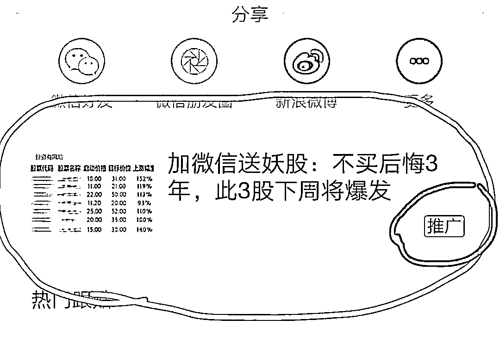

你一不小心点进去，就是老师牛到令人发指的战绩，收益低于 50%都算差的，但无一例外，并在下面留下一个联系方式，引诱你添加。

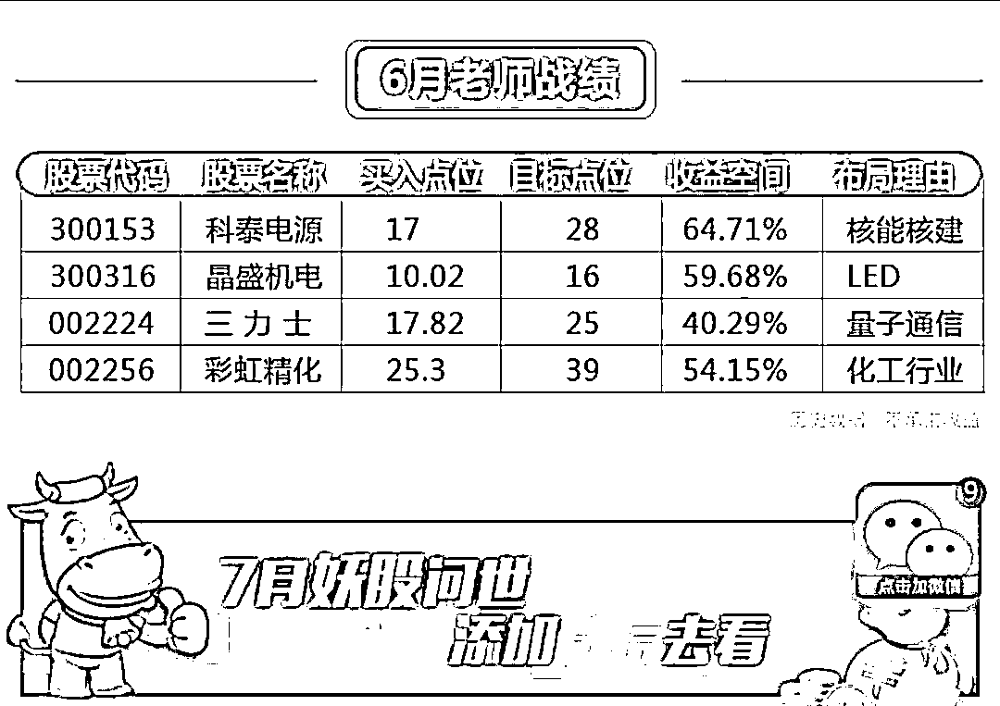

还有一种，就是从号商处购买大量“美女”账号，用一些群控工具添加你为好友。可以通过手机号成千上百地批量加好友，还能任意定位添加好友，哪怕有 0.1%的人通过，数目也非常可观。

*   **忽悠洗脑**

在添加了你为好友之后，他们紧接着就会把你拉到一个小群（一般 30 人以下）。请放心，**这个群除了你，基本都是公司的业务员，**也就是骗子。有的骗子扮演股票高手，有的扮演金融小白，还互相聊骚，好不热闹。

在这个小群中，骗子们轮番登场发送各类推荐股票成功上涨的信息，吸引你的注意。其实他们并不是专门给你发，而是通过群控工具给几百上千个群发同样的信息。

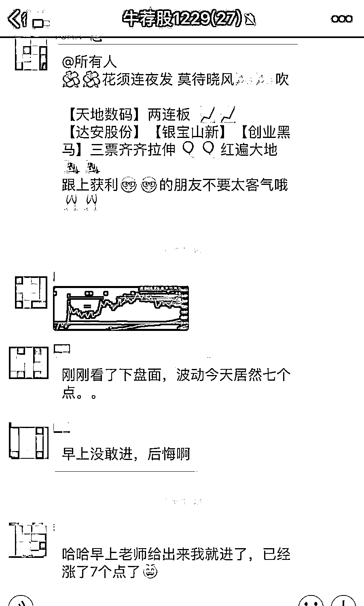

聊了一阵子后，骗子估摸着你已经注意到他们成功的战绩之后，就会话锋一转，说明这些股票之所以这么成功，是由于某位专业老师的推荐，还会“热心”地把老师的微信名片发到群上。

你只要一心动加上这个老师，就等于把自己当做猎物主动送到了他们的嘴边。

*   **欲擒故纵**

你加的这个老师已经被前面群里的人包装成为炒股专家，而且看看他的朋友圈，也基本都是全部成功的案例，很多人便放松了警惕。

专家一般会在一些网站开设有直播间，每天开市时间就讲解要买哪些股票、卖哪些股票。瞎猫总能碰着死耗子，再加上直播间里的托把每一次股票上涨都吹嘘为专家牛逼，所以很多人会好奇跟着买，有的也确实能赚一点。

在赢得你的信任之后，他们会在视频直播中透露这样一个信息：现在股票行情不好，老师我现在做外汇、黄金、石油期货、恒生指数赚了不少钱，有想赚钱可以找我的助手开户。

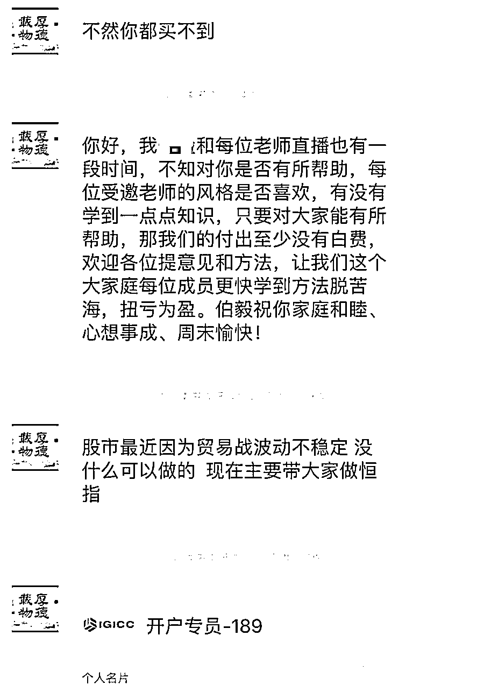

*   **彻底收割**

进行到这一步，骗子就要开始收割了。等成功把你的钱转移到他的账户，就会和你说拜拜了。

在投资时

部分人会听信所谓的“专家”内幕

却不知道自己已经掉进陷阱

最后结局往往血本无归

最后

这份鉴定指南值得收藏 

遇到可疑投资记得打开

**01.看官网信息**

通过中国证监会网站、中国证券业协会网站、中国期货业协会网站查询合法证券期货经营机构及其从业人员信息。

**02.看营销方式**

不法分子往往自称“老师”、“股神”，以“知道内幕信息”、”能够挑选黑马股”、“只要跟着做就能赚钱”之类的说法吸引投资者。谨记：证券期货交易有风险，投资需谨慎。

**03.看网址信息**

非法证券期货网站的网址往往采用无特殊意义的字母和数字构成，或在合法证券期货经营机构网址的基础上变换或增加字母和数字。

投资者可通过证监会网站或中国证券业协会、中国期货业协会网站，查看合法证券期货经营机构的网址，识别非法证券期货网站；通过查询网站备案和服务器所在地，可以识别不正规网站。

**04.看收款账号**

合法证券期货经营机构只能以公司名义对外开展业务，也只能以公司的名义开立银行账户。投资者在汇款环节应当格外谨慎，如果收款账户为个人账户或与该机构名称不符，请果断拒绝。

**05.看负面舆情**

投资者可以在搜索引擎上输入荐股机构或个人的名称、手机号码等信息，搜索网上相关信息，看该机构是否已经被投资者投诉、举报，是否已涉嫌违法违规。

**06.看营业场所**

合法证券期货经营机构一般会在营业场所悬挂取得的经营资质，并且会设立各职能部门，分工协作，有效运营。

而非法的经营机构办公场所不仅没有经营资质，而且有大量的电销人员在进行电话营销。有些非法机构甚至没有实体办公场所。建议投资者在作出决策前先去看看他们的营业场所。

来源：邯郸市反电信网络诈骗中心，利箭在出击

← 向右滑动与灰产圈互动交流 →

