# 中国多地警告：不回国就注销户籍 身份证、地址全网公布 华人亏 40 万后紧急撤离

> 原文：[`mp.weixin.qq.com/s?__biz=MzIyMDYwMTk0Mw==&mid=2247516082&idx=1&sn=8f96981aec18106e3cb08a323d7f4d37&chksm=97cb748aa0bcfd9c3e5132134874fcb3ebaa8972b8a3da6ae5f048ddf76d996e28289cc92af9&scene=27#wechat_redirect`](http://mp.weixin.qq.com/s?__biz=MzIyMDYwMTk0Mw==&mid=2247516082&idx=1&sn=8f96981aec18106e3cb08a323d7f4d37&chksm=97cb748aa0bcfd9c3e5132134874fcb3ebaa8972b8a3da6ae5f048ddf76d996e28289cc92af9&scene=27#wechat_redirect)

从上几个月开始， 

中国对跨境电信诈骗，

作出了强有力的动作：

敦促缅北犯罪份子，

尽快投案回国！

部分经商华人，

也最好紧急撤离！

多地警告： 

**拒不回国、一律注销户籍！**

边境口岸队伍大排长龙， 

有人亏 40 万转手超市回国。

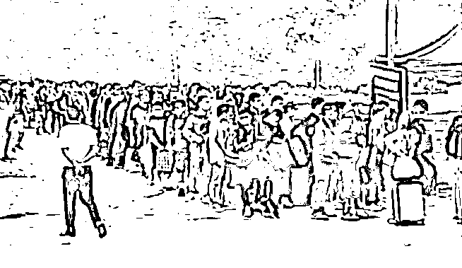

01

中国多地发出最后通牒

前一阵子，中国多地突然发出严重警告：

**敦促非法滞留缅北的华人尽快回国！**

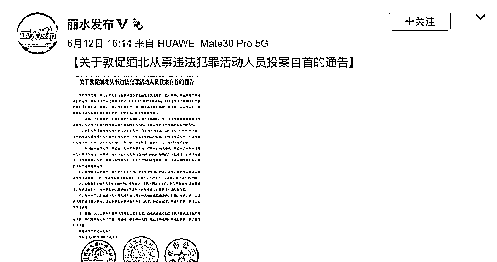

特别是从事违法行为的犯罪份子，

**劝返回国、投案自首！**

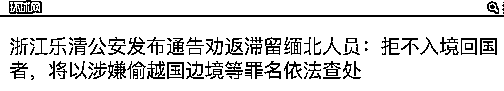

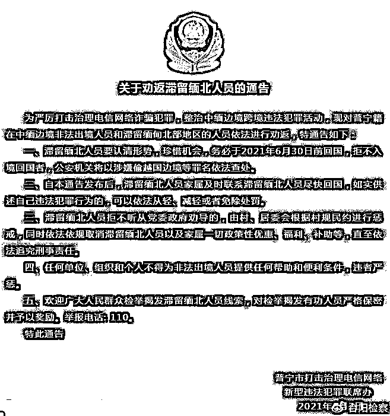

部分地区更是下达了最后通牒：

针对在境外搞电信诈骗的人员， 

**若拒不回国，一律注销户籍！**

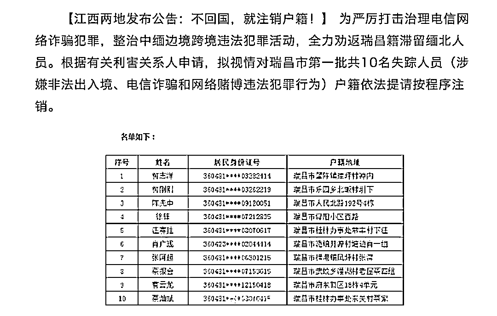

还有一些地区限定了时间：

**对 6 月 30 日前滞留缅北窝点拒不返回人员，将采取“十个一律”惩戒措施！**

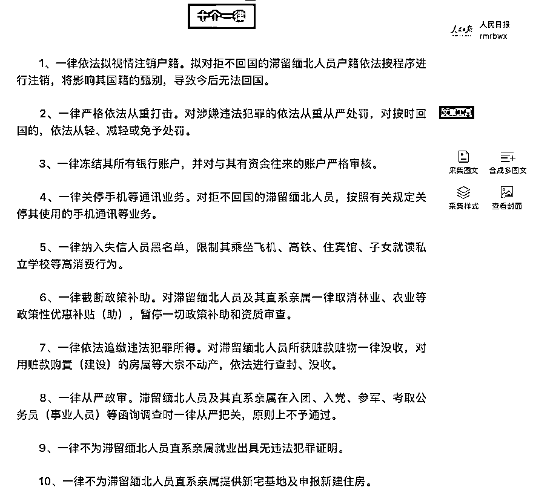

这可不是什么儿戏，

在打击违法犯罪这件事情上，中国的态度可谓是“绝不手软”！

就连人民日报、环球时报等多家媒体，都接连报道了相关新闻。

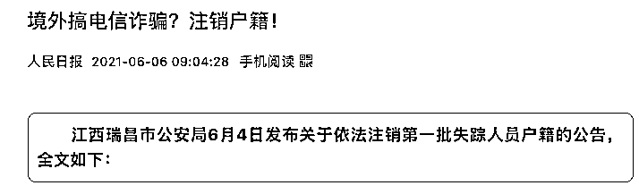

**姓名、身份证号、户籍地址等信息，**

**全部公之于众！**

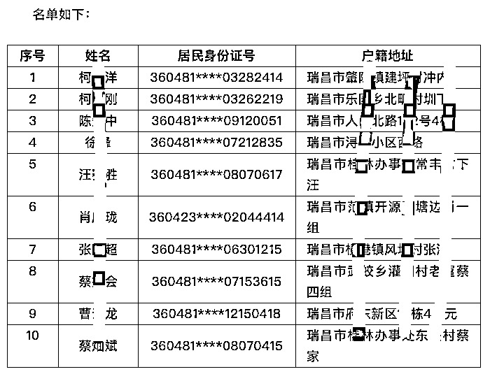

各地的名单也已经整理出了。

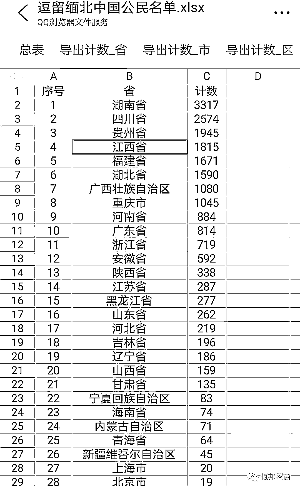

那为何会突然发生这种情况，

实际的原因或许还在缅北这个地方的身上...

02

无数人被骗后，日子痛不欲生

相信很多刷社交平台的朋友们一定听过这么一句话：

**“这里是缅甸北部,我生长的地方,欢迎来到我的世界,娇贵的小公主。”**

然而冷冰冰的现实却是，

**缅北近乎成为了人人都想逃离的“魔窟”。**

在这里局势动荡不安， 

军事冲突不断，毒品、电信诈骗、黑产滋生...

更加令人担忧的是，

很多懵懂的中国人怀揣着赚大钱、过好日子的梦想，

被人利用、 轻信了网上“赴缅甸打工”的信息，

**被骗去缅北，进而遭绑架、非法拘禁、敲诈勒索、强迫卖淫。**

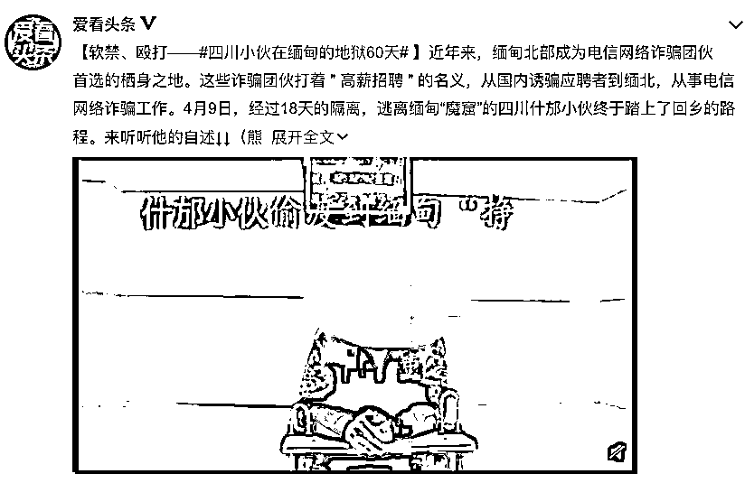

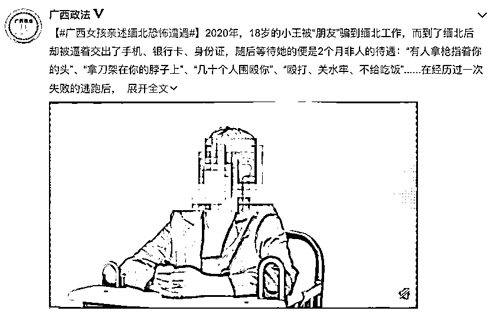

就在 3 个月前，

4 名未满 16 的少年就结伴离家，

只因素未谋面的网友邀请他们来缅北工作；

**而且还免费提供车票、机票钱。**

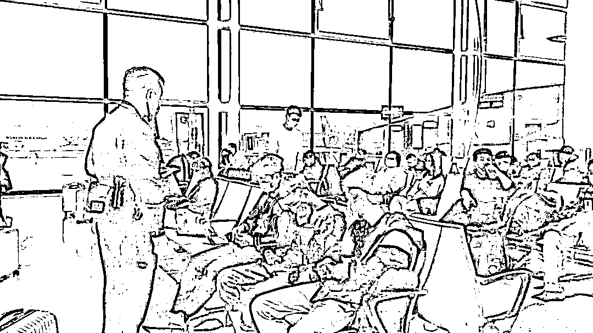

期间先是到云南大理，

接着有人接他们偷渡去缅甸。

**而这一切，他们的父母都一无所知。**

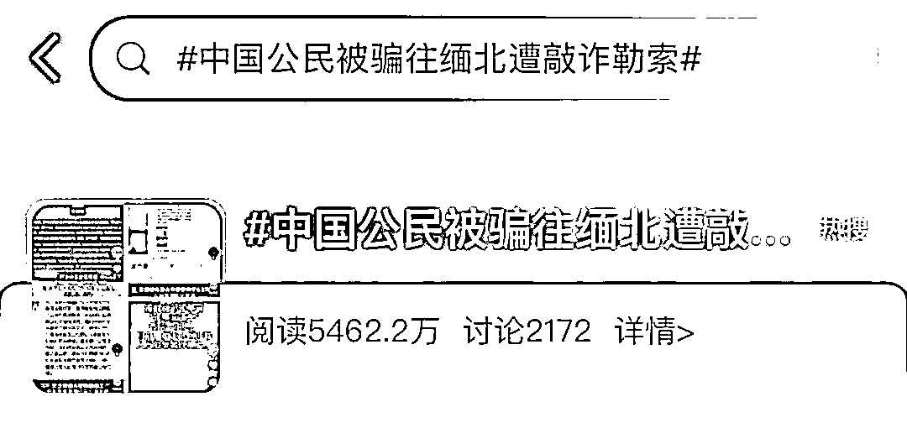

幸亏被及时发现，不然到了缅北之后， 

他们的处境或者真的是“生不如死”了...

据环球时报报道，

22 岁的李光就是这么被骗进缅北诈骗场所的。

一路上他看到层层关卡处，很多人都带着枪。 

身份证件还必须得上交，

**不配合的话就会被活活打死。**

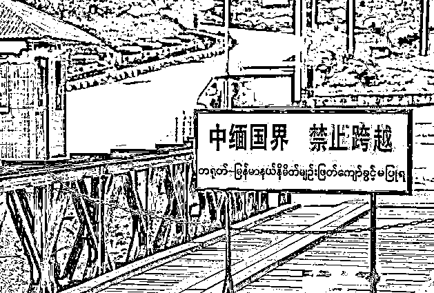

不听话的人还会面临“水牢”酷刑：

**将人整个身体泡在水里，**

**只露一个头、人只能站着。**

一坐下来就会被水淹，无法休息也无法睡觉。

最后他在**交了 2.8 万后**才联系到当地民警，最终冒险逃回国。

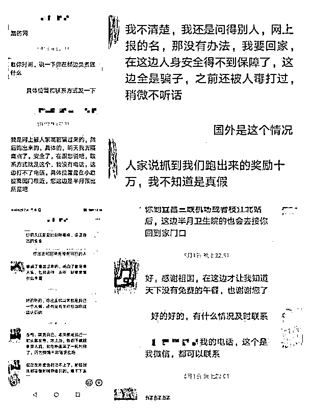

李光的命运还算相对不错的， 

还有很多人只是诈骗老板手下的“挣钱工具”。 

那里制定了严格的工作准则与纪律规定，

小到作息时间、说话声音，大到诈骗话术、转账要求。

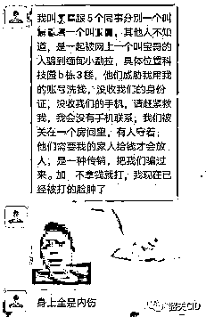

事无巨细，每一条都有对应的处罚规定，

轻则打骂，重则剁手指、关水牢乃至直接折磨致死。

21 岁的四川小伙张某被骗后执意要走。

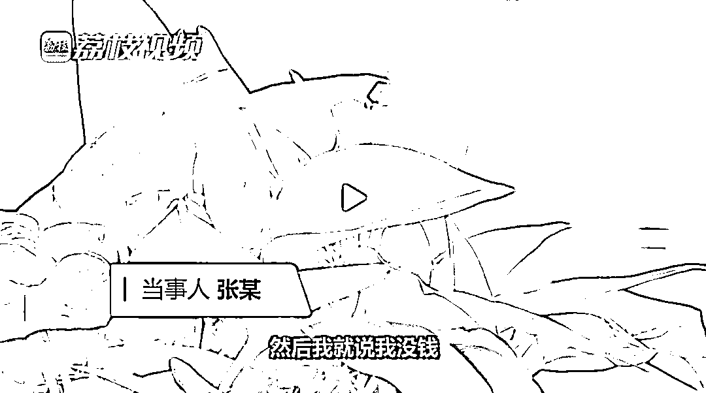

诈骗团伙给出了选择： 

**要么家里拿出 12 万赎人，要么一根手指 3 万。**

无奈之下，他选择了后者， 

**最终被无情地一刀剁掉 4 根手指。**

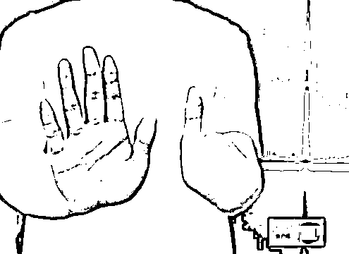

很多有幸逃回国的青年， 

都口述了自己当时痛不欲生的悲惨遭遇，

**“宁愿回国接受惩罚”，都不愿再去缅北了。**

据央视财经报道，

为严厉打击跨境赌博犯罪行为，多个部门联合发布《关于敦促跨境赌博相关犯罪嫌疑人投案自首的通告》。

在今年 4 月 30 日前，犯罪嫌疑人自动投案，如实供述自己罪行，

可依法从轻或者减轻处罚，情节较轻的可依法免除处罚。

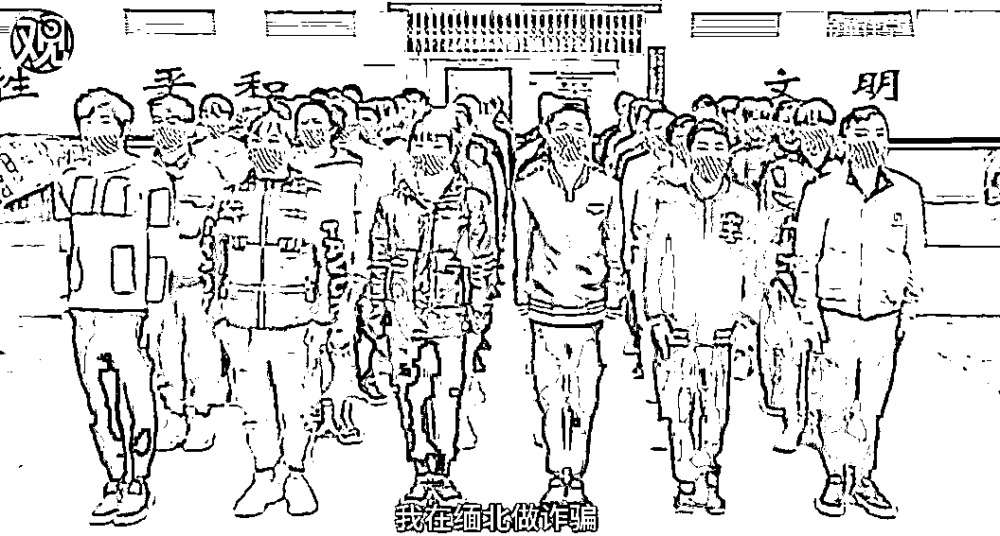

到截止日期前，**已有 914 人投案自首。** 

他们中的很多人就曾在缅北。

03

大批华人想回国，检测队伍排长龙

去年，由于疫情的爆发，

缅北的生存环境变得更加恶劣。

再加上中国多地的劝返令， 

**更是让很多缅北华人绞尽脑汁想回国！**

在当地的交流群中， 

很多华人都开始转让、出售当地的房产。 

**超市亏本 3 万也转让，奶茶店刚装修也出售。**

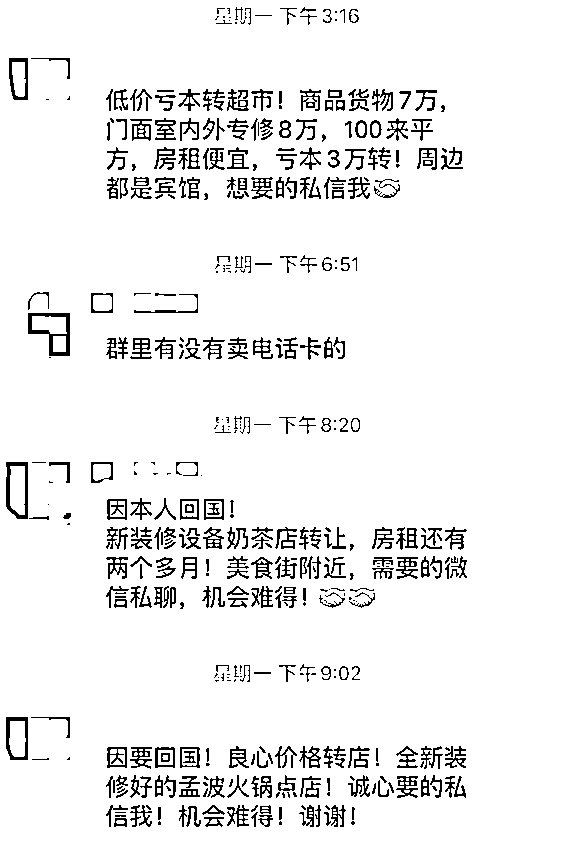

在佤邦开超市的湖南人张先生向记者透露：

**“支持打击电信诈骗，我回国后再也不会来缅北了。”**

他本身还有 5 家店需要处理，就让妻子先回国，自己留下来善后。

最后张先生将店铺转给了一个当地人，**但亏了 40 多万。**

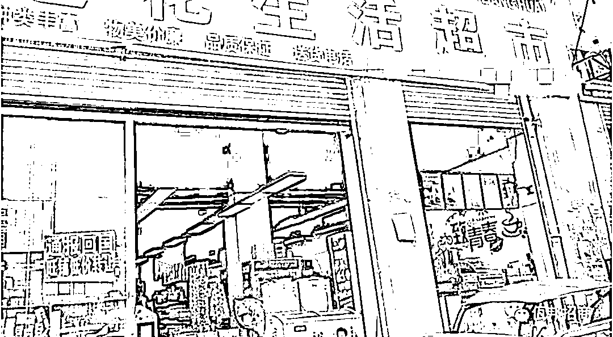

剩下的 4 个店铺都不太好转让，

目前他准备将存货处理掉，低价卖出去，尽量止损。

还有一些人吆喝着：

**“回中国不排队”**

**“自首不排队可直接入住酒店”**

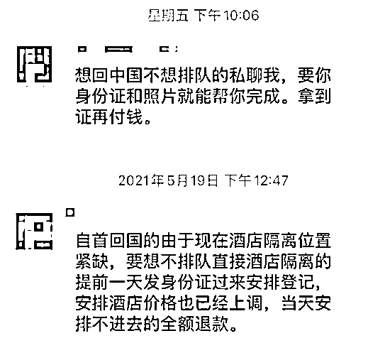

大家都互相打探着消息，做好了回国的计划。

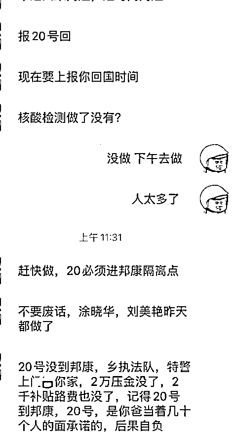

*（网传缅北华人的对话记录）*

在上个月，

缅甸佤邦口岸排队等待核酸检测的队伍，

就已经大排长龙、人山人海。

[`mp.weixin.qq.com/mp/readtemplate?t=pages/video_player_tmpl&action=mpvideo&auto=0&vid=wxv_1876364363574329351`](https://mp.weixin.qq.com/mp/readtemplate?t=pages/video_player_tmpl&action=mpvideo&auto=0&vid=wxv_1876364363574329351)

[`mp.weixin.qq.com/mp/readtemplate?t=pages/video_player_tmpl&action=mpvideo&auto=0&vid=wxv_1886174275473031169`](https://mp.weixin.qq.com/mp/readtemplate?t=pages/video_player_tmpl&action=mpvideo&auto=0&vid=wxv_1886174275473031169)

等待的途中还能不断地听到这样的消息： 

**“凌晨 3 点多去排队，上午 9 点马上就要排到了，结果没号了，6 月 15 日继续去排。”**

**“晚上 10 点去果敢老街排的，上午 8 点终于拿到号了。”**

对面望过去的，就是中国境内了。

[`mp.weixin.qq.com/mp/readtemplate?t=pages/video_player_tmpl&action=mpvideo&auto=0&vid=wxv_1886181861375131651`](https://mp.weixin.qq.com/mp/readtemplate?t=pages/video_player_tmpl&action=mpvideo&auto=0&vid=wxv_1886181861375131651)

通过劝返令的种种迹象表明， 

这不是一地一区的行为，而已经上升为多地的一致行动。

而且从缅北几个生活号来看，

各地的执行力度很大，已经完全按照要求落实惩戒措施了。

比如：

官员挨家挨户到村民的家中做工作。

在拒不履行人员的门口喷涂“诈骗之家”。

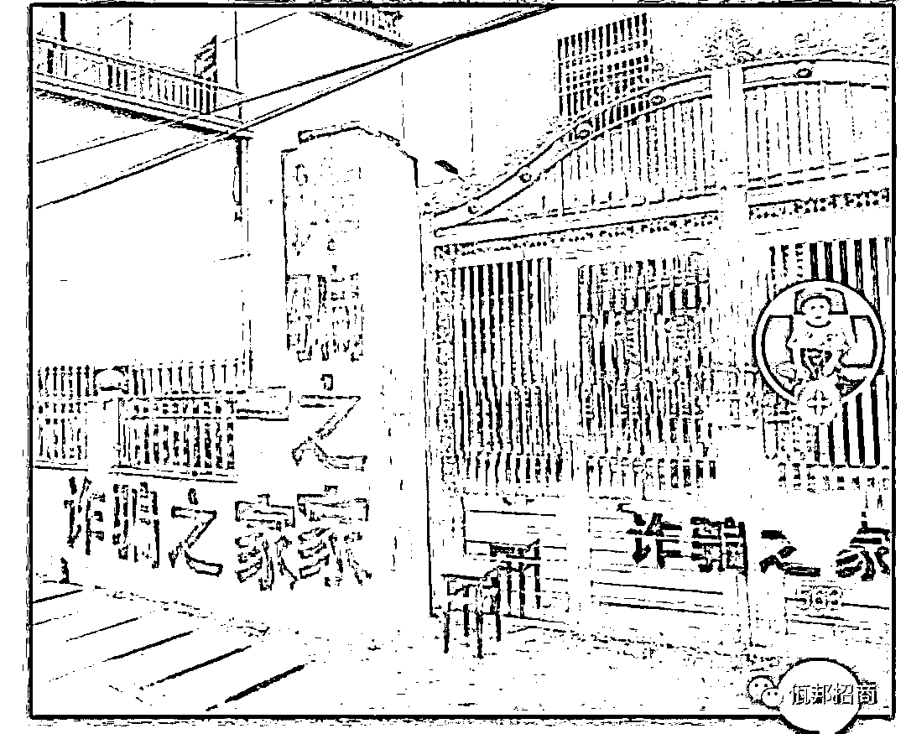

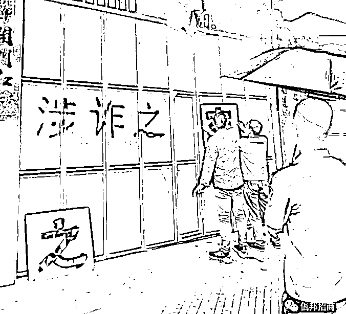

离 6 月 30 日也只有半个月的时间了，

希望还在缅北没回国的华人们，早做打算、安全回国！

天网恢恢、疏而不漏。

今日哥在这里劝诫：

仍在缅北滞留的犯罪份子， 

尽快自首回国！

可要是丢了性命，

可就得不偿失了...

推荐阅读

*   [他们从缅甸回来就自首，揭开真实的缅北，听着都手心冒汗！](http://mp.weixin.qq.com/s?__biz=MzIyMDYwMTk0Mw==&mid=2247512728&idx=5&sn=0edec71756e71d6a3d3dd52da07c695e&chksm=97cb79a0a0bcf0b6bffe8a591167ee7d5bb5e30bd0c1872b8720a9eb943f2b0342a432b50270&scene=21#wechat_redirect)

*   [除了电诈、赌博，还有更恐怖的……江西又有 2 人从缅北逃回家！](http://mp.weixin.qq.com/s?__biz=MzIyMDYwMTk0Mw==&mid=2247513378&idx=2&sn=cf06d0f8504d932282242f21e3e55d90&chksm=97cb7e1aa0bcf70c2fadd7096421014bb88e8111f607a5ed6acf3f2042d0efb0ac915cb7fa0c&scene=21#wechat_redirect)

*   [“底薪 8000 元，你来芒市当网管”！21 岁小伙被骗到缅北 剁断 4 根手指！](http://mp.weixin.qq.com/s?__biz=MzIyMDYwMTk0Mw==&mid=2247514230&idx=1&sn=e1556f0ce8c3f2ec2cbd67e92de06eab&chksm=97cb734ea0bcfa58102560d78e4f8d69c00b37a19b94891e29a3611a2e3be6380b60c5b27b1b&scene=21#wechat_redirect)

*   [嫌疑人亲述：在缅北，连呼吸都要交钱！](http://mp.weixin.qq.com/s?__biz=MzIyMDYwMTk0Mw==&mid=2247514280&idx=1&sn=957bfe8688785730c1916ca18c39667e&chksm=97cb7390a0bcfa8639e0d793d60b6c78d562a9cbdbc3d79d933804556e198edf81e6fe919d4b&scene=21#wechat_redirect)

*   [多地警方岀手：缅北电信诈骗人员立即回国！](http://mp.weixin.qq.com/s?__biz=MzIyMDYwMTk0Mw==&mid=2247515249&idx=1&sn=1609dea7d7f2ec78a957c076e70954d0&chksm=97cb7749a0bcfe5fa26f752ee08c06785fa06761f06c004e6830791f07e9947b47a33f164183&scene=21#wechat_redirect)

来源：极目新闻、佤邦招商、人民日报、环球时报、观察者网，利箭在行动

← 向右滑动与灰产圈互动交流 →

