# 造谣 15 名女生私生活混乱，称女生是“母 G”...

> 原文：[`mp.weixin.qq.com/s?__biz=MzIyMDYwMTk0Mw==&mid=2247516082&idx=3&sn=676bca811cd33086f6c814a13b08b9f0&chksm=97cb748aa0bcfd9c61ff6bc0d015fe7d1d6d262e853c88e92abb2de62fb671b44fa7ad1dad94&scene=27#wechat_redirect`](http://mp.weixin.qq.com/s?__biz=MzIyMDYwMTk0Mw==&mid=2247516082&idx=3&sn=676bca811cd33086f6c814a13b08b9f0&chksm=97cb748aa0bcfd9c61ff6bc0d015fe7d1d6d262e853c88e92abb2de62fb671b44fa7ad1dad94&scene=27#wechat_redirect)

6 月 17 日，一篇微信推文引起网友热议。

推文中称，广东中山大学学生赵某晨无端造谣同校女生，严重影响对方精神生活和社交状态，并且污蔑另外一位同校男生。

17 日晚，中山大学发布通报，该学生在朋友圈捏造事实诽谤他人，并给当事人造成了名誉损害。日前已被行政拘留，现被该校开除学籍。

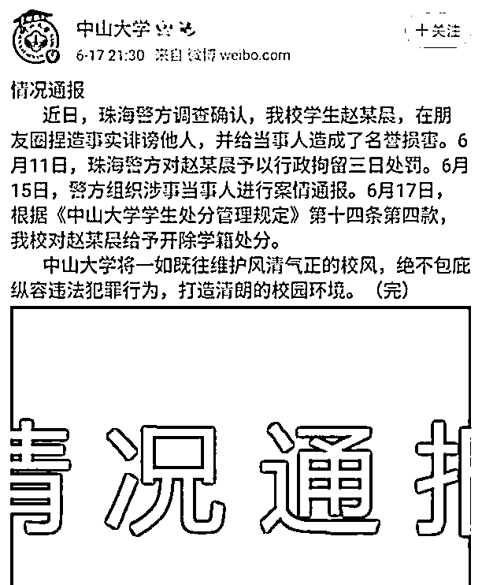

学校通报

6 月 17 日，一篇名为《当“我们”作为“母狗”出现在朋友圈》的推文引起网友的广泛讨论。

在推文中，笔者自述是中山大学的一名学生，现患上重度抑郁，被焦虑和痛苦淹没，无法正常学习生活，这一切都源于一起造谣事件。

一位名叫赵某晨的学生，在长达半年的时间里，伪造了大量不雅聊天记录和虚假裸照，并将这些内容在线上线下大肆传阅和分享。

这个名叫赵某晨的学生，是该校某院学生会主席。

另外，在此事件中还有 3 名主要传谣者，其中一人为赵某晨女友。

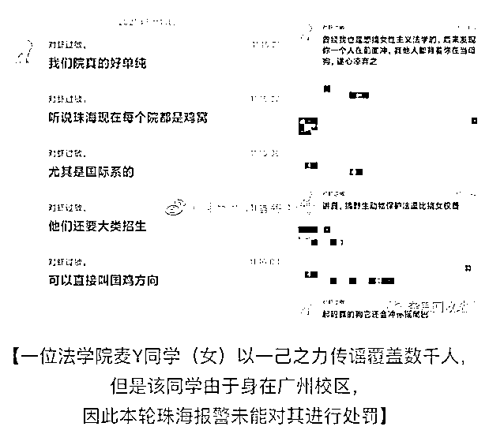

推文笔者称，这起事件中，受害者并不止自己一人，有类似遭遇的还有十多名同校学生。

这些受害者中，15 个女生涉及 2 个校区，横跨 5 个院系、3 个年级，很多人与赵某晨并无过多交集，也有部分女生曾是赵某晨的追求对象。

此事发生后，受害者曾将相关证据上报给相关学院和老师，并在 6 月 10 日向珠海警方寻求帮助。

赵某晨被行政拘留 3 日后，学校和公安局组织当事人进行了案件通报，赵某晨对受害者进行了道歉，但受害者表示道歉缺乏诚意，希望得到公开道歉，由学校公开处理，尽最大可能消除对受害者的影响。

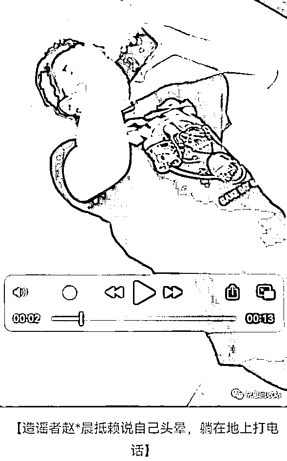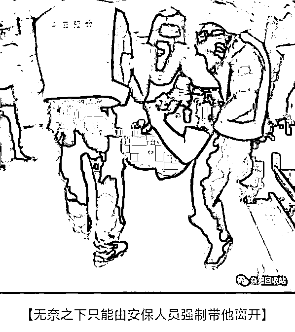

17 日晚，记者尝试联系受害者，求证推文中事件，未得到回复。

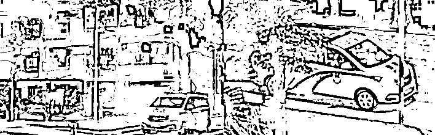警方介入

当晚，中山大学官方微博发布情况通报，称近日珠海警方调查确认，该校学生赵某晨，在朋友圈捏造事实诽谤他人，并给当事人造成了名誉损害。

6 月 11 日，珠海警方对赵某晨予以行政拘留三日处罚。

6 月 15 日，警方组织涉事当事人进行案情通报。

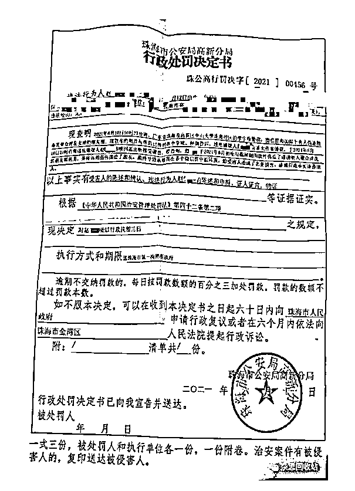

**事件详情：**  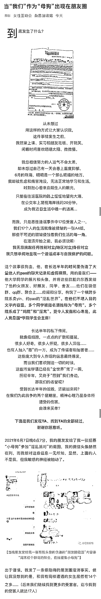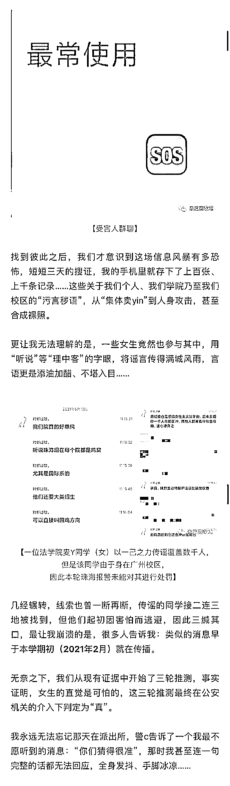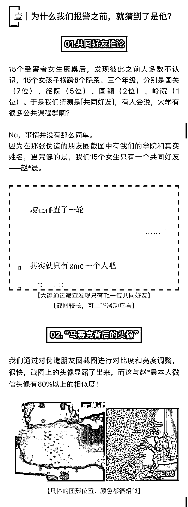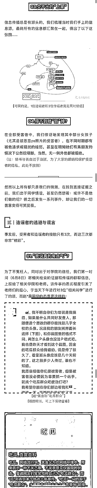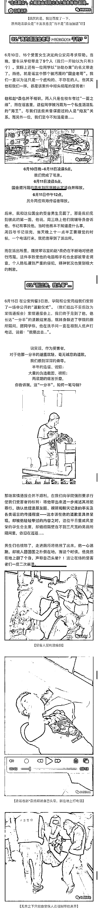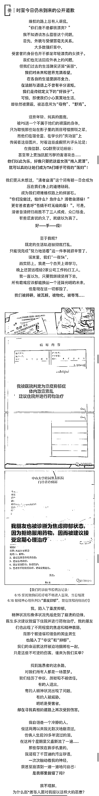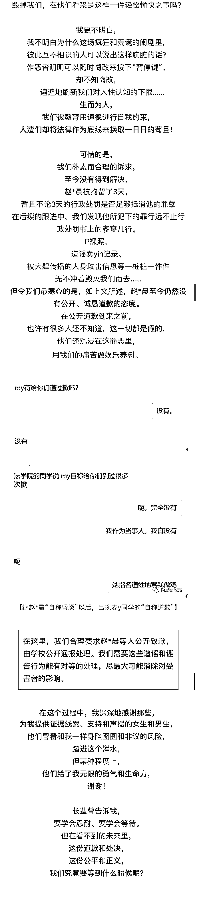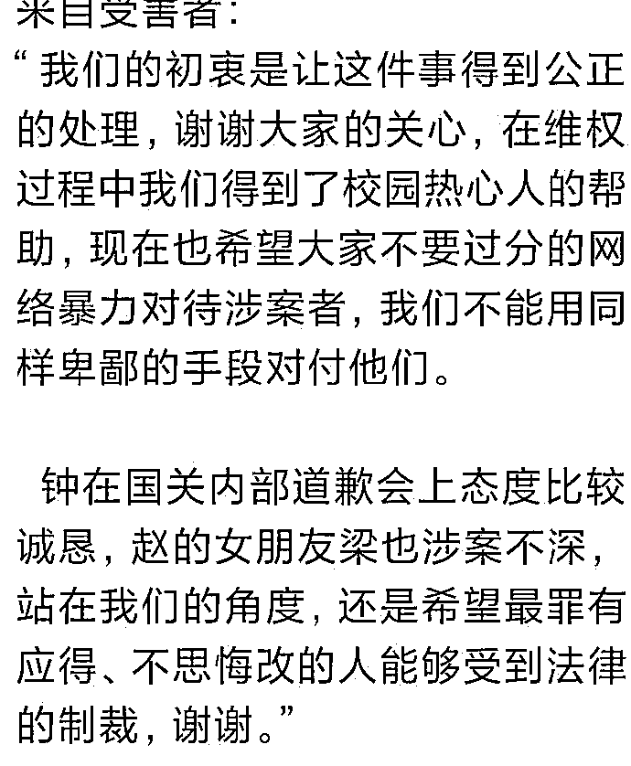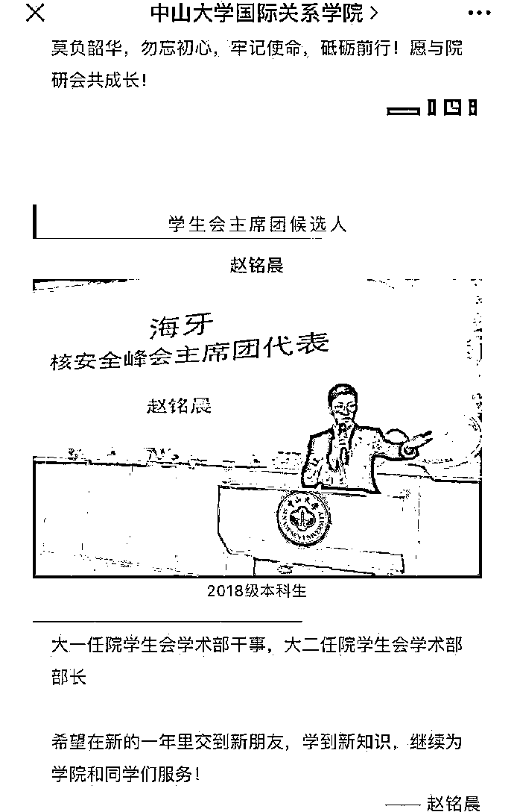来源：我不是一条鱼

← 向右滑动与灰产圈互动交流 →

