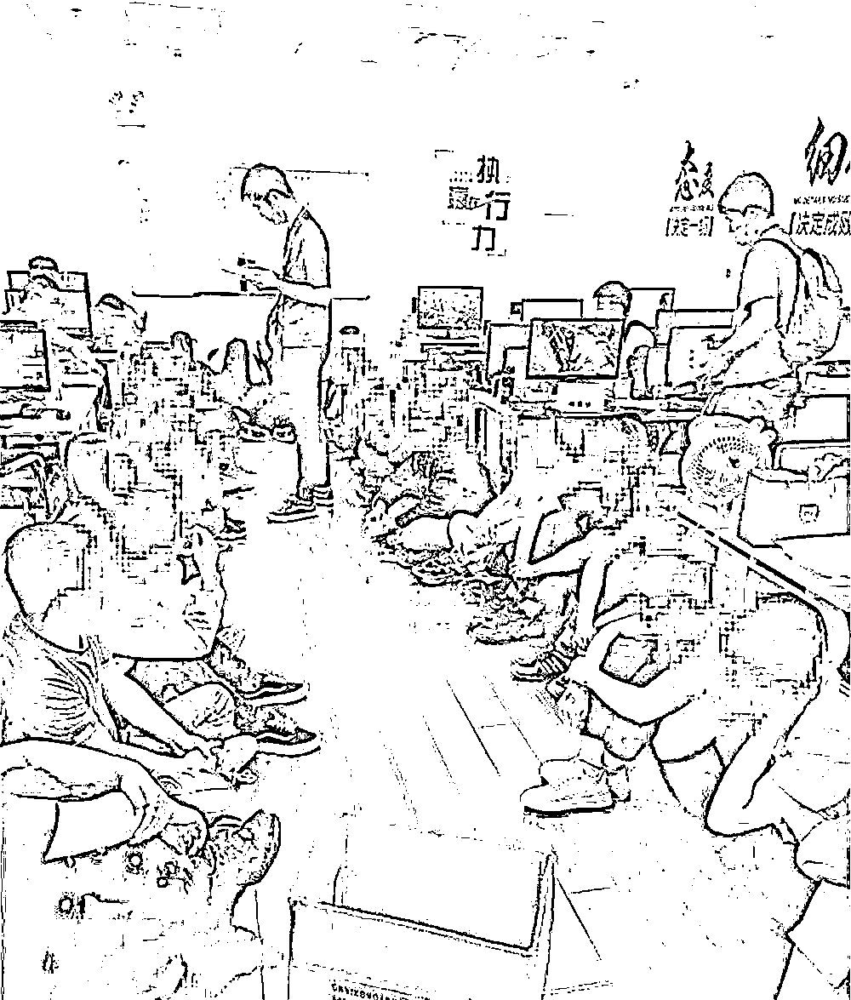
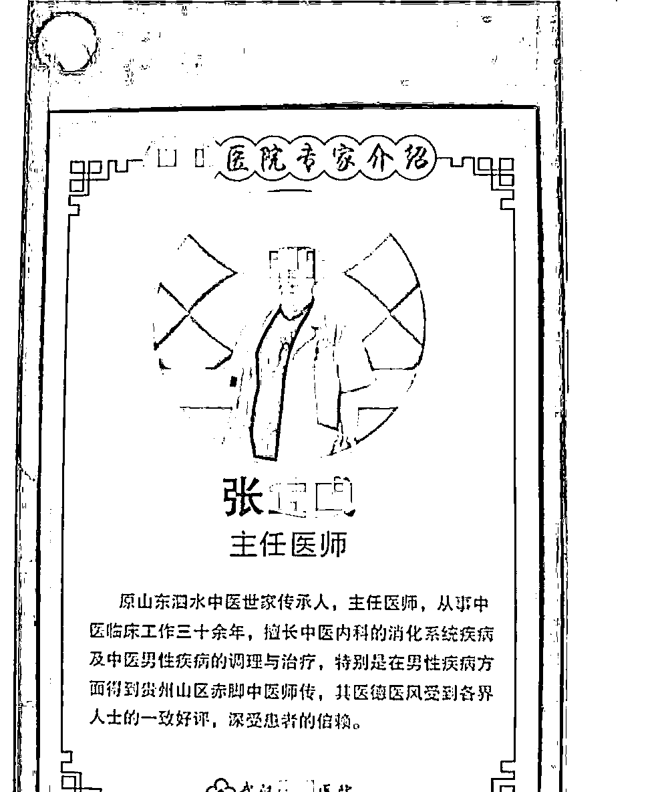
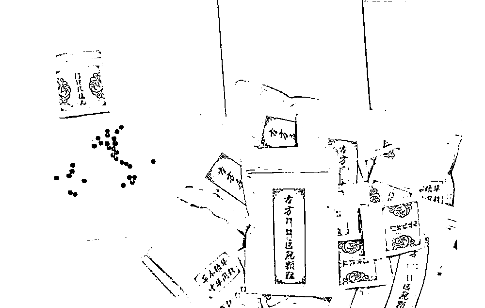
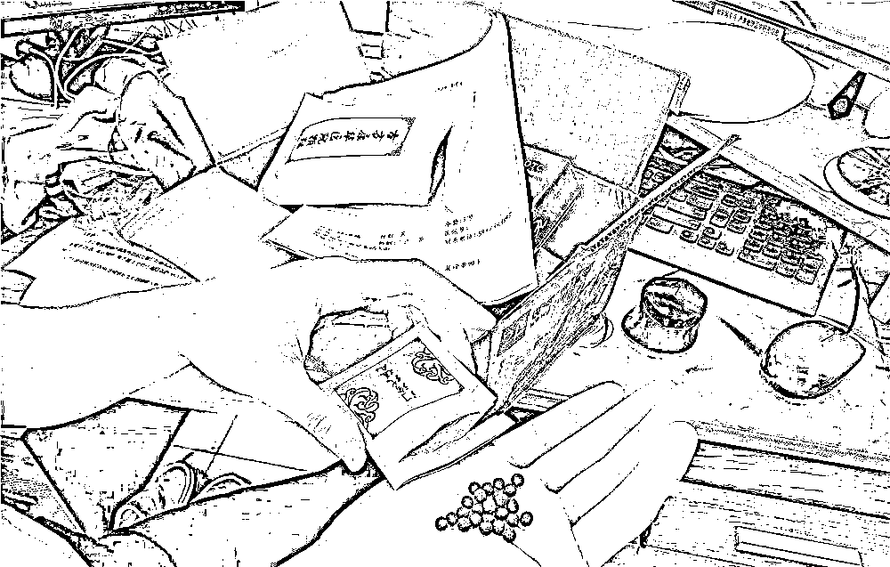

# 诈骗上亿元，警方抓获 98 名“老中医”！

> 原文：[`mp.weixin.qq.com/s?__biz=MzIyMDYwMTk0Mw==&mid=2247516082&idx=6&sn=6b0ab4a12f03cab28beff48165e1947b&chksm=97cb748aa0bcfd9cce6f50a7e1f6c9d7ab58d3b08a653326949c61455d6de60fc596b59010ec&scene=27#wechat_redirect`](http://mp.weixin.qq.com/s?__biz=MzIyMDYwMTk0Mw==&mid=2247516082&idx=6&sn=6b0ab4a12f03cab28beff48165e1947b&chksm=97cb748aa0bcfd9cce6f50a7e1f6c9d7ab58d3b08a653326949c61455d6de60fc596b59010ec&scene=27#wechat_redirect)

日前，绍兴柯桥警方侦破了一起“老中医”网络团队诈骗案，98 名“老中医”落网。据初步统计，该案涉案资金上亿元，受害人信息 2 万余条。

花费两万余元的网络问诊竟毫无作用

“我要报案，我在网上看病买药，但吃了没有一点效果，被骗了 2 万余元。”5 月 21 日，柯桥人劳先生向柯桥警方报案，称自己被网上所谓的“老中医”骗了，前后花费了 2 万余元的中药治病，却毫无效果。

据劳先生回忆，自己患有男性隐疾，因羞于去正规医院诊治，便决定在网上寻找治疗方法。大约在去年 11 月，他在网络上看到一则广告，页面上介绍了武汉某医院可以利用中医调理男性疾病，还详细地上传了很多患者反馈的截图，称效果明显。

劳先生心动了，便添加了广告页面上的显示的微信，对方自称是武汉某医院的医生助理。他建议劳先生可以来现场就诊，也可以通过该院特别推出的网络问诊服务，专家通过视频问诊方式，就可对症下药，“一人一方”，省时又省力。

劳先生选择了网络问诊，此时，“张主任”接待了他。在一番看似正规的问诊后，劳先生收到了自己的病历本，由于病历本与湖北省医疗机构门（急）诊通用病例一模一样，劳先生对“张主任”的身份深信不疑，为此，他毫不犹豫地花费 6480 元购买了第一个疗程。

没多久，劳先生就收到了发货地址为该医院的药丸，共 8 包，每包 6 剂，每剂 1 小袋，里面都是与小弹珠差不多大小的小黑丸。第一个疗程结束，劳先生觉得效果并不明显，他找到“张主任”。“张主任”假借每个人的身体机能不一样，想要改善症状还需要持之以恒的理由，建议劳先生继续服药，劳先生又陆续购买了两次，分别花费 12960 元、2172 元。

柯桥警方雷霆出击 98 名“老中医”落网

“购买了三次，共花费了 2 万多元，但一点效果没有。”劳先生对此也很懊恼，但考虑到涉及自己的个人身体隐私，他本不想声张，直到柯桥民警上门开展反诈宣传，他才意识到自己遭遇了诈骗，决定报案。

接到报案后，柯桥警方当即展开调查，在详细了解劳先生的购药情况，查看双方的网络聊天记录后，初步判定这就是一起打着正规医院名头实施诈骗的案件，而且极有可能是团伙作案。柯桥警方当即组成专案组，锁定嫌疑人位置，赶往武汉进行调查部署。

5 月 24 日，专案组先遣小队赶到武汉摸排情况，发现案件涉及的医院是一家规模较小的正规民营医院，而所谓的“张主任”在该医院是查无此人，但民警在位于武汉汉阳区的一个商务楼内发现了他。经过蹲点和调查，民警共找到了 3 处办公地点，并通过梳理分析后判断上述场所就是这个犯罪团伙的窝点，医院是他们用来掩人耳目的。通过后续侦蹲守踩点，警方进一步明晰了该团伙的组织架构、人员构成以及作息规律等情况。

5 月 27 日，柯桥警方抽调 60 余名警力实施抓捕，将公司老板彭某、医院院长刘某等在内的 102 名犯罪嫌疑人一举抓获，对其中 98 人采取刑事强制措施，现场扣押涉案电脑 150 台、手机 300 余部、受害人信息 2 万余条。

联合正规医院的大黑产已经持续三年之久

大概谁也想象不到，明明挂着正规医院的名头，怎么还会是诈骗呢？“这也是这个团伙可以诈骗三年之久的原因之一。”据区涉网犯罪侦查大队民警严江燕介绍，这家正规的小型民营医院的确真实存在，在国家卫健委网站上查询到的信息也显示，该医院拥有医疗机构职业许可证。

2019 年，犯罪嫌疑人彭某看中了医院一直处于亏损状态的现状，找到了院长刘某进行合作。彭某提出借用医院的资金通道，组建公司，招募业务员，冒充该院的老中医，以网络诊断的方式，为受害人配置针对性治疗男性疾病的中药，并熬制成药丸等，骗取钱财。而刘院长得到的好处便是每月 2 万余元的好处费，同时，彭某承诺可以通过网络引流公司在各大网络平台发布大量的中医治疗男性疾病的广告和软文对医院进行引流。

此时的刘院长对这样的交易方案十分满意，便同意合作，这一合作便是三年。三年来，彭某手下的“老中医”越来越多，而为了不让受害者起疑心，打款、发货、药丸包装等处处打着医院名义。

网上“神医”皆“庸医”

还是应选择正规医院就医

没有行医资格，网络问诊也是如出一辙，看似荒诞的诈骗手段却还是被犯罪团伙屡屡得手，实在让人感到无奈。

在与多名受害者联系的过程中，柯桥警方发现，被骗金额少的三五千，高的几万元，涉案金额累计高达上亿元，而诈骗团伙口中“一人一方”配置的治疗男性疾病的中药丸，其实只是从网络上购买的价格极低，无任何药物功效的药丸。另外，这里面绝大部分的受害者都在上当受骗了选择了沉默，因此，这起案件延续了三年之久。目前，柯桥警方正在全力侦查案件，联系受害人，同时等待市场监管部门出具成分认定书。

警方提醒广大群众，电信诈骗犯罪已经呈现集团化、专业化的趋势，诈骗团伙利用人们迷信老中医能治疗疑难杂症的心理，在网上打出神医、名医的幌子进行诈骗。因此，切勿盲目相信网络平台或小程序中的“老中医、老专家、祖传秘方”等虚假广告，看病就医还是要到正规的医疗机构，否则，上当受骗损失钱财事小，耽误治疗贻误病情则是大事了。

来源：迪扬新闻、途越新闻、极目新闻，反诈骗先锋

← 向右滑动与灰产圈互动交流 →

